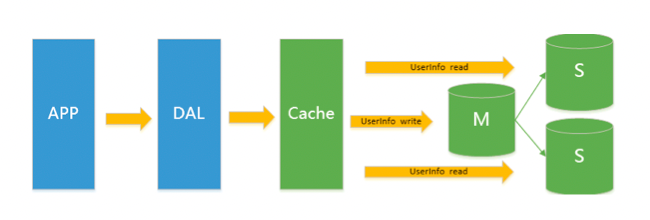
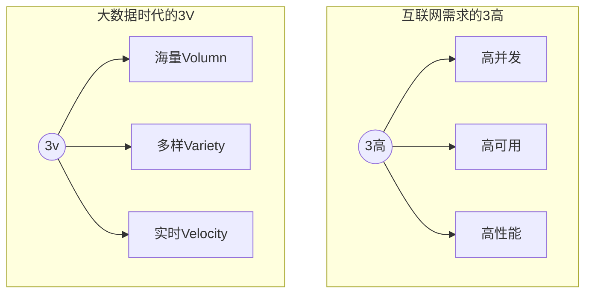

## Redis简介

### 简单介绍

Redis：开源、免费、非关系型数据库、K-V数据库、内存数据库，支持持久化、事务和备份，集群(支持16个库)等高可用功能。并且性能极高(可以达到100000+的QPS)，易扩展，丰富的数据类型，所有操作都是单线程,原子性的。

**NOSQL**：非关系型数据库，数据与数据之间没有关联关系。就是为了解决大规模数据集合多重数据种类带来的挑战，尤其是大数据应用难题

类型

1. 键值(key-value)存储数据库
2. 列存储数据库：键仍然存在，但是指向了多个列，HBase (eg：博客平台(标签和文章)，日志)
3. 文档型数据库 MongoDb  (eg：淘宝商品的评价)
4. 图形数据库 Neo4j  （eg：好友列表）

> 扩展:
>
> MongoDB是一个基于分布式文件存储的数据库。有C++语言编写。旨在为WEB应用提供可扩展的高性能数据存储解决方案。
>
> MongoDB是一个介于关系型数据库和非关系型数据库之间的产品，是非关系数据库当中功能最丰富，最像关系型数据库的。
>
> 文档(document)是MongoDB中数据的基本单元，非常类似于关系型数据库系统中的行(但是比行要复杂的多);
> 集合(collection)就是一组文档，如果说MongoDB中的文档类似于关系型数据库中的行，那么集合就如同表;

使用场景:

1. 数据模型比较简单
2. 需要灵活更强的IT系统
3. 对数据库性能要求比较高
4. 不需要高度的数据一致性
5. 对于给定的key，比较容易映射复杂值的环境

**SQL**:关系型数据库，表与表之间建立关联关系


### redis的安装

```shell
#拉取镜像
docker pull redis
#挂载数据卷并运行容器
docker run -p 6379:6379 --name redis -v /root/redis/data:/data -v /root/redis/conf/redis.conf:/usr/local/etc/redis/redis.conf -d redis redis-server /usr/local/etc/redis/redis.conf --appendonly yes --requirepass "xxx"
```


### 为什么使用NOSQL

#### 单机 MySQL 的美好时代

在90年代，一个网站的访问量一般都不大，用单个数据库完全可以轻松应付。在那个时候，更多的都是静态网页，动态交互类型的网站不多。


DAL : Data Access Layer（数据访问层 – Hibernate，MyBatis）

上述架构下，我们来看看`数据存储的瓶颈`是什么？

> 1. 数据量的总大小一个机器放不下时。
> 2. 数据的索引（B+ Tree）一个机器的内存放不下时。
> 3. 访问量(读写混合)一个实例不能承受。

如果满足了上述1 or 3个时，只能对数据库的整体架构进行重构。

<br/>


####  Memcached(缓存)+MySQL+垂直拆分

[关于垂直拆分和水平拆分的简单介绍](http://codekiller.top/2020/03/29/mysql-split/)

后来，随着访问量的上升，几乎大部分使用MySQL架构的网站在数据库上都开始出现了性能问题，web程序不再仅仅专注在功能上，同时也在追求性能。程序员们开始大量的使用缓存技术来缓解数据库的压力，优化数据库的结构和索引。开始比较流行的是通过文件缓存来缓解数据库压力，但是当访问量继续增大的时候，多台web机器通过文件缓存不能共享，大量的小文件缓存也带了了比较高的IO压力。在这个时候，Memcached就自然的成为一个非常时尚的技术产品。


Memcached作为一个独立的分布式的缓存服务器，为多个web服务器提供了一个共享的高性能缓存服务，在Memcached服务器上，又发展了根据hash算法来进行多台Memcached缓存服务的扩展，然后又出现了一致性hash来解决增加或减少缓存服务器导致重新hash带来的大量缓存失效的弊端。


####  Mysql主从读写分离

由于数据库的写入压力增加，Memcached只能缓解数据库的读取压力。读写集中在一个数据库上让数据库不堪重负，大部分网站开始使用主从复制技术来达到读写分离，以提高读写性能和读库的可扩展性。Mysql的master-slave模式成为这个时候的网站标配了。




#### 分库分表+水平拆分+mysql集群

在Memcached的高速缓存，MySQL的主从复制，读写分离的基础之上，这时MySQL主库的写压力开始出现瓶颈，而数据量的持续猛增，由于MyISAM在写数据的时候会使用表锁，在高并发写数据的情况下会出现严重的锁问题，大量的高并发MySQL应用开始使用InnoDB引擎代替MyISAM。

>ps：这就是为什么 MySQL 在 5.6 版本之后使用 InnoDB 做为默认存储引擎的原因 – MyISAM 写会锁表，InnoDB 有行锁，，并且是事务优先，发生冲突的几率低，并发性能高。
>
>注意锁的几个概念：行锁和表锁，读锁和写锁，乐观锁和悲观锁，还有一个间隙锁 
>
>详情请看[锁的介绍](#http://codekiller.top/2020/03/27/mysql-lock/)


### 四种NoSQL对比


### 3V+3高




### ACID

事务是由一组SQL语句组成的逻辑处理单元，事务具有4属性，通常称为事务的ACID属性。

- `原子性`（Actomicity）：事务是一个原子操作单元，其对数据的修改，要么全都执行，要么全都不执行。

- `一致性`（Consistent）：在事务开始和完成时，数据都必须保持一致状态。这意味着所有相关的数据规则都必须应用于事务的修改，以操持完整性；事务结束时，所有的内部数据结构（如B树索引或双向链表）也都必须是正确的。

  eg：有3个人进行转账操作，为了保证一致性（即3个人 的账号金额总数不变），那在我写代码的时候，如果写了代码：A=A-5000;此时数据时不一致的。那就必须要写上，B=B+5000，或者是C=C+5000，这样的代码才能保证了数据库的一致性状态。

- `隔离性`（Isolation）：数据库系统提供一定的隔离机制，保证事务在不受外部并发操作影响的“独立”环境执行。这意味着事务处理过程中的中间状态对外部是不可见的，反之亦然。具体看下面的几个隔离级别和并发问题。

- `持久性`（Durable）：事务完成之后，它对于数据的修改是永久性的，即使出现系统故障也能够保持


### CAP

C：consistency，数据在多个副本中能保持一致的状态。

A：Availability，整个系统在任何时刻都能提供可用的服务，通常达到99.99%四个九可以称为**高可用**

P：Partition tolerance，分区容错性，在分布式中，由于网络的原因无法避免有时候出现数据不一致的情况，系统如果不能在时限内达成数据一致性，就意味着发生了分区的情况，必须就当前操作在C和A之间做出选择，换句话说，系统可以跨网络分区线性的伸缩和扩展。

CAP理论的核心：一个分布式系统`不可能同时`很好的满足一致性，可用性和分区容错性这三个需求，`最多只能同时较好的满足两个`。

- CA：单点集群，满足一致性，可用性的系统，通常在可扩展上不太强大。应用：传统的Oracle数据库
- CP：满足一致性，分区容错性的系统，通常性能不是特别高。应用：Redis，MongoDB，银行
- AP：满足可用性，分区容错性，通常可能对一致性要求低一些。应用：大多数网站架构的选择


CAP理论就是说在分布式存储系统中，最多只能实现上面的两个。而由于当前的网络硬件肯定会出现延迟丢包等问题。所以

`分区容忍性是我们必须需要实现的`

所以我们只能在一致性和高可用之间进行权衡，没有NoSQL系统能同时保证三点。[为什么呢？](#sandian)


###  <span id="sandian">为何CAP三者不可兼得</span>

现在我们就来证明一下，为什么不能同时满足三个特性？

假设有两台服务器，一台放着应用A和数据库V，一台放着应用B和数据库V，他们之间的网络可以互通，也就相当于分布式系统的两个部分。

在满足一致性的时候，两台服务器 N1和N2，一开始两台服务器的数据是一样的，DB0=DB0。在满足可用性的时候，用户不管是请求N1或者N2，都会得到立即响应。在满足分区容错性的情况下，N1和N2有任何一方宕机，或者网络不通的时候，都不会影响N1和N2彼此之间的正常运作。           


当用户通过N1中的A应用请求数据更新到服务器DB0后，这时N1中的服务器DB0变为DB1，通过分布式系统的数据同步更新操作，N2服务器中的数据库V0也更新为了DB1，这时，用户通过B向数据库发起请求得到的数据就是即时更新后的数据DB1。

上面是正常运作的情况，但分布式系统中，最大的问题就是网络传输问题，现在假设一种极端情况，N1和N2之间的网络断开了，但我们仍要支持这种网络异常，也就是满足分区容错性，那么这样能不能同时满足一致性和可用性呢？


假设N1和N2之间通信的时候网络突然出现故障，有用户向N1发送数据更新请求，那N1中的数据DB0将被更新为DB1，由于网络是断开的，N2中的数据库仍旧是DB0；

如果这个时候，有用户向N2发送数据读取请求，由于数据还没有进行同步，应用程序没办法立即给用户返回最新的数据DB1，怎么办呢？有二种选择，第一，牺牲数据一致性，响应旧的数据DB0给用户；第二，牺牲可用性，阻塞等待，直到网络连接恢复，数据更新操作完成之后，再给用户响应最新的数据DB1。

上面的过程比较简单，但也说明了要满足分区容错性的分布式系统，只能在一致性和可用性两者中，选择其中一个。也就是说分布式系统不可能同时满足三个特性。这就需要我们在搭建系统时进行取舍了。


### Base

Base就是为了解决关系型数据库强一致性引起的问题而引起的可用性降低而提出的解决方案。

Base其实是下面三个术语的缩写：

- 基本可用（Basically Available）
- 软状态（Soft state）状态可以有一段时间不同步
- 最终一致（Eventually consistent）最终数据是一致的就可以了，而不是时时保持强一致

它的思想是通过让系统放松对某一时刻数据一致性的要求来换取系统整体伸缩性和性能上改观。为什么这么说呢，缘由就在于大型系统往往由于地域分布和极高性能的要求，不可能采用分布式事务来完成这些指标，要想获得这些指标，我们必须采用另外一种方式来完成，这里BASE就是解决这个问题的办法。

以*案例转账*为例，我们把用户A给用户B转账分成四个阶段，第一个阶段用户A准备转账，第二个阶段从用户A账户扣减余额，第三个阶段对用户B增加余额，第四个阶段完成转账。系统需要记录操作过程中每一步骤的状态，一旦系统出现故障，系统能够自动发现没有完成的任务，然后，根据任务所处的状态，继续执行任务，最终完成任务，达到一致的最终状态。

在实际应用中，上面这个过程通常是通过持久化执行任务的状态和环境信息，一旦出现问题，定时任务会捞取未执行完的任务，继续未执行完的任务，直到执行完成为止，或者取消已经完成的部分操作回到原始状态。这种方法在任务完成每个阶段的时候，都要更新数据库中任务的状态，这在大规模高并发系统中不会有太好的性能，一个更好的办法是用Write-Ahead Log（写前日志），这和数据库的Bin  Log（操作日志）相似，在做每一个操作步骤，都先写入日志，如果操作遇到问题而停止的时候，可以读取日志按照步骤进行恢复，并且继续执行未完成的工作，最后达到一致。写前日志可以利用机械硬盘的追加写而达到较好性能，因此，这是一种专业化的实现方式，多数业务系系统还是使用数据库记录的字段来记录任务的执行状态，也就是记录中间的“软状态”，一个任务的状态流转一般可以通过数据库的行级锁来实现，这比使用Write-Ahead Log实现更简单、更快速。


### 分布式和集群

分布式：不同的多台服务器上面部署不同的服务模块（工程）

集群：不同的多台服务器上面部署相同的服务模块。通过分布式调度软件进行统一的调度，对外提供服务和访问。