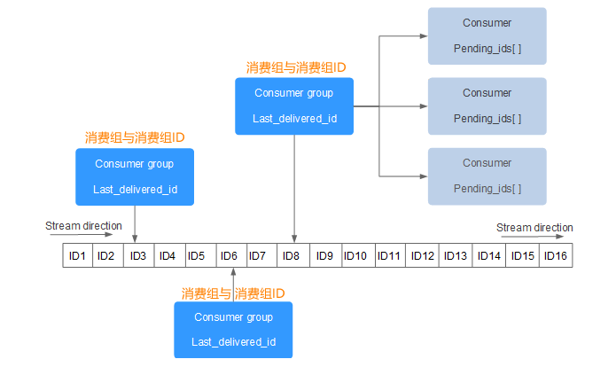

## Redis的数据类型

Redis六种数据类型：string、hash、list、set、zset、stream

### 公用命令

> - del key
> - dump key：序列化给定key，返回被序列化的值
> - exists key：检查key是否存在
> - expire key second：为key设定过期时间,以秒计算,可以不写second，默认为秒
> - ttl key：返回key剩余时间,-1为永久,-2为失效
> - persist key：移除key的过期时间，key将持久保存
> - keys pattern：查询所有符号给定模式的key eg：keys *
> - randomkey：随机返回一个key
> - rename key newkey：修改key的名称
> - move key db：移动key至指定数据库中 eg:move a 1
> - type key：返回key所储存的值的类型

> expirekey second的**使用场景**：
> 1、限时的优惠活动
> 2、网站数据缓存
> 3、手机验证码
> 4、限制网站访客频率

### key的命名建议

>1. key不要太长，尽量不要超过1024字节。不仅消耗内存，也会降低查找的效率
>2. key不要太短，太短可读性会降低
>3. 在一个项目中，key最好使用统一的命名模式，如user:123:password
>4. key区分大小写

### String

> string 数据结构是简单的 key-value 类型。虽说是String类型，但是其value值在底层存储可以是数字类型和字符串类型，它的编码格式有三种：int，raw，embstr。

> - **set key_name value**：命令不区分大小写，但是key_name区分大小写
> - **setnx key value**：当key不存在时设置key的值。（SET if Not eXists）,分布式锁的问题
> - setex：创建一个key，并且设置他的过期时间
> - get key_name
> - **getrange** key start end：获取key中字符串的子字符串，从start开始，end结束
> - setrange key offset value：设置从offset往后的值
> - mget key1 [key2 …]：获取多个key
> - getset key_name value：返回key的旧值,并设定key的值。当key不存在，返回nil
> - strlen key：返回key所存储的字符串的长度
> - **incr key_name** ：INCR命令key中存储的值+1,如果不存在key，则key中的值话先被初始化为0再加1
> - **INCRBY KEY_NAME** 增量
> - **DECR KEY_NAME**：key中的值自减一
> - **DECRBY KEY_NAME**
> - append key_name value：字符串拼接，追加至末尾，如果不存在，为其赋值

> **String应用场景**：
> 1、String通常用于保存单个字符串或JSON字符串数据
> 2、因为String是二进制安全的，所以可以把保密要求高的图片文件内容作为字符串来存储
> 3、计数器：常规Key-Value缓存应用，如微博数、粉丝数。INCR本身就具有原子性特性，所以不会有线程安全问题

### hash

Redis hash相当于JDK1.8前的HashMap，是一个数组+链表，每个key值对应一个string类型的field和value的映射表，**hash特别适用于存储对象**。每个hash可以存储**232-1**(40亿左右)键值对。可以看成KEY和VALUE的MAP容器。相比于JSON，hash占用很少的内存空间。

***常用命令***

> - hset key_name field value：为指定的key设定field和value
> - hmset key field value[field1,value1]
> - hsetnx：当不存在才创建该field
> - hget key field
> - hmget key field[field1]
> - hgetall key：返回hash表中所有字段和值
> - hkeys key：获取hash表所有字段
> - hvals key：获取hash表所有值
> - hlen key：获取hash表中的字段数量
> - hdel key field [field1]：删除一个或多个hash表的字段
> - hexists：在key里面是否存在指定的field
> - hincrby key field increment：增加某个field的值

***应用场景***

> Hash的应用场景，通常用来存储一个用户信息的对象数据。
>
> 1. 相比于存储对象的string类型的json串，json串修改单个属性需要将整个值取出来。而hash不需要。
> 2. 相比于多个key-value存储对象，hash节省了很多内存空间
> 3. 如果hash的属性值被删除完，那么hash的key也会被redis删除

### list

list是一个双向链表，两端都可以进行插入和删除。编码格式有两种：ziplist、linkedlist

> - lpush key value1 [value2]：从左侧插入，右边的先出,**相当于一个栈**
> - eg:lpush list 1 2 3 lrange list 0 -1 输出：3 2 1
>
> - rpush key value1 [value2]: 从右侧插入，左边的先出
> - eg:rpush list 1 2 3 lrange list 0 -1 输出：1 2 3
>
> - lpushx key value：从左侧插入值，如果list不存在，则不操作
> - rpushx key value：从右侧插入值，如果list不存在，则不操作
> - llen key：获取列表长度
> - lindex key index：获取指定索引的元素,从零开始
> - lrange key start stop：获取列表指定范围的元素
> - lpop key ：从左侧移除第一个元素
> - prop key：移除列表最后一个元素
> - irem:删除指定个数的同一元素
> - eg:irem list 2 3 删掉了集合中的两个三
>
> - blpop key [key1] timeout：移除并获取列表第一个元素，如果列表没有元素会阻塞列表到等待超时或发现可弹出元素为止
> - brpop key [key1] timeout：移除并获取列表最后一个元素，如果列表没有元素会阻塞列表到等待超时或发现可弹出元素为止
> - ltrim key start stop ：对列表进行修改，让列表只保留指定区间的元素，不在指定区间的元素就会被删除
> - eg:list1中元素1 2 3 4 5 ltrim list1 2 3 list1剩余元素:3 4
>
> - lset key index value ：指定索引的值
> - linsert key before|after world value：在列表元素前或则后插入元素

***应用场景***

> 1. 对数据大的集合数据删减、分页
>
>    &nbsp;&nbsp; 列表显示、关注列表、粉丝列表、留言评价...分页、热点新闻等
>
> 2. 消息队列
>    &nbsp;&nbsp; list通常用来实现一个消息队列，而且可以确保先后顺序，不必像MySQL那样通过order by来排序

> 补充：
>
> - rpoplpush list1 list2 移除list1最后一个元素，并将该元素添加到list2并返回此元素
>   用此命令可以实现订单下单流程、用户系统登录注册短信等。

**性能总结**

> 它是一个字符串链表，left、right都可以插入添加；
> 如果键不存在，创建新的链表；
> 如果键已存在，新增内容；
> 如果值全移除，对应的键也就消失了。
> 链表的操作无论是头和尾效率都极高，但假如是对中间元素进行操作，效率就很惨淡了。

### set

唯一、无序

> - sadd key value1[value2]：向集合添加成员
>
> - scard key：返回集合成员数
>
> - smembers key：返回集合中所有成员
>
> - sismember key member：判断memeber元素是否是集合key成员的成员
>
> - srandmember key [count]：返回集合中一个或多个随机数
>
> - srem key member1 [member2]：移除集合中一个或多个成员
>
> - spop key：移除并返回集合中的一个随机元素
>
> - smove source destination member：将member元素从source集合移动到destination集合
>
> - sdiff key1 [key2]：返回给定的第一个集合和其他集合的差集(即在key1中的值而在其他key中找不到)
>
> - sdiffstore destination key1[key2]：返回给定的第一个集合与其他的集合的差集并存储在destination中
>
>   eg：set1：1 2 3   set2：3 4 5 6   sdiffstore set3 set1 set2   smembers set3  result：1 2
>
> - sinter key1 [key2]:返回所有集合的交集
>
> - sunion key1 [key2]：返回所有集合的并集

> 对两个集合间的数据[计算]进行交集、并集、差集运算
> 1、以非常方便的实现如共同关注、共同喜好、二度好友等功能。对上面的所有集合操作，你还可以使用不同的命令选择将结果返回给客户端还是存储到一个新的集合中。
> 2、利用唯一性，可以统计访问网站的所有独立 IP

### zset

有序且不重复。每个元素都会关联一个double类型的分数，Redis通过分数进行从小到大的排序。分数可以重复

> - zadd key score1 memeber1
> - zcard key ：获取集合中的元素数量
> - zcount key min max 计算在有序集合中指定区间分数的成员数
> - zcount key min max 计算在有序集合中指定区间分数的成员数
> - zrange key start stop 指定输出索引范围内的成员
> - zrangebyscore key min max 指定输出score区间内的成员
>
> - zrank key member：返回有序集合指定成员的索引
> - zrevrange key start stop ：返回有序集中指定区间内的成员，通过索引，分数从高到底
> - zrem key member [member …] 移除有序集合中的一个或多个成员
> - zremrangebyrank key start stop 移除有序集合中给定的索引区间的所有成员(第一名是0)(低到高排序）
> - zremrangebyscore  key min max 移除有序集合中给定的分数区间的所有成员

> 常用于需要根据权重来进行排序的系统，比如弹幕，排行榜：
>
> 1. 如推特可以以发表时间作为score来存储
> 2. 存储成绩
> 3. 还可以用zset来做带权重的队列，让重要的任务先执行

### stream

Stream 实际上是一个具有消息发布/订阅功能的组件，也就常说的消息队列。其实这种类似于 broker/consumer(生产者/消费者)的数据结构很常见，比如 RabbitMQ 消息中间件、Celery 消息中间件，以及 Kafka 分布式消息系统等，而 Redis Stream 正是借鉴了 Kafaka 系统。

Stream 消息队列主要由四部分组成，分别是：消息本身、生产者、消费者和消费组

一个 Stream 队列可以拥有多个消费组，每个消费组中又包含了多个消费者，组内消费者之间存在竞争关系。当某个消费者消费了一条消息时，同组消费者，都不会再次消费这条消息。被消费的消息 ID 会被放入等待处理的 Pending_ids 中。每消费完一条信息，消费组的游标就会向前移动一位，组内消费者就继续去争抢下消息。

- Stream direction：表示数据流，它是一个消息链，将所有的消息都串起来，每个消息都有一个唯一标识 ID 和对应的消息内容（Message content）。
- Consumer Group ：表示消费组，拥有唯一的组名，使用 XGROUP CREATE 命令创建。一个 Stream 消息链上可以有多个消费组，一个消费组内拥有多个消费者，每一个消费者也有一个唯一的 ID 标识。
- last_delivered_id ：表示消费组游标，每个消费组都会有一个游标 last_delivered_id，任意一个消费者读取了消息都会使游标 last_delivered_id 往前移动。
- pending_ids ：Redis 官方称为 PEL，表示消费者的状态变量，它记录了当前已经被客户端读取的消息 ID，但是这些消息没有被 ACK(确认字符)。如果客户端没有 ACK，那么这个变量中的消息 ID 会越来越多，一旦被某个消息被 ACK，它就开始减少。

| 命令                      | 说明                                         |
| ------------------------- | -------------------------------------------- |
| XADD                      | 添加消息到末尾。                             |
| XTRIM                     | 对 Stream 流进行修剪，限制长度。             |
| XDEL                      | 删除指定的消息。                             |
| XLEN                      | 获取流包含的元素数量，即消息长度。           |
| XRANGE                    | 获取消息列表，会自动过滤已经删除的消息。     |
| XREVRANGE                 | 反向获取消息列表，ID 从大到小。              |
| XREAD                     | 以阻塞或非阻塞方式获取消息列表。             |
| XGROUP CREATE             | 创建消费者组。                               |
| XREADGROUP GROUP          | 读取消费者组中的消息。                       |
| XACK                      | 将消息标记为"已处理"。                       |
| XGROUP SETID              | 为消费者组设置新的最后递送消息ID。           |
| XGROUP DELCONSUMER        | 删除消费者。                                 |
| XGROUP DESTROY            | 删除消费者组。                               |
| XPENDING                  | 显示待处理消息的相关信息。                   |
| XCLAIM                    | 转移消息的归属权。                           |
| XINFO                     | 查看 Stream 流、消费者和消费者组的相关信息。 |
| XINFO GROUPS              | 查看消费者组的信息。                         |
| XINFO STREAM              | 查看 Stream 流信息。                         |
| XINFO CONSUMERS key group | 查看组内消费者流信息。                       |

