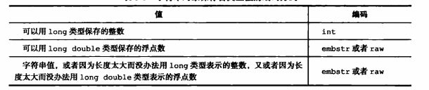
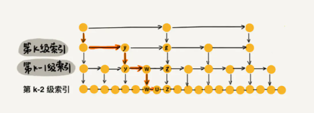

### redisDb

在源码的server.h中可以看到，dict存储了我们所有的key及其对应的具体redisobject对象

```c
typedef struct redisDb {
    dict *dict;                 /* The keyspace for this DB */
    dict *expires;              /* Timeout of keys with a timeout set 用来存放key的过期时间。*/
    dict *blocking_keys;        /* Keys with clients waiting for data (BLPOP)* 处于阻塞状态的键和相应的client（主要用于List类型的阻塞操作）/
    dict *ready_keys;           /* Blocked keys that received a PUSH 准备好数据可以解除阻塞状态的键和相应的client*/
    dict *watched_keys;         /* WATCHED keys for MULTI/EXEC CAS 被watch命令监控的key和相应client */
    int id;                     /* Database ID 数据库ID标识*/
    long long avg_ttl;          /* Average TTL, just for stats 数据库内所有键的平均TTL（生存时间） */
    list *defrag_later;         /* List of key names to attempt to defrag one by one, gradually. */
} redisDb;
```

而进一步在db.c中可以看到，每一个key值就是一个redisObject，其实就是SDS对象

```c
void dbAdd(redisDb *db, robj *key, robj *val) {
    sds copy = sdsdup(key->ptr);
    int retval = dictAdd(db->dict, copy, val);

    serverAssertWithInfo(NULL,key,retval == DICT_OK);
    if (val->type == OBJ_LIST ||
        val->type == OBJ_ZSET)
        signalKeyAsReady(db, key);
    if (server.cluster_enabled) slotToKeyAdd(key);
}
```

dict中存储的数据结构如下：

<center></center>

> 参考：:point_right: [【Redis源码剖析】 - Redis之数据库redisDb_Fred^_^的博客-CSDN博客](https://blog.csdn.net/xiejingfa/article/details/51321282)

### **redisObject** 

redisObject 是 Redis 类型系统的核心, 数据库中的每个键、值, 以及 Redis 本身处理的参数, 都表示为这种数据类型。比如list，set, hash等redis支持的数据类型，在底层都会以redisObject的方式来存储。redisObject是个结构体：

```c
typedef struct redisObject {
    unsigned type:4;
    unsigned encoding:4;
    unsigned lru:LRU_BITS; /* LRU time (relative to global lru_clock) or
                            * LFU data (least significant 8 bits frequency
                            * and most significant 16 bits access time). */
    int refcount;
    void *ptr;
} robj;
```

由五个属性组成：

1. **type** 表示当前值对象的一个数据类型，由六种取值：**string,hash,set,list,zset,stream**(Redis 5.x 支持六种数据类型)
2. **enconding** 表示当前值对象底层存储的编码格式。Redis 针对每种数据结构都设计有多种编码格式进行数据存储：
   - string：int、raw、embstr
   - hash：ziplist、hashtable
   - list：ziplist、linkedlist
   - set：hashtable、intser
   - zset：skiplist、ziplist
   - stream：stream

3. **lru 这个字段用来记录对象最后一次访问时间**，当前时间 - lru时间为空转时长，如果服务器打开了maxmemory选项，并且服务器用于回收内存的算法为volatile-1ru或者allkeys-1ru，那么当服务器占用的内存数超过了maxmemory选项所设置的上限值时，空转时长较高的那部分键会优先被服务器释放，从而回收内存。
4. **refcount 记录了当前对象被引用的次数**，**当 refcount =0时，表示可以安全回收当前对象。**
5. **ptr 就是指向真实存储数据的指针**。指向真实数据。

其实我的理解就是，不管是什么数据类型，key-value都是存在redisDb的字典中，key值保存在一个sds字符串对象中，value值使用一个redisObject来存储，而根据类型的不同，再考虑使用不同的编码格式，又或者说是不同的数据结构来存储，string类型可以有三种编码格式，而其它类型在存储时可以嵌套string对象。因此最基础的数据也只有两种：字符型和数字型(double,long,int等)。


#### 编码格式

##### string

**int：**当字符串能用long类型表达，就会采用int格式进行存储，直接将redisObject中ptr字段的值改为该数字(**注:当数值为0-10000时,key会指向预先创建好的共享对象池中的redisObject，而不需要新建redisObject**)。如果我们向对象执行了一些命令，使得这个对象保存的不再是整数值，而是一个字符串值，那么**字符串对象的编码将从int变为raw**。

**raw：**如果字符串对象保存的是一个字符串值，并且这个字符串值的长度大于32字节，那么那么字符串对象将使用raw编码的方式来保存这个字符串值，ptr指针指向对应的sdshdr。


**embstr：**如果字符串对象保存的是一个字符串值，并且这个字符串值的长度小于等于32字节，那么字符串对象将使用embstr编码的方式来保存这个字符串值。

embstr编码是专门用于保存短字符串的一种优化编码方式，这种编码和raw编码一样，都使用redisObject结构和sdshdr结构来表示字符串对象，但raw编码会调用两次内存分配函数来分别创建redisobject结构和sdshdr结构，而**embstr编码则通过调用一次内存分配函数来分配一块连续的空间**，空间中依次包含redisobject和sdshdr两个结构。


**embstr编码的字符串对象实际上是只读的**，因为Redis没有为embstr编码的字符串对象编写任何相应的修改程序（只有int编码的字符串对象和raw编码的字符串对象有这些程序)。当我们对embstr编码的字符串对象执行任何修改命令时，程序会先将对象的编码从embstr转换成raw，然后再执行修改命令。

好处在于：①只需要分配一次内存和释放一次内存 ②两个对象都保存在一块内存，更能利用缓存带来的优势


最后要说的是，可以用long double类型表示的浮点数在Redis中也是作为字符串值来保存的。如果我们要保存一个浮点数到字符串对象里面，那么程序会先将这个浮点数转换成字符串值，然后再保存转换所得的字符串值。在有需要的时候，程序会将保存在字符串对象里面的字符串值转换回浮点数值，执行某些操作，然后再将执行操作所得的浮点数值转换回字符串值，并继续保存在字符串对象里面。

各种类型的编码方式：

<center></center>

对应源码，位于object.c下，自行体会：

```c
/* Try to encode a string object in order to save space */
robj *tryObjectEncoding(robj *o) {
    long value;
    sds s = o->ptr;
    size_t len;

    /* Make sure this is a string object, the only type we encode
     * in this function. Other types use encoded memory efficient
     * representations but are handled by the commands implementing
     * the type. */
    serverAssertWithInfo(NULL,o,o->type == OBJ_STRING);

    /* We try some specialized encoding only for objects that are
     * RAW or EMBSTR encoded, in other words objects that are still
     * in represented by an actually array of chars. */
    if (!sdsEncodedObject(o)) return o;

    /* It's not safe to encode shared objects: shared objects can be shared
     * everywhere in the "object space" of Redis and may end in places where
     * they are not handled. We handle them only as values in the keyspace. */
    if (o->refcount > 1) return o;

    /* Check if we can represent this string as a long integer.
     * Note that we are sure that a string larger than 20 chars is not
     * representable as a 32 nor 64 bit integer. */
    len = sdslen(s);
    if (len <= 20 && string2l(s,len,&value)) {
        /* This object is encodable as a long. Try to use a shared object.
         * Note that we avoid using shared integers when maxmemory is used
         * because every object needs to have a private LRU field for the LRU
         * algorithm to work well. */
        if ((server.maxmemory == 0 ||
             !(server.maxmemory_policy & MAXMEMORY_FLAG_NO_SHARED_INTEGERS)) &&
            value >= 0 &&
            value < OBJ_SHARED_INTEGERS)
        {
            decrRefCount(o);
            incrRefCount(shared.integers[value]);
            return shared.integers[value];
        } else {
            if (o->encoding == OBJ_ENCODING_RAW) {
                sdsfree(o->ptr);
                o->encoding = OBJ_ENCODING_INT;
                o->ptr = (void*) value;
                return o;
            } else if (o->encoding == OBJ_ENCODING_EMBSTR) {
                decrRefCount(o);
                return createStringObjectFromLongLongForValue(value);
            }
        }
    }

    /* If the string is small and is still RAW encoded,
     * try the EMBSTR encoding which is more efficient.
     * In this representation the object and the SDS string are allocated
     * in the same chunk of memory to save space and cache misses. */
    if (len <= OBJ_ENCODING_EMBSTR_SIZE_LIMIT) {
        robj *emb;

        if (o->encoding == OBJ_ENCODING_EMBSTR) return o;
        emb = createEmbeddedStringObject(s,sdslen(s));
        decrRefCount(o);
        return emb;
    }

    /* We can't encode the object...
     *
     * Do the last try, and at least optimize the SDS string inside
     * the string object to require little space, in case there
     * is more than 10% of free space at the end of the SDS string.
     *
     * We do that only for relatively large strings as this branch
     * is only entered if the length of the string is greater than
     * OBJ_ENCODING_EMBSTR_SIZE_LIMIT. */
    trimStringObjectIfNeeded(o);  

    /* Return the original object. */
    return o;
}
```


##### hash

**ziplist：**当所有键和值的字符串长度都小于64B且键值对个数小于512个就用ziplist编码。ziplist编码的哈希对象使用**压缩列表**作为底层实现，每个键值对使用两个紧挨在一起的压缩列表节点来保存，先在列表表尾保存一个键的压缩结点，再保存值的压缩结点。因此:①同一个键值对键在前值在后 ②先添加的键值对在表头方向，后添加的在表尾方向。

<center></center>

**hashtable：**当一个键或值的字符串长度都大于等于64B或键值对个数大于等于512个就用hashtable编码。hashtable编码的哈希对象使用**字典**作为底层实现，哈希对象中的每个键值对都使用一个字典键值对来保存。字典的每个键都是一个字符串对象，对象中保存了键值对的键;字典的每个值都是一个字符串对象，对象中保存了健值对的值。

<center></center>

> 在redis7.0中，hash的编码方式就变成了listpack和hashtable。


##### list

**ziplist：** 当所有字符串对象的元素长度都小于64字节且元素个数小于512个就是用ziplist编码。ziplist编码的列表对象使用**压缩列表**作为底层实现，每个压缩列表节点(entry)保存了一个**列表元素**。

<center></center>

**linkedlist：** 当有一个字符串对象的元素长度大于等于64字节或者元素个数大于等于512个就用linkedlist编码，linkedlist编码的列表对象使用**双端链表**作为底层实现，每个双端链表节点(node)都保存了一个**字符串对象**，而每个字符串对象都保存了一个列表元素。

<center></center>

字符串对象具体的格式为：

<center></center>

>在redis3.2之后(包括)，list只有一种编码格式：quicklist。


##### set

**intset：**当集合元素都是整数且元素个数小于512个就用intset编码。intset使用整数集合作为底层实现，所有元素都保存在整数集合中。

<center></center>

**hashtable：**当集合元素有一个不是整数或元素个数大于等于512个就用hashtable编码。hashtable使用字典作为底层实现，字典的每个键都是一个字符串对象，每个字符串对象包含了一个集合元素，而字典的值则全部被设置为NULL。

<center></center>


##### zset

**ziplist**：当所有字符串对象的元素长度都小于64字节且元素个数小于128个就使用ziplist编码。ziplist编码的集合对象使用**压缩列表**作为底层实现，每个集合元素使用两个紧挨在一起的压缩列表节点来保存，第一个节点保存元素的值，而第二个保存元素的分值( score )。压缩列表内的集合元素按分值从小到大进行排序，分值较小的元素被放置在靠近表头的方向，而分值较大的元素则被放置在靠近表尾的方向。

<center></center>

**skiplist**：当有一个字符串对象的元素长度都大于等于64字节或元素个数大于等于128个就使用skiplist编码。skiplist编码的集合对象使用跳表和字典作为底层实现。

- 跳表：每个跳跃表节点都保存了一个集合元素，跳跃表节点的ele属性是一个字符串对象，保存了元素的值，而跳跃表节点的score属性则保存了元素的分值。通过这个跳跃表，程序可以对有序集合进行范围型操作，比如ZRANK、ZRANGE等命令就是基于跳跃表API来实现的。
- 字典：字典为有序集合创建了一个从值到分值的映射，字典中的每个键值对都保存了一个集合元素，字典的键是一个字符串对象，保存了元素的值，而字典的值也是一个字符串对象，保存了元素的分值。通过这个字典，程序可以用O(1)复杂度查找给定值的分数，ZSCORE命令就是根据这一特性实现的，而很多其他有序集合命令都在实现的内部用到了这一特性。

有序集合每个元素的值都是一个字符串对象，而每个元素的分值都是一个double类型的浮点数。值得一提的是，虽然skiplist编码同时使用跳跃表和字典来保存有序集合元素，但**这两种数据结构都会通过指针来共享相同元素的值和分数**，所以同时使用跳跃表和字典来保存集合元素不会产生任何重复成员或者分值，也不会因此而浪费额外的内存。

<center></center>

上图为了展示没有共享值和分数。


#### 共享对象池

创建大量重复的整数类型势必会耗费大量内存，所以在Redis内部维护了一个从0到9999的整数对象池，这就是**共享对象池**。

```shell
127.0.0.1:6379> set one-more-num1 404
OK
127.0.0.1:6379> object refcount one-more-num1
(integer) 2
172.24.130.22:6379> set one-more-num2 404
OK
127.0.0.1:6379> object refcount one-more-num2
(integer) 3
```

设置one-more-num1为404后，直接使用共享池中的整数对象，所以引用数为2（另外一个引用在对象池上）；再设置one-more-num2为404后，引用数变成了3。

不过需要注意的是：当设置最大内存值（maxmemory）并且启用LRU相关淘汰策略（如：volatile-lru、allkeys-lru）时，共享对象池将会被禁止使用。 

>**为什么没有字符串对象池？**

共享对象池中一个关键操作是判断对象是否相等。Redis中只有整数类型的对象池，是因为整数的比较算法的时间复杂度是O(1)，也只保留了10000个整数为了防止对象池的过度浪费。相对而言，字符串的比较算法的时间复杂度是O(n)，特别是长字符串的比较更加消耗性能。

而且，整数类型被重复使用的概率很大，字符串被重复使用的概率相比就会小很多很多，所以在Redis中只用整数类型的对象共享池。


### 数据结构

在对于数据的存储中，不同的编码格式可能会使用不同的数据结构，主要由：SDS、链表、字典、跳表、整数结合、压缩列表。

#### SDS(简单动态字符串)

SDS是Redis中定义的一种用于存储字符串的数据结构。对于 SDS ，Redis 有五种实现方式 SDS_TYPE_5、 SDS_TYPE_8、 SDS_TYPE_16、 SDS_TYPE_32、 SDS_TYPE_64。根据初始化的长度决定使用哪种类型，从而减少内存的使用。(Redis中所有的key都是用SDS来存储)

```c
struct __attribute__ ((__packed__)) sdshdr5 {
    unsigned char flags; /* 3 lsb of type, and 5 msb of string length */
    char buf[];
};
struct __attribute__ ((__packed__)) sdshdr8 {
    uint8_t len; /* used */
    uint8_t alloc; /* excluding the header and null terminator */
    unsigned char flags; /* 3 lsb of type, 5 unused bits */
    char buf[];
};
```

sdshdr5中只有两个元素flags和buf数组

sdshdr8以及其它的有四个元素：

- buf：一个char类型数组，用于存储数据，最后一个字节保存空字节‘\0’
- len：字符串长度，不包括空字节
- alloc：字符串可用空间大小，不包括空字节
- flags：标志位，用于标识sds的类型，目前只用了3位，还有5位空

SDS和C字符串的一个共同点就是字符串末尾都是一个空字节，但是它们有很大的区别：

1. SDS保存了字符串长度，而C并没有
2. SDS不会发生缓冲区溢出，C的strcat操作可能会溢出，SDS因为记录了字符串可用空间大小，在修改时会先检查空间是否满足修改的需求，不满足会进行扩容。
3. SDS减少了内存重分配次数，C每次增长和缩短字符串都会导致内存重分配，因为SDS采用了空间预分配和惰性空间释放，字符串长度变长后不用每次都重新分配空间；字符串缩短后不用立即重分配空间，当我们有需要的时候再释放。
4. 二进制安全。C字符申中的字符必须符合某种编码（比如ASCII），并且除了字符串的末尾之外，字符串里面不能包含空字符，否则最先被程序读入的空字符将被误认为是字符串结尾，这些限制使得C字符串只能保存文本数据，而不能保存像图片、音频、视频、压縮文件这样的二进制数据。而SDS中使用一个字段来保存了字符串的长度，因此SDS API都会以处理二进制的方式来处理SDS存放在buf数组里的数据，程序不会对其中的数据做任何限制、过滤、或者假设，数据在写人时是什么样的，它被读取时就是什么样。所以我们可以将SDS的buf属性称为字节数组：Redis不是用这个数组来保存字符，而是用它来保存一系列二进制数据。


> 参考：
>
> -  :point_right:[​  redis 系列，要懂redis，首先得看懂sds（全网最细节的sds讲解）_偷懒的程序员-小彭的博客-CSDN博客_redis sds](https://blog.csdn.net/qq_33361976/article/details/109014012)
> -  :point_right: [ Redis底层存储结构一---Redis中Key-Value中的Key_小乐乐的天台的博客-CSDN博客_redis 内部key](https://blog.csdn.net/qq_41931364/article/details/120923567)


#### list(链表)

链表在redis不仅作为list数据类型的一种底层存储，发布订阅、慢查询、监视器等功能也用到了链表，redis服务器本身还使用链表来保存多个客户端的状态信息。

数据结构定义如下：

```c
typedef struct listNode {
    struct listNode *prev;
    struct listNode *next;
    void *value;
} listNode;

typedef struct list {
    listNode *head;
    listNode *tail;
    void *(*dup)(void *ptr);  //dup 函数用于复制链表节点所保存的值;
    void (*free)(void *ptr);  //free函数用于释放链表节点所保存的值;
    int (*match)(void *ptr, void *key);  //match函数则用于对比链表节点所保存的值和另一个输入值是否相等。
    unsigned long len;
} list;
```

Redis链表特性：

1. 双端：链表具有前置节点和后置节点的引用，获取这两个节点时间复杂度都为O(1)。
2. 无环：表头节点的 prev 指针和表尾节点的 next 指针都指向 NULL,对链表的访问都是以 NULL 结束。　　
3. 带链表长度计数器：通过 len 属性获取链表长度的时间复杂度为 O(1)。
4. 多态：链表节点使用 void* 指针来保存节点值，可以保存各种不同类型的值。


#### dict(字典)

字典在redis不仅作为hash数据类型的一种底层存储，在redisDb中也用来保存所有的键值对、过期的键值对等信息。

<center></center>

Redis的字典使用哈希表作为底层实现，使用拉链发来处理冲突。

```c
typedef struct dictType {
    uint64_t (*hashFunction)(const void *key);
    void *(*keyDup)(void *privdata, const void *key);
    void *(*valDup)(void *privdata, const void *obj);
    int (*keyCompare)(void *privdata, const void *key1, const void *key2);
    void (*keyDestructor)(void *privdata, void *key);
    void (*valDestructor)(void *privdata, void *obj);
} dictType;

typedef struct dict {
    dictType *type;
    void *privdata;
    dictht ht[2];
    long rehashidx; /* rehashing not in progress if rehashidx == -1 */
    unsigned long iterators; /* number of iterators currently running */
} dict;

typedef struct dictht {
    dictEntry **table;
    unsigned long size;
    unsigned long sizemask;
    unsigned long used;
} dictht;

typedef struct dictEntry {
    void *key;
    union {
        void *val;
        uint64_t u64;
        int64_t s64;
        double d;
    } v;
    struct dictEntry *next;
} dictEntry;
```

redis对于dict的实现，主要是三个数据结构：dict、dictht、dictEntry。

dict：

- type属性指向一个dictType结构的指针，每个dictType保存了一组用于操作特定类型键值对的函数。如下的一个例子：

  ```c
  dictType BenchmarkDictType = {
      hashCallback,
      NULL,
      NULL,
      compareCallback,
      freeCallback,
      NULL
  };
  ```

- privdata属性保存了需要传给dictType中特定函数的可选参数。

- ht属性是一个包含两个项的数组，数组中的每个项都是一个dictht哈希表，一般情况下，字典只使用ht[0]哈希表，ht[1]哈希表只会在对ht [0]哈希表进行rehash时使用。

- rehashidx属性记录了rehash目前的进度，如果没有rehash，值为-1。

- iterators属性记录了有多少个迭代器正在运行。

dictht(哈希表)：

- table属性是一个数组，每个数组元素指向一个键值对(dictEntry)。

- size属性记录了数组的大小。

- sizemask属性用于计算索引值，等于size-1，将hash与sizemask进行与操作得到下标，

- 等同于取模操作。

  ```c
  11%3 = 2
  1011 & 0010 = 0010 = 2
  ```

- used属性表示哈希表已有节点的数量。

dictEntry(哈希表节点)：

- key属性记录键值对的键。
- val属性是一个uint64，int64，double类型，或者是一个指针，指向具体的值对象。
- next属性指向当前链表的下一个结点。


##### rehash

随着操作的不断执行，哈希表保存的键值对会逐渐地增多或者减少，为了让哈希表的负载因子( load factor）维持在一个合理的范围之内，当哈希表保存的键值对数量太多或者太少时,程序需要对哈希表的大小进行相应的扩展或者收缩。

扩展和收缩哈希表的工作可以通过执行rehash（重新散列）操作来完成，Redis对字典的哈希表执行rehash的步骤如下:

1. 为字典的ht[1]哈希表分配空间，这个哈希表的空间大小取决于要执行的操作，以及ht[0]当前包含的键值对数量（也即是ht [0].used属性的值)：

   - 如果执行的是扩展操作，那么ht [1]的大小为第一个大于等于ht [0].used\*2的2^n^。

   - 如果执行的是收缩操作，那么ht[1]的大小为第一个大于等于ht[0].used的2^n^。

     看源码：

     ```c
     static unsigned long _dictNextPower(unsigned long size)
     {
         unsigned long i = DICT_HT_INITIAL_SIZE;
     
         if (size >= LONG_MAX) return LONG_MAX + 1LU;
         while(1) {
             if (i >= size)
                 return i;
             i *= 2;
         }
     }
     ```

2. 将保存在ht[0]中的所有键值对rehash到ht[1]上面，rehash指的是重新计算键的哈希值和索引值，然后将键值对放置到ht[1]哈希表的指定位置上。redis的rehash使用了渐进式rehash。

3. 当ht [0]包含的所有键值对都迁移到了ht[1]之后(ht[0]变为空表)，释放ht[0]，将ht[1]设置为ht[0]，并在ht[1]新创建一个空白哈希表，为下一次rehash做准备。

哈希表的扩展的触发条件主要有两个：

1. 服务器目前没有在执行BGSAVE命令或者BGREWRITEAOF命令，并且哈希表的负载因子大于等于1。
2. 服务器目前正在执行BGSAVE命令或者BGREWRITEAOF命令，并且哈希表的负载因子大于等于5。
   $$负载因子 = 哈希表已保存结点数量 ÷ 哈希表大小 = ht[0].used ÷ ht[0].size$$

而当哈希表的负载因子小于0.1时，程序自动开始对哈希表执行收缩操作。

根据BGSAVE命令或BGREWRITEAOF命令是否正在执行，服务器执行扩展操作所需的负载因子并不相同，这是因为在执行BGSAVE命令或BGREWRITEAOF命令的过程中，Redis需要创建当前服务器进程的子进程，而大多数操作系统都采用写时复制（ copy-on-write)技术来优化子进程的使用效率，所以在子进程存在期间，服务器会提高执行扩展操作所需的负载因子，从而尽可能地避免在子进程存在期间进行哈希表扩展操作，这可以避免不必要的内存写人操作，最大限度地节约内存。


##### 渐进式rehash

上一节说过，扩展或收缩哈希表需要将ht[0]里面的所有键值对rehash到ht [1]里面，但是，这个rehash动作并不是一次性、集中式地完成的，而是分多次、渐进式地完成的。

这样做的原因在于，如果ht[0]里只保存着四个键值对，那么服务器可以在瞬间就将这些键值对全部rehash到ht[1];但是，如果哈希表里保存的键值对数量不是四个，而是四百万、四千万甚至四亿个键值对，那么要一次性将这些键值对全部rehash到ht [1]的话，庞大的计算量可能会导致服务器在一段时间内停止服务。

因此，为了避免rehash对服务器性能造成影响，服务器不是一次性将ht[0]里面的所有键值对全部rehash到ht[1]，而是分多次、渐进式地将ht[0]里面的键值对慢慢地rehash到ht [1]。

以下是哈希表渐进式rehash的详细步骤:

1. 在字典中维持一个索引计数器变量rehashidx，并将它的值设置为0，表示 rehash工.作正式开始。
2. 在rehash进行期间，每次对字典执行添加、删除、查找或者更新操作时，程序除了执行指定的操作以外，还会顺带将ht[0]哈希表在rehashidx索引上的所有键值对rehash 到ht[1]，当rehash工作完成之后，程序将rehashidx属性的值增一。
3. 随着字典操作的不断执行，最终在某个时间点上，ht [0]的所有键值对都会被rehash至ht[1]，这时程序将rehashidx属性的值设为-1，表示rehash操作已完成。

渐进式rehash 的好处在于它**采取分而治之的方式，将rehash键值对所需的计算工作均摊到对字典的每个添加、删除、查找和更新操作上，从而避免了集中式rehash而带来的庞大计算量。**

因为在进行渐进式rehash的过程中，字典会同时使用ht [0]和ht[1]两个哈希表，所以在渐进式rehash进行期间，字典的删除（ delete)、查找（find)、更新（ update）等操作会在两个哈希表上进行。例如，**要在字典里面查找一个键的话，程序会先在ht[0]里面进行查找，如果没找到的话，就会继续到ht[1〕里面进行查找**，诸如此类。

另外，在渐进式rehash执行期间，**新添加到字典的键值对一律会被保存到ht[1〕里面，而ht[0]则不再进行任何添加操作**，这一措施保证了ht[0]包含的键值对数量会只减不增，并随着rehash 操作的执行而最终变成空表。


#### zskiplist(跳表)

跳跃表（skiplist）是一种有序数据结构，它通过在每个节点中维持多个指向其他节点的指针，从而达到快速访问节点的目的。

##### 数据结构

看下下面的一个跳表例子：

<center></center>

**server.h**中关于数据结构的定义：

```c
typedef struct zskiplistNode {
    sds ele;
    double score;
    struct zskiplistNode *backward;
    struct zskiplistLevel {
        struct zskiplistNode *forward;
        unsigned long span;
    } level[];
} zskiplistNode;

typedef struct zskiplist {
    struct zskiplistNode *header, *tail;
    unsigned long length;
    int level;
} zskiplist;
```

在跳表中有四个属性：

- header:指向跳跃表的表头节点。
- tail:指向跳跃表的表尾节点。
- level:记录目前跳跃表内，层数最大的那个节点的层数（表头节点的层数不计算在内)。
- length:记录跳跃表的长度，也即是，跳跃表目前包含节点的数量（表头节点不计算在内)。

在跳表节点中也有四个属性：

- level数组：level数组可以包含多个元素，每个元素都包含一个指向其他节点的指针和跨度，跳表就是通过这些层来加快访问其他节点的速度，一般来说，层的数量越多，访问其他节点的速度就越快。每次创建一个新跳跃表节点的时候，就会调用**randomLevel()**随机生成当节点的层数。

  每一层的的forward指针指向当前层的下一个结点；span表示当前层到下一个结点的距离，也就是在原始链表上的中间结点数，它的作用是用来计算排位的，也就是在原始链表中的位置。

- backward指针：指向当前层的前一个结点，因为每个结点只有一个该指针，因此只能回退一个结点。

- score：一个double类型的分数，跳表根据分数来进行排序。

- ele：一个sds字符串对象，指向真实数据。


##### 查询

跳表查询数据时，会从最高层进行查找，若查找数据比当前数据大，比下一跳数据小，就下降一层继续查找，再遍历两者之间的结点，直到找到一个比查找数据小和大的结点区间后，再下降一层继续遍历两者间的结点，直到找到匹配的结点。因此跳表是**可以实现二分查找的有序链表**。

而跳表的设计中，可以指定每一层遍历几个结点，比如每一层中每两个结点必有一个抽出作为上一层的结点，因此每一层遍历时最多遍历3个结点。又表高为$log_2n$，因此时间复杂度为 $O(3*logn)$，省略常数即：$O(logn)$。而为了满足每一层遍历3个结点的设计，在插入时就要做一些处理。

例子：

<center></center>

图中所示，现在到达第 k 级索引，我们发现要查找的元素 x 比 y 大比 z 小，所以，我们需要从 y 处下降到 k-1 级索引继续查找，k-1级索引中比 y 大比 z 小的只有一个 w，所以在 k-1 级索引中，我们遍历的元素最多就是 y、w、z，发现 x 比 w大比 z 小之后，再下降到 k-2 级索引。所以，k-2 级索引最多遍历的元素为 w、u、z。


##### 插入

插入时，尽量让元素有 1/2 的几率建立在一层、1/4 的几率建立二层、1/8 的几率建立三层，以此类推，就能满足我们上面的条件。

需要创建一个randomLevel() 方法，随机生成 1~MAX_LEVEL 之间的数（MAX_LEVEL表示索引的最高层数），通过设置晋升概率，使**有 1/2的概率返回 1、1/4的概率返回 2、1/8的概率返回 3 ...** randomLevel() 方法返回 1 不建索引，仅插入原始链表、返回2建一级索引、返回 3 建二级索引、返回 4 建三级索引 ...

以下是redis中的实现：

```c
// 该 randomLevel 方法会随机生成 1~MAX_LEVEL 之间的数，且 ：
//        1/2 的概率返回 1
//        1/4 的概率返回 2
//        1/8 的概率返回 3 以此类推
private int randomLevel() {
    int level = 1;
    // 当 level < MAX_LEVEL，且随机数小于设定的晋升概率时，level + 1
    while (Math.random() < SKIPLIST_P && level < MAX_LEVEL)
        level += 1;
    return level;
}
```

我们的案例中晋升概率 SKIPLIST_P 设置的 1/2，即：每两个结点抽出一个结点作为上一级索引的结点。如果我们想节省空间利用率，可以适当的降低代码中的 SKIPLIST_P，从而减少索引元素个数，Redis 的 zset 中 SKIPLIST_P 设定的 0.25。

例子：

现在我们要插入数据 6 到跳表中，首先 randomLevel() 返回 3，表示**需要建二级索引**，即：一级索引和二级索引需要增加元素 6。该跳表目前最高三级索引，首先找到三级索引的 1，发现 6 比 1大比 13小，所以，从 1 下沉到二级索引。

<center></center>

下沉到二级索引后，发现 6 比 1 大比 7 小，此时需要在二级索引中 1 和 7 之间加一个元素6 ，并从元素 1 继续下沉到一级索引。

<center></center>

下沉到一级索引后，发现 6 比 1 大比 4 大，所以往后查找，发现 6 比 4 大比 7 小，此时需要在一级索引中 4 和 7 之间加一个元素 6 ，并把二级索引的 6 指向 一级索引的 6，最后，从元素 4 继续下沉到原始链表。

<center></center>

下沉到原始链表后，就比较简单了，发现 4、5 比 6小，7比6大，所以将6插入到 5 和 7 之间即可，整个插入过程结束。

<center></center>


##### 删除

删除元素的过程跟查找元素的过程类似，只不过在查找的路径上如果发现了要删除的元素 x，则执行删除操作。跳表中，每一层索引其实都是一个有序的单链表，单链表删除元素的时间复杂度为 O(1)，索引层数为 logn 表示最多需要删除 logn 个元素，所以删除元素的总时间包含 查找元素的时间加 删除 logn个元素的时间为 O(logn) + O(logn) = 2 O(logn)，忽略常数部分，删除元素的时间复杂度为 O(logn)。


> 参考：
>
> :point_right: [Skip List--跳表（全网最详细的跳表文章没有之一） - 简书 (jianshu.com)](https://www.jianshu.com/p/9d8296562806)


#### intset(整数集合)

整数集合( intset）是集合键的底层实现之一，当集合元素都是整数且元素个数小于512个就用intset编码。

```c
typedef struct intset {
    uint32_t encoding;
    uint32_t length;
    int8_t contents[];
} intset;
```

- contents数组是整数集合的底层实现：整数集合的每个元素都是contents数组的一个数组项( item )，各个项在数组中按值的大小**从小到大**有序地排列，并且数组中不包含任何重复项。
- length属性记录了整数集合包含的元素数量，也即是contents数组的长度。
- 虽然intset结构将contents属性声明为int8_t类型的数组，但实际上contents数组并不保存任何int8_t类型的值，contents数组的真正类型取决于encoding属性的值。

每当我们要将一个新元素添加到整数集合里面，并且新元素的类型比整数集合现有所有元素的类型都要长时，整数集合需要先进行**升级(upgrade)**，然后才能将新元素添加到整数集合里面。

升级整数集合并添加新元素共分为三步进行:

1. 根据新元素的类型，扩展整数集合底层数组的空间大小，并为新元素分配空间。
2. 将底层数组现有的所有元素都转换成与新元素相同的类型，并将类型转换后的元素放置到正确的位上，而且在放置元素的过程中，需要继续维持底层数组的有序性质不变。
3. 将新元素添加到底层数组里面。（一般就是放在最后一个）

升级的好处：

1. 提升灵活性：一般一个数组中只能放一种类型的元素，而intset采用升级来适应新类型元素。
2. 节约内存：数组初始设置为int8_t，随着元素值类型变化来重新设置数组类型，从而节省了内存空间。当然，要让一个数组可以同时保存int16_t、int32_t、int64_t三种类型的值，最简单的做法就是直接使用int64_t类型的数组作为整数集合的底层实现。不过这样一来,即使添加到整数集合里面的都是int16_t类型或者int32_t类型的值，数组都需要使用int64_t类型的空间去保存它们，从而出现浪费内存的情况。

不支持降级。


#### ziplist

ziplist是一个经过特殊编码的双向链表，旨在提高内存效率。它可以储存字符串和整型值，其中，整型值被编码为实际整数，字符串被编码为字节数组。压缩列表(ziplist)是列表键和哈希键的底层实现之一。

- hash:当所有键和值的字符串长度都小于64B且键值对个数小于512个就用ziplist编码。ziplist编码的哈希对象使用**压缩列表**作为底层实现，每个键值对使用两个紧挨在一起的压缩列表节点来保存，先在列表表尾保存一个键的压缩结点，再保存值的压缩结点。
- list:当所有字符串对象的元素长度都小于64字节且元素个数小于512个就是用ziplist编码。ziplist编码的列表对象使用**压缩列表**作为底层实现，每个压缩列表节点(entry)保存了一个**列表元素**。

##### 数据结构

每个ziplist占用的内存布局如下，分为五个部分：

<center></center>

- zlbytes是一个无符号整数，表示当前ziplist占用的总字节数。
- zltail是ziplist最后一个entry的指针相对于ziplist最开始的偏移量。通过它，不需要完全遍历ziplist就可以对最后的entry进行操作。
- zllen是ziplist的entry数量。当zllen比65534大时，需要完全遍历entry列表来获取entry的总数目。
- zlend是一个单字节的特殊值，为0xFF，等于255，标识着ziplist的内存结束点。


```c
/* We use this function to receive information about a ziplist entry.
 * Note that this is not how the data is actually encoded, is just what we
 * get filled by a function in order to operate more easily. */
typedef struct zlentry {
    unsigned int prevrawlensize; //记录prevrawlen需要的字节数
    unsigned int prevrawlen;    //记录上个节点的长度
    unsigned int lensize;        //记录len需要的字节数
    unsigned int len;           //记录节点长度
    unsigned int headersize;   //prevrawlensize+lensize 
    unsigned char encoding;   //编码格式
    unsigned char *p;       //具体的数据指针
} zlentry;
```

重点看注释，Note that this is not how the data is actually encoded，这句话说明这并不是数据的实际存储格式。因为，这个结构存储实在是太浪费空间了。这个结构32位机占用了25（int类型5个，每个int占4个字节，char类型1个，每个char占用1个字节，char\*类型1个，每个char\*占用4个字节，所以总共5\*4+1\*1+1\*4=25）个字节，在64位机占用了29（int类型5个，每个int占4个字节，char类型1个，每个char占用1个字节，char\*类型1个，每个char\*占用8个字节，所以总共5\*4+1\*1+1\*8=29个字节）。这不符合压缩列表的设计目的。

所以Redis对上述结构进行了改进了，抽象合并了三个参数：

- `prev_entry_len`: 前一个节点的长度，可以是一个字节和五个字节。

  - 如果前一个节点长度小于254字节，那么prev_entry_len使用一个字节表示。
  - 如果前一个节点长度大于等于254字节，那么prev_entry_len使用五个字节表示。第一个字节为常数0xFE(254)，后面四位为真正的前一个节点的长度。

  因为节点的previous_entry_length属性记录了前一个节点的长度，所以程序可以通过指针运算，根据当前节点的起始地址来计算出前一个节点的起始地址。

- `encoding`：记录了节点的content属性所保存数据的类型以及长度。

  - 一字节、两字节或者五字节长，值的最高位为00、01或者10的是字节数组编码：这种编码表示节点的content属性保存着字节数组，数组的长度由编码除去最高两位之后的其他位记录;
  - 一字节长，值的最高位以11开头的是整数编码：这种编码表示节点的content属性保存着整数值，整数值的类型和长度由编码除去最高两位之后的其他位记录;

- `content`：具体的数据。


##### 宏

Redis并没有像之前的字符串SDS，字典，跳跃表等结构一样，封装一个结构体来保存压缩列表的信息。而是**通过定义一系列宏来对数据进行操作**。也就是说压缩列表是一堆字节码，Redis通过操纵字节码来存储、获取数据。

1. **ZIP_IS_STR(enc)**

   ```c
   #define ZIP_IS_STR(enc) (((enc) & ZIP_STR_MASK) < ZIP_STR_MASK)
   ```

   ZIP_STR_MASK是0b0011_0000，将它与enc进行AND操作，如果enc是string类型，那么其前两位应该是00、01或10，因此计算之后的数值应该小于ZIP_STR_MASK的。

2. **ZIPLIST_BYTES(zl)**

   这个宏就是把ziplist最开头的zlbytes提取出来，代码也很简单，通过指针取zl对应的值。

   ```c
   #define ZIPLIST_BYTES(zl)       (*((uint32_t*)(zl)))
   ```

3. **ZIPLIST_TAIL_OFFSET(zl)**

   这个宏是提取ziplist的zltail内容，它的指针则是对zl偏移一个uint32_t大小(zlbytes的长度)获得的。

   ```c
   #define ZIPLIST_TAIL_OFFSET(zl) (*((uint32_t*)((zl)+sizeof(uint32_t))))
   ```

4. **ZIPLIST_LENGTH(zl)**

   获取zllen的内容，其指针的获取同上，只不过需要偏移两个uint32_t的内存大小。

   ```c
   #define ZIPLIST_LENGTH(zl)   (*((uint16_t*)((zl)+sizeof(uint32_t)*2)))
   ```

5. **ZIPLIST_ENTRY相关**

   redis使用三个宏来定位ziplist中entry的首尾位置。

   首先计算了ziplist中第一个entry到ziplist开头的偏移地址，其实就是zlbytes、zltail和zllen占用的内存大小。

   ```c
   #define ZIPLIST_HEADER_SIZE     (sizeof(uint32_t)*2+sizeof(uint16_t))
   ```

   接下来通过宏获得ziplist第一个entry的指针地址。

   ```c
   #define ZIPLIST_ENTRY_HEAD(zl)  ((zl)+ZIPLIST_HEADER_SIZE)
   ```

   那么ziplist的最后一个entry的指针地址也可以通过ZIPLIST_TAIL_OFFSET的宏获得。

   ```c
   #define ZIPLIST_ENTRY_TAIL(zl)  ((zl)+intrev32ifbe(ZIPLIST_TAIL_OFFSET(zl)))
   ```

   entry列表的地址边界也可以获得，ziplist最后是一个字节的zlend，因此，zl偏移zlbytes-1就可以获得其指针了。

   ```c
   #define ZIPLIST_ENTRY_END(zl)   ((zl)+intrev32ifbe(ZIPLIST_BYTES(zl))-1)
   ```

6. **ZIPLIST_INCR_LENGTH(zl,incr)**

   这个宏用来调整ziplist的entry数量，即zllen。因为ziplist每次只pop或push一个数据，因此这个宏的incr一般为1或-1。代码如下，当ZIPLIST_LENGTH(zl)大于UINT16_MAX时，就已经不再更新zllen了，之后统计ziplist长度就需要进行遍历。

   ```c
   #define ZIPLIST_INCR_LENGTH(zl,incr) { \
        if (ZIPLIST_LENGTH(zl) < UINT16_MAX) \
            ZIPLIST_LENGTH(zl) = intrev16ifbe(intrev16ifbe(ZIPLIST_LENGTH(zl))+incr); \
    }
   ```

   我当时迷糊了好久，为啥第三行代码ZIPLIST_LENGTH(zl)的结果可以直接赋值呢？我翻了好久也没翻出来，突然发现，ZIPLIST_LENGTH(zl)是宏定义。它在编译时是将定义的代码直接插入到第三行代码中的，这样就可以进行指针赋值了。

7. **ZIP_ENTRY_ENCODING(ptr, encoding)**

   这个宏是用来设置entry的encoding字段，

   ```c
   #define ZIP_ENTRY_ENCODING(ptr, encoding) do {  \
        (encoding) = (ptr[0]); \
        if ((encoding) < ZIP_STR_MASK) (encoding) &= ZIP_STR_MASK; \
    } while(0)
   ```

   代码中第三行，如果encoding小于ZIP_STR_MASK(0b1100_0000)，就通过AND操作将encoding后6位设置为0。

8. **ZIP_DECODE_LENGTH(ptr, encoding, lensize, len)**

   这个宏的实现目标为：根据encoding设置lensize，即len占用的字节数；根据ptr指向的数据设置len。接下来介绍lensize和len的设置，具体编码参考1.2章的encoding格式：

   - 如果encoding==ZIP_STR_06B(0b0000_0000)，它的lensize为1，len即为ptr[0]的后六位。
   - 如果encoding==ZIP_STR_14B(0b0100_0000)，lensize为2，len为((ptr[0]&0x3f)<<8)|ptr[1]。
   - 如果encoding==ZIP_STR_32B(0b1100_0000)，lensize为5，len为ptr[1]-ptr[4]组成的uint64类型整数。
   - 否则的话encoding>0b1100_0000，说明其是数字，则调用zipIntSize(encoding)设置它的len，lensize为1.

   ```c
   static unsigned int zipIntSize(unsigned char encoding) {
       switch(encoding) {
           case ZIP_INT_8B:  return 1;
           case ZIP_INT_16B: return 2;
           case ZIP_INT_24B: return 3;
           case ZIP_INT_32B: return 4;
           case ZIP_INT_64B: return 8;
           default: return 0; /* 4 bit immediate */
       }
       assert(NULL);
       return 0;
   }
   ```

9. **ZIP_DECODE_PREVLENSIZE(ptr, prevlensize)和ZIP_DECODE_PREVLEN(ptr, prevlensize, prevlen)**

   entry会记录上一个entry的大小，如果超过254则使用5个字节来储存其长度，否则只使用1个字节就够了。因此，ZIP_DECODE_PREVLENSIZE(ptr,prevlensize)就是用来设置entry中的prevlensize字段。

   ```c
   #define ZIP_DECODE_PREVLENSIZE(ptr, prevlensize) do {                          \
        if ((ptr)[0] < ZIP_BIGLEN) {                                               \
            (prevlensize) = 1;                                                     \
        } else {                                                                   \
            (prevlensize) = 5;                                                     \
        }                                                                          \
    } while(0);
   ```

   那ZIP_DECODE_PREVLEN(ptr, prevlensize, prevlen)就很简单了，就是把ptr[1]-ptr[4]的数据复制到prevlen。

   ```c
   #define ZIP_DECODE_PREVLEN(ptr, prevlensize, prevlen) do {                     \
        ZIP_DECODE_PREVLENSIZE(ptr, prevlensize);                                  \
        if ((prevlensize) == 1) {                                                  \
            (prevlen) = (ptr)[0];                                                  \
        } else if ((prevlensize) == 5) {                                           \
            assert(sizeof((prevlensize)) == 4);                                    \
            memcpy(&(prevlen), ((char*)(ptr)) + 1, 4);                             \
            memrev32ifbe(&prevlen);                                                \
        }                                                                          \
    } while(0);
   ```


>参考：:point_right: [ziplist源码阅读 - 知乎 (zhihu.com)](https://zhuanlan.zhihu.com/p/386251681)


##### 连锁更新

现在，考虑这样一种情况:在一个压缩列表中，有多个连续的、长度介于250字节到253字节之间的节点e1至eN。

<center></center>

因为e1至eN的所有节点的长度都小于254字节，所以记录这些节点的长度只需要1字节长的previous_entry_length属性，换句话说，e1至eN的所有节点的previous_entry_length属性都是1字节长的。

现在，麻烦的事情来了，e1原本的长度介于250字节至253字节之间，在为previous_entry_length属性新增四个字节的空间之后，e1的长度就变成了介于254字节至257字节之间，而这种长度使用1字节长的previous_entry_length属性是没办法保存的；因此，为了让e2的previous_entry_length属性可以记录下e1的长度，程序需要再次对压缩列表执行空间重分配操作，并将e2节点的previous_entry_length属性从原来的1字节长扩展为5字节长；正如扩展e1引发了对e2的扩展一样，扩展e2也会引发对e3的扩展，而扩展e3又会引发对e4的扩展……为了让每个节点的previous_entry_length属性都符合压缩列表对节点的要求，程序需要不断地对压缩列表执行空间重分配操作，直到eN为止。

以上情况就叫做**连锁更新**。除了添加新节点可能会引发连锁更新之外，删除节点也可能会引发连锁更新。

因为连锁更新在最坏情况下需要对压缩列表执行N次空间重分配操作，而每次空间重分配的最坏复杂度为O(N)，所以连锁更新的最坏复杂度为O(N^2^)。要注意的是，尽管连锁更新的复杂度较高，但它真正造成性能问题的几率是很低的：

- 首先，压缩列表里要恰好有多个连续的、长度介于250字节至253字节之间的节点，连锁更新才有可能被引发，在实际中，这种情况并不多见；
- 其次，即使出现连锁更新，但只要被更新的节点数量不多，就不会对性能造成任何影响。


##### ziplist的缺陷

在前面ziplist的介绍中，可以知道ziplist的最大特点就是它被设计成一种内存紧凑型的数据结构，占用一块连续的内存空间，以达到节省内存的目的。

但是，在计算机系统中，任何一个设计都是有利有弊的。对于 ziplist 来说，这个道理同样成立。虽然 ziplist 节省了内存开销，可它也存在两个设计代价：

- 一是**不能保存过多的元素**，否则访问性能会降低；
- 二是**不能保存过大的元素**，否则容易导致内存重新分配，甚至可能引发连锁更新的问题。

对于这两个代价，也就引出了ziplist的两个缺陷：

1）**查找复杂度高**。

因为 ziplist 头尾元数据的大小是固定的，并且在 ziplist 头部记录了最后一个元素的位置，所以，当在 ziplist 中查找第一个或最后一个元素的时候，就可以很快找到。但问题是，**当要查找列表中间的元素时，ziplist 就得从列表头或列表尾遍历才行**。而当 ziplist 保存的元素过多时，查找中间数据的复杂度就增加了。更糟糕的是，如果 ziplist 里面保存的是字符串，ziplist 在查找某个元素时，还需要逐一判断元素的每个字符，这样又进一步增加了复杂度。

也正因为如此，我们在使用 ziplist 保存 Hash 或 Sorted Set 数据时，都会在 redis.conf 文件中，通过 hash-max-ziplist-entries 和 zset-max-ziplist-entries 两个参数，来控制保存在 ziplist 中的元素个数。

不仅如此，除了查找复杂度高以外，**ziplist 在插入元素时，如果内存空间不够了，ziplist 还需要重新分配一块连续的内存空间**，而这还会进一步引发连锁更新的问题。

2）**连锁更新风险**。这一点在前面已经介绍过了。

所以说，虽然 ziplist 紧凑型的内存布局能节省内存开销，但是**如果保存的元素数量增加了，或是元素变大了**，ziplist 就会面临性能问题。那么，有没有什么方法可以避免 ziplist 的问题呢？这就是接下来要介绍的 **quicklist** 和 **listpack**，这两种数据结构的设计目标，就是尽可能地保持 ziplist 节省内存的优势，同时避免 ziplist 潜在的性能下降问题。


#### quicklist

quicklist 的设计，其实是结合了链表和 ziplist 各自的优势。简单来说，**一个 quicklist 就是一个链表，而链表中的每个元素又是一个 ziplist。**可以看下下面这张图：

<center></center>

##### 数据结构

首先，来看下quicklist：

```c
typedef struct quicklist {
    quicklistNode *head;   //指向链表头
    quicklistNode *tail;   //指向链表尾
    unsigned long count;        //所有ziplist数据项的个数总和
    unsigned long len;          //quicklist节点的个数
    int fill : QL_FILL_BITS;              //ziplist大小设置，存放list-max-ziplist-size参数的值
    unsigned int compress : QL_COMP_BITS; //节点压缩深度设置，存放list-compress-depth参数的值
    //bookmakrs是可选的，主要用来重新分配这个结构体
    unsigned int bookmark_count: QL_BM_BITS;  
    quicklistBookmark bookmarks[];
} quicklist;
```

- head: 指向头节点（左侧第一个节点）的指针。
- tail: 指向尾节点（右侧第一个节点）的指针。
- count: 所有ziplist数据项的个数总和。
- len: quicklist节点的个数。
- fill: 16bit，ziplist大小设置，存放`list-max-ziplist-size`参数的值。
- compress: 16bit，节点压缩深度设置，存放`list-compress-depth`参数的值。

quicklist 中的每个元素就是 quicklistNode：

```c
typedef struct quicklistNode {
    struct quicklistNode *prev;   // 前一个quicklistNode
    struct quicklistNode *next;   // 后一个quicklistNode
    unsigned char *zl;            // 数据指针。如果当前节点的数据没有压缩，那么它指向一个ziplist结构；否则，它指向一个quicklistLZF结构。
    unsigned int sz;             // ziplist的字节大小(包括zlbytes, zltail, zllen, zlend和各个数据项），如果ziplist被压缩了，那么这个sz的值仍然是压缩前的ziplist大小。
    unsigned int count : 16;     // ziplist中的元素个数
    unsigned int encoding : 2;   // 编码格式，原生字节数组或压缩存储 RAW==1 or LZF==2
    unsigned int container : 2;  // 存储方式 NONE==1 or ZIPLIST==2
    unsigned int recompress : 1;  // 数据是否被压缩
    unsigned int attempted_compress : 1; // 数据能否被压缩，这个值只对Redis的自动化测试程序有用。我们不用管它。
    unsigned int extra : 10;   // 预留的bit位
} quicklistNode;
```

- prev: 指向链表前一个节点的指针。
- next: 指向链表后一个节点的指针。
- zl: 数据指针。如果当前节点的数据没有压缩，那么它指向一个ziplist结构；否则，它指向一个quicklistLZF结构。
- sz: 表示zl指向的ziplist的总大小（包括`zlbytes`, `zltail`, `zllen`, `zlend`和各个数据项）。需要注意的是：如果ziplist被压缩了，那么这个sz的值仍然是压缩前的ziplist大小。
- count: 表示ziplist里面包含的数据项个数。这个字段只有16bit。稍后我们会一起计算一下这16bit是否够用。
- encoding: 表示ziplist是否压缩了（以及用了哪个压缩算法）。目前只有两种取值：2表示被压缩了（而且用的是LZF压缩算法），1表示没有压缩。
- container: 本来设计是用来表明存储方式的，即是直接存数据，还是使用ziplist存数据。但是，在目前的实现中，这个值是一个固定的值2，表示使用ziplist作为数据容器。
- recompress: 当我们使用类似lindex这样的命令查看了某一项本来压缩的数据时，需要把数据暂时解压，这时就设置recompress=1做一个标记，等有机会再把数据重新压缩。
- attempted_compress: 这个值只对Redis的自动化测试程序有用。我们不用管它。
- extra: 其它扩展字段。目前Redis的实现里也没用上。

```c
typedef struct quicklistLZF {
    unsigned int sz; /* LZF size in bytes*/
    char compressed[];
} quicklistLZF;
```

quicklistLZF结构表示一个被压缩过的ziplist。其中：

- sz: 表示压缩后的ziplist大小。
- compressed: 是个柔性数组（[flexible array member](https://en.wikipedia.org/wiki/Flexible_array_member)），存放压缩后的ziplist字节数组。

##### 插入

quicklist可以选择在头部或者尾部进行插入(`quicklistPushHead`和`quicklistPushTail`)，而不管是在头部还是尾部插入数据，都包含两种情况：

- 如果头节点（或尾节点）上ziplist大小没有超过限制（即`_quicklistNodeAllowInsert`返回1），那么新数据被直接插入到ziplist中（调用`ziplistPush`）。
- 如果头节点（或尾节点）上ziplist太大了，那么新创建一个quicklistNode节点（对应地也会新创建一个ziplist），然后把这个新创建的节点插入到quicklist双向链表中。

也可以从任意指定的位置插入。`quicklistInsertAfter`和`quicklistInsertBefore`就是分别在指定位置后面和前面插入数据项。这种在任意指定位置插入数据的操作，要比在头部和尾部的进行插入要复杂一些。

- 当插入位置所在的ziplist大小没有超过限制时，直接插入到ziplist中就好了；
- 当插入位置所在的ziplist大小超过了限制，但插入的位置位于ziplist两端，并且相邻的quicklist链表节点的ziplist大小没有超过限制，那么就转而插入到相邻的那个quicklist链表节点的ziplist中；
- 当插入位置所在的ziplist大小超过了限制，但插入的位置位于ziplist两端，并且相邻的quicklist链表节点的ziplist大小也超过限制，这时需要新创建一个quicklist链表节点插入。
- 对于插入位置所在的ziplist大小超过了限制的其它情况（主要对应于在ziplist中间插入数据的情况），则需要把当前ziplist分裂为两个节点，然后再其中一个节点上插入数据。


#### listpack

listpack 也叫**紧凑列表**，它的特点就是**用一块连续的内存空间来紧凑地保存数据，同时为了节省内存空间，listpack 列表项使用了多种编码方式，来表示不同长度的数据，这些数据包括整数和字符串**。

Redis源码对于listpack的解释为 A lists of strings serialization format，**一个字符串列表的序列化格式**，也就是将一个字符串列表进行序列化存储

##### 数据结构

listpack的结构：

<center></center>

listpack由4部分组成：total Bytes、Num Elem、Entry以及End：

- Total Bytes为整个listpack的空间大小，占用4个字节，每个listpack最多占用4294967295Bytes(2^32^-1)；
- Num Elem为listpack中的元素个数，即Entry的个数，占用2个字节，值得注意的是，这并不意味着listpack最多只能存放65535个Entry，当Entry个数大于等于65535时，Num Elem被设置为65535，此时如果需要获取元素个数，需要遍历整个listpack；
- Entry为每个具体的元素；
- End为listpack结束标志，占用1个字节，内容为0xFF。

可以看下 listpack 的创建函数 lpNew，因为从这个函数的代码逻辑中，我们可以了解到 listpack 的整体结构。lpNew 函数创建了一个空的 listpack，一开始分配的大小是 LP_HDR_SIZE 再加 1 个字节。LP_HDR_SIZE 宏定义是在 listpack.c 中，它默认是 6 个字节，其中 4 个字节是记录 listpack 的总字节数，2 个字节是记录 listpack 的元素数量。此外，listpack 的最后一个字节是用来标识 listpack 的结束，其默认值是宏定义 LP_EOF。和 ziplist 列表项的结束标记一样，LP_EOF 的值也是 255。

```c
#define LP_HDR_SIZE 6       /* 32 bit total len + 16 bit number of elements. */
#define LP_EOF 0xFF
```

```c
/* Create a new, empty listpack.
 * On success the new listpack is returned, otherwise an error is returned.
 * Pre-allocate at least `capacity` bytes of memory,
 * over-allocated memory can be shrinked by `lpShrinkToFit`.
 * */
unsigned char *lpNew(size_t capacity) {
    unsigned char *lp = lp_malloc(capacity > LP_HDR_SIZE+1 ? capacity : LP_HDR_SIZE+1);
    if (lp == NULL) return NULL;
    lpSetTotalBytes(lp,LP_HDR_SIZE+1);
    lpSetNumElements(lp,0);
    lp[LP_HDR_SIZE] = LP_EOF;
    return lp;
}
```

Entry为listpack中的具体元素，其内容可以为字符串或者整型，每个Entry如下：

<center></center>

从组成上可以看出，和 ziplist 列表项类似，listpack 列表项也包含了元数据信息和数据本身。

不过，为了避免 ziplist 引起的连锁更新问题，listpack 中的每个列表项不再像 ziplist 列表项那样，保存其前一个列表项的长度，它只会包含三个方面内容，分别是当前元素的**编码类型**（encoding）、**元素数据** (data)、以及**编码类型和元素数据这两部分的长度** (len)。

其中 encoding 和 len 一定有值；有时 data 可能会缺失，因为对于一些小的元素可以直接将data放在encoding字段中。

len记录了这个Entry的长度（encoding + data），注意并不包括 len 自身的长度，占用的字节数小于等于5：

- len 所占用的每个字节的第一个 bit 用于标识；0代表结束，1代表尚未结束，每个字节只有7 bit 有效；
- len 主要用于从后向前遍历，当我们需要找到当前元素的上一个元素时，我们可以从后向前依次查找每个字节，找到上一个Entry的 len 字段的结束标识，进而可以计算出上一个元素的长度。
  例如 len 为0000000110001000，代表该元素的长度为00000010001000，即136字节。通过计算即可算出上一个元素的首地址（entry的首地址）。

需要注意的是，在整型存储中，并不实际存储负数，而是将负数转换为正数进行存储。例如，在13位整型存储中，存储范围为[0, 8191]，其中[0, 4095]对应非负的[0, 4095]（当然，[0, 127]将会采用7位无符号整型存储），而[4096, 8191]则对应[-4096, -1]。


##### 编码格式

listpack 列表项编码方法我们先来看下 listpack 元素的编码类型。如果你看了 listpack.c 文件，你会发现该文件中有大量类似 LP_ENCODING_N_BIT_INT 和 LP_ENCODING_N_BIT_STR 的宏定义，如下所示：

```c
#define LP_ENCODING_7BIT_UINT 0
#define LP_ENCODING_7BIT_UINT_MASK 0x80
#define LP_ENCODING_IS_7BIT_UINT(byte) (((byte)&LP_ENCODING_7BIT_UINT_MASK)==LP_ENCODING_7BIT_UINT)

#define LP_ENCODING_6BIT_STR 0x80
#define LP_ENCODING_6BIT_STR_MASK 0xC0
#define LP_ENCODING_IS_6BIT_STR(byte) (((byte)&LP_ENCODING_6BIT_STR_MASK)==LP_ENCODING_6BIT_STR)

#define LP_ENCODING_13BIT_INT 0xC0
#define LP_ENCODING_13BIT_INT_MASK 0xE0
#define LP_ENCODING_IS_13BIT_INT(byte) (((byte)&LP_ENCODING_13BIT_INT_MASK)==LP_ENCODING_13BIT_INT)

#define LP_ENCODING_12BIT_STR 0xE0
#define LP_ENCODING_12BIT_STR_MASK 0xF0
#define LP_ENCODING_IS_12BIT_STR(byte) (((byte)&LP_ENCODING_12BIT_STR_MASK)==LP_ENCODING_12BIT_STR)

#define LP_ENCODING_16BIT_INT 0xF1
#define LP_ENCODING_16BIT_INT_MASK 0xFF
#define LP_ENCODING_IS_16BIT_INT(byte) (((byte)&LP_ENCODING_16BIT_INT_MASK)==LP_ENCODING_16BIT_INT)

#define LP_ENCODING_24BIT_INT 0xF2
#define LP_ENCODING_24BIT_INT_MASK 0xFF
#define LP_ENCODING_IS_24BIT_INT(byte) (((byte)&LP_ENCODING_24BIT_INT_MASK)==LP_ENCODING_24BIT_INT)

#define LP_ENCODING_32BIT_INT 0xF3
#define LP_ENCODING_32BIT_INT_MASK 0xFF
#define LP_ENCODING_IS_32BIT_INT(byte) (((byte)&LP_ENCODING_32BIT_INT_MASK)==LP_ENCODING_32BIT_INT)

#define LP_ENCODING_64BIT_INT 0xF4
#define LP_ENCODING_64BIT_INT_MASK 0xFF
#define LP_ENCODING_IS_64BIT_INT(byte) (((byte)&LP_ENCODING_64BIT_INT_MASK)==LP_ENCODING_64BIT_INT)

#define LP_ENCODING_32BIT_STR 0xF0
#define LP_ENCODING_32BIT_STR_MASK 0xFF
#define LP_ENCODING_IS_32BIT_STR(byte) (((byte)&LP_ENCODING_32BIT_STR_MASK)==LP_ENCODING_32BIT_STR)
```

大概可以分为三种：

1）单字节数字：

LP_ENCODING_7BIT_UINT ：表示元素的实际数据是一个 7 bit 的无符号整数。又因为 LP_ENCODING_7BIT_UINT 本身的宏定义值为 0，所以编码类型的值也相应为 0，占 1 个 bit。此时，编码类型和元素实际数据共用 1 个字节，这个字节的最高位为 0，表示编码类型，后续的 7 位用来存储 7 bit 的无符号整数。

```c
0|xxxxxxx
```

2）单字节字符串

LP_ENCODING_6BIT_STR：6位字符串长度，后6位为字符串长度，再之后则是字符串内容（0 ~ 63 bytes）。

```c
10|xxxxxx <string-data>
```

3）多字节编码

如果第一个字节的最高2bit被设置为1，采用如下两种编码方式

```c
110|xxxxx xxxxxxxx -- LP_ENCODING_13BIT_INT，即13位整型，后5位及下个字节为数据内容
1110|xxxx xxxxxxxx -- LP_ENCODING_12BIT_STR，即12位长度的字符串，后4位及下个字节为字符串长度，再之后的为字符串数据。
```

如果第一个字节的最高4bit被设置为1，将采用以下几种方式编码:

```c
1111|0000 <4 bytes len> <large string>，LP_ENCODING_32BIT_STR,即32位长度字符串，后4字节为字符串长度，再之后为字符串内容
1111|0001 <16 bits signed integer>，LP_ENCODING_16BIT_INT,即16位整型，后2字节为数据
1111|0010 <24 bits signed integer>，LP_ENCODING_24BIT_INT,即24位整型，后3字节为数据
1111|0011 <32 bits signed integer>，LP_ENCODING_32BIT_INT,即32位整型，后4字节为数据
1111|0100 <64 bits signed integer>，LP_ENCODING_64BIT_INT,即64位整型，后8字节为数据
1111|0101 to 1111|1110 are currently not used.   当前不用编码
1111|1111 End of listpack，结尾标识
```


##### listpack 避免连锁更新的实现方式

最后，我们再来了解下 listpack 列表项是如何避免连锁更新的。在 listpack 中，因为每个列表项只记录自己的长度，而不会像 ziplist 中的列表项那样，会记录前一项的长度。所以，当我们在 listpack 中新增或修改元素时，实际上只会涉及每个列表项自己的操作，而不会影响后续列表项的长度变化，这就避免了连锁更新。

不过，你可能会有疑问：如果 listpack 列表项只记录当前项的长度，那么 listpack 支持从左向右正向查询列表，或是从右向左反向查询列表吗？

其实，listpack 是能支持正、反向查询列表的。

当应用程序从左向右正向查询 listpack 时，我们可以先调用 lpFirst 函数。该函数的参数是指向 listpack 头的指针，它在执行时，会让指针向右偏移 LP_HDR_SIZE 大小，也就是跳过 listpack 头。你可以看下 lpFirst 函数的代码，如下所示：

```c
/* Return a pointer to the first element of the listpack, or NULL if the
 * listpack has no elements. */
unsigned char *lpFirst(unsigned char *lp) {
    // 跳过listpack头部6个字节
    unsigned char *p = lp + LP_HDR_SIZE; /* Skip the header. */
    // 如果已经是listpack的末尾结束字节，则返回NULL
    if (p[0] == LP_EOF) return NULL;
    lpAssertValidEntry(lp, lpBytes(lp), p);
    return p;
}
```

然后，再调用 lpNext 函数，该函数的参数包括了指向 listpack 某个列表项的指针。lpNext 函数会进一步调用 lpSkip 函数，并传入当前列表项的指针，如下所示：

```c
unsigned char *lpNext(unsigned char *lp, unsigned char *p) {
    ((void) lp); 
    p = lpSkip(p);
    if (p[0] == LP_EOF) return NULL;
    return p;
}
```

最后，lpSkip 函数会先后调用 lpCurrentEncodedSize 和 lpEncodeBacklen 这两个函数：

- lpCurrentEncodedSize函数是根据当前列表项第 1 个字节的取值，来计算当前项的编码类型，并根据编码类型，计算当前项编码类型和实际数据的总长度；
- lpEncodeBacklen函数会根据编码类型和实际数据的长度之和，进一步计算列表项最后一部分 entry-len 本身的长度。这样一来，lpSkip 函数就知道当前项的编码类型、实际数据和 len 的总长度了，也就可以将当前项指针向右偏移相应的长度，从而实现查到下一个列表项的目的。

下面代码展示了 lpEncodeBacklen 函数的基本计算逻辑，你可以看下：

```c
/* Store a reverse-encoded variable length field, representing the length
 * of the previous element of size 'l', in the target buffer 'buf'.
 * The function returns the number of bytes used to encode it, from
 * 1 to 5. If 'buf' is NULL the function just returns the number of bytes
 * needed in order to encode the backlen. */
unsigned long lpEncodeBacklen(unsigned char *buf, uint64_t l) {
    // 编码类型和实际数据的总长度小于等于127，entry-len长度为1字节
    if (l <= 127) {
        if (buf) buf[0] = l;
        return 1;
    } else if (l < 16383) {
        // 编码类型和实际数据的总长度大于127但小于16383，entry-len长度为2字节
        if (buf) {
            buf[0] = l>>7;
            buf[1] = (l&127)|128;
        }
        return 2;
    } else if (l < 2097151) {
        // 编码类型和实际数据的总长度大于16383但小于2097151，entry-len长度为3字节
        if (buf) {
            buf[0] = l>>14;
            buf[1] = ((l>>7)&127)|128;
            buf[2] = (l&127)|128;
        }
        return 3;
    } else if (l < 268435455) {
        // 编码类型和实际数据的总长度大于2097151但小于268435455，entry-len长度为4字节
        if (buf) {
            buf[0] = l>>21;
            buf[1] = ((l>>14)&127)|128;
            buf[2] = ((l>>7)&127)|128;
            buf[3] = (l&127)|128;
        }
        return 4;
    } else {
        // 否则，entry-len长度为5字节
        if (buf) {
            buf[0] = l>>28;
            buf[1] = ((l>>21)&127)|128;
            buf[2] = ((l>>14)&127)|128;
            buf[3] = ((l>>7)&127)|128;
            buf[4] = (l&127)|128;
        }
        return 5;
    }
}
```

大概流程就是：

<center></center>

再来看下**从右向左反向查询 listpack**：

首先，我们根据 listpack 头中记录的 listpack 总长度，就可以直接定位到 listapck 的尾部结束标记。然后，我们可以调用 **lpPrev** 函数，该函数的参数包括指向某个列表项的指针，并返回指向当前列表项前一项的指针。lpPrev 函数中的关键一步就是调用 **lpDecodeBacklen** 函数。

lpDecodeBacklen 函数会从右向左，逐个字节地读取当前列表项的 len。那么，lpDecodeBacklen 函数如何判断 len 是否结束了呢？

这就依赖于 len 的编码方式了。len 每个字节的最高位，是用来表示当前字节是否为 len 的最后一个字节，这里存在两种情况，分别是：

- 最高位为 1，表示 len 还没有结束，当前字节的左边字节仍然表示 len 的内容；
- 最高位为 0，表示当前字节已经是 len 最后一个字节了。

而 len 每个字节的低 7 位，则记录了实际的长度信息。这里你需要注意的是，len 每个字节的低 7 位采用了大端模式存储，也就是说，len 的低位字节保存在内存高地址上：

<center></center>

正是因为有了 len 的特别编码方式，lpDecodeBacklen 函数就可以从当前列表项起始位置的指针开始，向左逐个字节解析，得到前一项的 len 值，也就可以得到encoding + data的总长度，从而得出entry的总长度；减去entry的总长度，就得到了前一个entry的地址。


#### ziplist & quicklist & listpack

你要知道，ziplist 的不足主要在于一旦 ziplist 中元素个数多了，它的查找效率就会降低。而且如果在 ziplist 里新增或修改数据，ziplist 占用的内存空间还需要重新分配；更糟糕的是，ziplist 新增某个元素或修改某个元素时，可能会导致后续元素的 prevlen 占用空间都发生变化，从而引起连锁更新问题，导致每个元素的空间都要重新分配，这就会导致 ziplist 的访问性能下降。

所以，为了应对 ziplist 的问题，Redis 先是在 3.0 版本中设计实现了 quicklist。quicklist 结构在 ziplist 基础上，使用链表将 ziplist 串联起来，链表的每个元素就是一个 ziplist。这种设计减少了数据插入时内存空间的重新分配，以及内存数据的拷贝。同时，quicklist 限制了每个节点上 ziplist 的大小，一旦一个 ziplist 过大，就会采用新增 quicklist 节点的方法。不过，又因为 quicklist 使用 quicklistNode 结构指向每个 ziplist，无疑增加了内存开销。

为了减少内存开销，并进一步避免 ziplist 连锁更新问题，Redis 在 5.0 版本中，就设计实现了 listpack 结构。listpack 结构沿用了 ziplist 紧凑型的内存布局，把每个元素都紧挨着放置。listpack 中每个列表项不再包含前一项的长度了，因此当某个列表项中的数据发生变化，导致列表项长度变化时，其他列表项的长度是不会受影响的，因而这就避免了 ziplist 面临的连锁更新问题。

总而言之，Redis 在内存紧凑型列表的设计与实现上，从 ziplist 到 quicklist，再到 listpack，你可以看到 Redis 在内存空间开销和访问性能之间的设计取舍，这一系列的设计变化，是非常值得学习的。


#### rax(前缀树)

**rax** 是 redis 自己实现的基数树, 它是一种基于存储空间优化的前缀树数据结构, 在 redis 的许多地方都有使用到，比如：streams这个类型里面的 consumer group(消费者组) 的名称还有集群名称；集群状态下clusterState中的slots_to_keys用rax保存了从槽到key之间的关系。

通常来讲, 一个基数树(前缀树) 看起来如下所示：

```c
 *              (f) ""
 *                \
 *                (o) "f"
 *                  \
 *                  (o) "fo"
 *                    \
 *                  [t   b] "foo"
 *                  /     \
 *         "foot" (e)     (a) "foob"
 *                /         \
 *      "foote" (r)         (r) "fooba"
 *              /             \
 *    "footer" []             [] "foobar"
```

然而, 当前的代码实现使用了一种非常常见的优化策略, 把只有单个子的节点连续几个节点压缩成一个节点, 这个节点有一个字符串, 不再是只存储单个字符, 上述的结构可以优化成如下结构：

```c
 *                  ["foo"] ""
 *                     |
 *                  [t   b] "foo"
 *                  /     \
 *        "foot" ("er")    ("ar") "foob"
 *                 /          \
 *       "footer" []          [] "foobar"
```

字符串 `mygroup1` 在 rax 中也是以压缩节点的方式存储的, 可以用如下表示:

```c
 *                  ["mygroup1"] ""
 *                     |
 *                    [] "mygroup1"
```

第一个节点存储了压缩过的整个字符串 mygroup1, 第二个节点是一个空的叶子节点, 他是一个 key 值, 表示到这个节点之前合起来的字符串存储在了当前的 raxNode中。

rax结构代表一个Rax树：

```c
typedef struct rax {
　　raxNode *head;
　　uint64_t numele;
　　uint64_t numnodes;
} rax;
```

- head：指向rax的头节点；
- numele：rax元素的个数，即key的个数；
- numnodes：节点个数。

```c
typedef struct raxNode {
    //节点是否包含key
    uint32_t iskey:1;     /* Does this node contain a key? */
    //节点的值是否为NULL
    uint32_t isnull:1;    /* Associated value is NULL (don't store it). */
    //节点是否被压缩
    uint32_t iscompr:1;   /* Node is compressed. */
    //节点大小
    uint32_t size:29;     /* Number of children, or compressed string len. */
    //节点的实际存储数据
    unsigned char data[];
} raxNode;
```

- `iskey` 表示当前的节点是否为 key 节点，即表示从 Radix Tree 的根节点到当前节点路径上的字符组成的字符串，是否表示了一个完整的 key。这里需要注意的是，当前节点所表示的 key，并不包含该节点自身的内容
- `isnull` 表示当前节点是否有存储额外的值(data的指针是否为空)
- `iscompr` 表示当前节点是否为压缩的节点
- `size` 是子节点数量或者压缩的字符串长度，如果当前节点是压缩节点，该值表示压缩数据的长度；如果是非压缩节点，该值表示该节点指向的子节点个数。
- `data`存储数据

在 Radix Tree 中存在两类节点：

- **第一类节点是非压缩节点，这类节点会包含多个指向不同子节点的指针，以及多个子节点所对应的字符**。data 数组包括子节点对应的字符、指向子节点的指针，以及节点表示 key 时对应的 value 指针；
- **第二类节点是压缩节点，这类节点会包含一个指向子节点的指针，以及子节点所代表的合并的字符串**。data 数组包括子节点对应的合并字符串、指向子节点的指针，以及节点为 key 时的 value 指针。

在 raxNode 的实现中，无论是非压缩节点还是压缩节点，其实具有两个特点：

- 它们所代表的 key，是从根节点到当前节点路径上的字符串，但并不包含当前节点；
- 它们本身就已经包含了子节点代表的字符或合并字符串。而对于它们的子节点来说，也都属于非压缩或压缩节点，所以，子节点本身又会保存，子节点的子节点所代表的字符或合并字符串。

可以简单看下这个例子：

<center></center>

这张图上显示了 Radix Tree 最右侧分支的 4 个节点 r、e、d、is 和它们各自的 raxNode 内容。其中，节点 r、e 和 d 都不代表 key，所以它们的 iskey 值为 0，isnull 值为 1，没有为 value 指针分配空间。

节点 r 和 e 指向的子节点都是单字符节点，所以它们不是压缩节点，iscompr 值为 0。而节点 d 的子节点包含了合并字符串“is”，所以该节点是压缩节点，iscompr 值为 1。最后的叶子节点 is，它的 raxNode 的 size 为 0，没有子节点指针。不过，因为从根节点到节点 is 路径上的字符串代表了 key“redis”，所以，节点 is 的 value 指针指向了“redis”对应的 value 数据。

这里，你需要注意的是，为了满足内存对齐的需要，raxNode 会根据保存的字符串长度，在字符串后面填充一些字节，也就是图中的 padding 部分。

下图是字符串 mygroup1 当前所在的 rax 的实际图示：

<center></center>

第一个节点的 iscompr 值为 1, 并且整个字符串 mygroup1 存储在了当前这一个节点中, size 为 8 表示当前节点存储了 8 个 char 字符, iskey为 0, 表示当前的节点不是 key 节点, 我们需要继续往下搜索。

第二个节点的 iskey 为 1, 表示当前的节点为 key 节点, 它表示在到这个节点之前的所有字符串连起来(也就是mygroup1) 存在当前的前缀树中, 也就是说当前的前缀树有包含 mygroup1 这个字符串, isnull 为 0 表示在当前这个 key 节点的 data 尾部存储了一个指针, 这个指针是函数调用者进行存储的, 在当前的情况它是一个指向 streamCG 的指针, 但是实际上他可以是指向任意对象的指针, 比如集群名称或者其他对象。

我们再来插入一个 `consumer group` 名称到当前的前缀树中：

```c
127.0.0.1:6379> XGROUP CREATE mystream mygroup2 $
OK
```

<center></center>

从上图可知, 第一个节点被裁剪了, 并且它后面插入了一个新的节点, 左下角的节点是原先存在的节点, 右下角的节点也是一个新插入的节点:

```c
 *                  ["mygroup"] ""
 *                     |
 *                  [1   2] "mygroup"
 *                  /     \
 *      "mygroup1" []     [] "mygroup2"
```

中间的节点未被压缩(iscompr 这个位没有被设置), data 字段中存储了 size 个字符, 在这些字符之后, 同样会存储 size 个指向与之前字符一一对应的 raxNode 的结构的指针。

底下两个节点的 iskey = 1 并 isnull = 0, 表示当到达任意一个这样的节点时, 当前的字符串是存储在这个前缀树中的, 并且在 data 字段最尾部存储了一个辅助的指针, 这个指针具体指向什么对象取决于调用者。


#### stream

Stream 会使用 Radix Tree 来保存消息 ID，然后将消息内容保存在 listpack 中，并作为消息 ID 的 value，用 raxNode 的 value 指针指向对应的 listpack。

##### 数据结构

```c
typedef struct stream {
　　rax *rax; /* 存储生产者生产的具体消息，以消息ID为键，消息内容为值存储在rax中，值得注意的是，rax中的一个节点可能存储多个消息*/
　　uint64_t length; /*当前stream中的消息个数（不包括已经删除的消息）。*/
　　streamID last_id; /* 当前stream中最后插入的消息的ID，stream空时，设置为0。. */
　　rax *cgroups; /* 存储了当前stream相关的消费组，rax中: name -> streamCG */
} stream;
```

- rax：指向rax的的头节点，存储生产者生产的具体消息，以消息ID为键，消息内容为值存储在rax中；
- length：stream中消息的个数，不包括已经删除的消息；
- last_id： 当前stream中最后插入的消息的ID，stream空时，设置为0；
- cgoups：指向rax的头节点，存储了当前stream相关的消费组。

每个Stream会有多个消费组，每个消费组通过组名称进行唯一标识，同时关联一个streamCG结构，该结构定义如下：

```c
typedef struct streamCG {
　　streamID last_id; // 该消费组已经确认的最后一个消息的ID
　　rax *pel; // 该消费组尚未确认的消息，消息ID为键，streamNACK（一个尚未确认的消息）为值；
　　rax *consumers; // 该消费组中所有的消费者，消费者的名称为键，streamConsumer（代表一个消费者）为值。
} streamCG;
```

每个消费者通过streamConsumer唯一标识，该结构如下：

```c
typedef struct streamConsumer {
　　mstime_t seen_time; /* 该消费者最后一次活跃的时间； */
　　sds name; /* 消费者的名称*/
　　rax *pel; /* 消费者尚未确认的消息，以消息ID为键，streamNACK为值。 */
} streamConsumer;
```

未确认消息（streamNACK）维护了消费组或者消费者尚未确认的消息，值得注意的是，消费组中的pel的元素与每个消费者的pel中的元素是共享的，即该消费组消费了某个消息，这个消息会同时放到消费组以及该消费者的pel队列中，并且二者是同一个streamNACK结构。

```c
/* Pending (yet not acknowledged) message in a consumer group. */
typedef struct streamNACK {
    mstime_t delivery_time; /* 该消息最后发送给消费方的时间 */
    uint64_t delivery_count; /*为该消息已经发送的次数（组内的成员可以通过xclaim命令获取某个消息的处理权，该消息已经分给组内另一个消费者但其并没有确认该消息）。*/
    streamConsumer *consumer; /* 该消息当前归属的消费者 */
} streamNACK;
```

此外，还可以看下迭代器：

```c
typedef struct streamIterator {
    stream *stream; /*当前迭代器正在遍历的消息流 */
    streamID master_id; /* 消息内容实际存储在listpack中，每个listpack都有一个masterentry（也就是第一个插入的消息），master_id为该消息id */
    uint64_t master_fields_count; /* master entry中field域的个数. */
    unsigned char *master_fields_start; /*master entry field域存储的首地址*/
    unsigned char *master_fields_ptr; /*当listpack中消息的field域与master entry的field域完全相同时，该消息会复用master entry的field域，在我们遍历该消息时，需要记录当前所在的field域的具体位置，master_fields_ptr就是实现这个功能的。 */
    int entry_flags; /* 当前遍历的消息的标志位 */
    int rev; /*当前迭代器的方向 */
    uint64_t start_key[2]; /* 该迭代器处理的消息ID的范围 */
    uint64_t end_key[2]; /* End key as 128 bit big endian. */
    raxIterator ri; /*rax迭代器，用于遍历rax中所有的key. */
    unsigned char *lp; /* 当前listpack指针*/
    unsigned char *lp_ele; /* 当前正在遍历的listpack中的元素, cursor. */
    unsigned char *lp_flags; /* Current entry flags pointer.指向当前消息的flag域 */
    //用于从listpack读取数据时的缓存
    unsigned char field_buf[LP_INTBUF_SIZE];
    unsigned char value_buf[LP_INTBUF_SIZE];
} streamIterator;
```


##### 存储方式

<center></center>

stream 结构体中的 rax 指针，指向了 Radix Tree 的头节点，也就是 rax 结构体。rax 结构体中的头指针进一步指向了第一个 raxNode。因为我们假设就只有一个 streamID，暂时没有其他 streamID 和该 streamID 共享前缀，所以，当前这个 streamID 就可以用压缩节点保存。

然后，第一个 raxNode 指向了下一个 raxNode，也是 Radix Tree 的叶子节点。这个节点的 size 为 0，它的 value 指针指向了实际的消息内容。

streamID可以自己指定，也可以由redis生成，即由每个消息创建时的时间（1970年1月1号至今的毫秒数）以及序号组成，共128位：

```c
typedef struct streamID {
　　uint64_t ms; /* Unix time in milliseconds. */
　　uint64_t seq; /* Sequence number. */
} streamID;
```

而在消息内容这里，是使用了 listpack 进行保存的。

> 一个listpack可以存储多个消息，也就是说多个raxNode可能会指向同一个listpack。

每个listpack都有一个master entry，该结构中存储了创建这个listpack时待插入消息的所有field，这主要是考虑同一个消息流，消息内容通常具有相似性，如果后续消息的field与master entry内容相同，则不需要再存储其field。master entry中每一个元素都是一个单独的entry（下图省略了listpack每个元素存储时的encoding以及backlen字段）

<center></center>

- **count** 为当前listpack中的所有未删除的消息个数；
- **deleted** 为当前listpack中所有已经删除的消息个数；
- **num-fields** 为下面的field的个数；
- **field-1,…,filed-N** 为当前listpack中第一个插入的消息的所有field域；
- **0** 为标识位，在从后向前遍历该listpack的所有消息时使用。

存储一个消息时，如果该消息的field域与master entry的域完全相同，则不需要再次存储field域：

<center></center>

- **flags**字段为消息标志位，STREAM_ITEM_FLAG_NONE代表无特殊标识， STREAM_ITEM_FLAG_DELETED代表该消息已经被删除， STREAM_ITEM_FLAG_SAMEFIELDS代表该消息的field域与master entry完全相同；
- **streamID.ms**以及**streamID.seq**为该消息ID减去master entry id之后的值；
- **value**域存储了该消息的每个field域对应的内容；
- **lp-count**为该消息占用listpack的元素个数，也就是3+N。

消息的field域与master entry不完全相同，存储如下：

<center></center>

- **flags**为消息标志位，与上面一致；
- **streamID.ms，streamID.seq**为该消息ID减去master entry id之后的值；
- **num-fields**为该消息field域的个数；
- **field-value**存储了消息的域值对，也就是消息的具体内容；
- **lp-count**为该消息占用的listpack的元素个数，也就是4+2N。


##### 添加消息

Redis提供了streamAppendItem函数，用于向stream中添加一个新的消息：

```c
int streamAppendItem(stream *s, robj **argv, int64_t numfields, streamID *added_id, streamID *use_id)
```

- s 为待插入的数据流；
- argv 为待插入的消息内容，argv[0]为field_1，argv[1]为value_1，依此类推；
- numfields 为待插入的消息的field的总数；
- added_id 不为空，并且插入成功时，将新插入的消息id写入added_id以供调用方使用；
- use_id 为调用方为该消息定义的消息id，该消息id应该大于s中任意一个消息的id。

大概流程如下：

1. 获取rax的最后一个key所在的节点，由于Rax树是按照消息id的顺序存储的，所以最后一个key节点存储了上一次插入的消息；
2. 查看该节点是否可以插入这条新的消息；
3. 如果该节点已经不能再插入新的消息（listpack为空或者已经达到设定的存储最大值），在rax中插入新的节点（以消息id为key，新建listpack为value），并初始化新建的listpack；
4. 如果仍然可以插入消息，则对比插入的消息与listpack中的master消息对应的fields是否完全一致，完全一致则表明该消息可以复用master的field；
5. 将待插入的消息内容插入到新建的listpack中或者原来的rax的最后一个key节点对应的listpack中，这一步主要取决于前2步的结果。


##### 删除消息

streamIteratorRemoveEntry函数用于移除某个消息，值得注意的是，该函数通常只是设置待移除消息的标志位为已删除，并修改master entry的统计信息，而不会将该消息从所在的listpack中删除。当消息所在的整个listpack的所有消息都已删除时，则会从rax中释放该节点。

```c
void streamIteratorRemoveEntry(streamIterator *si, streamID *current) {
    unsigned char *lp = si->lp;
    int64_t aux;
    int flags = lpGetInteger(si->lp_flags);
    flags |= STREAM_ITEM_FLAG_DELETED;
    lp = lpReplaceInteger(lp,&si->lp_flags,flags); // 设置消息的标志位

    /* Change the valid/deleted entries count in the master entry. */
    unsigned char *p = lpFirst(lp);
    aux = lpGetInteger(p);
    if (aux == 1) {
        /* 当前Listpack只有待删除消息，可以直接删除节点. */
        lpFree(lp);
        raxRemove(si->stream->rax,si->ri.key,si->ri.key_len,NULL);
    } else {
        /* 修改listpack master enty中的统计信息 */
        lp = lpReplaceInteger(lp,&p,aux-1);
        p = lpNext(lp,p); /* Seek deleted field. */
        aux = lpGetInteger(p);
        lp = lpReplaceInteger(lp,&p,aux+1);
        /* 查看listpack是否有变化(listpack中元素变化导致的扩容缩容) . */
        if (si->lp != lp)
            raxInsert(si->stream->rax,si->ri.key,si->ri.key_len,lp,NULL);
    }
    .....
}
```


