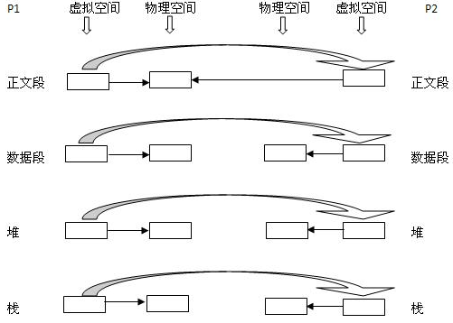
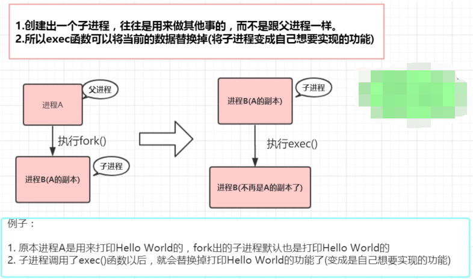
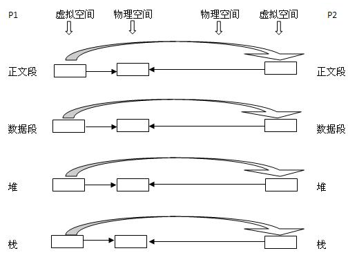
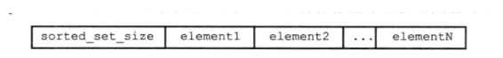

### RDB

#### 介绍

RDB是redis持久化的一种方式，可以手动或在指定的时间间隔内生成内存中整个数据集的持久化快照。RDB文件是一个经过压缩的二进制文件，默认被存储在当前文件夹中，名称为`dump.rdb`，可以通过dir和dbfilename参数来修改默认值。

#### 配置文件

```shell
# redis是基于内存的数据库，可以通过设置该值定期写入磁盘。
# 注释掉“save”这一行配置项就可以让保存数据库功能失效
# 900秒（15分钟）内至少1个key值改变（则进行数据库保存--持久化） 
# 300秒（5分钟）内至少10个key值改变（则进行数据库保存--持久化） 
# 60秒（1分钟）内至少10000个key值改变（则进行数据库保存--持久化）
save 900 1
save 300 10
save 60 10000
 
#当RDB持久化出现错误后，是否依然进行继续进行工作，yes：不能进行工作，no：可以继续进行工作，可以通过info中的rdb_last_bgsave_status了解RDB持久化是否有错误
stop-writes-on-bgsave-error yes
 
#使用压缩rdb文件，rdb文件压缩使用LZF压缩算法，yes：压缩，但是需要一些cpu的消耗。no：不压缩，需要更多的磁盘空间
rdbcompression yes
 
#是否校验rdb文件。从rdb格式的第五个版本开始，在rdb文件的末尾会带上CRC64的校验和。这跟有利于文件的容错性，但是在保存rdb文件的时候，会有大概10%的性能损耗，所以如果你追求高性能，可以关闭该配置。
rdbchecksum yes
 
#rdb文件的名称
dbfilename dump.rdb
 
#数据目录，数据库的写入会在这个目录。rdb、aof文件也会写在这个目录
dir /data
```

#### 创建RDB文件

##### 命令创建

redis中有两个命令可以生成RDB文件：SAVE和BGSAVE，创建RDB文件的实际工作由rdb.c/rdbsave函数完成。

SAVE命令会阻塞 Redis服务器进程，直到RDB文件创建完毕为止，在服务器进程阻塞期间，服务器不能处理任何命令请求；

BGSAVE命令会fork出一个子进程，然后由子进程负责创建RDB文件，服务器进程（父进程）继续处理命令请求。但是，在BGSAVE命令执行期间，服务器处理SAVE、BGSAVE、BGREWRITEAOF三个命令的方式会和平时有所不同。

- 在BGSAVE命令执行期间，客户端发送的SAVE命令会被服务器**拒绝**，服务器禁止SAVE命令和BGSAVE命令同时执行是为了避免父进程（服务器进程）和子进程同时执行两个rdbSave调用，防止产生竞争条件；

- 在BGSAVE命令执行期间，客户端发送的BGSAVE命令会被服务器**拒绝**，因为同时执行两个BGSAVE命令也会产生竞争条件；

- BGREWRITEAOF和BGSAVE两个命令不能同时执行，如果BGSAVE命令正在执行，那么客户端发送的BGREWRITEAOF命令会被**延迟**到BGSAVE命令执行完毕之后执行；如果BGREWRITEAOF命令正在执行，也同样会被延迟到BGSAVE命令执行完毕之后执行。（具体的可以看源码分析，bgsaveCommand和bgrewriteaofCommand都会分别设置一个scheduled，之后在serverCron中再进行判断执行对应的处理函数）

  其实BGREWRITEAOF和BGSAVE两个命令并没有什么冲突的地方，不同时执行是基于性能方面的考虑，如果同时两个线程都同时执行大量的磁盘写入操作，确实不是一个好主意。

##### 自动间隔创建

Redis 允许用户通过设置服务器配置的save选项，让服务器每隔一段时间自动执行一次BGSAVE命令。

```shell
save 900 1
save 300 10
save 60 10000
```

- 服务器在900秒之内，对数据库进行了至少1次修改；
- 服务器在300秒之内，对数据库进行了至少10次修改；
- 服务器在60秒之内，对数据库进行了至少10000次修改。

接着，服务器程序会根据save选项所设置的保存条件，设置服务器状态redisserver结构的saveparams数组，数组中的每个元素都是一个saveparam结构，每个saveparam结构都保存了一个save选项设置的保存条件：

```c
struct redisServer {
    ...
    long long dirty;                /* Changes to DB from the last save */
    long long dirty_before_bgsave;  /* Used to restore dirty on failed BGSAVE */
    struct saveparam *saveparams;   /* Save points array for RDB */
    int saveparamslen;              /* Number of saving points */
    ...
};

struct saveparam {
    time_t seconds;
    int changes;
};
```

除了saveparams数组之外，服务器状态还维持着一个dirty计数器，以及一个lastsave属性:

- lastsave属性是一个UNIX时间截，记录了服务器上一次成功执行SAVE命令或者BGSAVE命令的时间。
- dirty计数器记录距离上一次成功执行SAVE命令或者BGSAVE命令之后，服务器对数据库状态（服务器中的所有数据库）进行了多少次修改（包括写入、删除、更新等操作)。

Redis的服务器周期性操作函数servercron 默认每隔100毫秒就会执行一次，该函数用于对正在运行的服务器进行维护，它的其中一项工作就是检查save选项所设置的保存条件是否已经满足，如果满足的话，就执行BGSAVE命令。


##### 其它

通过flushall命令，也会产生dump.rdb文件，但是里面是空的，无意义。

通过shutdown命令，安全退出，也会生成快照文件（和异常退出形成对比，比如：kill杀死进程的方式）


#### 恢复

Redis并没有专门用于载入RDB文件的命令，只要Redis服务器在启动时检测到RDB文件存在，它就会自动载入RDB文件。

如果服务器开启了AOF持久化功能，那么服务器会优先使用AOF 文件来还原数据，因为AOF 文件的更新频率通常比RDB文件的更新频率高。只有在AOF持久化功能处于关闭状态时，服务器才会使用RDB文件来还原数据库状态。

```shell
appendonly no
dbfilename dump.rdb
dir /var/lib/redis  #可以自行指定
```

`appendonly 设置成no`，redis启动时会把/var/lib/redis 目录下的dump.rdb 中的数据恢复。dir 和dbfilename 都可以设置。我测试时`appendonly 设置成yes 时候不会将dump.rdb文件中的数据恢复`。


#### BGSAVE

BGSAVE是基于COW(copy-on-write)实现的，Redis创建子进程以后，利用cow方式完成快照文件的生成。

cow的意思是资源的复制是在只有需要写入时才会发生，如果有多个调用者（callers）同时请求相同资源（如内存或磁盘上的数据存储），他们会共同获取相同的指针指向相同的资源，直到某个调用者试图修改资源的内容时，系统才会真正复制一份专用副本（private copy）给该调用者，而其他调用者所见到的最初的资源仍然保持不变。此作法主要的优点是如果调用者没有修改该资源，就不会有副本（private copy）被建立，因此多个调用者只是读取操作时可以共享同一份资源。它的实现是依靠fork()和exec()两个函数。

##### fork&exec

fork用于**创建子进程**，这个子进程是通过父进程复制得到的，和父进程除了pid其它完全相同。内核会给子进程的数据段、堆栈段分配相应的物理空间（至此两者有各自的进程空间，互不影响），而代码段继续共享父进程的物理空间（两者的代码完全相同），并且虚拟空间相同。

<center></center>

fork作为一个函数被调用。这个函数会有**两次返回，三种可能的值**，将**子进程的PID返回给父进程，0返回给子进程**。如果出现错误，fork返回一个负值。

> 在linux中，init进程是所有进程的爹，Linux的进程都通过init进程或init的子进程fork(vfork)出来的。

vfock：内核连子进程的虚拟地址空间结构也不创建了，直接共享了父进程的虚拟空间，当然了，这种做法就顺水推舟的共享了父进程的物理空间。

exec函数的作用就是：**装载一个新的程序**（可执行映像）覆盖**当前进程**内存空间中的映像，**从而执行不同的任务**。由于两者执行的代码不同，子进程的代码段也会分配单独的物理空间。

<center></center>

##### cow

fork()会产生一个和父进程完全相同的子进程(除了pid)，如果按**传统**的做法，会**直接**将父进程的数据拷贝到子进程中，拷贝完之后，父进程和子进程之间的数据段和堆栈是**相互独立的**。

但是，以我们的使用经验来说：往往子进程都会执行`exec()`来做自己想要实现的功能。所以，如果按照上面的做法的话，创建子进程时复制过去的数据是没用的(因为子进程执行`exec()`，原有的数据会被清空)

既然很多时候复制给子进程的数据是无效的，于是就有了Copy On Write这项技术了，原理也很简单：

- fork创建出的子进程，**与父进程共享内存空间**。也就是说，如果父/子进程**不对内存空间进行写入操作的话，内存空间中的数据并不会复制给子进程**，这样创建子进程的速度就很快了！(不用复制，直接引用父进程的物理空间)。
- 并且如果在fork函数返回之后，子进程**第一时间**exec一个新的可执行映像，那么也不会浪费时间和内存空间了。

<center></center>

也就是：在fork之后exec之前两个进程**用的是相同的物理空间**（内存区），子进程的代码段、数据段、堆栈都是指向父进程的物理空间，也就是说，两者的虚拟空间不同，但其对应的**物理空间是同一个**。当父子进程中**有更改相应段的行为发生时**，再**为子进程相应的段分配物理空间**。如果不是因为exec，内核会给子进程的数据段、堆栈段分配相应的物理空间（至此两者有各自的进程空间，互不影响），而代码段继续共享父进程的物理空间（两者的代码完全相同）。而如果是因为exec，由于两者执行的代码不同，子进程的代码段也会分配单独的物理空间。

Copy On Write技术**实现原理：**

fork()之后，kernel把父进程中所有的内存页的权限都设为read-only，然后子进程的地址空间指向父进程。当父子进程都只读内存时，相安无事。当其中某个进程写内存时，CPU硬件检测到内存页是read-only的，于是触发页异常中断（page-fault），陷入kernel的一个中断例程。中断例程中，kernel就会**把触发的异常的页复制一份**，于是父子进程各自持有独立的一份。

Copy On Write技术**好处**是什么？

- COW技术可**减少**分配和复制大量资源时带来的**瞬间延时**。
- COW技术可减少**不必要的资源分配**。比如fork进程时，并不是所有的页面都需要复制，父进程的**代码段和只读数据段都不被允许修改，所以无需复制**。

Copy On Write技术**缺点**是什么？

- 如果在fork()之后，父子进程都还需要继续进行写操作，**那么会产生大量的分页错误(页异常中断page-fault)**，这样就得不偿失。

如果有需要，我们会用`exec()`把当前进程映像替换成新的进程文件，完成自己想要实现的功能。

#####  Redis的cow

- Redis创建子进程以后，根本不进行数据的copy，主进程与子线程是共享数据的。主进程继续对外提供读写服务。
- 虽然不copy数据，但是kernel会把主进程中的所有内存页的权限都设为read-only，主进程和子进程访问数据的指针都指向同一内存地址。
- 主进程发生写操作时，因为权限已经设置为read-only了，所以会触发页异常中断（page-fault）。在中断处理中，需要被写入的内存页面会复制一份，复制出来的旧数据交给子进程使用，然后主进程该干啥就干啥。

也就是说，在进行IO操作写盘的过程中（on write），对于没有改变的数据，主进程和子进程资源共享；只有在出现了需要变更的数据时（写脏的数据），才进行copy操作。

在最理想的情况下，也就是生成RDB文件的过程中，一直没有写操作的话，就根本不会发生内存的额外占用。

##### 文件系统的cow

更新数据块时，数据块被读入内存，进行修改，然后写入新位置，而旧数据则保持不变。

好处是保护数据：本地文件系统由于有备份机制,不会因为文件系统崩溃导致大量甚至全部数据丢失。


#### RDB文件结构

##### RDB总体结构

<center></center>

- RIDES常量的长度为5字节，保存了“REDIS”五个字符。通过这五个字符，程序可以在载入文件时，快速检查所载入的文件是否RDB文件。
- db_version记录了RDB文件的版本号，为4字节。“0006”就是第六版。
- databases部分包含着零个或任意多个数据库，以及各个数据库中的键值对数据。如果服务器的数据库状态为空（所有数据库都是空的)，那么这个部分也为空，长度为0字节；如果服务器的数据库状态为非空（有至少一个数据库非空)，那么这个部分也为非空。
- EOF常量的长度为1字节，为255，即FF，这个常量标志着RDB文件正文内容的结束，当读入程序遇到这个值的时候，它知道所有数据库的所有键值对都已经载入完毕了。
- check_sum是一个8字节长的无符号整数，保存着一个校验和，这个校验和是程序通过对REDIS、db_version、databases、EOF 四个部分的内容进行计算得出的。服务器在载入RDB文件时，会将载入数据所计算出的校验和与check_sum所记录的校验和进行对比，以此来检查RDB文件是否有出错或者损坏的情况出现。

> 为了方便区分，常量是大写，变量和数据是小写。（《redis设计与实现》这么）

例子：

<center></center>

##### database结构

每个非空数据库都可以保存：

<center></center>

- SELECTDB常量的长度为1字节，为254，即FE，表示接下来读的是一个数据库号码。
- db_number保存着一个数据库号码，根据号码的大小不同，这个部分的长度可以是1字节、2字节或者5字节。当程序读人db_number部分之后，服务器会调用SELECT命令，根据读入的数据库号码进行数据库切换，使得之后读入的键值对可以载入到正确的数据库中。
- key_value_pairs 部分保存了数据库中的所有键值对数据，如果键值对带有过期时间，那么过期时间也会和键值对保存在一起。根据键值对的数量、类型、内容以及是否有过期时间等条件的不同，key_value_pairs 部分的长度也会有所不同。

##### key_value_pairs

不带过期时间的键值对：

<center></center>

- TYPE记录了value的类型，表明了value的编码格式，为1字节，值为常量其中一个：REDIS_RDB_TYPE_STRINGR、EDIS_RDB_TYPE_LIST、REDIS_RDB_TYPE_SET、REDIS_RDB_TYPE_ZSET、REDIS_RDB_TYPE_HASH、REDIS_RDB_TYPE_LIST_ZIPLIST、REDIS_RDB_TYPE__SET_INTSET、REDIS_RDB_TYPE_ZSET_ZIPLIST、REDIS_RDB_TYPE_HASH_ZIPLIST
- 其中key总是一个字符串对象，它的编码方式和`REDIS_RDB_TYPE_STRING`类型的`value`一样
- value根据type类型的不同，以及保存内容长度的不同，结构和长度也会有所不同。

带过期时间的键值对：

<center></center>

- `EXPIRETIME_MS`常量的长度为`1字节`，它告知读入程序，接下来要读入的将是一个**以毫秒为单位的过期时间**
- `ms`是一个`8字节长`的**带符号整数**，记录着一个**以毫秒为单位的UNIX时间戳**，这个时间戳就是键值对的过期时间

value：RDB文件中的每个`value`部分都保存了一个值对象，每个值对象的类型都由与之对应的`TYPE`记录，根据类型的不同，`value`部分的结构，长度也会有所不同

1. **字符串对象**

   字符串对象的编码可以是`REDIS_ENCODING_INT`或者`REDIS_ENCODING_RAW`。

   如果编码为`REDIS_ENCODING_INT`，那么说明对象中保存的长度**不超过32位的整数**，这种编码将以如图所示：

   <center></center>

   其中，`ENCODING`的值可以是`REDIS_RDB_ENC_INT8`,`REDIS_RDB_ENC_INT16`或者`R。EDIS_RDB_ENC_INT32`三个常量的其中一个，他们分别代表RDB文件使用`8位，16位或者32位`来保存整数值integer。

   如果字符串对象的编码为`REDIS_ENCODING_RAW`，那么说明对象所保存的是**一个字符串值**，根据字符串长度的不同，有压缩和不压缩两种方法来保存：

   - 长度小于等于20字节，原样保存
   - 长度大于20字节，压缩保存

   无压缩结构：

   <center></center>

   压缩结构：

   <center></center>

   采用`LZF`算法进行压缩，读入程序在碰到这个常量后，会根据之后的`compressed_len`记录的是字符串被压缩之后的长度,而`origin_len`记录的是原长度。

2. **哈希对象**

   <center></center>

   `hash_size`记录了**哈希表的大小**，也即是这个哈希表保存了多少键值对，读入程序可以通过这个大小知道自己应该读入多少个键值对

   以`key_value_pair`开头的部分代表哈希表中的键值对，键值对的键和值都是字符串对象，所以程序会以处理字符串对象的方式来保存和读入键值对

3. **列表对象**

   <center></center>

   `list_length`记录了列表的长度，它记录列表保存了多少个项（item），读入程序可以通过这个长度知道自己应该读入多少个列表项

4. **集合对象**

   <center></center>

   `set_size`是集合的大小，它记录集合保存了多少个元素。

   图中以`elem`开头的部分代表集合的元素，因为每个集合元素都是一个字符串对象，所以程序会以处理字符串对象的方式来保存和读入集合元素

5. **有序集合对象**

   <center></center>

   `sorted_set_size`记录了有序集合的大小，以`element`开头的部分代表有序集合中的元素，分为**成员**和**分值**两部分。

6. **INTSET编码的集合**

   数集合对象，RDB文件保存这种对象的方法是，先将整数集合转换为字符串对象，然后将这个字符串对象保存到RDB 文件里面。读入时先读入字符串对象，再将这个字符串对象转换成原来的整数集合对象。

7. **ZIPLIST编码的列表，哈希表或者有序集合**

   RDB文件保存这种对象的方法：将压缩列表转换成一个字符串对象，然后将转换所得的字符串对象保存到RDB文件。恢复操作：读入字符串对象，并将它转换成原来的压缩列表对象，然后根据TYPE的值，进行不同类型的转换

#### 优势

1. 恢复数据的速度很快，适合大规模的数据恢复，而又对部分数据不敏感的情况
2. dump.db文件是一个压缩的二进制文件，文件暂用空间小

#### 劣势

1. 当出现异常退出时，会丢失最后一次快照后的数据
2. 当fork的时候，内存的中的数据会被克隆一份，大致两倍的膨胀需要考虑。而且，当数据过大时，fork操作占用过多的系统资源，造成主服务器进程假死。

#### 使用场景

1. 数据备份 
2. 服务器数据同步
3. 可容忍部分数据丢失 
4. 跨数据中心的容灾备份


#### 源码分析

RDB的所有相关操作都存在rdb.c文件中，通过saveCommand(client *c)、bgsaveCommand(client *c)这两个函数可以知道save命令和bgsave命令真正执行的持久化逻辑是来自于：rdbSave(char *filename, rdbSaveInfo *rsi)、rdbSaveBackground。

先来看下**saveCommand**：

```c
void saveCommand(client *c) {
    // 检查是否后台已经有子进程在执行save，如果有就停止执行。
    if (server.rdb_child_pid != -1) {
        addReplyError(c,"Background save already in progress");
        return;
    }
    rdbSaveInfo rsi, *rsiptr;
    rsiptr = rdbPopulateSaveInfo(&rsi);
    
    //调用rdbsave进行持久化
    if (rdbSave(server.rdb_filename,rsiptr) == C_OK) {
        //回复信息
        addReply(c,shared.ok);
    } else {
        addReply(c,shared.err);
    }
}
```

>addReply方法可以看服务端中的介绍。

**bgsaveCommand**：

```c
void bgsaveCommand(client *c) {
    int schedule = 0;

    /* The SCHEDULE option changes the behavior of BGSAVE when an AOF rewrite
     * is in progress. Instead of returning an error a BGSAVE gets scheduled. */
    if (c->argc > 1) {
        if (c->argc == 2 && !strcasecmp(c->argv[1]->ptr,"schedule")) {
            schedule = 1;
        } else {
            addReply(c,shared.syntaxerr);
            return;
        }
    }

    rdbSaveInfo rsi, *rsiptr;
    rsiptr = rdbPopulateSaveInfo(&rsi);


    if (server.rdb_child_pid != -1) {
        // 检查是否后台已经有子进程在执行save，如果有就停止执行。
        addReplyError(c,"Background save already in progress");
    } else if (server.aof_child_pid != -1) {
        if (schedule) {
            // 如果aof重写已经在执行中了，这次执行会放到serverCron中执行
            server.rdb_bgsave_scheduled = 1;
            addReplyStatus(c,"Background saving scheduled");
        } else {
            addReplyError(c,
                          "An AOF log rewriting in progress: can't BGSAVE right now. "
                          "Use BGSAVE SCHEDULE in order to schedule a BGSAVE whenever "
                          "possible.");
        }
    } else if (rdbSaveBackground(server.rdb_filename,rsiptr) == C_OK) {
        //调用rdbSaveBackground进行持久化
        addReplyStatus(c,"Background saving started");
    } else {
        addReply(c,shared.err);
    }
}
```

##### rdbSave

Redis 的 **rdbSave** 函数是真正进行 RDB 持久化的函数，它的大致流程如下：

- 首先创建一个临时文件；
- 创建并初始化rio，rio是redis对io的一种抽象，提供了read、write、flush、checksum……等方法；
- 调用 rdbSaveRio()，将当前 Redis 的内存信息全量写入到临时文件中；
- 调用 fflush、 fsync 和 fclose 接口将文件写入磁盘中；
- 使用 rename 将临时文件改名为 正式的 RDB 文件；
- 将server.dirty清零，server.dirty是用了记录在上次生成rdb后有多少次数据变更，会在serverCron中用到。

```c
/* rdb磁盘写入操作 */
int rdbSave(char *filename, rdbSaveInfo *rsi) {
    char tmpfile[256];
    char cwd[MAXPATHLEN]; /* Current working dir path for error messages. */
    FILE *fp = NULL;
    rio rdb;
    int error = 0;

    //创建并获取一个临时文件
    snprintf(tmpfile,256,"temp-%d.rdb", (int) getpid());
    fp = fopen(tmpfile,"w");
    if (!fp) {
        char *cwdp = getcwd(cwd,MAXPATHLEN);
        serverLog(LL_WARNING,
                  "Failed opening the RDB file %s (in server root dir %s) "
                  "for saving: %s",
                  filename,
                  cwdp ? cwdp : "unknown",
                  strerror(errno));
        return C_ERR;
    }

    // 初始化rio
    rioInitWithFile(&rdb,fp);  
    startSaving(RDBFLAGS_NONE);

    if (server.rdb_save_incremental_fsync)
        rioSetAutoSync(&rdb,REDIS_AUTOSYNC_BYTES);
    
    // 将内存数据dump到rdb 
    if (rdbSaveRio(&rdb,&error,RDBFLAGS_NONE,rsi) == C_ERR) {
        errno = error;
        goto werr;
    }

    //调用fflush将输出缓冲区刷新到page cache(内核缓冲区)，然后调用fsync将cache中的内容写盘，最后关闭文件。
    if (fflush(fp)) goto werr;
    if (fsync(fileno(fp))) goto werr;
    if (fclose(fp)) { fp = NULL; goto werr; }
    fp = NULL;

    //把临时文件重命名为正式文件名
    if (rename(tmpfile,filename) == -1) {
        char *cwdp = getcwd(cwd,MAXPATHLEN);
        serverLog(LL_WARNING,
                  "Error moving temp DB file %s on the final "
                  "destination %s (in server root dir %s): %s",
                  tmpfile,
                  filename,
                  cwdp ? cwdp : "unknown",
                  strerror(errno));
        unlink(tmpfile);
        stopSaving(0);
        return C_ERR;
    }

    //最后，打印日志，重置dirty和lastsave，这两个值会影响被动触发rdb dump的时机(自动间隔创建)。
    serverLog(LL_NOTICE,"DB saved on disk");
    server.dirty = 0;
    server.lastsave = time(NULL);
    server.lastbgsave_status = C_OK;
    stopSaving(1);
    return C_OK;
    
werr:
    serverLog(LL_WARNING,"Write error saving DB on disk: %s", strerror(errno));
    if (fp) fclose(fp);
    unlink(tmpfile);
    stopSaving(0);
    return C_ERR;
}
```

将内存中的数据写入到文件中主要是rdbSaveRio函数（注意了解rdb文件的格式）：

```c
int rdbSaveRio(rio *rdb, int *error, int flags, rdbSaveInfo *rsi) {
    dictIterator *di = NULL;
    dictEntry *de;
    char magic[10];
    int j;
    uint64_t cksum;
    size_t processed = 0;

    if (server.rdb_checksum)
        rdb->update_cksum = rioGenericUpdateChecksum;
    // rdb文件中最先写入的内容就是magic，magic就是REDIS这个字符串+4位版本号
    snprintf(magic,sizeof(magic),"REDIS%04d",RDB_VERSION);
    if (rdbWriteRaw(rdb,magic,9) == -1) goto werr;
    if (rdbSaveInfoAuxFields(rdb,flags,rsi) == -1) goto werr;
    if (rdbSaveModulesAux(rdb, REDISMODULE_AUX_BEFORE_RDB) == -1) goto werr;

    //遍历每一个db
    for (j = 0; j < server.dbnum; j++) {
        redisDb *db = server.db+j;
        //获取当前存储K-V对的字典,先判断DB是否为空，如果为空就跳过。然后获取该DB的迭代器。
        dict *d = db->dict;
        if (dictSize(d) == 0) continue;
        di = dictGetSafeIterator(d);

        /* Write the SELECT DB opcode */
        //写入selectdb的opcode，定义为254。即FE，然后是对应的DB号。具体格式是，1字节的OPcode，加上1，2或4字节的DB号。
        if (rdbSaveType(rdb,RDB_OPCODE_SELECTDB) == -1) goto werr;
        if (rdbSaveLen(rdb,j) == -1) goto werr;

        /* Write the RESIZE DB opcode. We trim the size to UINT32_MAX, which
         * is currently the largest type we are able to represent in RDB sizes.
         * However this does not limit the actual size of the DB to load since
         * these sizes are just hints to resize the hash tables. */
        uint64_t db_size, expires_size;
        db_size = dictSize(db->dict);
        expires_size = dictSize(db->expires);
        if (rdbSaveType(rdb,RDB_OPCODE_RESIZEDB) == -1) goto werr;
        if (rdbSaveLen(rdb,db_size) == -1) goto werr;
        if (rdbSaveLen(rdb,expires_size) == -1) goto werr;

        /* Iterate this DB writing every entry */
        //遍历所有K-V对，并进行dump。对于每个KV，获取key，value和expire time
        while((de = dictNext(di)) != NULL) {
            sds keystr = dictGetKey(de);
            robj key, *o = dictGetVal(de);
            long long expire;

            initStaticStringObject(key,keystr);
            expire = getExpire(db,&key);
            //对K-V对进行dump
            if (rdbSaveKeyValuePair(rdb,&key,o,expire) == -1) goto werr;

            /* When this RDB is produced as part of an AOF rewrite, move
             * accumulated diff from parent to child while rewriting in
             * order to have a smaller final write. */
            if (flags & RDB_SAVE_AOF_PREAMBLE &&
                rdb->processed_bytes > processed+AOF_READ_DIFF_INTERVAL_BYTES)
            {
                processed = rdb->processed_bytes;
                aofReadDiffFromParent();
            }
        }
        dictReleaseIterator(di);
        di = NULL; /* So that we don't release it again on error. */
    }

    /* If we are storing the replication information on disk, persist
     * the script cache as well: on successful PSYNC after a restart, we need
     * to be able to process any EVALSHA inside the replication backlog the
     * master will send us. */
    if (rsi && dictSize(server.lua_scripts)) {
        di = dictGetIterator(server.lua_scripts);
        while((de = dictNext(di)) != NULL) {
            robj *body = dictGetVal(de);
            if (rdbSaveAuxField(rdb,"lua",3,body->ptr,sdslen(body->ptr)) == -1)
                goto werr;
        }
        dictReleaseIterator(di);
        di = NULL; /* So that we don't release it again on error. */
    }

    if (rdbSaveModulesAux(rdb, REDISMODULE_AUX_AFTER_RDB) == -1) goto werr;

    /* EOF opcode */
    //输出EOF opcode(255，即FF)表示文件的结束
    if (rdbSaveType(rdb,RDB_OPCODE_EOF) == -1) goto werr;

    /* CRC64 checksum. It will be zero if checksum computation is disabled, the
     * loading code skips the check in this case. */
    //计算CRC16 checksum并写入
    cksum = rdb->cksum;
    memrev64ifbe(&cksum);
    if (rioWrite(rdb,&cksum,8) == 0) goto werr;
    return C_OK;

    werr:
    if (error) *error = errno;
    if (di) dictReleaseIterator(di);
    return C_ERR;
}
```

其中rdbSaveKeyValuePair函数是对每一个K-V对进行写入：

```c
int rdbSaveKeyValuePair(rio *rdb, robj *key, robj *val,
                        long long expiretime, long long now)
{
    /* Save the expire time */
    if (expiretime != -1) {
        // 如果过期时间少于当前时间，那么表示该key已经失效，返回不做任何保存；
        /* If this key is already expired skip it */
        if (expiretime < now) return 0;
        // 如果当前遍历的entry有失效时间属性，那么保存REDIS_RDB_OPCODE_EXPIRETIME_MS即252，即"FC"以及失效时间到rdb文件中，
        if (rdbSaveType(rdb,REDIS_RDB_OPCODE_EXPIRETIME_MS) == -1) return -1;
        if (rdbSaveMillisecondTime(rdb,expiretime) == -1) return -1;
    }

    // 接下来保存redis key的类型，key，以及value到rdb文件中；
    /* Save type, key, value */
    if (rdbSaveObjectType(rdb,val) == -1) return -1;
    if (rdbSaveStringObject(rdb,key) == -1) return -1;
    if (rdbSaveObject(rdb,val) == -1) return -1;
    return 1;
}
```


##### rdbSaveBackground

通过阅读rdbSaveBackground(char *filename)的源码可知，其最终的实现还是调用rdbSave(char *filename)，只不过是通过fork()出的子进程来执行罢了，所以bgsave和save的实现是殊途同归：

```c
int rdbSaveBackground(char *filename) {
    pid_t childpid;
    long long start;

    // 如果已经有RDB持久化任务，那么rdb_child_pid的值就不是-1，那么返回REDIS_ERR；
    if (server.rdb_child_pid != -1) return REDIS_ERR;

    server.dirty_before_bgsave = server.dirty;
    server.lastbgsave_try = time(NULL);

    // 记录RDB持久化开始时间
    start = ustime();
    //fork一个子进程
    if ((childpid = fork()) == 0) {
        // 如果fork()的结果childpid为0，即当前进程为fork的子进程，那么接下来调用rdbSave()进程持久化；
        int retval;

        /* Child */
        //子进程首先关闭监听socket，避免接收客户端连接。
        closeListeningSockets(0);
        redisSetProcTitle("redis-rdb-bgsave");
        // bgsave事实上就是通过fork的子进程调用rdbSave()实现, rdbSave()就是save命令业务实现；
        retval = rdbSave(filename);
        if (retval == REDIS_OK) {
            size_t private_dirty = zmalloc_get_private_dirty();

            if (private_dirty) {
                // RDB持久化成功后，如果是notice级别的日志，那么log输出RDB过程中copy-on-write使用的内存
                redisLog(REDIS_NOTICE,
                         "RDB: %zu MB of memory used by copy-on-write",
                         private_dirty/(1024*1024));
            }
        }
        exitFromChild((retval == REDIS_OK) ? 0 : 1);
    } else {
        // 父进程更新redisServer记录一些信息，例如：fork进程消耗的时间stat_fork_time, 
        /* Parent */
        server.stat_fork_time = ustime()-start;
        // 更新redisServer记录fork速率：每秒多少G；zmalloc_used_memory()的单位是字节，所以通过除以(1024*1024*1024),得到GB；由于记录的fork_time即fork时间是微妙，所以*1000000，得到每秒钟fork多少GB的速度；
        server.stat_fork_rate = (double) zmalloc_used_memory() * 1000000 / server.stat_fork_time / (1024*1024*1024); /* GB per second. */
        latencyAddSampleIfNeeded("fork",server.stat_fork_time/1000);
        // 如果fork子进程出错，即childpid为-1，更新redisServer，记录最后一次bgsave状态是REDIS_ERR;
        if (childpid == -1) {
            server.lastbgsave_status = REDIS_ERR;
            redisLog(REDIS_WARNING,"Can't save in background: fork: %s",
                     strerror(errno));
            return REDIS_ERR;
        }
        redisLog(REDIS_NOTICE,"Background saving started by pid %d",childpid);
        // 如果fork成功，最后在redisServer中记录的save开始时间重置为空，并记录执行bgsave的子进程id，即child_pid；
        server.rdb_save_time_start = time(NULL);
        server.rdb_child_pid = childpid;
        server.rdb_child_type = REDIS_RDB_CHILD_TYPE_DISK;
        updateDictResizePolicy();
        return REDIS_OK;
    }
    return REDIS_OK; /* unreached */
}
```


##### serverCron中处理rdb

上面生成rdb的两种方式都是被动触发的，也就是通过两种命令分别触发的，redis也提供定期生成rdb的机制。定期生成rdb的实现在server.c 中的serverCron中。serverCron是redis每次执行完一次eventloop执行的定期调度任务，里面就有rdb和aof的执行逻辑，rdb相关具体如下：

> 注意：为了方便看，我这里将rdb和aof的相关源码全部贴出来了。

```c
int serverCron(struct aeEventLoop *eventLoop, long long id, void *clientData) {
    ...
        
    /*
     * AOF重写在serverCron中第一个触发点：
     * 需要确认当前没有aof rewrite和rdb dump在进行，并且设置了aof_rewrite_scheduled(在bgrewriteaofCommand里设置的)，
     * 调用rewirteAppendOnlyFileBackground进行aof rewrite。
     */
    if (server.rdb_child_pid == -1 && server.aof_child_pid == -1 &&
        server.aof_rewrite_scheduled)
    {
        rewriteAppendOnlyFileBackground();
    }

    // 检测bgsave、aof重写是否在执行过程中，或者是否有子线程
    if (server.rdb_child_pid != -1 || server.aof_child_pid != -1 ||
        ldbPendingChildren())
    {
        int statloc;
        pid_t pid;

        //等待所有的子进程
        if ((pid = wait3(&statloc,WNOHANG,NULL)) != 0) {
            //取得子进程exit()返回的结束代码
            int exitcode = WEXITSTATUS(statloc);
            int bysignal = 0;

            //如果子进程是因为信号而结束则此宏值为真
            if (WIFSIGNALED(statloc)) bysignal = WTERMSIG(statloc);

            if (pid == -1) {
                //如果此时没有子线程
                serverLog(LL_WARNING,"wait3() returned an error: %s. "
                    "rdb_child_pid = %d, aof_child_pid = %d",
                    strerror(errno),
                    (int) server.rdb_child_pid,
                    (int) server.aof_child_pid);
            } else if (pid == server.rdb_child_pid) {
                //如果已经完成了bgsave,会调用backgroundSaveDoneHandler函数做最后处理
                backgroundSaveDoneHandler(exitcode,bysignal);
                if (!bysignal && exitcode == 0) receiveChildInfo();
            } else if (pid == server.aof_child_pid) {
                //如果已经完成了aof重写，会调用backgroundRewriteDoneHandler函数做最后处理
                backgroundRewriteDoneHandler(exitcode,bysignal);
                if (!bysignal && exitcode == 0) receiveChildInfo();
            } else {
                if (!ldbRemoveChild(pid)) {
                    serverLog(LL_WARNING,
                        "Warning, detected child with unmatched pid: %ld",
                        (long)pid);
                }
            }
            updateDictResizePolicy();
            closeChildInfoPipe();
        }
    } else {
        /*
         * 如果此时没有子线程在进行save或rewrite，则判断是否要save或rewrite
         */

        //先判断是否要进行save
        /*
         * RDB的持久化在serverCron中第一个触发点，根据条件判断定期触发：
         */
        for (j = 0; j < server.saveparamslen; j++) {
            //每一个saveparam表示一个配置文件中的save
            struct saveparam *sp = server.saveparams+j;

            /* Save if we reached the given amount of changes,
             * the given amount of seconds, and if the latest bgsave was
             * successful or if, in case of an error, at least
             * CONFIG_BGSAVE_RETRY_DELAY seconds already elapsed. */
            //判断修改次数和时间
            if (server.dirty >= sp->changes &&
                server.unixtime-server.lastsave > sp->seconds &&
                (server.unixtime-server.lastbgsave_try >
                 CONFIG_BGSAVE_RETRY_DELAY ||
                 server.lastbgsave_status == C_OK))
            {
                serverLog(LL_NOTICE,"%d changes in %d seconds. Saving...",
                    sp->changes, (int)sp->seconds);
                rdbSaveInfo rsi, *rsiptr;
                rsiptr = rdbPopulateSaveInfo(&rsi);
                //调用rdbSaveBackground进行save
                rdbSaveBackground(server.rdb_filename,rsiptr);
                break;
            }
        }

        /*
         * AOF重写在serverCron中第二个触发点：
         * 判断aof文件的大小超过预定的百分比，
         * 当aof文件超过了预定的最小值，并且超过了上一次aof文件的一定百分比，则会触发aof rewrite。
         */
        if (server.aof_state == AOF_ON &&
            server.rdb_child_pid == -1 &&
            server.aof_child_pid == -1 &&
            server.aof_rewrite_perc &&
            server.aof_current_size > server.aof_rewrite_min_size)
        {
            long long base = server.aof_rewrite_base_size ?
                server.aof_rewrite_base_size : 1;
            long long growth = (server.aof_current_size*100/base) - 100;
            if (growth >= server.aof_rewrite_perc) {
                serverLog(LL_NOTICE,"Starting automatic rewriting of AOF on %lld%% growth",growth);
                rewriteAppendOnlyFileBackground();
            }
        }
    }


    /* AOF postponed flush: Try at every cron cycle if the slow fsync
     * completed. */
    //进行AOF buffer的刷盘:
    // 在aof_flush_postponed_start不为0时调用，即存在延迟flush的情况。
    // 主要是保证fsync完成之后，可以快速的进入下一次flush。
    // 尽量保证fsync策略是everysec时，每秒都可以进行fsync，同时缩短两次fsync的间隔，减少影响。
    if (server.aof_flush_postponed_start) flushAppendOnlyFile(0);

    /* AOF write errors: in this case we have a buffer to flush as well and
     * clear the AOF error in case of success to make the DB writable again,
     * however to try every second is enough in case of 'hz' is set to
     * an higher frequency. */
    //进行AOF buffer的刷盘:保证aof出错时，尽快执行下一次flush，以便从错误恢复。
    run_with_period(1000) {
        if (server.aof_last_write_status == C_ERR)
            flushAppendOnlyFile(0);
    }
    
    ...
        
    /*
     * RDB的持久化在serverCron中第二个触发点，需要确认当前没有aof rewrite和rdb dump在进行，并且设置了rdb_bgsave_scheduled：
     * 如果上次触发bgsave时已经有进程在执行aof的重写了(rdbSaveBackground中)，就会标记rdb_bgsave_scheduled=1，
     * 然后放到serverCron，然后在serverCron的最后在进行判断是否能够执行
     */
    if (server.rdb_child_pid == -1 && server.aof_child_pid == -1 &&
        server.rdb_bgsave_scheduled &&
        (server.unixtime-server.lastbgsave_try > CONFIG_BGSAVE_RETRY_DELAY ||
         server.lastbgsave_status == C_OK))
    {
        rdbSaveInfo rsi, *rsiptr;
        rsiptr = rdbPopulateSaveInfo(&rsi);
        if (rdbSaveBackground(server.rdb_filename,rsiptr) == C_OK)
            server.rdb_bgsave_scheduled = 0;
    }
    
    ...
}
```

代码中使用了wait3函数，这里看下wait3和wait4的区别：

pid_t wait3 ( int *status, int option, struct rusage *ru );

pid_t wait4 ( pid_t pid, int *status, int option, struct rusage *ru );

option的可选值有：WNOHANG、WCONTINUED、WUNTRACED。

wait3等待所有的子进程；wait4可以像waitpid一样指定要等待的子进程：pid>0表示子进程ID；pid=0表示当前进程组中的子进程；pid=-1表示等待所有子进程；pid<-1表示进程组ID为pid绝对值的子进程。

子进程的结束状态返回后存于status，底下有几个宏可判别结束情况：

- WIFEXITED(status)如果子进程正常结束则为非0值；
- WEXITSTATUS(status)取得子进程exit()返回的结束代码，一般会先用WIFEXITED 来判断是否正常结束才能使用此宏；
- WIFSIGNALED(status)如果子进程是因为信号而结束则此宏值为真；
- WTERMSIG(status)取得子进程因信号而中止的信号代码，一般会先用WIFSIGNALED 来判断后才使用此宏；
- WIFSTOPPED(status)如果子进程处于暂停执行情况则此宏值为真。一般只有使用WUNTRACED 时才会有此情况；
- WSTOPSIG(status)取得引发子进程暂停的信号代码，

再看下当子线程bgsave完成后的后序处理backgroundSaveDoneHandler(rdb.c)：

```c
void backgroundSaveDoneHandler(int exitcode, int bysignal) {
    switch(server.rdb_child_type) {
    case RDB_CHILD_TYPE_DISK:  //
        backgroundSaveDoneHandlerDisk(exitcode,bysignal);
        break;
    case RDB_CHILD_TYPE_SOCKET:  //
        backgroundSaveDoneHandlerSocket(exitcode,bysignal);
        break;
    default:
        serverPanic("Unknown RDB child type.");
        break;
    }
}

void backgroundSaveDoneHandlerDisk(int exitcode, int bysignal) {
    if (!bysignal && exitcode == 0) {
        //正常退出 修改dirty 为执行rbd任务到完成时候 dirty的差值
        serverLog(LL_NOTICE,
            "Background saving terminated with success");
        server.dirty = server.dirty - server.dirty_before_bgsave;
        server.lastsave = time(NULL);
        server.lastbgsave_status = C_OK;
    } else if (!bysignal && exitcode != 0) {
        //表示子进程执行失败 设置lastbgsave_status 下次重试
        serverLog(LL_WARNING, "Background saving error");
        server.lastbgsave_status = C_ERR;
    } else {
        mstime_t latency;

        serverLog(LL_WARNING,
            "Background saving terminated by signal %d", bysignal);
        latencyStartMonitor(latency);
        //删除临时文件
        rdbRemoveTempFile(server.rdb_child_pid);
        latencyEndMonitor(latency);
        latencyAddSampleIfNeeded("rdb-unlink-temp-file",latency);
        /* SIGUSR1 is whitelisted, so we have a way to kill a child without
         * tirggering an error condition. */
        if (bysignal != SIGUSR1)
            server.lastbgsave_status = C_ERR;
    }
    server.rdb_child_pid = -1;
    server.rdb_child_type = RDB_CHILD_TYPE_NONE;
    server.rdb_save_time_last = time(NULL)-server.rdb_save_time_start;
    server.rdb_save_time_start = -1;
    /* Possibly there are slaves waiting for a BGSAVE in order to be served
     * (the first stage of SYNC is a bulk transfer of dump.rdb) */
    //用于在主从同步中，完成rdb dump，通知向slave传输rdb。
    updateSlavesWaitingBgsave((!bysignal && exitcode == 0) ? C_OK : C_ERR, RDB_CHILD_TYPE_DISK);
}
```


##### rdbLoad

在redis.c的main函数中，完成初始化后，会调用loadDataFromDisk()完成数据的加载。

```c
void loadDataFromDisk(void) {
    long long start = ustime();
    //如果开启了aof，调用loadAppendOnlyFile进行加载
    if (server.aof_state == AOF_ON) {
        if (loadAppendOnlyFile(server.aof_filename) == C_OK)
            serverLog(LL_NOTICE,"DB loaded from append only file: %.3f seconds",(float)(ustime()-start)/1000000);
    } else {
        //否则，调用rdbLoad进行加载
        rdbSaveInfo rsi = RDB_SAVE_INFO_INIT;
        if (rdbLoad(server.rdb_filename,&rsi) == C_OK) {
            serverLog(LL_NOTICE,"DB loaded from disk: %.3f seconds",
                      (float)(ustime()-start)/1000000);

            /* Restore the replication ID / offset from the RDB file. */
            if ((server.masterhost ||
                 (server.cluster_enabled &&
                  nodeIsSlave(server.cluster->myself))) &&
                rsi.repl_id_is_set &&
                rsi.repl_offset != -1 &&
                /* Note that older implementations may save a repl_stream_db
                 * of -1 inside the RDB file in a wrong way, see more
                 * information in function rdbPopulateSaveInfo. */
                rsi.repl_stream_db != -1)
            {
                memcpy(server.replid,rsi.repl_id,sizeof(server.replid));
                server.master_repl_offset = rsi.repl_offset;
                /* If we are a slave, create a cached master from this
                 * information, in order to allow partial resynchronizations
                 * with masters. */
                replicationCacheMasterUsingMyself();
                selectDb(server.cached_master,rsi.repl_stream_db);
            }
        } else if (errno != ENOENT) {
            serverLog(LL_WARNING,"Fatal error loading the DB: %s. Exiting.",strerror(errno));
            exit(1);
        }
    }
}
```


```c
int rdbLoad(char *filename, rdbSaveInfo *rsi) {
    FILE *fp;
    rio rdb;
    int retval;

    //打开rdb文件
    if ((fp = fopen(filename,"r")) == NULL) return C_ERR;
    startLoading(fp);
    rioInitWithFile(&rdb,fp);
    //进行读取rdb文件
    retval = rdbLoadRio(&rdb,rsi,0); 
    fclose(fp);
	//标志结束
    stopLoading();
    return retval;
}

int rdbLoadRio(rio *rdb, rdbSaveInfo *rsi, int loading_aof) {
    uint64_t dbid;
    int type, rdbver;
    redisDb *db = server.db+0;
    char buf[1024];

    //设置校验和函数
    rdb->update_cksum = rdbLoadProgressCallback;
    //这次每次处理的最大块
    rdb->max_processing_chunk = server.loading_process_events_interval_bytes;
    //读取redis版本
    if (rioRead(rdb,buf,9) == 0) goto eoferr;
    buf[9] = '\0';
    //验证是否REDIS开头
    if (memcmp(buf,"REDIS",5) != 0) {
        serverLog(LL_WARNING,"Wrong signature trying to load DB from file");
        errno = EINVAL;
        return C_ERR;
    }
    //验证版本 必须大于1 并且 比当前版本低
    rdbver = atoi(buf+5);
    if (rdbver < 1 || rdbver > RDB_VERSION) {
        serverLog(LL_WARNING,"Can't handle RDB format version %d",rdbver);
        errno = EINVAL;
        return C_ERR;
    }

    /* Key-specific attributes, set by opcodes before the key type. */
    long long lru_idle = -1, lfu_freq = -1, expiretime = -1, now = mstime();
    long long lru_clock = LRU_CLOCK();

    //开始读取
    while(1) {
        robj *key, *val;

        /* Read type. */
        //读取当前行的类型
        if ((type = rdbLoadType(rdb)) == -1) goto eoferr;

        /* Handle special types. */
        if (type == RDB_OPCODE_EXPIRETIME) {
            //读取秒级别的过期时间,continue后进行读取对应的K-V
            /* EXPIRETIME: load an expire associated with the next key
             * to load. Note that after loading an expire we need to
             * load the actual type, and continue. */
            expiretime = rdbLoadTime(rdb);
            expiretime *= 1000;
            continue; /* Read next opcode. */
        } else if (type == RDB_OPCODE_EXPIRETIME_MS) {
            //读取毫秒级别的过期时间,continue后进行读取对应的K-V
            /* EXPIRETIME_MS: milliseconds precision expire times introduced
             * with RDB v3. Like EXPIRETIME but no with more precision. */
            expiretime = rdbLoadMillisecondTime(rdb,rdbver);
            continue; /* Read next opcode. */
        } else if (type == RDB_OPCODE_FREQ) {
            /* FREQ: LFU frequency. */
            uint8_t byte;
            if (rioRead(rdb,&byte,1) == 0) goto eoferr;
            lfu_freq = byte;
            continue; /* Read next opcode. */
        } else if (type == RDB_OPCODE_IDLE) {
            /* IDLE: LRU idle time. */
            uint64_t qword;
            if ((qword = rdbLoadLen(rdb,NULL)) == RDB_LENERR) goto eoferr;
            lru_idle = qword;
            continue; /* Read next opcode. */
        } else if (type == RDB_OPCODE_EOF) {
            //结束
            /* EOF: End of file, exit the main loop. */
            break;
        } else if (type == RDB_OPCODE_SELECTDB) {
            //选择切换db
            /* SELECTDB: Select the specified database. */
            if ((dbid = rdbLoadLen(rdb,NULL)) == RDB_LENERR) goto eoferr;
            if (dbid >= (unsigned)server.dbnum) {
                serverLog(LL_WARNING,
                          "FATAL: Data file was created with a Redis "
                          "server configured to handle more than %d "
                          "databases. Exiting\n", server.dbnum);
                exit(1);
            }
            db = server.db+dbid;
            continue; /* Read next opcode. */
        } else if (type == RDB_OPCODE_RESIZEDB) {
            /* RESIZEDB: Hint about the size of the keys in the currently
             * selected data base, in order to avoid useless rehashing. */
            uint64_t db_size, expires_size;
            if ((db_size = rdbLoadLen(rdb,NULL)) == RDB_LENERR)
                goto eoferr;
            if ((expires_size = rdbLoadLen(rdb,NULL)) == RDB_LENERR)
                goto eoferr;
            dictExpand(db->dict,db_size);
            dictExpand(db->expires,expires_size);
            continue; /* Read next opcode. */
        } else if (type == RDB_OPCODE_AUX) {
            /* AUX: generic string-string fields. Use to add state to RDB
             * which is backward compatible. Implementations of RDB loading
             * are requierd to skip AUX fields they don't understand.
             *
             * An AUX field is composed of two strings: key and value. */
            robj *auxkey, *auxval;
            if ((auxkey = rdbLoadStringObject(rdb)) == NULL) goto eoferr;
            if ((auxval = rdbLoadStringObject(rdb)) == NULL) goto eoferr;

            if (((char*)auxkey->ptr)[0] == '%') {
                /* All the fields with a name staring with '%' are considered
                 * information fields and are logged at startup with a log
                 * level of NOTICE. */
                serverLog(LL_NOTICE,"RDB '%s': %s",
                          (char*)auxkey->ptr,
                          (char*)auxval->ptr);
            } else if (!strcasecmp(auxkey->ptr,"repl-stream-db")) {
                if (rsi) rsi->repl_stream_db = atoi(auxval->ptr);
            } else if (!strcasecmp(auxkey->ptr,"repl-id")) {
                if (rsi && sdslen(auxval->ptr) == CONFIG_RUN_ID_SIZE) {
                    memcpy(rsi->repl_id,auxval->ptr,CONFIG_RUN_ID_SIZE+1);
                    rsi->repl_id_is_set = 1;
                }
            } else if (!strcasecmp(auxkey->ptr,"repl-offset")) {
                if (rsi) rsi->repl_offset = strtoll(auxval->ptr,NULL,10);
            } else if (!strcasecmp(auxkey->ptr,"lua")) {
                /* Load the script back in memory. */
                if (luaCreateFunction(NULL,server.lua,auxval) == NULL) {
                    rdbExitReportCorruptRDB(
                        "Can't load Lua script from RDB file! "
                        "BODY: %s", auxval->ptr);
                }
            } else {
                /* We ignore fields we don't understand, as by AUX field
                 * contract. */
                serverLog(LL_DEBUG,"Unrecognized RDB AUX field: '%s'",
                          (char*)auxkey->ptr);
            }

            decrRefCount(auxkey);
            decrRefCount(auxval);
            continue; /* Read type again. */
        } else if (type == RDB_OPCODE_MODULE_AUX) {
            /* Load module data that is not related to the Redis key space.
             * Such data can be potentially be stored both before and after the
             * RDB keys-values section. */
            uint64_t moduleid = rdbLoadLen(rdb,NULL);
            int when_opcode = rdbLoadLen(rdb,NULL);
            int when = rdbLoadLen(rdb,NULL);
            if (when_opcode != RDB_MODULE_OPCODE_UINT)
                rdbExitReportCorruptRDB("bad when_opcode");
            moduleType *mt = moduleTypeLookupModuleByID(moduleid);
            char name[10];
            moduleTypeNameByID(name,moduleid);

            if (!rdbCheckMode && mt == NULL) {
                /* Unknown module. */
                serverLog(LL_WARNING,"The RDB file contains AUX module data I can't load: no matching module '%s'", name);
                exit(1);
            } else if (!rdbCheckMode && mt != NULL) {
                if (!mt->aux_load) {
                    /* Module doesn't support AUX. */
                    serverLog(LL_WARNING,"The RDB file contains module AUX data, but the module '%s' doesn't seem to support it.", name);
                    exit(1);
                }

                RedisModuleIO io;
                moduleInitIOContext(io,mt,rdb,NULL);
                io.ver = 2;
                /* Call the rdb_load method of the module providing the 10 bit
                 * encoding version in the lower 10 bits of the module ID. */
                if (mt->aux_load(&io,moduleid&1023, when) || io.error) {
                    moduleTypeNameByID(name,moduleid);
                    serverLog(LL_WARNING,"The RDB file contains module AUX data for the module type '%s', that the responsible module is not able to load. Check for modules log above for additional clues.", name);
                    exit(1);
                }
                if (io.ctx) {
                    moduleFreeContext(io.ctx);
                    zfree(io.ctx);
                }
                uint64_t eof = rdbLoadLen(rdb,NULL);
                if (eof != RDB_MODULE_OPCODE_EOF) {
                    serverLog(LL_WARNING,"The RDB file contains module AUX data for the module '%s' that is not terminated by the proper module value EOF marker", name);
                    exit(1);
                }
                continue;
            } else {
                /* RDB check mode. */
                robj *aux = rdbLoadCheckModuleValue(rdb,name);
                decrRefCount(aux);
                continue; /* Read next opcode. */
            }
        }

        /* Read key */
        //读取key
        if ((key = rdbLoadStringObject(rdb)) == NULL) goto eoferr;
        /* Read value */
        //读取value
        if ((val = rdbLoadObject(type,rdb,key)) == NULL) goto eoferr;
        /* Check if the key already expired. This function is used when loading
         * an RDB file from disk, either at startup, or when an RDB was
         * received from the master. In the latter case, the master is
         * responsible for key expiry. If we would expire keys here, the
         * snapshot taken by the master may not be reflected on the slave. */
        //如果为redis 主 则忽略过期key，并将key val的引用计数减少
        if (server.masterhost == NULL && !loading_aof && expiretime != -1 && expiretime < now) {
            decrRefCount(key);
            decrRefCount(val);
        } else {
            /* Add the new object in the hash table */
            //将key val加到指定的db中
            dbAdd(db,key,val);

            /* Set the expire time if needed */
            //如果存在过期时间 则设置过期
            if (expiretime != -1) setExpire(NULL,db,key,expiretime);

            /* Set usage information (for eviction). */
            objectSetLRUOrLFU(val,lfu_freq,lru_idle,lru_clock);

            /* Decrement the key refcount since dbAdd() will take its
             * own reference. */
            //加入完成减少key的引用计数
            decrRefCount(key);
        }

        /* Reset the state that is key-specified and is populated by
         * opcodes before the key, so that we start from scratch again. */
        expiretime = -1;
        lfu_freq = -1;
        lru_idle = -1;
    }
    /* Verify the checksum if RDB version is >= 5 */
    //验证redis 版本，验证校验和
    if (rdbver >= 5) {
        uint64_t cksum, expected = rdb->cksum;

        if (rioRead(rdb,&cksum,8) == 0) goto eoferr;
        if (server.rdb_checksum) {
            memrev64ifbe(&cksum);
            if (cksum == 0) {
                serverLog(LL_WARNING,"RDB file was saved with checksum disabled: no check performed.");
            } else if (cksum != expected) {
                serverLog(LL_WARNING,"Wrong RDB checksum. Aborting now.");
                rdbExitReportCorruptRDB("RDB CRC error");
            }
        }
    }
    return C_OK;

eoferr: /* unexpected end of file is handled here with a fatal exit */
    serverLog(LL_WARNING,"Short read or OOM loading DB. Unrecoverable error, aborting now.");
    rdbExitReportCorruptRDB("Unexpected EOF reading RDB file");
    return C_ERR; /* Just to avoid warning */
}
```


