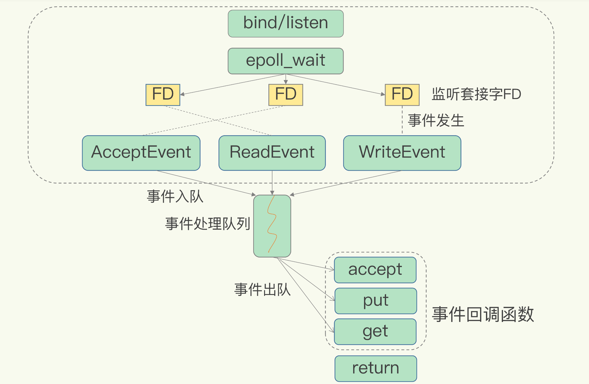

## 事件(event loop)

**redis服务器是一个事件驱动程序，Redis的服务器进程就是一个事件循环(event loop)，所有的操作都会被封装为event**，主要有两个类型的event：

1. **File Event** ：服务器和客户端的通信会产生对应的文件事件
2. **Time Event** ：为1s执行一次的计划任务, 会处理以下逻辑：①过期key的清理；②内部的调用性能统计；③DB对象的rehash扩容；④RDB&AOF的数据持久化(如果有必要)；⑤及其他一些检查 

### event loop

**redis服务初始化分为五个阶段**：①初始化服务配置；②载入配置选项；③服务初始化；④还原数据库状态；⑤启动event loop(具体可看服务端章节)

**event loop为单线程处理**：①所有event的处理因为是单线程顺序处理, 所以在操作DB等内存数据时是无锁的；②在每个process循环中都尝试处理所有已加入队列的io event和time event；③io event和time event是在同一个loop processor中顺序执行；④event loop中process的时延直接决定了redis server的吞吐量

1. 创建event loop(server.c#initServer)：

   ```c
   server.el = aeCreateEventLoop(server.maxclients+CONFIG_FDSET_INCR);
   if (server.el == NULL) {
       serverLog(LL_WARNING,
                 "Failed creating the event loop. Error message: '%s'",
                 strerror(errno));
       exit(1);
   }
   ```

   ```c
   aeEventLoop *aeCreateEventLoop(int setsize) {
       aeEventLoop *eventLoop;
       int i;
   
       // setsize指定事件循环监听的fd的数目
       // 由于内核保证新创建的fd是最小的正整数，所以直接创建setsize大小的数组，存放对应的event
       if ((eventLoop = zmalloc(sizeof(*eventLoop))) == NULL) goto err;
       eventLoop->events = zmalloc(sizeof(aeFileEvent)*setsize);
       eventLoop->fired = zmalloc(sizeof(aeFiredEvent)*setsize);
       if (eventLoop->events == NULL || eventLoop->fired == NULL) goto err;
       eventLoop->setsize = setsize;
       eventLoop->lastTime = time(NULL);
       eventLoop->timeEventHead = NULL;
       eventLoop->timeEventNextId = 0;
       eventLoop->stop = 0;
       eventLoop->maxfd = -1;
       eventLoop->beforesleep = NULL;
       //aeApiCreate主要是创建epoll的fd，以及要监听的epoll_event
       if (aeApiCreate(eventLoop) == -1) goto err;
       /* Events with mask == AE_NONE are not set. So let's initialize the
        * vector with it. */
       for (i = 0; i < setsize; i++)
           eventLoop->events[i].mask = AE_NONE;
       return eventLoop;
    
   err:
       if (eventLoop) {
           zfree(eventLoop->events);
           zfree(eventLoop->fired);
           zfree(eventLoop);
       }
       return NULL;
   }
   ```

2. 启动event loop(server.c#main)：

   ```c
   // 每个event执行的前置函数
   aeSetBeforeSleepProc(server.el,beforeSleep);
   // 每个event执行完成后的后置函数
   aeSetAfterSleepProc(server.el,afterSleep);
   // 会真正启动event loop的处理, 一旦调用当前线程将block直至系统退出
   aeMain(server.el);
   // 系统退出前的关闭event loop
   aeDeleteEventLoop(server.el);
   return 0;
   ```

**EventLoop很简单, 核心主要是event selector 和 event processor**

1. event loop中保留了file events列表和time events链表

   ```c
   typedef struct aeFileEvent {
       /* 监听事件类型掩码，值可以是 AE_READABLE 或 AE_WRITABLE ，或者 AE_READABLE | AE_WRITABLE */ 
       int mask; 
       aeFileProc *rfileProc;  // 读事件处理器
       aeFileProc *wfileProc;  // 写事件处理器
       void *clientData;  // 多路复用库的私有数据
   } aeFileEvent;
   
   
   typedef struct aeTimeEvent {
       long long id; // 时间事件的唯一标识符
       // 事件的到达时间，即执行的时间
       long when_sec; /* seconds */
       long when_ms;  /* milliseconds */
       // 事件处理函数
       aeTimeProc *timeProc;
       aeEventFinalizerProc *finalizerProc;  // 事件释放函数
       void *clientData; // 多路复用库的私有数据
       struct aeTimeEvent *next; // 指向下个时间事件结构，形成链表
   } aeTimeEvent;
   
   typedef struct aeFiredEvent {
       int fd; // 已就绪文件描述符
       /* 事件类型掩码，值可以是 AE_READABLE 或 AE_WRITABLE，或者是两者的或 */
       int mask;
   } aeFiredEvent;
   
   
   typedef struct aeEventLoop {
       // 目前已注册的最大描述符
       int maxfd;   /* highest file descriptor currently registered */
       // 追踪的最大描述符,也就是客户端最大数量
       int setsize; /* max number of file descriptors tracked */
       // 用于生成时间事件 id
       long long timeEventNextId;
       // 最后一次执行时间事件的时间
       time_t lastTime;     /* Used to detect system clock skew */
       // 已注册的文件事件
       aeFileEvent *events; /* Registered events */
       // 已就绪的文件事件
       aeFiredEvent *fired; /* Fired events */
       // 时间事件
       aeTimeEvent *timeEventHead;
       // 事件处理器的开关
       int stop;
       // 多路复用库的私有数据,即存放epoll、select等实现相关的数据
       void *apidata; /* This is used for polling API specific data */
       // 在处理事件前要执行的函数，比如调用flushAppendOnlyFile进行一次刷盘
       aeBeforeSleepProc *beforesleep;
   } aeEventLoop;
   ```

2. event selector 其实就是简单的while true系循环, 执行顺序如下：①执行event loop前置的钩子函数 beforesleep；②调用event processor函数--aeProcessEvents执行所有队列中的io event 和 time event

   ```c
   void aeMain(aeEventLoop *eventLoop) {
       eventLoop->stop = 0;
       //beforeSleep 函数会调用 handleClientsWithPendingWrites 函数来处理 clients_pending_write 列表,和进行一次AOF的刷盘
       while (!eventLoop->stop) {
           if (eventLoop->beforesleep != NULL)
               eventLoop->beforesleep(eventLoop);
           aeProcessEvents(eventLoop, AE_ALL_EVENTS|AE_CALL_AFTER_SLEEP);
       }
   }
   ```

3. event processor 执行顺序如下：①通过aeApiPoll获取所有注册的客户端套接字的事件 ；②在循环中顺序执行event；③check是否有待执行的time event, 如果有会执行time event

   ```c
   int aeProcessEvents(aeEventLoop *eventLoop, int flags)
   {
       int processed = 0, numevents;
       if (!(flags & AE_TIME_EVENTS) && !(flags & AE_FILE_EVENTS)) return 0;
       // 当有文件事件或者时间事件需要处理的时候，进入这个处理环节
       /*
        * 在两种情况下进入poll，阻塞等待事件发生：
        * 1）有需要监听的客户端描述符，即有file event时（maxfd != -1）
        * 2）需要处理定时器事件，并且DONT_WAIT开关关闭的情况下
        */
       if (eventLoop->maxfd != -1 ||
           ((flags & AE_TIME_EVENTS) && !(flags & AE_DONT_WAIT))) {
           int j;
           aeTimeEvent *shortest = NULL;
           struct timeval tv, *tvp;
   
           /*
            * 根据最快发生的定时器事件的发生时间，确定此次poll阻塞的时间
            */
           if (flags & AE_TIME_EVENTS && !(flags & AE_DONT_WAIT))
               // 由于时间事件链表是时间有序的，所以aeSearchNearestTimer是一个线性搜索函数，搜索最近需要被触发的时间事件
               shortest = aeSearchNearestTimer(eventLoop);
           //如果有定时器事件，则根据它触发的时间，计算sleep的时间（ms单位）
           if (shortest) {
               long now_sec, now_ms;
               // aeGetTime获取当前秒数和毫秒
               aeGetTime(&now_sec, &now_ms);
               tvp = &tv;
               // 计算还有多少毫秒该事件要被触发？
               long long ms =
                   (shortest->when_sec - now_sec)*1000 +
                   shortest->when_ms - now_ms;
               // 还没到触发点，更新tvp使得tv为触发时间点
               if (ms > 0) {
                   tvp->tv_sec = ms/1000;
                   tvp->tv_usec = (ms % 1000)*1000;
               } else {
                   // 已经到了或者过了触发点了，需要马上触发
                   tvp->tv_sec = 0;
                   tvp->tv_usec = 0;
               }
           } else {
               /*
                * 如果没有定时器事件，则根据情况是立即返回，或者永远阻塞
                */
   
               // 如果是一个即时事件（AE_DONT_WAIT），马上触发
               if (flags & AE_DONT_WAIT) {
                   tv.tv_sec = tv.tv_usec = 0;
                   tvp = &tv;
               } else {
                   // 当前没有需要触发的事件，tvp=NULL可以使得poll阻塞直到有新事件
                   tvp = NULL; /* wait forever */
               }
           }
   
           //传入前面计算的sleep时间，等待io事件发生。
           // 如果tvp==NULL那么epoll_wait的时间会被设为-1，此时epoll_wait就会一直阻塞
           numevents = aeApiPoll(eventLoop, tvp);
   
           /* After sleep callback. */
           // poll后的回调函数
           if (eventLoop->aftersleep != NULL && flags & AE_CALL_AFTER_SLEEP)
               eventLoop->aftersleep(eventLoop);
           // aeApiPoll会返回需要触发的事件数，用循环来进行处理
           for (j = 0; j < numevents; j++) {
               // 获取对应触发fd的文件事件
               aeFileEvent *fe = &eventLoop->events[eventLoop->fired[j].fd];
               int mask = eventLoop->fired[j].mask;
               int fd = eventLoop->fired[j].fd;
               // fired为已触发的事件数
               int fired = 0; /* Number of events fired for current fd. */
   
               // 判断AE_BARRIER是否被设置
               // 如果被设置，那么就需要先写后读
               int invert = fe->mask & AE_BARRIER;
   
               // 如果没有设置AE_BARRIER并且该事件还没有被处理，开始处理读事件，调用R文件回调函数
               if (!invert && fe->mask & mask & AE_READABLE) {
                   fe->rfileProc(eventLoop,fd,fe->clientData,mask);
                   fired++;
               }
   
               // 触发写事件，调用W文件回调函数
               //如果读事件要响应，会在networking.c#handleClientsWithPendingWrites中直接写入sockt，若写入不成功，就会创建一个写事件
               /* Fire the writable event. */
               if (fe->mask & mask & AE_WRITABLE) {
                   // 如果还没触发或者R和W并不相同的时候，触发写事件
                   if (!fired || fe->wfileProc != fe->rfileProc) {
                       fe->wfileProc(eventLoop,fd,fe->clientData,mask);
                       fired++;
                   }
               }
   
               // 如果需要先写后读，因为刚才已经调过AE_WRITABLE了（AE_BARRIER=4，设置AE_BARRIER&AE_WRITABLE就大于0了）
               // 这个时候再调用读事件
               if (invert && fe->mask & mask & AE_READABLE) {
                   if (!fired || fe->wfileProc != fe->rfileProc) {
                       fe->rfileProc(eventLoop,fd,fe->clientData,mask);
                       fired++;
                   }
               }
               // 统计处理的事件数
               processed++;
           }
       }
       /* Check time events */
       if (flags & AE_TIME_EVENTS)
           // 如果是时间事件，处理时间事件
           processed += processTimeEvents(eventLoop);
   
       return processed; /* return the number of processed file/time events */
   }
   ```

>**所以，redis的所有定时任务都是基于serverCron来驱动的，而eventloop直接驱动的只有serverCron。**


### File Event

#### redis reactor

Redis 的网络框架实现了 Reactor 模型，但是Redis是基于Reactor模式开发了自己的网络事件处理器：这个处理器被称为文件事件处理器（ file event handler ) :

- 文件事件处理器使用IO多路复用( multiplexing）程序来同时监听多个套接字，并根据套接字目前执行的任务来为套接字关联不同的事件处理器。
- 当被监听的套接字准备好执行连接应答( accept)、读取（ read)、写人( write)、关闭( close)等操作时，与操作相对应的文件事件就会产生，这时文件事件处理器就会调用套接字之前关联好的事件处理器来处理这些事件。

虽然文件事件处理器以单线程方式运行，但通过使用IO多路复用程序来监听多个套接字，文件事件处理器既实现了高性能的网络通信模型，又可以很好地与Redis服务器中其他同样以单线程方式运行的模块进行对接，这保持了Redis内部单线程设计的简单性。

文件事件处理器分为四个部分：套接字、I/O多路复用程序、文件事件分派器、事件处理器。

<center></center>

- 文件事件是对套接字操作的抽象，每当一个套接字准备好执行连接应答( accept)、写入、读取、关闭等操作时，就会产生一个文件事件。因为一个服务器通常会连接多个套接字，所以多个文件事件有可能会并发地出现。

- IO多路复用程序负责监听多个套接字,并向文件事件分派器传送那些产生了事件的套接字。

  尽管多个文件事件可能会并发地出现，但IO多路复用程序总是会将所有产生事件的套接字都放到一个队列里面，然后通过这个队列，以有序( sequentially)、同步( synchronously)、每次一个套接字的方式向文件事件分派器传送套接字。当上一个套接字产生的事件被处理完毕之后（该套接字为事件所关联的事件处理器执行完毕)，IO多路复用程序才会继续向文件事件分派器传送下一个套接字。

- 文件事件分派器接收I/O多路复用程序传来的套接字，并根据套接字产生的事件的类型，调用相应的事件处理器。

- 服务器会为执行不同任务的套接字关联不同的事件处理器，**这些处理器是一个个函数**，它们定义了某个事件发生时，服务器应该执行的动作。

具体可以看 ae.h、ae.c这两个文件，Redis 为了实现事件驱动框架，相应地定义了**事件的数据结构、框架主循环函数、事件捕获分发函数、事件和 handler 注册函数**。这在event loop、服务器的命令执行过程这两个小节有分析。

>Nginx 采用多 Reactor 多进程模型，不过与标准的多 Reactor 多进程模型有些许差异。Nginx 的主进程只用来初始化 socket，不会 accept 连接，而是由子进程 accept 连接，之后这个连接的所有处理都在子进程中完成。
>
>nginx：nginx是多进程模型，master进程不处理网络IO，每个Wroker进程是一个独立的单Reacotr单线程模型。
>
>netty：通信绝对的王者，默认是多Reactor，主Reacotr只负责建立连接，然后把建立好的连接给到从Reactor，从Reactor负责IO读写。当然可以专门调整为单Reactor。
>
>kafka：kafka也是多Reactor，但是因为Kafka主要与磁盘IO交互，因此真正的读写数据不是从Reactor处理的，而是有一个worker线程池，专门处理磁盘IO，从Reactor负责网络IO，然后把任务交给worker线程池处理。


#### I/O多路复用

Redis 的I/O多路复用程序的所有功能都是通过包装常见的select、epoll、evport和kqueue这些IO多路复用函数库来实现的，每个I/O多路复用函数库在Redis源码中都对应一个单独的文件，比如ae_select.c、ae_epoll.c、ae_kqueue.c、ae_evport，诸如此类。

因为Redis为每个IO多路复用函数库都实现了相同的API，所以IO多路复用程序的底层实现是可以互换的。

具体来看一下：

以 Get 请求为例，SimpleKV 为了处理一个 Get 请求，需要监听客户端请求（bind/listen），和客户端建立连接（accept），从 socket 中读取请求（recv），解析客户端发送请求（parse），根据请求类型读取键值数据（get），最后给客户端返回结果，即向 socket 中写回数据（send）。下图显示了这一过程，其中，bind/listen、accept、recv、parse 和 send 属于网络 IO 处理，而 get 属于键值数据操作。既然 Redis 是单线程，那么，最基本的一种实现是在一个线程中依次执行上面说的这些操作。

下图显示了这一过程，其中，bind/listen、accept、recv、parse 和 send 属于网络 IO 处理，而 get 属于键值数据操作。既然 Redis 是单线程，那么，最基本的一种实现是在一个线程中依次执行上面说的这些操作。

<center></center>

但是，在这里的网络 IO 操作中，有潜在的阻塞点，分别是 accept() 和 recv()。当 Redis 监听到一个客户端有连接请求，但一直未能成功建立起连接时，会阻塞在 accept() 函数这里，导致其他客户端无法和 Redis 建立连接。类似的，当 Redis 通过 recv() 从一个客户端读取数据时，如果数据一直没有到达，Redis 也会一直阻塞在 recv()。

这就导致 Redis 整个线程阻塞，无法处理其他客户端请求，效率很低。不过，幸运的是，socket 网络模型本身支持非阻塞模式。

Socket 网络模型的非阻塞模式设置，主要体现在三个关键的函数调用上，如果想要使用 socket 非阻塞模式，就必须要了解这三个函数的调用返回类型和设置模式。接下来，我们就重点学习下它们。在 socket 模型中，不同操作调用后会返回不同的套接字类型。socket() 方法会返回主动套接字，然后调用 listen() 方法，**将主动套接字转化为监听套接字**，此时，可以监听来自客户端的连接请求。最后，调**用 accept() 方法接收到达的客户端连接，并返回已连接套接字**。

<center></center>

针对监听套接字，我们可以设置非阻塞模式：当 Redis 调用 accept() 但一直未有连接请求到达时，Redis 线程可以返回处理其他操作，而不用一直等待。但是，你要注意的是，调用 accept() 时，已经存在监听套接字了。

虽然 Redis 线程可以不用继续等待，但是总得有机制继续在监听套接字上等待后续连接请求，并在有请求时通知 Redis。类似的，我们也可以针对已连接套接字设置非阻塞模式：Redis 调用 recv() 后，如果已连接套接字上一直没有数据到达，Redis 线程同样可以返回处理其他操作。我们也需要有机制继续监听该已连接套接字，并在有数据达到时通知 Redis。这样才能保证 Redis 线程，既不会像基本 IO 模型中一直在阻塞点等待，也不会导致 Redis 无法处理实际到达的连接请求或数据。到此，Linux 中的 IO 多路复用机制就要登场了。
Linux 中的 IO 多路复用机制是指一个线程处理多个 IO 流，就是我们经常听到的 select/epoll 机制。简单来说，在 Redis 只运行单线程的情况下，该机制允许内核中，同时存在多个监听套接字和已连接套接字。内核会一直监听这些套接字上的连接请求或数据请求。一旦有请求到达，就会交给 Redis 线程处理，这就实现了一个 Redis 线程处理多个 IO 流的效果。

下图就是基于多路复用的 Redis IO 模型。图中的多个 FD(file descriptor) 就是刚才所说的多个套接字。Redis 网络框架调用 epoll 机制，让内核监听这些套接字。此时，Redis 线程不会阻塞在某一个特定的监听或已连接套接字上，也就是说，不会阻塞在某一个特定的客户端请求处理上。正因为此，Redis 可以同时和多个客户端连接并处理请求，从而提升并发性。

<center></center>

为了在请求到达时能通知到 Redis 线程，select/epoll 提供了基于事件的回调机制，即针对不同事件的发生，调用相应的处理函数。那么，回调机制是怎么工作的呢？其实，**服务器的accept操作和对各个客户端都对应一个FD，而每一个FD都会绑定一个对应的文件事件处理器，select/epoll 一旦监测到 FD 上有请求到达时，就会触发相应的事件。这些事件会被放进一个事件队列，Redis 单线程对该事件队列不断进行处理**。这样一来，Redis 无需一直轮询是否有请求实际发生，这就可以避免造成 CPU 资源浪费。同时，Redis 在对事件队列中的事件进行处理时，会调用相应的处理函数，这就实现了基于事件的回调。因为 Redis 一直在对事件队列进行处理，所以能及时响应客户端请求，提升 Redis 的响应性能。

可以看下具体的相关函数介绍：

- int **socket**(int domain,int type,int protocol) 

  domain(协议族)：常用的协议族便是IPV4(PF_INET), IPV6(PF_INET6),本地通信协议的UNIX族(PF_LOCAL)；
  type：数据传输类型；典型数据传输类型：SOCK_DGRAM(数据报套接字/无连接的套接字),SOCK_RAW,SOCK_SEQPACKET,SOCK_STREAM(流格式套接字/面向连接的套接字)；
  protocal：具体协议，通常为0，表示按给定的域或套接字类型选择默认协议。当对同一域和套接字类型支持多个协议时，可以使用protocol参数选择一个特定协议，常用的有 IPPROTO_TCP 和 IPPTOTO_UDP，分别表示 TCP 传输协议和 UDP 传输协议。

  作用：socket() 函数用来创建套接字，返回值就是一个 int 类型的文件描述符。

- int **bind**(int sock, struct sockaddr *addr, socklen_t addrlen)

  int **connect**(int sock, struct sockaddr *serv_addr, socklen_t addrlen)

  sock 为 socket 文件描述符，addr 为 sockaddr 结构体变量的指针，addrlen 为 addr 变量的大小，可由 sizeof() 计算得出。

  作用：服务端用 bind() 函数将套接字与特定的 IP 地址和端口绑定起来，只有这样，流经该 IP 地址和端口的数据才能交给套接字处理。类似地，客户端也要用 connect() 函数建立连接。

- int **listen**(int sock, int backlog)

  sock 为需要进入监听状态的套接字，backlog 为请求队列的最大长度。

  请求队列：当套接字正在处理客户端请求时，如果有新的请求进来，套接字是没法处理的，只能把它放进缓冲区，待当前请求处理完毕后，再从缓冲区中读取出来处理。如果不断有新的请求进来，它们就按照先后顺序在缓冲区中排队，直到缓冲区满。这个缓冲区，就称为请求队列（Request Queue）。如果将 backlog 的值设置为 SOMAXCONN，就由系统来决定请求队列长度，这个值一般比较大，可能是几百，或者更多。当请求队列满时，就不再接收新的请求，对于 Linux，客户端会收到 ECONNREFUSED 错误，对于 Windows，客户端会收到 WSAECONNREFUSED 错误。

  作用：对于服务器端程序，使用 bind() 绑定套接字后，还需要使用 listen() 函数让套接字进入被动监听状态。所谓被动监听，是指当没有客户端请求时，套接字处于“睡眠”状态，只有当接收到客户端请求时，套接字才会被“唤醒”来响应请求。

- int **accept**(int sock, struct sockaddr *addr, socklen_t *addrlen)

  sock 为服务器端套接字，addr 为 sockaddr_in 结构体变量，addrlen 为参数 addr 的长度，可由 sizeof() 求得。

  作用：accept() 返回一个新的套接字来和客户端通信，addr 保存了客户端的IP地址和端口号，而 sock 是服务器端的套接字，要注意区分。后面和客户端通信时，要使用这个新生成的套接字，而不是原来服务器端的套接字。

- 1）linux下数据的接收发送：

  ssize_t **read**(int fd, void *buf, size_t nbytes)

  ssize_t  **write**(int fd, const void *buf, size_t nbytes)

  fd 为要读取/写入的文件的描述符，buf 为要读取/写入的数据的缓冲区地址，nbytes 为要读取/写入的数据的字节数。

  作用：read() 函数会从 fd 文件中读取 nbytes 个字节并保存到缓冲区 buf，成功则返回读取到的字节数（但遇到文件结尾则返回0），失败则返回 -1；write() 函数会将缓冲区 buf 中的 nbytes 个字节写入文件 fd，成功则返回写入的字节数，失败则返回 -1。

  2）win下数据的接收发送：

  int **recv**(SOCKET sock, char *buf, int len, int flags)

  int **send**(SOCKET sock, const char *buf, int len, int flags)

  sock 为要接收/发送数据的套接字，buf 为要接收/发送的数据的缓冲区地址，len 为要接收/发送的数据的字节数，flags 为发送数据时的选项，一般设置为 0 或 NULL。


#### 事件的类型

IO多路复用程序可以监听多个套接字的ae.h/AE_READABLE事件和ae.h/AE_WRITABLE事件，这两类事件和套接字操作之间的对应关系如下:

- 当套接字变得可读时（客户端对套接字执行write操作，或者执行close操作)，或者有新的可应答（ acceptable)套接字出现时（客户端对服务器的监听套接字执行connect操作)，套接字产生AE_READABLE事件。
- 当套接字变得可写时(客户端对套接字执行read操作)，套接字产生AE_WRITABLE事件。

I/O多路复用程序允许服务器同时监听套接字的AE_READABLE事件和 AE_WRITABLE事件，如果一个套接字同时产生了这两种事件，那么文件事件分派器会优先处理AE_READABLE事件，等到AE_READABLE事件处理完之后，才处理AE_WRITABLE事件。

还有一种事件：AE_BARRIER，即先读后写。


#### 结构体

```c
typedef struct aeFileEvent {
    int mask; /* one of AE_(READABLE|WRITABLE|BARRIER) */
    aeFileProc *rfileProc;  //读处理器
    aeFileProc *wfileProc;  //写处理器
    void *clientData;
} aeFileEvent;
```


#### 文件事件的处理器

1. 连接应答处理器。networking.c/**acceptTcpHandler**函数是Redis 的连接应答处理器，这个处理器**用于对连接服务器监听套接字的客户端进行应答**，具体实现为sys/socket.h/accept函数的包装。

   **当Redis服务器进行初始化的时候，程序会将这个连接应答处理器和服务器监听套接字的AE_READABLE事件关联起来**，**当有客户端用sys/socket.h/connect函数连接服务器监听套接字的时候，套接字就会产生AE_READABLE事件，引发连接应答处理器执行，并执行相应的套接字应答操作。**

   看下initServer函数，redis在将监听socket初始化完毕之后，会将他们添加到事件循环中：

   ```c
   for (j = 0; j < server.ipfd_count; j++) {
       if (aeCreateFileEvent(server.el, server.ipfd[j], AE_READABLE,
                             acceptTcpHandler,NULL) == AE_ERR)
       {
           serverPanic(
               "Unrecoverable error creating server.ipfd file event.");
       }
   }
   ```

   每一个事件对应一个acceptTcpHandler：

   ```c
   void acceptTcpHandler(aeEventLoop *el, int fd, void *privdata, int mask) {
       int cport, cfd, max = MAX_ACCEPTS_PER_CALL;
       char cip[REDIS_IP_STR_LEN];
       REDIS_NOTUSED(el);
       REDIS_NOTUSED(mask);
       REDIS_NOTUSED(privdata);
    
       //最多迭代MAX_ACCEPTS_PER_CALL（1000）次，也就是说每次事件循环最多可以处理1000个客户端的连接
       while(max--) {
           //函数anetTcpAccept用于accept客户端的连接，其返回值是客户端对应的socket
           cfd = anetTcpAccept(server.neterr, fd, cip, sizeof(cip), &cport);
           if (cfd == ANET_ERR) {
               if (errno != EWOULDBLOCK)
                   redisLog(REDIS_WARNING,
                       "Accepting client connection: %s", server.neterr);
               return;
           }
           redisLog(REDIS_VERBOSE,"Accepted %s:%d", cip, cport);
           //对连接以及客户端进行初始化
           acceptCommonHandler(cfd,0);
       }
   }
   
   static void acceptCommonHandler(int fd, int flags, char *ip) {
       client *c;
       //调用createClient初始化客户端相关数据结构以及对应的socket
        if ((c = createClient(fd)) == NULL) {
           redisLog(REDIS_WARNING,
               "Error registering fd event for the new client: %s (fd=%d)",
               strerror(errno),fd);
           close(fd); /* May be already closed, just ignore errors */
           return;
       }
       /* If maxclient directive is set and this is one client more... close the
        * connection. Note that we create the client instead to check before
        * for this condition, since now the socket is already set in non-blocking
        * mode and we can send an error for free using the Kernel I/O */
       //判断当前连接的客户端是否超过最大值，如果超过的话，会拒绝这次连接。否则，更新客户端连接数的计数。
       if (listLength(server.clients) > server.maxclients) {
           char *err = "-ERR max number of clients reached\r\n";
    
           /* That's a best effort error message, don't check write errors */
           if (write(c->fd,err,strlen(err)) == -1) {
               /* Nothing to do, Just to avoid the warning... */
           }
           server.stat_rejected_conn++;
           freeClient(c);
           return;
       }
       server.stat_numconnections++;
       c->flags |= flags;
   }
   
   client *createClient(int fd) {
       //创建redisClient
       client *c = zmalloc(sizeof(client));
       //设置socket的属性
       if (fd != -1) {
           anetNonBlock(NULL,fd);
           anetEnableTcpNoDelay(NULL,fd);
           if (server.tcpkeepalive)
               anetKeepAlive(NULL,fd,server.tcpkeepalive);
           //创建该client的事件，是一个READABLE事件，对应的处理函数就是readQueryFromClient。具体的函数介绍可以看后面的事件创建部分的源码
           if (aeCreateFileEvent(server.el,fd,AE_READABLE,
                                 , c) == AE_ERR)
           {
               close(fd);
               zfree(c);
               return NULL;
           }
       }
       ...
   }
   ```

   可以看到acceptTcpHandler会将给定套接字的事件加人到I/O多路复用程序的**监听范围**之内，并对事件和事件处理器进行关联。

2. 命令请求处理器。networking.c /**readQueryFromclient**函数是Redis的命令请求处理器,这个**处理器负责从套接字中读入客户端发送的命令请求内容**，具体实现为unistd.h/ read函数的包装。
   当一个客户端通过连接应答处理器成功连接到服务器之后，服务器会将客户端套接字的AE_READABLE事件和命令请求处理器关联起来，当客户端向服务器发送命令请求的时候，套接字就会产生AE_READABLE事件，引发命令请求处理器执行，并执行相应的套接字读入操作。

   ```c
   void readQueryFromClient(aeEventLoop *el, int fd, void *privdata, int mask) {
       //设置当前服务的client，然后是设置这次从socket读取的数据的默认大小（REDIS_IOBUF_LEN为16KB）
       client *c = (client*) privdata;
       int nread, readlen;
       size_t qblen;
       UNUSED(el);
       UNUSED(mask);
   
       readlen = PROTO_IOBUF_LEN;
       /* If this is a multi bulk request, and we are processing a bulk reply
        * that is large enough, try to maximize the probability that the query
        * buffer contains exactly the SDS string representing the object, even
        * at the risk of requiring more read(2) calls. This way the function
        * processMultiBulkBuffer() can avoid copying buffers to create the
        * Redis Object representing the argument. */
       //这段代码重新设置读取数据的大小，避免频繁拷贝数据
       //如果当前请求是一个multi bulk类型的，并且要处理的bulk的大小大于REDIS_MBULK_BIG_ARG（32KB），则将读取数据大小设置为该bulk剩余数据的大小。
       if (c->reqtype == PROTO_REQ_MULTIBULK && c->multibulklen && c->bulklen != -1
           && c->bulklen >= PROTO_MBULK_BIG_ARG)
       {
           ssize_t remaining = (size_t)(c->bulklen+2)-sdslen(c->querybuf);
   
           /* Note that the 'remaining' variable may be zero in some edge case,
            * for example once we resume a blocked client after CLIENT PAUSE. */
           if (remaining > 0 && remaining < readlen) readlen = remaining;
       }
   
       //读取的请求内容会存储到redisClient->querybuf中
       //此处代码调整querybuf大小以便容纳这次read的数据
       qblen = sdslen(c->querybuf);
       if (c->querybuf_peak < qblen) c->querybuf_peak = qblen;
       //可能存在一次copy,如果buffer的空闲空间小于readlen，则buffer大小翻倍，并将数据拷贝到新buffer
       c->querybuf = sdsMakeRoomFor(c->querybuf, readlen);
       //调用read系统调用，读取readlen大小的数据，并存储到querybuf中
       nread = read(fd, c->querybuf+qblen, readlen);
       //校验read的返回值，检测出错。如果read返回0，则客户端关闭连接，会释放掉该客户端。
       if (nread == -1) {
           //EAGAIN表示read不到数据
           if (errno == EAGAIN) {
               return;
           } else {
               serverLog(LL_VERBOSE, "Reading from client: %s",strerror(errno));
               freeClient(c);
               return;
           }
       } else if (nread == 0) {
           serverLog(LL_VERBOSE, "Client closed connection");
           freeClient(c);
           return;
       } else if (c->flags & CLIENT_MASTER) {
           /* Append the query buffer to the pending (not applied) buffer
            * of the master. We'll use this buffer later in order to have a
            * copy of the string applied by the last command executed. */
           c->pending_querybuf = sdscatlen(c->pending_querybuf,
                                           c->querybuf+qblen,nread);
       }
   
       sdsIncrLen(c->querybuf,nread);
       c->lastinteraction = server.unixtime;
       if (c->flags & CLIENT_MASTER) c->read_reploff += nread;
       server.stat_net_input_bytes += nread;
       //判断客户端的请求buffer是否超过配置的值server.client_max_querybuf_len（1GB），如果超过，会拒绝服务，并关闭该客户端。
       if (sdslen(c->querybuf) > server.client_max_querybuf_len) {
           sds ci = catClientInfoString(sdsempty(),c), bytes = sdsempty();
   
           bytes = sdscatrepr(bytes,c->querybuf,64);
           serverLog(LL_WARNING,"Closing client that reached max query buffer length: %s (qbuf initial bytes: %s)", ci, bytes);
           sdsfree(ci);
           sdsfree(bytes);
           freeClient(c);
           return;
       }
   
       /* Time to process the buffer. If the client is a master we need to
        * compute the difference between the applied offset before and after
        * processing the buffer, to understand how much of the replication stream
        * was actually applied to the master state: this quantity, and its
        * corresponding part of the replication stream, will be propagated to
        * the sub-slaves and to the replication backlog. */
       // 最后，会调用processInputBuffer函数解析请求。
       processInputBufferAndReplicate(c);
   }
   ```

   

3. 命令回复处理器。networking.c/**sendReplyToclient**函数是Redis 的命令回复处理器，这个**处理器负责将服务器执行命令后得到的命令回复通过套接字返回给客户端**，具体实现为unistd.h/write函数的包装，主要的逻辑是**writeToClient** 函数。
   当服务器有命令回复需要传送给客户端的时候，服务器会将客户端套接字的AE_WRITABLE事件和命令回复处理器关联起来，当客户端准备好接收服务器传回的命令回复时，就会产生AE_WRITABLE事件，引发命令回复处理器执行，并执行相应的套接字写入操作。

4. 集群中使用的处理器。①**clusterAcceptHandler**。监听其它节点发来的建链请求，并创建对应套接字的可读事件clusterReadHandler；②**clusterReadHandler** 。读取集群中其它节点发送的消息并进行处理；

#### 事件创建和监听事件

> 这方面的阅读最好结合event loop的介绍和源码

ae.c#**aeCreateFileEvent**函数接受一个套接字描述符、一个事件类型，以及一个事件处理器作为参数，将给定套接字的给定事件加人到I/O多路复用程序的**监听范围**之内，并对事件和事件处理器进行关联。这个函数的调用可以看下面的**acceptTcpHandler**。

```c
/*
 * 获取File Event，存在events中
 */
int aeCreateFileEvent(aeEventLoop *eventLoop, int fd, int mask,
        aeFileProc *proc, void *clientData)
{
    // 因为events数组的最大大小就是setsize的，所以传进来的fd不能超过setsize，否则会events数组越界
    if (fd >= eventLoop->setsize) {
        errno = ERANGE;
        return AE_ERR;
    }
    // 获取对应fd的文件事件，在创建eventLoop时已经创建了setsize个fileEvent，因此直接获取就可以了
    aeFileEvent *fe = &eventLoop->events[fd];
    // 往底层的poll增加文件事件
    if (aeApiAddEvent(eventLoop, fd, mask) == -1)
        return AE_ERR;、
    // 给该文件事件添加（或维持原样）mask
    fe->mask |= mask;
    // 对R/W回调函数根据mask来赋值
    if (mask & AE_READABLE) fe->rfileProc = proc;
    if (mask & AE_WRITABLE) fe->wfileProc = proc;
    fe->clientData = clientData;
    // 更新事件中心最大fd
    if (fd > eventLoop->maxfd)
        eventLoop->maxfd = fd;
    return AE_OK;
}
```

注意一下aeApiAddEvent函数：

```c
static int aeApiAddEvent(aeEventLoop *eventLoop, int fd, int mask) {
    aeApiState *state = eventLoop->apidata;
    struct epoll_event ee;
    /* If the fd was already monitored for some event, we need a MOD
     * operation. Otherwise we need an ADD operation. */
    int op = eventLoop->events[fd].mask == AE_NONE ?
            EPOLL_CTL_ADD : EPOLL_CTL_MOD;
 
    ee.events = 0;
    mask |= eventLoop->events[fd].mask; /* Merge old events */
    if (mask & AE_READABLE) ee.events |= EPOLLIN;
    if (mask & AE_WRITABLE) ee.events |= EPOLLOUT;
    ee.data.u64 = 0; /* avoid valgrind warning */
    ee.data.fd = fd;
    //向epoll中添加事件
    if (epoll_ctl(state->epfd,op,fd,&ee) == -1) return -1;
    return 0;
}
```

struct epll_event用于指定要监听的事件，以及该文件描述符绑定的data，在事件触发时可以返回。这里将data直接存为fd，通过这个数据，便可以找到对应的事件，然后调用其处理函数。这个epoll_ctl函数很关键，是向 epoll对象中添加、修改或者删除感兴趣的事件：

```c
int epoll_ctl(int epfd , int op , int fd , struct epoll_event * event );
```

- epfd：就是指定epoll文件描述符。
- op : 需要执行的操作，添加，修改，删除。EPOLL_CTL_ADD：在epoll的监视列表中添加一个文件描述符（即参数fd），指定监视的事件类型（参数event）；EPOLL_CTL_MOD：修改监视列表中已经存在的描述符（即参数fd），修改其监视的事件类型（参数event）；　EPOLL_CTL_DEL：将某监视列表中已经存在的描述符（即参数fd）删除，参数event传NULL。
- fd：需要添加，修改，删除的套接字。
- event：需要epoll监视的时间类型。 

ae_select.c、ae_epoll.c、ae_kqueue.c、ae_evport中都有**aeApiPoll**函数，接受一个sys/time.h/struct timeval结构为参数，并在指定的时间内，阻塞并等待所有被aeCreateFileEvent函数设置为监听状态的套接字产生文件事件，当有至少一个事件产生，或者等待超时后，函数返回。

```c
/*
 * 获取File Event，存在fired中
 */
static int aeApiPoll(aeEventLoop *eventLoop, struct timeval *tvp) {
    aeApiState *state = eventLoop->apidata;
    int retval, numevents = 0;

    // 阻塞等待，将触发的事件存放到state->events数组中，retval就是事件的个数，也是数组的大小
    retval = epoll_wait(state->epfd,state->events,eventLoop->setsize,
                        tvp ? (tvp->tv_sec*1000 + tvp->tv_usec/1000) : -1);

    // 有至少一个事件就绪？
    if (retval > 0) {
        int j;
        // 为已就绪事件设置相应的模式
        // 并加入到 eventLoop 的 fired 数组中
        numevents = retval;
        for (j = 0; j < numevents; j++) {
            int mask = 0;
            struct epoll_event *e = state->events+j;

            if (e->events & EPOLLIN) mask |= AE_READABLE;
            if (e->events & EPOLLOUT) mask |= AE_WRITABLE;
            if (e->events & EPOLLERR) mask |= AE_WRITABLE;
            if (e->events & EPOLLHUP) mask |= AE_WRITABLE;

            eventLoop->fired[j].fd = e->data.fd;
            eventLoop->fired[j].mask = mask;
        }
    }
    // 返回已就绪事件个数
    return numevents;
}
```

时间监听的函数调用发生在ae.c/aeProcessEvents函数中，其是文件事件分派器，它先调用aeApiPoll函数来等待事件产生，然后遍历所有已产生的事件，并调用相应的事件处理器来处理这些事件。(看前文)


#### 完整流程示例

让我们来追踪一次Redis客户端与服务器进行连接并发送命令的整个过程，看看在过程中会产生什么事件，而这些事件又是如何被处理的。

假设一个Redis服务器正在运作，那么这个服务器的监听套接字的AE_READABLE事件应该正处于监听状态之下，而该事件所对应的处理器为连接应答处理器。

如果这时有一个Redis客户端向服务器发起连接，那么监听套接字将产生AE_READABLE事件，触发连接应答处理器执行。处理器会对客户端的连接请求进行应答，然后创建客户端套接字，以及客户端状态，并将客户端套接字的AE_READABLE事件与命令请求处理器进行关联,使得客户端可以向主服务器发送命令请求。

之后，假设客户端向主服务器发送一个命令请求，那么客户端套接字将产生AE_READABLE事件，引发命令请求处理器执行，处理器读取客户端的命令内容，然后传给相关程序去执行。

执行命令将产生相应的命令回复，为了将这些命令回复传送回客户端，服务器会将客户端套接字的AE_WRITABLE事件与命令回复处理器进行关联。当客户端尝试读取命令回复的时候,客户端套接字将产生AE_WRITABLE事件,触发命令回复处理器执行，当命令回复处理器将命令回复全部写人到套接字之后，服务器就会解除客户端套接字的AE_WRITABLE事件与命令回复处理器之间的关联。


### Time Event

Redis的时间事件分为两类：

1. **定时事件**：让一段程序在指定的时间之后执行一次。
2. **周期性事件**：让一段程序每隔指定的时间就执行一次。（比如serverCron函数，每秒执行次数为server.hz）

一个时间事件是定时事件还是周期性事件**取决于时间事件处理器的返回值**:

1. 如果事件处理器返回ae.h/AE_NOMORE，那么这个事件为定时事件：该事件在达到一次之后就会被删除，之后不再到达。
2. 如果事件处理器返回一个非AE_NOMORE的整数值，那么这个事件为周期性时间:当一个时间事件到达之后，服务器会根据事件处理器返回的值，对时间事件的when属性进行更新，让这个事件在一段时间之后再次到达，并以这种方式一直更新并运行下去。比如说，如果一个时间事件的处理器返回整数值30，那么服务器应该对这个时间事件进行更新，让这个事件在30毫秒之后再次到达。

**目前版本的Redis只使用周期性事件，而没有使用定时事件**。(serverCron)

#### 结构体

```c
typedef struct aeTimeEvent {
    // 时间事件的唯一标识符
    long long id; /* time event identifier. */
    // 事件的到达时间，即执行的时间
    long when_sec; /* seconds */
    long when_ms; /* milliseconds */
    // 事件处理函数
    aeTimeProc *timeProc;
    // 事件释放函数
    aeEventFinalizerProc *finalizerProc;
    // 多路复用库的私有数据
    void *clientData;
    // 指向下个时间事件结构，形成链表
    struct aeTimeEvent *next;
} aeTimeEvent;
```

#### 实现

服务器将所有时间事件都放在一个无序链表中(timeEventHead)，**无序链表指的不是链表不按ID排序，而是说，该链表不按when属性的大小排序**。正因为链表没有按when属性进行排序，所以当时间事件执行器运行的时候，它必须遍历链表中的所有时间事件，这样才能确保服务器中所有已到达的时间事件都会被处理。

<center></center>

上图链表中包含了三个不同的时间事件:因为新的时间事件总是插入到链表的表头，所以三个时间事件分别按ID逆序排序，表头事件的ID为3，中间事件的ID为2，表尾事件的ID为1。

#### serverCron

持续运行的Redis服务器需要定期对自身的资源和状态进行检查和调整，从而确保服务器可以长期、稳定地运行，这些定期操作由redis.c/serverCron函数负责执行，它的主要工作包括:

1. 更新服务器的各类统计信息，比如LRU全局时间戳、内存占用、数据库占用情况等，并清理数据库中的过期键值对；
2. 关闭和清理连接失效的客户端；
3. 尝试进行AOF或RDB持久化操作，以及AOF的重写操作。每一种操作都有两种判断方式，具体的看持久化的源码分析部分。
4. 如果服务器是主服务器，那么对从服务器进行定期同步。如果处于集群模式,对集群进行定期同步和连接测试；
5. Redis服务器以周期性事件的方式来运行serverCron函数，在服务器运行期间，每隔一段时间，servercron就会执行一次，直到服务器关闭为止。

在Redis2.6版本，服务器默认规定servercron每秒运行10次，平均每间隔100毫秒运行一次。

从Redis2.8开始，**redis有一个主频的概念**（server.hz），用户可以通过修改hz选项来调整servercron的每秒执行次数，它表示的其实就是1秒钟这个serverCron会被调用多少次。默认server.hz = 10，也就是1秒钟调用10次，也就是100ms调用一次。

由于redis几乎所有需要定时处理的任务都是在serverCron里面驱动的，所以理论上，你可以通过调整这个主频，来改善性能。

```c
#define run_with_period(_ms_) if ((_ms_ <= 1000/server.hz) || !(server.cronloops%((_ms_)/(1000/server.hz))))
```

service.c#initServer函数会注册一个1s执行一次的time event:

```c
/* Create the timer callback, this is our way to process many background
    * operations incrementally, like clients timeout, eviction of unaccessed
    * expired keys and so forth. */
if (aeCreateTimeEvent(server.el, 1, serverCron, NULL, NULL) == AE_ERR) {
    serverPanic("Can't create event loop timers.");
    exit(1);
}
```

```c
int serverCron(struct aeEventLoop *eventLoop, long long id, void *clientData) {
    int j;
    UNUSED(eventLoop);
    UNUSED(id);
    UNUSED(clientData);

    /* Software watchdog: deliver the SIGALRM that will reach the signal
     * handler if we don't return here fast enough. */
    //软件看门狗，如果没有快速的返回，就会收到 SIGTERM 信号，从而判断关闭服务器
    //Watchdog 是 Linux 系统一个很重要的机制，其目的是监测系统运行的情况，一旦出现锁死，死机的情况，能及时重启机器（取决于设置策略）
    if (server.watchdog_period) watchdogScheduleSignal(server.watchdog_period);

    /*
     * 更新服务器时间缓存：Redis服务器中有不少功能需要获取系统的当前时间，而每次获取系统的当前时间都需要执行一次系统调用，
     * 为了减少系统调用的执行次数，服务器状态中的unixtime属性(秒)、ustime属性(微秒)、mstime属性(毫秒)被用作当前时间的缓存。
     * 因为serverCron函数默认会以大概每100毫秒一次的频率更新unixtime属性、ustune属性、mstime属性，所以这三个属性记录的时间的精确度并不高：
     * 服务器只会在打印日志、命令开始执行时间、决定是否执行持久化任务、计算服务器上线时间这类对时间精确度要求不高的功能上
     * 使用unixtime、ustime、mstime属性。对于设置全局lru时钟值、为键设置过期时间、添加慢查询日志这种需要高精确度时间的功能来说，
     * 服务器还是会再次执行系统调用，从而获得最准确的系统当前时间。
     */
    updateCachedTime(1);

    //读取配置文件的hz,hz就是主频，主要用于调整serverCron的每秒执行次数
    server.hz = server.config_hz;
    //根据配置的客户端数量调整 server.hz 值。如果我们有很多客户端，我们希望以更高的频率调用 serverCron()
    if (server.dynamic_hz) {
        while (listLength(server.clients) / server.hz >
               MAX_CLIENTS_PER_CLOCK_TICK)
        {
            server.hz *= 2;
            if (server.hz > CONFIG_MAX_HZ) {
                server.hz = CONFIG_MAX_HZ;
                break;
            }
        }
    }

    /*
    * 限制该代码块的执行最小周期，是100ms
    * 比如`serverCron`每秒钟执行10次，代表100ms执行一次，则每次执行serverCron方法里面的代码块都会执行
    * 比如`serverCron`每秒钟执行20次，代表50ms执行一次，则每两次执行serverCron方法里面的代码才会执行一次
    * 这里每100ms一次的频率采样，统计时间段内服务器请求数、流量input、output等信息
    */
    run_with_period(100) {
        trackInstantaneousMetric(STATS_METRIC_COMMAND,server.stat_numcommands);
        trackInstantaneousMetric(STATS_METRIC_NET_INPUT,
                                 server.stat_net_input_bytes);
        trackInstantaneousMetric(STATS_METRIC_NET_OUTPUT,
                                 server.stat_net_output_bytes);
    }


    //更新全局的LRU时间戳，具体使用可以看LRU的源码解析部分
    unsigned long lruclock = getLRUClock();
    atomicSet(server.lruclock,lruclock);

    /* Record the max memory used since the server was started. */
    // 记录服务器的内存峰值
    //stat_peak_memory属性记录了服务器的内存峰值大小,如果当前使用的内存数量比stat_peak_memory属性记录的值要大，
    //那么程序就将当前使用的内存数量记录到stat_peak_memory属性里面。
    if (zmalloc_used_memory() > server.stat_peak_memory)
        server.stat_peak_memory = zmalloc_used_memory();

    run_with_period(100) {
        /* Sample the RSS and other metrics here since this is a relatively slow call.
         * We must sample the zmalloc_used at the same time we take the rss, otherwise
         * the frag ratio calculate may be off (ratio of two samples at different times) */
        server.cron_malloc_stats.process_rss = zmalloc_get_rss();
        server.cron_malloc_stats.zmalloc_used = zmalloc_used_memory();
        /* Sampling the allcator info can be slow too.
         * The fragmentation ratio it'll show is potentically more accurate
         * it excludes other RSS pages such as: shared libraries, LUA and other non-zmalloc
         * allocations, and allocator reserved pages that can be pursed (all not actual frag) */
        zmalloc_get_allocator_info(&server.cron_malloc_stats.allocator_allocated,
                                   &server.cron_malloc_stats.allocator_active,
                                   &server.cron_malloc_stats.allocator_resident);
        /* in case the allocator isn't providing these stats, fake them so that
         * fragmention info still shows some (inaccurate metrics) */
        if (!server.cron_malloc_stats.allocator_resident) {
            /* LUA memory isn't part of zmalloc_used, but it is part of the process RSS,
             * so we must desuct it in order to be able to calculate correct
             * "allocator fragmentation" ratio */
            size_t lua_memory = lua_gc(server.lua,LUA_GCCOUNT,0)*1024LL;
            server.cron_malloc_stats.allocator_resident = server.cron_malloc_stats.process_rss - lua_memory;
        }
        if (!server.cron_malloc_stats.allocator_active)
            server.cron_malloc_stats.allocator_active = server.cron_malloc_stats.allocator_resident;
        if (!server.cron_malloc_stats.allocator_allocated)
            server.cron_malloc_stats.allocator_allocated = server.cron_malloc_stats.zmalloc_used;
    }

    /* We received a SIGTERM, shutting down here in a safe way, as it is
     * not ok doing so inside the signal handler. */
    /*
     * 服务器进程收到 SIGTERM 信号，关闭服务器:
     * 在服务器初始化的时候会调用setupSignalHandlers 设置信号关联处理函数,
     * 设置SIGTERM信号关联的处理函数是sigShutdownHandler,sigShutdownHandler会设置服务状态shutdown_asap标识为1；
     */
    if (server.shutdown_asap) {
        //尝试关闭
        if (prepareForShutdown(SHUTDOWN_NOFLAGS) == C_OK) exit(0);
        // 如果关闭失败，那么打印 LOG ，并移除关闭标识
        serverLog(LL_WARNING,"SIGTERM received but errors trying to shut down the server, check the logs for more information");
        server.shutdown_asap = 0;
    }

    /* Show some info about non-empty databases */
    // 记录数据库的键值对信息
    run_with_period(5000) {
        for (j = 0; j < server.dbnum; j++) {
            long long size, used, vkeys;

            // 可用键值对的数量
            size = dictSlots(server.db[j].dict);
            // 已用键值对的数量
            used = dictSize(server.db[j].dict);
            // 带有过期时间的键值对数量
            vkeys = dictSize(server.db[j].expires);
            // 记录相关信息
            if (used || vkeys) {
                serverLog(LL_VERBOSE,"DB %d: %lld keys (%lld volatile) in %lld slots HT.",j,used,vkeys,size);
                /* dictPrintStats(server.dict); */
            }
        }
    }

    /* Show information about connected clients */
    // 如果服务器没有运行在 SENTINEL 模式下，那么打印客户端的连接信息
    if (!server.sentinel_mode) {
        run_with_period(5000) {
            serverLog(LL_VERBOSE,
                      "%lu clients connected (%lu replicas), %zu bytes in use",
                      listLength(server.clients)-listLength(server.slaves),
                      listLength(server.slaves),
                      zmalloc_used_memory());
        }
    }

    /*
     * clientsCron会做以下事情：
     * 1. 检查客户端与服务器之间连接是否超时（长时间没有和服务端互动），如果长时间没有互动，那么释放这个客户端;
     * 2. 客户端输入缓冲区是否超过一定限制，如果超过限制，那么释放输入缓冲区，并创建一个默认大小的缓冲区，防止占用内存过多;
     * 3. 跟踪最近几秒钟内使用最大内存量的客户端。 这样可以给info命令提供相关信息，从而避免O(n)遍历client列表，sentinel就是通过info命令获取主从服务器信息的。
     */
    clientsCron();

    /* Handle background operations on Redis databases. */
    // 对数据库执行各种操作，比如：删除过期键、对字典进行rehash
    databasesCron();


    /*
     * AOF重写在serverCron中第一个触发点：
     * 需要确认当前没有aof rewrite和rdb dump在进行，并且设置了aof_rewrite_scheduled(在bgrewriteaofCommand里设置的)，
     * 调用rewirteAppendOnlyFileBackground进行aof rewrite。
     */
    if (server.rdb_child_pid == -1 && server.aof_child_pid == -1 &&
        server.aof_rewrite_scheduled)
    {
        rewriteAppendOnlyFileBackground();
    }

    // 检测bgsave、aof重写是否在执行过程中，或者是否有子线程
    if (server.rdb_child_pid != -1 || server.aof_child_pid != -1 ||
        ldbPendingChildren())
    {
        int statloc;
        pid_t pid;

        //等待所有的子进程
        if ((pid = wait3(&statloc,WNOHANG,NULL)) != 0) {
            //取得子进程exit()返回的结束代码
            int exitcode = WEXITSTATUS(statloc);
            int bysignal = 0;

            //如果子进程是因为信号而结束则此宏值为真
            if (WIFSIGNALED(statloc)) bysignal = WTERMSIG(statloc);

            if (pid == -1) {
                //如果此时没有子线程
                serverLog(LL_WARNING,"wait3() returned an error: %s. "
                          "rdb_child_pid = %d, aof_child_pid = %d",
                          strerror(errno),
                          (int) saeCreateEventLooperver.rdb_child_pid,
                          (int) server.aof_child_pid);
            } else if (pid == server.rdb_child_pid) {
                //如果已经完成了bgsave,会调用backgroundSaveDoneHandler函数做最后处理
                backgroundSaveDoneHandler(exitcode,bysignal);
                if (!bysignal && exitcode == 0) receiveChildInfo();
            } else if (pid == server.aof_child_pid) {
                //如果已经完成了aof重写，会调用backgroundRewriteDoneHandler函数做最后处理
                backgroundRewriteDoneHandler(exitcode,bysignal);
                if (!bysignal && exitcode == 0) receiveChildInfo();
            } else {
                if (!ldbRemoveChild(pid)) {
                    serverLog(LL_WARNING,
                              "Warning, detected child with unmatched pid: %ld",
                              (long)pid);
                }
            }
            updateDictResizePolicy();
            closeChildInfoPipe();
        }
    } else {
        /*
         * 如果此时没有子线程在进行save或rewrite，则判断是否要save或rewrite
         */

        //先判断是否要进行save
        /*
         * RDB的持久化在serverCron中第一个触发点，根据条件判断定期触发：
         */
        for (j = 0; j < server.saveparamslen; j++) {
            //每一个saveparam表示一个配置文件中的save
            struct saveparam *sp = server.saveparams+j;

            /* Save if we reached the given amount of changes,
             * the given amount of seconds, and if the latest bgsave was
             * successful or if, in case of an error, at least
             * CONFIG_BGSAVE_RETRY_DELAY seconds already elapsed. */
            //判断修改次数和时间
            if (server.dirty >= sp->changes &&
                server.unixtime-server.lastsave > sp->seconds &&
                (server.unixtime-server.lastbgsave_try >
                 CONFIG_BGSAVE_RETRY_DELAY ||
                 server.lastbgsave_status == C_OK))
            {
                serverLog(LL_NOTICE,"%d changes in %d seconds. Saving...",
                          sp->changes, (int)sp->seconds);
                rdbSaveInfo rsi, *rsiptr;
                rsiptr = rdbPopulateSaveInfo(&rsi);
                //调用rdbSaveBackground进行save
                rdbSaveBackground(server.rdb_filename,rsiptr);
                break;
            }
        }

        /*
         * AOF重写在serverCron中第二个触发点：
         * 判断aof文件的大小超过预定的百分比，
         * 当aof文件超过了预定的最小值，并且超过了上一次aof文件的一定百分比，则会触发aof rewrite。
         */
        if (server.aof_state == AOF_ON &&
            server.rdb_child_pid == -1 &&
            server.aof_child_pid == -1 &&
            server.aof_rewrite_perc &&
            server.aof_current_size > server.aof_rewrite_min_size)
        {
            long long base = server.aof_rewrite_base_size ?
                server.aof_rewrite_base_size : 1;
            long long growth = (server.aof_current_size*100/base) - 100;
            if (growth >= server.aof_rewrite_perc) {
                serverLog(LL_NOTICE,"Starting automatic rewriting of AOF on %lld%% growth",growth);
                rewriteAppendOnlyFileBackground();
            }
        }
    }


    /* AOF postponed flush: Try at every cron cycle if the slow fsync
     * completed. */
    //进行AOF buffer的刷盘:
    // 在aof_flush_postponed_start不为0时调用，即存在延迟flush的情况。
    // 主要是保证fsync完成之后，可以快速的进入下一次flush。
    // 尽量保证fsync策略是everysec时，每秒都可以进行fsync，同时缩短两次fsync的间隔，减少影响。
    if (server.aof_flush_postponed_start) flushAppendOnlyFile(0);

    /* AOF write errors: in this case we have a buffer to flush as well and
     * clear the AOF error in case of success to make the DB writable again,
     * however to try every second is enough in case of 'hz' is set to
     * an higher frequency. */
    //进行AOF buffer的刷盘:保证aof出错时，尽快执行下一次flush，以便从错误恢复。
    run_with_period(1000) {
        if (server.aof_last_write_status == C_ERR)
            flushAppendOnlyFile(0);
    }

    /* Close clients that need to be closed asynchronous */
    freeClientsInAsyncFreeQueue();

    /* Clear the paused clients flag if needed. */
    clientsArePaused(); /* Don't check return value, just use the side effect.*/

    /* Replication cron function -- used to reconnect to master,
     * detect transfer failures, start background RDB transfers and so forth. */
    run_with_period(1000) replicationCron();

    /* Run the Redis Cluster cron. */
    //如果使用了集群，则运行集群的时间事件处理函数
    run_with_period(100) {
        if (server.cluster_enabled) clusterCron();
    }

    //如果当前运行的是哨兵，则运行哨兵的时间事件处理函数
    if (server.sentinel_mode) sentinelTimer();

    /* Cleanup expired MIGRATE cached sockets. */
    //当某个连接长时间不用时，需要断开连接，删除缓存的migrateCachedSocket结构
    //migrateCachedSocket是一个缓存链接，用于节点A->B的迁移
    run_with_period(1000) {
        migrateCloseTimedoutSockets();
    }

    /* Start a scheduled BGSAVE if the corresponding flag is set. This is
     * useful when we are forced to postpone a BGSAVE because an AOF
     * rewrite is in progress.
     *
     * Note: this code must be after the replicationCron() call above so
     * make sure when refactoring this file to keep this order. This is useful
     * because we want to give priority to RDB savings for replication. */
    /*
     * RDB的持久化在serverCron中第二个触发点，需要确认当前没有aof rewrite和rdb dump在进行，并且设置了rdb_bgsave_scheduled：
     * 如果上次触发bgsave时已经有进程在执行aof的重写了(rdbSaveBackground中)，就会标记rdb_bgsave_scheduled=1，
     * 然后放到serverCron，然后在serverCron的最后在进行判断是否能够执行
     */
    if (server.rdb_child_pid == -1 && server.aof_child_pid == -1 &&
        server.rdb_bgsave_scheduled &&
        (server.unixtime-server.lastbgsave_try > CONFIG_BGSAVE_RETRY_DELAY ||
         server.lastbgsave_status == C_OK))
    {
        rdbSaveInfo rsi, *rsiptr;
        rsiptr = rdbPopulateSaveInfo(&rsi);
        if (rdbSaveBackground(server.rdb_filename,rsiptr) == C_OK)
            server.rdb_bgsave_scheduled = 0;
    }

    server.cronloops++;
    //返回下一次多久后执行，在processTimeEvents中使用！！！
    return 1000/server.hz;
}
```


#### 事件创建

```c
/*
 * 创建时间事件
 * 返回时间事件的id
 */
long long aeCreateTimeEvent(aeEventLoop *eventLoop, long long milliseconds,
                            aeTimeProc *proc, void *clientData,
                            aeEventFinalizerProc *finalizerProc)
{
    // 更新时间计数器
    long long id = eventLoop->timeEventNextId++;

    // 创建时间事件结构
    aeTimeEvent *te;

    te = zmalloc(sizeof(*te));
    if (te == NULL) return AE_ERR; //事件执行状态：出错

    // 设置 ID
    te->id = id;

    // 设定处理事件的时间
    aeAddMillisecondsToNow(milliseconds,&te->when_sec,&te->when_ms);
    // 设置事件处理器
    te->timeProc = proc;
    //设置事件释放函数
    te->finalizerProc = finalizerProc;
    // 设置私有数据
    te->clientData = clientData;

    // 将新事件放入表头
    te->next = eventLoop->timeEventHead;
    eventLoop->timeEventHead = te;

    return id;
}
```

```c
/*
 * 在当前时间上加上 milliseconds 毫秒，
 * 并且将加上之后的秒数和毫秒数分别保存在 sec 和 ms 指针中。
 */
static void aeAddMillisecondsToNow(long long milliseconds, long *sec, long *ms) {
    long cur_sec, cur_ms, when_sec, when_ms;

    // 获取当前时间
    aeGetTime(&cur_sec, &cur_ms);

    // 计算增加 milliseconds 之后的秒数和毫秒数
    when_sec = cur_sec + milliseconds/1000;
    when_ms = cur_ms + milliseconds%1000;

    // 进位：
    // 如果 when_ms 大于等于 1000
    // 那么将 when_sec 增大一秒
    if (when_ms >= 1000) {
        when_sec ++;
        when_ms -= 1000;
    }

    // 保存到指针中
    *sec = when_sec;
    *ms = when_ms;
}
```


#### 事件处理

每次执行ae.c#aeProcessEvents时，会调用processTimeEvents进行处理所有的time event。

```c
/* Check time events */
    if (flags & AE_TIME_EVENTS)
        processed += processTimeEvents(eventLoop);
```

```c
static int processTimeEvents(aeEventLoop *eventLoop) {
    int processed = 0;
    aeTimeEvent *te;
    long long maxId;
    time_t now = time(NULL);
    // 如果系统时钟被移动到未来，然后返回到正确的值，那么时间事件可能会以一种随机的方式延迟。通常这意味着计划的操作不会很快执行。
    // 在这里，我们试图检测系统时钟的倾斜，并在发生这种情况时强制所有的时间事件被处理。
    // 早期处理事件比无限期地延迟它们的危险要小
    // 通过重置事件的运行时间，
    // 防止因时间穿插（skew）而造成的事件处理混乱
    if (now < eventLoop->lastTime) {
        te = eventLoop->timeEventHead;
        while(te) {
            te->when_sec = 0;
            te = te->next;
        }
    }
    // 更新最后一次处理时间事件的时间
    eventLoop->lastTime = now;

    // 遍历链表
    // 执行那些已经到达的事件
    te = eventLoop->timeEventHead;
    maxId = eventLoop->timeEventNextId-1;
    while(te) {
        long now_sec, now_ms;
        long long id;

        // 跳过无效事件
        if (te->id > maxId) {
            te = te->next;
            continue;
        }

        // 获取当前时间
        aeGetTime(&now_sec, &now_ms);

        // 如果当前时间等于或等于事件的执行时间，那么说明事件已到达，执行这个事件
        if (now_sec > te->when_sec ||
            (now_sec == te->when_sec && now_ms >= te->when_ms))
        {
            int retval;

            id = te->id;
            // 执行事件处理器，并获取返回值
            retval = te->timeProc(eventLoop, id, te->clientData);
            processed++;
            // 记录是否有需要循环执行这个事件时间
            if (retval != AE_NOMORE) {
                // 是的， retval 毫秒之后继续执行这个时间事件
                aeAddMillisecondsToNow(retval,&te->when_sec,&te->when_ms);
            } else {
                // 不，将这个事件删除
                aeDeleteTimeEvent(eventLoop, id);
            }

            // 因为执行事件之后，事件列表可能已经被改变了
            // 因此需要将 te 放回表头，继续开始执行事件
            te = eventLoop->timeEventHead;
        } else {
            te = te->next;
        }
    }
    return processed;
}
```

通过遍历时间事件链表，来处理所有已经到达的时间事件，需要注意的是：

1. 如果系统时钟被移动到未来，那么时间事件可能会以一种随机的方式延迟，意味着计划的操作不会很快被执行。所以需要用eventLoop中定义的lastTime来检测系统时钟的倾斜，确保发生这种情况时强制所有的时间事件被执行：te->when_sec=0。
2. 执行完具体的事件处理器后，根据返回值retval来判断是否需要循环执行这个时间事件，若要循环执行就要重新设置处理事件的到达时间，否则就删除这个时间。
3. 执行完具体的事件后，事件链表可能已经被改变了，因此需要重新迭代至表头，继续判断执行事件。

**所以，redis的所有定时任务都是基于serverCron来驱动的，而eventloop直接驱动的只有serverCron。**

> - :point_right: [Redis入门-定时函数serverCron · 疯狂的小鸡 (whetherlove.github.io)](https://whetherlove.github.io/2018/10/07/Redis入门-定时函数serverCron/)
> - :point_right: [Redis时间事件源码解析_菜鸡小王子的博客-CSDN博客](https://blog.csdn.net/qq_35181209/article/details/80353299)

