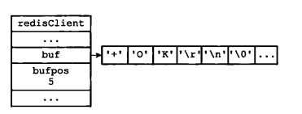
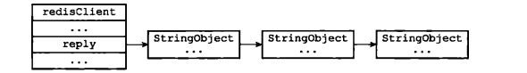
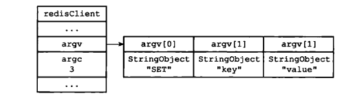
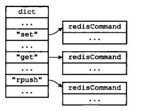
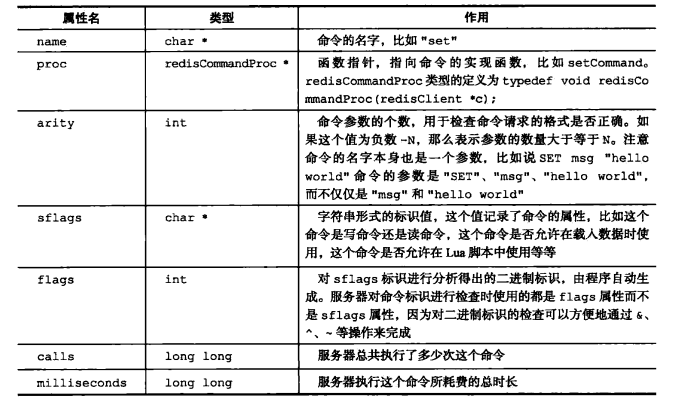
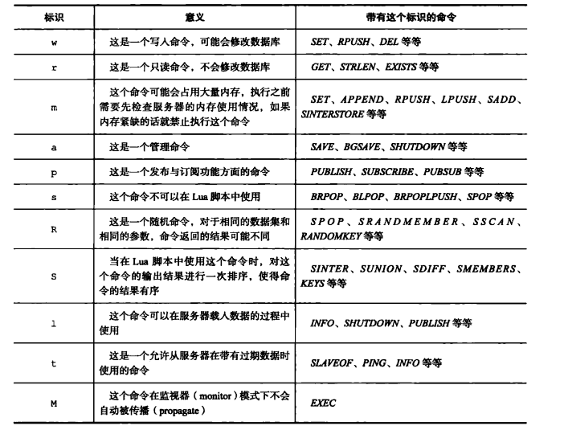

## 客户端

### 结构体

```c
typedef struct client {
    uint64_t id;            //客户端id,-1表示伪客户端
    int fd;                 //套接字描述符
    redisDb *db;            //指向当前使用的redisDb
    robj *name;             //客户端名称
    sds querybuf;           //输入端缓冲区
    size_t qb_pos;          //缓冲区已读取的字节数
    sds pending_querybuf;   /* If this client is flagged as master, this buffer
                               represents the yet not applied portion of the
                               replication stream that we are receiving from
                               the master. */
    size_t querybuf_peak;   /* Recent (100ms or more) peak of querybuf size. */
    int argc;               //当前命令的参数个数
    robj **argv;            //当前命令的参数
    struct redisCommand *cmd, *lastcmd; //cmd：待执行的客户端命令；解析命令请求后，会根据命令名称查找该命令对应的命令对象，存储在客户端cmd字段；lastcmd：上次执行的命令
    int reqtype;            //客户端有两种请求协议：PROTO_REQ_INLINE 1;PROTO_REQ_MULTIBULK 2(看multibulk具体解析)
    int multibulklen;       //剩余读取的bulk数量
    long bulklen;           //每个bulk的数量
    list *reply;            //发送给客户端的回复链表
    unsigned long long reply_bytes;//记录回复链表总大小
    size_t sentlen;         //表示当前该对象已发送的长度
    time_t ctime;           //客户端创建时间
    time_t lastinteraction; //客户端最后一次交互的时间
    time_t obuf_soft_limit_reached_time;
    int flags;              //客户端标识，常见的 CLIENT_SLAVE， 表示 slave; CLENT_MASTER 表示客户端为 MASTER ， CLIETN_BLOCKED 表示客户端处理等待操作（执行某些阻塞操作）；CLIENT_MULTI 表示可兑换正在处理事务 CLIENT_FORCE_AOF表示强制执行 AOP（pubsub 时，所有指令都会 aof ）
    int authenticated;      /* When requirepass is non-NULL. */
    int replstate;          /* Replication state if this is a slave. */
    int repl_put_online_on_ack; /* Install slave write handler on first ACK. */
    int repldbfd;           /* Replication DB file descriptor. */
    off_t repldboff;        /* Replication DB file offset. */
    off_t repldbsize;       /* Replication DB file size. */
    sds replpreamble;       /* Replication DB preamble. */
    long long read_reploff; /* Read replication offset if this is a master. */
    long long reploff;      /* Applied replication offset if this is a master. */
    long long repl_ack_off; /* Replication ack offset, if this is a slave. */
    long long repl_ack_time;/* Replication ack time, if this is a slave. */
    long long psync_initial_offset; /* FULLRESYNC reply offset other slaves
                                       copying this slave output buffer
                                       should use. */
    char replid[CONFIG_RUN_ID_SIZE+1]; /* Master replication ID (if master). */
    int slave_listening_port; /* As configured with: SLAVECONF listening-port */
    char slave_ip[NET_IP_STR_LEN]; /* Optionally given by REPLCONF ip-address */
    int slave_capa;         /* Slave capabilities: SLAVE_CAPA_* bitwise OR. */
    multiState mstate;     //记录当前客户端的事务状态，事务状态包含一个事务队列以及一个命令计数器
    int btype;              /* Type of blocking op if CLIENT_BLOCKED. */
    blockingState bpop;     //记录客户端阻塞相关的状态，包括超时时间，引起阻塞的 key 等	
    long long woff;         /* Last write global replication offset. */
    list *watched_keys;     /* Keys WATCHED for MULTI/EXEC CAS */
    dict *pubsub_channels;  //当前客户端订阅的频道
    list *pubsub_patterns;  //当前客户端订阅的模式
    sds peerid;             /* Cached peer ID. */
    listNode *client_list_node; /* list node in client list */

    /* Response buffer */
    int bufpos;
    char buf[PROTO_REPLY_CHUNK_BYTES];
} client;
```

客户端状态包含的属性可以分为两类:

1. 一类是比较通用的属性，这些属性很少与特定功能相关，无论客户端执行的是什么工作，它们都要用到这些属性。
2. 另外一类是和特定功能相关的属性，比如操作数据库时需要用到的db属性和dictid属性，执行事务时需要用到的mstate属性，以及执行WATCH命令时需要用到的watched_keys属性等等。

主要包括以下属性：

1. 客户端的套接字描述符。客户端的名字。
2. 客户端的标志值( flag )。
3. 指向客户端正在使用的数据库的指针，以及该数据库的号码。
4. 客户端当前要执行的命令、命令的参数、命令参数的个数，以及指向命令实现函数的指针。
5. 客户端的输人缓冲区和输出缓冲区。
6. 客户端的复制状态信息，以及进行复制所需的数据结构。
7. 客户端执行BRPOP、BLPOP等列表阻塞命令时使用的数据结构。客户端的事务状态，以及执行 WATCH命令时用到的数据结构。客户端执行发布与订阅功能时用到的数据结构。
8. 客户端的身份验证标志。
9. 客户端的创建时间，客户端和服务器最后一次通信的时间，以及客户端的输出缓冲区大小超出软性限制（ soft limit)的时间。

所有的client都保存在redisServer的一个clients链表中：

```c
struct redisServer {
    ...
    list *clients;              /* List of active clients */
    ...
}
```


#### 套接字描述符-fd(int)

```c
typedef struct client {
    int fd;                 /* Client socket. */
}
```

**套接字描述符**是一个整数类型的值，就如程序通过文件描述符访问文件一样，套接字描述符是访问套接字的一种路径。每个进程的进程空间里都有一个**套接字描述符**表(每个进程维护一个单独的套接字描述符表。因此，应用程序可以拥有相同的套接字描述符)，该表中存放着**套接字描述符**和套接字数据结构的对应关系。该表中有一个字段存放新创建的套接字的描述符，另一个字段存放套接字数据结构的地址，因此根据**套接字描述符**就可以找到其对应的套接字数据结构。每个进程在自己的进程空间里都有一个**套接字描述符**表但是套接字数据结构都是在操作系统的内核缓冲里。

从某种意义上说，套接字也在文件，所以许多对文件描述符使用的函数，对套接字描述符同样适用。每个 socket 被创建后，都会分配两个缓冲区，输入缓冲区和输出缓冲区。

- write()/send() 并不立即向网络中传输数据，而是先将数据写入缓冲区中，再写入协议栈，即由TCP协议将数据从缓冲区发送到目标机器。一旦将数据写入到缓冲区，函数就可以成功返回，不管它们有没有到达目标机器，也不管它们何时被发送到网络，这些都是TCP协议负责的事情。
- read()/recv() 函数也是如此，也从输入缓冲区中读取数据，而不是直接从网络中读取。

> 参考：:point_right: [socket套接字及缓冲区详解_~青萍之末~的博客-CSDN博客_套接字缓冲区](https://blog.csdn.net/daaikuaichuan/article/details/83061726)

两个相关函数：

- int socket（int domain,int type,int protocol) 

  domain(协议族)：常用的协议族便是IPV4(PF_INET), IPV6(PF_INET6),本地通信协议的UNIX族(PF_LOCAL)
  type：数据传输类型；典型数据传输类型：SOCK_DGRAM,SOCK_RAW,SOCK_SEQPACKET,SOCK_STREAM
  protocal：具体协议，通常为0，表示按给定的域或套接字类型选择默认协议。当对同一域和套接字类型支持多个协议时，可以使用protocol参数选择一个特定协议。

- int shutdown(int socketfd,int how)  

  关闭sockfd指向的套接字的how。其中how的取值可以为：SHUT_RD,SHUT_WR,SHUT_RDWR。

  与close的区别：close是关闭一个指向文件的文件描述符，其实只是关闭了这个文件描述符对文件表的指针。如果该文件仍有其他文件描 述符引用的话，该文件的V节点表并没有关闭。只有当关闭的文件描述符是最后一个指向文件的文件描述符，V节点才能也被关闭；而shutdown是关闭对一文件的读写等属性，不问有多少个文件描述符对该文件引用。

- **伪客户端( fake client)的fd属性的值为-1**：伪客户端处理的命令请求来源于AOF文件或者Lua脚本，而不是网络，所以这种客户端不需要套接字连接，自然也不需要记录套接字描述符。目前Redis服务器会在两个地方用到伪客户端，一个用于载入AOF文件并还原数据库状态，而另一个则用于执行Lua脚本中包含的Redis命令。

- **普通客户端的fd属性的值为大于-1的整数**：普通客户端使用套接字来与服务器进行通信，所以服务器会用fd属性来记录客户端套接字的描述符。因为合法的套接字描述符不能是–1，所以普通客户端的套接字描述符的值必然是大于-1的整数。

>注意另一个属性：slave_listening_port，其会在设置服务器主从关系的时候设置，仅仅在主服务器执行INFO replication命令时打印出服务器的端口号。

#### 名字-name(robj*)

```c
typedef struct client {
    robj *name;             /* As set by CLIENT SETNAME. */
}client
```

如果客户端没有为自己设置名字，那么相应客户端状态的name属性指向NULL指针；相反地，如果客户端为自己设置了名字，那么name属性将指向一个字符串对象，而该对象就保存着客户端的名字。


#### 标志-flags(int)

```c
typedef struct client {
    int flags;   /* Client flags: CLIENT_* macros. */
}client
```

客户端的标志属性flags记录了客户端的角色（ role)，以及客户端目前所处的状态。flags可以是单个标志，也可以是多个标志的二进制或。

```c
flags = <flag>
flags = <flag1> | <flag2> | ...
```

每个标志使用一个常量表示，一部分标志记录了客户端的角色:

- 在主从服务器进行复制操作时，主服务器会成为从服务器的客户端，而从服务器也会成为主服务器的客户端。REDIs_MASTER标志表示客户端代表的是一个主服务器，REDIS_SIAVE标志表示客户端代表的是一个从服务器。
- REDIS_PRE_PSYNC标志表示客户端代表的是一个版本低于Redis2.8的从服务器，主服务器不能使用PSYNC命令与这个从服务器进行同步。这个标志只能在REDIS_SLAVE标志处于打开状态时使用。
- REDIS_LUA_CLIENT标识表示客户端是专门用于处理Lua脚本里面包含的Redis命令的伪客户端。

而另外一部分标志则记录了客户端目前所处的状态:

- REDIs_MONITOR标志表示客户端正在执行MONITOR命令。
- REDIS_UNIx_SOCKET标志表示服务器使用UNIX套接字来连接客户端。REDIS_BLOCKED标志表示客户端正在被BRPOP、BLPOP等命令阻塞。
- REDIS_UNBLOCKED标志表示客户端已经从REDIS_BLOCKED标志所表示的阻塞状态中脱离出来，不再阻塞。
- REDIS_ _UNBLOCKED 标志只能在REDIS_ BLOCKED 标志已经打开的情况下使用。
- REDIS_ MULTI 标志表示客户端正在执行事务。
- REDIS_ DIRTY_ CAS标志表示事务使用WATCH命令监视的数据库键已经被修改,
- REDIS__ DIRTY_ EXEC标志表示事务在命令人队时出现了错误，以上两个标志都表示事务的安全性已经被破坏，只要这两个标记中的任意-一个被打开，EXEC命令必然会执行失败。这两个标志只能在客户端打开了REDIS_ MULTI 标志的情况下使用。
- REDIS_ CLOSE_ ASAP标志表示客户端的输出缓冲区大小超出了服务器允许的范围，服务器会在下一-次执行serverCron函数时关闭这个客户端，以免服务器的稳定性受到这个客户端影响。积存在输出缓冲区中的所有内容会直接被释放,不会返回给客户端。
- REDIS_ CLOSE_ AFTER_ REPLY标志表示有用户对这个客户端执行了CLIENT KILL命令，或者客户端发送给服务器的命令请求中包含了错误的协议内容。服务器会将客户端积存在输出缓冲区中的所有内容发送给客户端，然后关闭客户端。
- REDIS_ ASKING标志表示客户端向集群节点(运行在集群模式下的服务器)发送了ASKING命令。
- REDIS_FORCE_AOF标志强制服务器将当前执行的命令写人到AOF文件里面,REDIS_FORCE_REPL标志强制主服务器将当前执行的命令复制给所有从服务器。执行PUBSUB命令会使客户端打开REDIS_ FORCE \_AOF标志，执行SCRIPT LOAD命令会使客户端打开REDIS_ FORCE_ AoF标志和REDIS_ FORCE_ REPL标志。
- 在主从服务器进行命令传播期间,从服务器需要向主服务器发送REPLICATION ACK命令,在发送这个命令之前，从服务器必须打开主服务器对应的客户端的REDIS_MASTER_ FORCE_ _REPLY标志，否则发送操作会被拒绝执行。

例子：

```c
#客户端是一个主服务器
REDIS_MASTER
    
#客户端正在被列表命令阻塞
REDIS_BLOCKED
    
#客户端正在执行事务、但事务的安全性巳被破坏
REDIS_MULTI lREDIs_DIRTY__cAs
    
#客户端是一个从服务器,并且版本低于Redis 2.8
REDIS_SLAVE lREDIS_PRE_PsYNc
    
#这是专门用于执行Lua脚本包含的Redis命令的伪客户端
#它强制凰务器将当前执行的命令写入AOF文件，并复制给从服务
REDIS_LUA_CLIENT  REDIs_PORCE_AOFI REDIS_PORCE_REPL
```


#### 输入缓冲区-querybuf(sds)

```c
typedef struct client {
    sds querybuf;           /* Buffer we use to accumulate client queries. */
}client
```

客户端状态的输入缓冲区用于保存客户端发送的命令请求，输人缓冲区的大小会根据输人内容动态地缩小或者扩大，但它的最大大小不能超过1GB,否则服务器将关闭这个客户端。


#### 输出缓冲区-buf/reply

```c
typedef struct client {
    list *reply;            /* List of reply objects to send to the client. */
    /* Response buffer */
    int bufpos;
    char buf[PROTO_REPLY_CHUNK_BYTES];
}client
```

执行命令所得的命令回复会被保存在客户端状态的输出缓冲区里面，每个客户端都有两个输出缓冲区可用，一个缓冲区的大小是固定的，另一个缓冲区的大小是可变的:

- 固定大小的缓冲区用于保存那些长度比较小的回复，比如oK、简短的字符串值、整数值、错误回复等等。
- 可变大小的缓冲区用于保存那些长度比较大的回复，比如一个非常长的字符串值，一个由很多项组成的列表，一个包含了很多元素的集合等等。

固定缓冲区是由buf和bufpos两个属性组成的：buf是一个大小为REDIS_REPLY_CHUNK_BYTES字节的字节数组，而bufpos属性则记录了buf数组目前已使用的字节数量。REDIS_REPLY_CHUNK_BYTES 常量目前的默认值为16*1024，也即是说，buf数组的默认大小为16KB。

<center></center>

当buf数组的空间已经用完，或者回复因为太大而没办法放进buf数组里面时，服务器就会开始使用可变大小缓冲区。可变大小缓冲区由reply链表和一个或多个字符串对象组成。

<center></center>


#### 命令和命令参数-argv(robj**)

在服务器将客户端发送的命令请求保存到客户端状态的querybuf属性之后，服务器将对命令请求的内容进行分析，并将得出的命令参数以及命令参数的个数分别保存到客户端状态的argv属性和argc属性。

```c
typedef struct client {
    int argc;               /* Num of arguments of current command. */
    robj **argv;            /* Arguments of current command. */
}client
```

argv属性是一个数组，数组中的每个项都是一个字符串对象，其中argv[0]是要执行的命令，而之后的其他项则是传给命令的参数。
argc属性则负责记录argv数组的长度。

<center></center>


#### 命令的实现函数-cmd(struct *redisCommand)

当服务器从协议内容中分析并得出argv属性和argc属性的值之后，服务器将根据项argv [0]的值，在命令表中查找命令所对应的命令实现函数。

<center></center>

上图展示了一个命令表示例，该表是一个字典，字典的键是一个SDS结构，保存了命令的名字，字典的值是命令所对应的redisCommand结构，这个结构保存了命令的实现函数、命令的标志、命令应该给定的参数个数、命令的总执行次数和总消耗时长等统计信息。

命令表存在redisServer对象中：

```c
struct redisServer {
    dict *commands;             /* Command table */
}
```

dict的键是一个SDS结构，保存了命令的名字，字典的值是命令所对应的redisCommand结构：

```c
struct redisCommand {
    char *name;
    redisCommandProc *proc;
    int arity;
    char *sflags; /* Flags as string representation, one char per flag. */
    int flags;    /* The actual flags, obtained from the 'sflags' field. */
    /* Use a function to determine keys arguments in a command line.
     * Used for Redis Cluster redirect. */
    redisGetKeysProc *getkeys_proc;
    /* What keys should be loaded in background when calling this command? */
    int firstkey; /* The first argument that's a key (0 = no keys) */
    int lastkey;  /* The last argument that's a key */
    int keystep;  /* The step between first and last key */
    long long microseconds, calls;
};
```

redisCommand保存了命令的名字、命令的实现函数、命令的标志、命令应该给定的参数个数、命令的总执行次数和总消耗时长等统计信息。

<center></center>

sflags属性可以使用的标志值和意义：

<center></center>

这里注意一个数据结构：server.c#redisCommandTable：

```c
struct redisCommand redisCommandTable[] = {
    {"module",moduleCommand,-2,"as",0,NULL,0,0,0,0,0},
    {"get",getCommand,2,"rF",0,NULL,1,1,1,0,0},
    {"set",setCommand,-3,"wm",0,NULL,1,1,1,0,0},
    ...
    {"lolwut",lolwutCommand,-1,"r",0,NULL,0,0,0,0,0}
};
```

这个数组中保存了所有命令的信息，并封装在每个redisCommand中。

然后在server.c#populateCommandTable中会将在redisCommandTable中的所有redisCommand存储到redisServer的commands字典中。

```c
/* Populates the Redis Command Table starting from the hard coded list
 * we have on top of redis.c file. */
void populateCommandTable(void) {
    int j;
    int numcommands = sizeof(redisCommandTable)/sizeof(struct redisCommand);

    for (j = 0; j < numcommands; j++) {
        struct redisCommand *c = redisCommandTable+j;
        char *f = c->sflags;
        int retval1, retval2;

        while(*f != '\0') {
            switch(*f) {
                case 'w': c->flags |= CMD_WRITE; break;
                case 'r': c->flags |= CMD_READONLY; break;
                case 'm': c->flags |= CMD_DENYOOM; break;
                case 'a': c->flags |= CMD_ADMIN; break;
                case 'p': c->flags |= CMD_PUBSUB; break;
                case 's': c->flags |= CMD_NOSCRIPT; break;
                case 'R': c->flags |= CMD_RANDOM; break;
                case 'S': c->flags |= CMD_SORT_FOR_SCRIPT; break;
                case 'l': c->flags |= CMD_LOADING; break;
                case 't': c->flags |= CMD_STALE; break;
                case 'M': c->flags |= CMD_SKIP_MONITOR; break;
                case 'k': c->flags |= CMD_ASKING; break;
                case 'F': c->flags |= CMD_FAST; break;
                default: serverPanic("Unsupported command flag"); break;
            }
            f++;
        }

        retval1 = dictAdd(server.commands, sdsnew(c->name), c);
        /* Populate an additional dictionary that will be unaffected
         * by rename-command statements in redis.conf. */
        retval2 = dictAdd(server.orig_commands, sdsnew(c->name), c);
        serverAssert(retval1 == DICT_OK && retval2 == DICT_OK);
    }
}
```


#### multibulk

Redis支持两种数据解析协议，一种是inline，一种是multibulk。inline协议是老协议，现在一般只在命令行下的redis客户端使用，其他情况(如程序客户端)一般是使用multibulk协议。

如果客户端传送的数据的第一个字符时‘*’，那么传送数据将被当做multibulk协议处理，否则将被当做inline协议处理。Inline协议的具体解析函数是processInlineBuffer()，multibulk协议的具体解析函数是processMultibulkBuffer()。 当协议解析完毕，即客户端传送的数据已经解析出命令字段和参数字段，接下来进行命令处理，命令处理函数是processCommand。

networking.c#processInputBuffer：

```c
server.current_client = c;

/* Keep processing while there is something in the input buffer */
//只要querybuf中还包含完整的命令就会一直处理
while(c->qb_pos < sdslen(c->querybuf)) {
    /* Return if clients are paused. */
    if (!(c->flags & CLIENT_SLAVE) && clientsArePaused()) break;

    /* Immediately abort if the client is in the middle of something. */
    if (c->flags & CLIENT_BLOCKED) break;

    /* Don't process input from the master while there is a busy script
         * condition on the slave. We want just to accumulate the replication
         * stream (instead of replying -BUSY like we do with other clients) and
         * later resume the processing. */
    if (server.lua_timedout && c->flags & CLIENT_MASTER) break;

    /* CLIENT_CLOSE_AFTER_REPLY closes the connection once the reply is
         * written to the client. Make sure to not let the reply grow after
         * this flag has been set (i.e. don't process more commands).
         *
         * The same applies for clients we want to terminate ASAP. */
    if (c->flags & (CLIENT_CLOSE_AFTER_REPLY|CLIENT_CLOSE_ASAP)) break;

    //根据命令的格式，决定请求的类型
    if (!c->reqtype) {
        if (c->querybuf[c->qb_pos] == '*') {
            c->reqtype = PROTO_REQ_MULTIBULK;
        } else {
            c->reqtype = PROTO_REQ_INLINE;
        }
    }

    //根据请求的类型，分别调用processInlineBuffer和processMultibulkBuffer解析请求
    if (c->reqtype == PROTO_REQ_INLINE) {
        if (processInlineBuffer(c) != C_OK) break;
    } else if (c->reqtype == PROTO_REQ_MULTIBULK) {
        if (processMultibulkBuffer(c) != C_OK) break;
    } else {
        serverPanic("Unknown request type");
    }

    /* Multibulk processing could see a <= 0 length. */
    //解析完成后，接下来调用processCommand函数进行命令处理
    if (c->argc == 0) {
        resetClient(c);
    } else {
        /* Only reset the client when the command was executed. */
        if (processCommand(c) == C_OK) {
            if (c->flags & CLIENT_MASTER && !(c->flags & CLIENT_MULTI)) {
                /* Update the applied replication offset of our master. */
                c->reploff = c->read_reploff - sdslen(c->querybuf) + c->qb_pos;
            }

            /* Don't reset the client structure for clients blocked in a
                 * module blocking command, so that the reply callback will
                 * still be able to access the client argv and argc field.
                 * The client will be reset in unblockClientFromModule(). */
            if (!(c->flags & CLIENT_BLOCKED) || c->btype != BLOCKED_MODULE)
                resetClient(c);
        }
        /* freeMemoryIfNeeded may flush slave output buffers. This may
             * result into a slave, that may be the active client, to be
             * freed. */
        if (server.current_client == NULL) break;
    }
}

/* Trim to pos */
if (server.current_client != NULL && c->qb_pos) {
    sdsrange(c->querybuf,c->qb_pos,-1);
    c->qb_pos = 0;
}

server.current_client = NULL;
```

networking.c#processInlineBuffer：

```c
//格式上，inline请求就是诸如”+PING\r\n”。在解析时，只需要查找\n即可。
//首先，就是查找\n。如果没有找到，说明buffer中的内容不是完整的请求，
// 然后判断一下querybuf的大小是否超过REDIS_INLINE_MAX_SIZE（64KB），
// 超过则向客户端发送错误响应。否则，返回REDIS_ERR，继续read数据。
int processInlineBuffer(client *c) {
    char *newline;
    int argc, j, linefeed_chars = 1;
    sds *argv, aux;
    size_t querylen;

    //查找 \n 第一次出现的位置
    newline = strchr(c->querybuf+c->qb_pos,'\n');

    // 没有\n，需要下一次epoll迭代，继续read
    if (newline == NULL) {
        if (sdslen(c->querybuf)-c->qb_pos > PROTO_INLINE_MAX_SIZE) {
            addReplyError(c,"Protocol error: too big inline request");
            setProtocolError("too big inline request",c);
        }
        return C_ERR;
    }

    // 找到\n，则读到一个请求，接下来会将该请求数据拷贝到一个新的buffer中，等待解析。
    if (newline && newline != c->querybuf+c->qb_pos && *(newline-1) == '\r')
        newline--, linefeed_chars++;

    /* Split the input buffer up to the \r\n */
    querylen = newline-(c->querybuf+c->qb_pos);
    //存在一次内存拷贝，即所有请求都需要拷贝一次
    aux = sdsnewlen(c->querybuf+c->qb_pos,querylen);
    // 接下来，根据空格将请求分割成多个部分，存储到argv数组，大小存于argc中
    argv = sdssplitargs(aux,&argc);
    sdsfree(aux);
    if (argv == NULL) {
        addReplyError(c,"Protocol error: unbalanced quotes in request");
        setProtocolError("unbalanced quotes in inline request",c);
        return C_ERR;
    }

    /* Newline from slaves can be used to refresh the last ACK time.
     * This is useful for a slave to ping back while loading a big
     * RDB file. */
    // 更新一下主从同步时间
    if (querylen == 0 && getClientType(c) == CLIENT_TYPE_SLAVE)
        c->repl_ack_time = server.unixtime;

    /* Move querybuffer position to the next query in the buffer. */
    //修改当前的querybuffer的未处理数据的位置
    c->qb_pos += querylen+linefeed_chars;

    //创建redisClient->argv数组
    if (argc) {
        if (c->argv) zfree(c->argv);
        c->argv = zmalloc(sizeof(robj*)*argc);
    }

    //给所有的参数创建一个robj，并存到redisClient->argv中
    for (c->argc = 0, j = 0; j < argc; j++) {
        c->argv[c->argc] = createObject(OBJ_STRING,argv[j]);
        c->argc++;
    }
    zfree(argv);
    return C_OK;
}
```

networking.c#processMultibulkBuffer

```c
// 这个函数解析multi bulk的请求。会以一个bulk为单位解析整个命令，在redisClient->multibulklen存储bulk的数量，
// 然后循环一次解析每个bulk，如果multibulklen=0，则首先需要解析出multibulklen。redisClient->bulklen存储
// 当前要解析的bulk的大小，如果bulk=-1，则首先要解析出bulk。下面代码，如果multibulklen=0，说明是一个新的请求，
// 首先需要解析出multibulklen。通过pos，指示当前querybuf中为解析的部分。如果后续在解析一个请求过程中，是不会走这个分支的。
int processMultibulkBuffer(client *c) {
    char *newline = NULL;
    int ok;
    long long ll;

    if (c->multibulklen == 0) {
        /* The client should have been reset */
        serverAssertWithInfo(c,NULL,c->argc == 0);

        /* Multi bulk length cannot be read without a \r\n */
        newline = strchr(c->querybuf+c->qb_pos,'\r');
        if (newline == NULL) {
            if (sdslen(c->querybuf)-c->qb_pos > PROTO_INLINE_MAX_SIZE) {
                addReplyError(c,"Protocol error: too big mbulk count string");
                setProtocolError("too big mbulk count string",c);
            }
            return C_ERR;
        }

        /* Buffer should also contain \n */
        if (newline-(c->querybuf+c->qb_pos) > (ssize_t)(sdslen(c->querybuf)-c->qb_pos-2))
            return C_ERR;

        /* We know for sure there is a whole line since newline != NULL,
         * so go ahead and find out the multi bulk length. */
        serverAssertWithInfo(c,NULL,c->querybuf[c->qb_pos] == '*');
        ok = string2ll(c->querybuf+1+c->qb_pos,newline-(c->querybuf+1+c->qb_pos),&ll);
        if (!ok || ll > 1024*1024) {
            addReplyError(c,"Protocol error: invalid multibulk length");
            setProtocolError("invalid mbulk count",c);
            return C_ERR;
        } else if (ll > 10 && server.requirepass && !c->authenticated) {
            addReplyError(c, "Protocol error: unauthenticated multibulk length");
            setProtocolError("unauth mbulk count", c);
            return C_ERR;
        }

        c->qb_pos = (newline-c->querybuf)+2;

        if (ll <= 0) return C_OK;

        c->multibulklen = ll;

        /* Setup argv array on client structure */
        if (c->argv) zfree(c->argv);
        c->argv = zmalloc(sizeof(robj*)*c->multibulklen);
    }

    serverAssertWithInfo(c,NULL,c->multibulklen > 0);
    // 循环multibulklen次，解析出对应个数的bulk。下面看一下这个循环内部：
    // 首先，也是如果bulklen=-1，说明要解析的是一个新的bulk，需要解析bulklen。
    while(c->multibulklen) {
        /* Read bulk length if unknown */
        if (c->bulklen == -1) {
            newline = strchr(c->querybuf+c->qb_pos,'\r');
            if (newline == NULL) {
                if (sdslen(c->querybuf)-c->qb_pos > PROTO_INLINE_MAX_SIZE) {
                    addReplyError(c,
                                  "Protocol error: too big bulk count string");
                    setProtocolError("too big bulk count string",c);
                    return C_ERR;
                }
                break;
            }

            /* Buffer should also contain \n */
            if (newline-(c->querybuf+c->qb_pos) > (ssize_t)(sdslen(c->querybuf)-c->qb_pos-2))
                break;

            if (c->querybuf[c->qb_pos] != '$') {
                addReplyErrorFormat(c,
                                    "Protocol error: expected '$', got '%c'",
                                    c->querybuf[c->qb_pos]);
                setProtocolError("expected $ but got something else",c);
                return C_ERR;
            }

            ok = string2ll(c->querybuf+c->qb_pos+1,newline-(c->querybuf+c->qb_pos+1),&ll);
            if (!ok || ll < 0 || ll > server.proto_max_bulk_len) {
                addReplyError(c,"Protocol error: invalid bulk length");
                setProtocolError("invalid bulk length",c);
                return C_ERR;
            } else if (ll > 16384 && server.requirepass && !c->authenticated) {
                addReplyError(c, "Protocol error: unauthenticated bulk length");
                setProtocolError("unauth bulk length", c);
                return C_ERR;
            }

            c->qb_pos = newline-c->querybuf+2;
            if (ll >= PROTO_MBULK_BIG_ARG) {
                /* If we are going to read a large object from network
                 * try to make it likely that it will start at c->querybuf
                 * boundary so that we can optimize object creation
                 * avoiding a large copy of data.
                 *
                 * But only when the data we have not parsed is less than
                 * or equal to ll+2. If the data length is greater than
                 * ll+2, trimming querybuf is just a waste of time, because
                 * at this time the querybuf contains not only our bulk. */
                if (sdslen(c->querybuf)-c->qb_pos <= (size_t)ll+2) {
                    sdsrange(c->querybuf,c->qb_pos,-1);
                    c->qb_pos = 0;
                    /* Hint the sds library about the amount of bytes this string is
                     * going to contain. */
                    c->querybuf = sdsMakeRoomFor(c->querybuf,ll+2);
                }
            }
            c->bulklen = ll;
        }

        /* Read bulk argument */
        // 接下来，是解析bulk，首先会判断querybuf是否包含足够的内容。不够则返回，否则解析该bulk。
        //在解析bulk，如果bulk不是大对象（不超过64KB），则会调用createStringObject创建argv，
        // 这个函数内部会调用strnewlen函数，拷贝传入的buffer。如果是大对象，并且querybuf中只
        // 包含该bulk的内容，则调用createObject函数，直接以querybuf为底层存储，创建argv，避免
        // 了大对象的拷贝。最后，在解析出bulk后，需要将bulklen设置为-1，并将multibulklen减1。

        if (sdslen(c->querybuf)-c->qb_pos < (size_t)(c->bulklen+2)) {
            /* Not enough data (+2 == trailing \r\n) */
            break;
        } else {
            /* Optimization: if the buffer contains JUST our bulk element
             * instead of creating a new object by *copying* the sds we
             * just use the current sds string. */
            if (c->qb_pos == 0 &&
                c->bulklen >= PROTO_MBULK_BIG_ARG &&
                sdslen(c->querybuf) == (size_t)(c->bulklen+2))
            {
                c->argv[c->argc++] = createObject(OBJ_STRING,c->querybuf);
                sdsIncrLen(c->querybuf,-2); /* remove CRLF */
                /* Assume that if we saw a fat argument we'll see another one
                 * likely... */
                c->querybuf = sdsnewlen(SDS_NOINIT,c->bulklen+2);
                sdsclear(c->querybuf);
            } else {
                c->argv[c->argc++] =
                    createStringObject(c->querybuf+c->qb_pos,c->bulklen);
                c->qb_pos += c->bulklen+2;
            }
            c->bulklen = -1;
            c->multibulklen--;
        }
    }

    /* We're done when c->multibulk == 0 */
    //如果multibulklen=0，说明已经解析出命令所有的bulk，即命令解析成功，则返回REDIS_OK。
    if (c->multibulklen == 0) return C_OK;

    /* Still not ready to process the command */
    return C_ERR;
}
```


