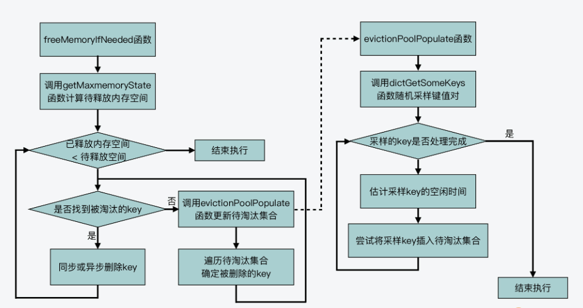
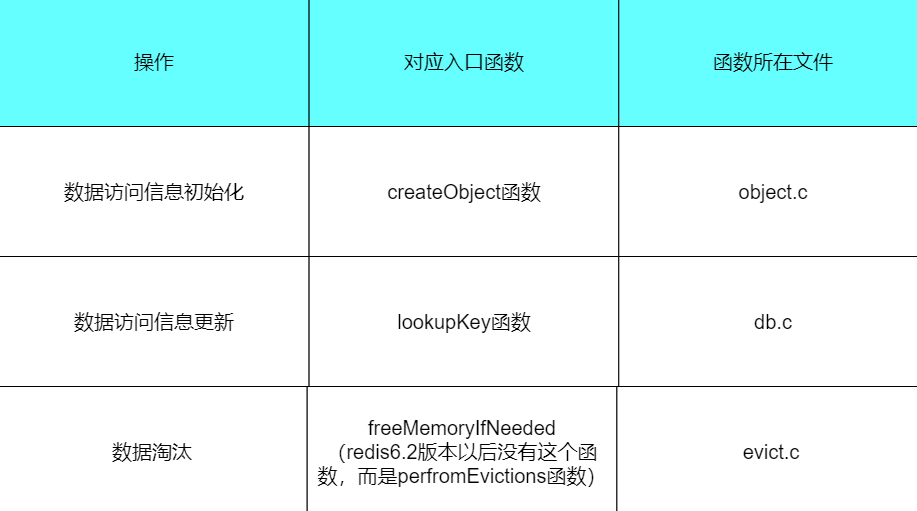

##  Redis 内存淘汰机制

> 相关问题：MySQL 里有 2000w 数据，Redis 中只存 20w 的数据，如何保证 Redis 中的数据都是热点数据?

Redis 提供 6 种数据淘汰策略：

1. **volatile-lru（least recently used）**：从已设置过期时间的数据集（server.db[i].expires）中挑选最近最少使用的数据淘汰
2. **volatile-ttl**：从已设置过期时间的数据集（server.db[i].expires）中挑选将要过期的数据淘汰
3. **volatile-random**：从已设置过期时间的数据集（server.db[i].expires）中任意选择数据淘汰
4. **allkeys-lru（least recently used）**：当内存不足以容纳新写入数据时，在键空间中，移除最近最少使用的 key（这个是最常用的）
5. **allkeys-random**：从数据集（server.db[i].dict）中任意选择数据淘汰
6. **no-eviction**：禁止驱逐数据，也就是说当内存不足以容纳新写入数据时，新写入操作会报错。这个应该没人使用吧！

4.0 版本后增加以下两种：

7. **volatile-lfu（least frequently used）**：从已设置过期时间的数据集(server.db[i].expires)中挑选最不经常使用的数据淘汰
8. **allkeys-lfu（least frequently used）**：当内存不足以容纳新写入数据时，在键空间中，移除最不经常使用的 key

lfu并不是简单地将使用的数据计数器+1，而是使用了对数递增计数值的方法，这一点要注意！

>只有设置了**maxmemory**，才能设置**maxmemory-policy**配置项决定内存淘汰机制。


### LRU源码分析

#### LRU的基本原理

从基本原理上来说，LRU 算法会使用一个链表来维护缓存中每一个数据的访问情况，并根据数据的实时访问，调整数据在链表中的位置，然后通过数据在链表中的位置，来表示数据是最近刚访问的，还是已经有一段时间没有访问了。

而具体来说，LRU 算法会把链表的头部和尾部分别设置为 MRU 端和 LRU 端。其中，MRU 是 Most Recently Used 的缩写，MRU 端表示这里的数据是刚被访问的。而 LRU 端则表示，这里的数据是最近最少访问的数据。

LRU 算法的执行，可以分成三种情况：

1. 当有新数据插入时，LRU 算法会把该数据插入到链表头部，同时把原来链表头部的数据及其之后的数据，都向尾部移动一位;
2. 当有数据刚被访问了一次之后，LRU 算法就会把该数据从它在链表中的当前位置，移动到链表头部。同时，把从链表头部到它当前位置的其他数据，都向尾部移动一位;
3. 当链表长度无法再容纳更多数据时，若再有新数据插入，LRU 算法就会去除链表尾部的数据，这也相当于将数据从缓存中淘汰掉。

所以你其实可以发现，如果要严格按照 LRU 算法的基本原理来实现的话，你需要在代码中实现如下内容：

- 要为 Redis 使用最大内存时，可容纳的所有数据维护一个链表；
- 每当有新数据插入或是现有数据被再次访问时，需要执行多次链表操作。

而假设 Redis 保存的数据比较多的话，那么，这两部分的代码实现，就既需要额外的内存空间来保存链表，还会在访问数据的过程中，让 Redis 受到数据移动和链表操作的开销影响，从而就会降低 Redis 访问性能。

所以说，无论是为了节省宝贵的内存空间，还是为了保持 Redis 高性能，Redis 源码并没有严格按照 LRU 算法基本原理来实现它，而是提供了一个近似 LRU 算法的实现。

#### 近似LRU算法

在了解 Redis 对近似 LRU 算法的实现之前，我们需要先来看下，Redis 的内存淘汰机制是如何启用近似 LRU 算法的，这可以帮助我们了解和近似 LRU 算法相关的配置项。

实际上，这和 Redis 配置文件 redis.conf 中的两个配置参数有关：

- maxmemory，该配置项设定了 Redis server 可以使用的最大内存容量，一旦 server 使用的实际内存量超出该阈值时，server 就会根据 maxmemory-policy 配置项定义的策略，执行内存淘汰操作；

- maxmemory-policy，该配置项设定了 Redis server 的内存淘汰策略，主要包括近似 LRU 算法、LFU 算法、按 TTL 值淘汰和随机淘汰等几种算法。

所以，一旦我们设定了 maxmemory 选项，并且将 maxmemory-policy 配置为 allkeys-lru 或是 volatile-lru 时，近似 LRU 算法就被启用了。

近似 LRU 算法的实现分成了三个部分：

- **全局 LRU 时钟值的计算**：这部分包括，Redis 源码为了实现近似 LRU 算法的效果，是如何计算全局 LRU 时钟值的，以用来判断数据访问的时效性；
- **键值对 LRU 时钟值的初始化与更新**：这部分包括，Redis 源码在哪些函数中对每个键值对对应的 LRU 时钟值，进行初始化与更新；
- **近似 LRU 算法的实际执行**：这部分包括，Redis 源码具体如何执行近似 LRU 算法，也就是何时触发数据淘汰，以及实际淘汰的机制是怎么实现的。

##### 全局LRU时钟值的计算

在前面的介绍中，我们已经知道了每一个键值对的值都是一个redisObject，而这个对象中有一个24位的lru属性，保存了该键值对最近一次访问的时间戳。

```c
typedef struct redisObject {
    unsigned type:4;
    unsigned encoding:4;
    unsigned lru:LRU_BITS; /* LRU time (relative to global lru_clock) or
                            * LFU data (least significant 8 bits frequency
                            * and most significant 16 bits access time). */
    int refcount;
    void *ptr;
} robj;
```

那么，每个键值对的 LRU 时钟值具体是如何计算的呢？其实，Redis server 使用了一个实例级别的全局 LRU 时钟，每个键值对的 LRU 时钟值会根据全局 LRU 时钟进行设置。

这个全局 LRU 时钟保存在了 Redis 全局变量 server 的成员变量 lruclock 中。当 Redis server 启动后，调用 initServerConfig 函数初始化各项参数时，就会对这个全局 LRU 时钟 lruclock 进行设置。具体来说，initServerConfig 函数是调用 getLRUClock 函数，来设置 lruclock 的值，如下所示：

```c
// 调用getLRUClock函数计算全局LRU时钟值
unsigned int lruclock = getLRUClock();
//设置lruclock为刚计算的LRU时钟值
atomicSet(server.lruclock,lruclock);
```

所以，**全局 LRU 时钟值就是通过 getLRUClock 函数计算得到的**。getLRUClock 函数是在evict.c文件中实现的：

```c
/* Return the LRU clock, based on the clock resolution. This is a time
 * in a reduced-bits format that can be used to set and check the
 * object->lru field of redisObject structures. */
unsigned int getLRUClock(void) {
    return (mstime()/LRU_CLOCK_RESOLUTION) & LRU_CLOCK_MAX;
}
```

上诉相关的宏都定义在server.h中：

```c
#define LRU_BITS 24
#define LRU_CLOCK_MAX ((1<<LRU_BITS)-1) /* Max value of obj->lru */
#define LRU_CLOCK_RESOLUTION 1000 /* LRU clock resolution in ms */
```

- LRU_BITS定义了redisObject中lru的位数；
- LRU_CLOCK_RESOLUTION表示的是以毫秒为单位的 LRU 时钟精度，也就是以毫秒为单位来表示的 LRU 时钟最小单位。因为 LRU_CLOCK_RESOLUTION 的默认值是 1000，所以，LRU 时钟精度就是 1000 毫秒，也就是 1 秒。这样一来，你需要注意的就是，如果一个数据前后两次访问的时间间隔小于 1 秒，那么这两次访问的时间戳就是一样的。因为 LRU 时钟的精度就是 1 秒，它无法区分间隔小于 1 秒的不同时间戳；
- LRU_CLOCK_MAX 表示的是 LRU 时钟能表示的最大值。

现在再来看看上方的getLRUClock，先调用 mstime 函数（在server.c文件中）获得以毫秒为单位计算的 UNIX 时间戳，除以 LRU_CLOCK_RESOLUTION 后得到对应精度的时间戳，再与LRU_CLOCK_MAX进行与运算，得到最终的时间戳。（与运算其实就相当于取模运算）

而该全局LRU时钟值的更新操作则是在**serverCron** 中。serverCron作为一个周期性事件，会定期进行执行，因此全局 LRU 时钟值就会按照这个函数的执行频率，定期调用 getLRUClock 函数进行更新。这也是为什么全局LRU时钟值要设置一个精度的原因。


##### 键值对 LRU 时钟值的初始化与更新

首先，对于一个键值对来说，它的 LRU 时钟值最初是在这个键值对被创建的时候，进行初始化设置的，这个初始化操作是在 **createObject** 函数中调用的。**createObject** 函数实现在object.c文件当中，当 Redis 要创建一个键值对时，就会调用这个函数：

```c
robj *createObject(int type, void *ptr) {
    robj *o = zmalloc(sizeof(*o));
    o->type = type;
    o->encoding = OBJ_ENCODING_RAW;
    o->ptr = ptr;
    o->refcount = 1;

    /* Set the LRU to the current lruclock (minutes resolution), or
     * alternatively the LFU counter. */
    if (server.maxmemory_policy & MAXMEMORY_FLAG_LFU) {
        o->lru = (LFUGetTimeInMinutes()<<8) | LFU_INIT_VAL;
    } else {
        o->lru = LRU_CLOCK();
    }
    return o;
}
```

而 createObject 函数除了会给 redisObject 结构体分配内存空间之外，它还会根据我刚才提到的 **maxmemory_policy** 配置项的值，来初始化设置 redisObject 结构体中的 lru 变量：

- 如果 maxmemory_policy 配置为使用 LFU 策略，那么 lru 变量值会被初始化设置为 LFU 算法的计算值；
- 如果 maxmemory_policy 配置项没有使用 LFU 策略，那么，createObject 函数就会调用 **LRU_CLOCK** 函数来设置 lru 变量的值，也就是键值对对应的 LRU 时钟值。

**LRU_CLOCK** 函数是在 evict.c 文件中实现的，它的作用就是返回当前的全局 LRU 时钟值。因为一个键值对一旦被创建，也就相当于有了一次访问，所以它对应的 LRU 时钟值就表示了它的访问时间戳。

```c
/* This function is used to obtain the current LRU clock.
 * If the current resolution is lower than the frequency we refresh the
 * LRU clock (as it should be in production servers) we return the
 * precomputed value, otherwise we need to resort to a system call. */
unsigned int LRU_CLOCK(void) {
    unsigned int lruclock;
    //如果serverCron平均每次的执行时间小于设置的精度，则直接获取全局的LRU时钟值
    if (1000/server.hz <= LRU_CLOCK_RESOLUTION) {
        atomicGet(server.lruclock,lruclock);
    } else {
        //否则，直接获取最新的LRU时钟值
        lruclock = getLRUClock();
    }
    return lruclock;
}
```

那么到这里，又出现了一个新的问题：**一个键值对的 LRU 时钟值又是在什么时候被再次更新的呢**？

其实，只要一个键值对被访问了，它的 LRU 时钟值就会被更新。而当一个键值对被访问时，访问操作最终都会调用 **lookupKey** 函数。**lookupKey** 函数是在**db.c**文件中实现的：

```c
/* Low level key lookup API, not actually called directly from commands
 * implementations that should instead rely on lookupKeyRead(),
 * lookupKeyWrite() and lookupKeyReadWithFlags(). */
robj *lookupKey(redisDb *db, robj *key, int flags) {
    dictEntry *de = dictFind(db->dict,key->ptr);
    if (de) {
        // 获取键值对对应的redisObject结构体
        robj *val = dictGetVal(de);

        /* Update the access time for the ageing algorithm.
         * Don't do it if we have a saving child, as this will trigger
         * a copy on write madness. */
        if (!hasActiveChildProcess() && !(flags & LOOKUP_NOTOUCH)){
            if (server.maxmemory_policy & MAXMEMORY_FLAG_LFU) {
                // 如果使用了LFU策略，调用updateLFU函数更新lru值
                updateLFU(val);
            } else {
                // 否则，调用LRU_CLOCK函数获取全局LRU时钟值
                val->lru = LRU_CLOCK();
            }
        }
        return val;
    } else {
        return NULL;
    }
}
```

它会从全局哈希表中查找要访问的键值对。如果该键值对存在，那么 lookupKey 函数就会根据 maxmemory_policy 的配置值，来更新键值对的 LRU 时钟值，也就是它的访问时间戳：

- 如果 maxmemory_policy 配置为使用 LFU 策略，那么修改LFU计数值，也就是修改lru属性；
- 如果 maxmemory_policy 配置项没有使用 LFU 策略，lookupKey 函数就会调用 LRU_CLOCK 函数，来获取当前的全局 LRU 时钟值，并将其赋值给键值对的 redisObject 结构体中的 lru 变量。


##### 近似 LRU 算法的实际执行

现在我们已经知道，Redis 之所以实现近似 LRU 算法的目的，是为了减少内存资源和操作时间上的开销。那么在这里，我们其实可以从两个方面来了解近似 LRU 算法的执行过程，分别是：

- **何时触发算法执行？**
- **算法具体如何执行？**

**何时触发算法执行？**

首先，近似 LRU 算法的主要逻辑是在 freeMemoryIfNeeded 函数中实现的，而这个函数本身是在 evict.c 文件中实现。freeMemoryIfNeeded 函数是被 freeMemoryIfNeededAndSafe 函数（在 evict.c 文件中）调用，而 freeMemoryIfNeededAndSafe 函数又是被 processCommand 函数所调用的。

server.c#processCommand：

````c
if (server.maxmemory && !server.lua_timedout) {
        //如果设置了maxmemory 配置项为非 0 值,且Lua 脚本没有在超时运行则判断是否要进行内存的的清理，具体的清理根据内存淘汰策略会有所不同，具体看内存淘汰机制。
        int out_of_memory = freeMemoryIfNeededAndSafe() == C_ERR;
````

evict.c#freeMemoryIfNeededAndSafe：

```c
int freeMemoryIfNeededAndSafe(void) {
    if (server.lua_timedout || server.loading) return C_OK;
    //Lua脚本没有超时运行，且Redis server没有在加载数据，则进一步判断是否要进行内存的清理
    return freeMemoryIfNeeded();
}
```

**算法具体如何执行？**

lru相关的大概执行流程：

<center></center>

直接看evict.c#freeMemoryIfNeeder()函数(可以只看lru部分)：

```c
/*
 * 根据当前的“maxmemory”设置，定期调用此函数以查看是否有可用内存。 如果我们超过内存限制，该函数会根据不同的策略尝试释放一些内存以返回低于限制。
 * 如果我们低于内存限制或超过限制但尝试释放内存成功,该函数将返回 C_OK。
 * 否则，如果我们超过了内存限制，但没有足够的内存被释放以返回低于限制，则该函数返回 C_ERR。
 */
int freeMemoryIfNeeded(void) {
    /* By default replicas should ignore maxmemory
     * and just be masters exact copies. */
    // 默认情况下，从节点应该忽略maxmemory指令，仅仅做从节点该做的事情就好
    if (server.masterhost && server.repl_slave_ignore_maxmemory) return C_OK;

    //mem_reported记录已使用的内存量，mem_tofree记录需要释放的内存量，mem_freed记录已经释放的内存量
    size_t mem_reported, mem_tofree, mem_freed;
    mstime_t latency, eviction_latency;
    long long delta;
    int slaves = listLength(server.slaves);

    /* When clients are paused the dataset should be static not just from the
     * POV of clients not being able to write, but also from the POV of
     * expires and evictions of keys not being performed. */
    // 当客户端暂停时，数据集应该是静态的，不仅来自客户端的 POV 无法写入，还有来自POV过期和驱逐key也无法执行。
    if (clientsArePaused()) return C_OK;
    // 检查内存状态，有没有超出限制，如果有，会计算需要释放的内存和已使用内存，并返回C_ERR。C_OK则表示没有超过限制，直接返回。
    if (getMaxmemoryState(&mem_reported,NULL,&mem_tofree,NULL) == C_OK)
        return C_OK;

    mem_freed = 0;

    /*
    * 1. 如果是禁止驱逐数据策略,则直接结束，接下来新写入会报错
    */
    if (server.maxmemory_policy == MAXMEMORY_NO_EVICTION)
        goto cant_free; /* We need to free memory, but policy forbids. */

    latencyStartMonitor(latency);

    /*
     * 根据 maxmemory 策略，遍历字典，释放内存并记录被释放内存的字节数
     */
    while (mem_freed < mem_tofree) {
        int j, k, i, keys_freed = 0;
        static unsigned int next_db = 0;
        sds bestkey = NULL; // 最佳淘汰key
        int bestdbid;  //最佳淘汰key所属的dbid
        redisDb *db;
        dict *dict;
        dictEntry *de;

        //先选择最佳淘汰key
        
        /*
         * 2. 如果是LRU策略、LFU策略、VOLATILE_TTL策略
         */
        if (server.maxmemory_policy & (MAXMEMORY_FLAG_LRU|MAXMEMORY_FLAG_LFU) ||
            server.maxmemory_policy == MAXMEMORY_VOLATILE_TTL)
        {
            // 创建一个淘汰池,该数组的大小由宏定义 EVPOOL_SIZE 决定，默认是 16 个元素
            struct evictionPoolEntry *pool = EvictionPoolLRU;

            while(bestkey == NULL) {
                unsigned long total_keys = 0, keys;


                // 从每个数据库抽样key填充淘汰池
                for (i = 0; i < server.dbnum; i++) {
                    //server的db是一个db数组
                    db = server.db+i;
                    // 判断淘汰策略是否是针对所有键的，从而选取dict还是expires进行抽样
                    dict = (server.maxmemory_policy & MAXMEMORY_FLAG_ALLKEYS) ?
                        db->dict : db->expires;
                    // 计算字典元素数量，不为0才可以挑选key
                    if ((keys = dictSize(dict)) != 0) {
                        // 填充淘汰池，四个参数分别为dbid，候选集合，主字典集合，淘汰池
                        // 填充完的淘汰池内部是有序的，按空闲时间升序
                        evictionPoolPopulate(i, dict, db->dict, pool);
                        total_keys += keys;
                    }
                }
                // 如果 total_keys = 0，没有要淘汰的key（redis没有key或者没有设置过期时间的key），break
                if (!total_keys) break; /* No keys to evict. */

                // 遍历淘汰池，从淘汰池末尾（空闲时间最长）开始向前迭代
                for (k = EVPOOL_SIZE-1; k >= 0; k--) {
                    if (pool[k].key == NULL) continue;
                    bestdbid = pool[k].dbid;

                    if (server.maxmemory_policy & MAXMEMORY_FLAG_ALLKEYS) {
                        // 如果淘汰策略针对所有key，从 redisDb.dict 中获取当前key的entry
                        de = dictFind(server.db[pool[k].dbid].dict,
                                      pool[k].key);
                    } else {
                        //否则，从 redisDb.expires 中获取当前key的entry
                        de = dictFind(server.db[pool[k].dbid].expires,
                                      pool[k].key);
                    }

                    // 从池中删除这个key，不管这个key还在不在（这个节点可能已经不存在了，比如到了过期时间被删除了）
                    if (pool[k].key != pool[k].cached)
                        sdsfree(pool[k].key);
                    pool[k].key = NULL;
                    pool[k].idle = 0;


                    // 如果这个节点存在，就跳出这个循环，否则尝试下一个元素
                    if (de) {
                        bestkey = dictGetKey(de);
                        break;
                    } else {
                        /* Ghost... Iterate again. */
                    }
                }
            }
        }

        /*
         * 3. 如果是volatile-random、allkeys-random策略,就轮询每一个db，并从对应的dict中随机选取一个key
         */
        else if (server.maxmemory_policy == MAXMEMORY_ALLKEYS_RANDOM ||
                 server.maxmemory_policy == MAXMEMORY_VOLATILE_RANDOM)
        {
            /* When evicting a random key, we try to evict a key for
             * each DB, so we use the static 'next_db' variable to
             * incrementally visit all DBs. */
            for (i = 0; i < server.dbnum; i++) {
                j = (++next_db) % server.dbnum;
                db = server.db+j;
                dict = (server.maxmemory_policy == MAXMEMORY_ALLKEYS_RANDOM) ?
                    db->dict : db->expires;
                if (dictSize(dict) != 0) {
                    de = dictGetRandomKey(dict);
                    bestkey = dictGetKey(de);
                    bestdbid = j;
                    break;
                }
            }
        }
        

        // 如果选择了一个最佳淘汰key则进行删除
        if (bestkey) {
            db = server.db+bestdbid;
            robj *keyobj = createStringObject(bestkey,sdslen(bestkey));
            //将删除key的信息传递给从库和AOF文件
            propagateExpire(db,keyobj,server.lazyfree_lazy_eviction);

            delta = (long long) zmalloc_used_memory();
            latencyStartMonitor(eviction_latency);
            // 是否开启lazyfree机制
            // lazyfree的原理就是在删除对象时只是进行逻辑删除，然后把对象丢给后台，让后台线程去执行真正的destruct，避免由于对象体积过大而造成阻塞。
            // 就是创建一个BIO的BIO_LAZY_FREE任务
            if (server.lazyfree_lazy_eviction)
                dbAsyncDelete(db,keyobj);
            else
                dbSyncDelete(db,keyobj);
            latencyEndMonitor(eviction_latency);
            latencyAddSampleIfNeeded("eviction-del",eviction_latency);
            latencyRemoveNestedEvent(latency,eviction_latency);
            // 计算删除key后的内存变化量
            delta -= (long long) zmalloc_used_memory();
            // 计算已释放内存
            mem_freed += delta;
            server.stat_evictedkeys++;
            notifyKeyspaceEvent(NOTIFY_EVICTED, "evicted",
                                keyobj, db->id);
            decrRefCount(keyobj);
            keys_freed++;

            /* When the memory to free starts to be big enough, we may
             * start spending so much time here that is impossible to
             * deliver data to the slaves fast enough, so we force the
             * transmission here inside the loop. */
            if (slaves) flushSlavesOutputBuffers();

            /*
            * 通常我们的停止条件是能够释放固定的、预先计算的内存量。
            * 然而，当我们在另一个线程中删除对象时，最好不时检查我们是否已经到达我们的目标内存，因为“mem_freed”数量仅在 dbAsyncDelete() 调用中计算，而线程可以无时无刻释放内存
            */
            if (server.lazyfree_lazy_eviction && !(keys_freed % 16)) {
                //如果内存没有超出限制
                if (getMaxmemoryState(NULL,NULL,NULL,NULL) == C_OK) {
                    // 手动满足停止条件
                    mem_freed = mem_tofree;
                }
            }
        }

        if (!keys_freed) {
            latencyEndMonitor(latency);
            latencyAddSampleIfNeeded("eviction-cycle",latency);
            goto cant_free; /* nothing to free... */
        }
    }
    latencyEndMonitor(latency);
    latencyAddSampleIfNeeded("eviction-cycle",latency);
    return C_OK;

cant_free:
    /* We are here if we are not able to reclaim memory. There is only one
     * last thing we can try: check if the lazyfree thread has jobs in queue
     * and wait... */
    while(bioPendingJobsOfType(BIO_LAZY_FREE)) {
        if (((mem_reported - zmalloc_used_memory()) + mem_freed) >= mem_tofree)
            break;
        usleep(1000);
    }
    return C_ERR;
}
```

在lru、lfu和ttl的实现中，有一个淘汰池(evict.c.)的概念，主要是用来存储待淘汰的key：

```c
#define EVPOOL_SIZE 16
#define EVPOOL_CACHED_SDS_SIZE 255
struct evictionPoolEntry {
    unsigned long long idle;    // 待淘汰的键值对的空闲时间
    sds key;                    // 待淘汰的键值对的key
    sds cached;                 // 用来存储一个sds对象留待复用，注意我们要复用的是sds的内存空间，只需关注cached的长度（决定是否可以复用），无需关注他的内容
    int dbid;                   // 待淘汰键值对的key所在的数据库ID
};
```

而对于每一个db，都需要往该淘汰池中进行填充key，具体看evict.c#evictionPoolPopulate：

```c
/*
 * 这是 freeMemoryIfNeeded() 的辅助函数，用于在每次我们想要key过期时用一些条目填充 evictionPool。
 * 添加空闲时间小于当前所有key空闲时间的key，如果池是空的则key会一直被添加
 * 我们按升序将键依次插入，因此空闲时间较小的键在左侧，而空闲时间较长的键在右侧。
 */
void evictionPoolPopulate(int dbid, dict *sampledict, dict *keydict, struct evictionPoolEntry *pool) {
    int j, k, count;
    // 初始化抽样集合，大小为 server.maxmemory_samples
    dictEntry *samples[server.maxmemory_samples];

    // 此函数对字典进行采样以从随机位置返回一些键
    count = dictGetSomeKeys(sampledict,samples,server.maxmemory_samples);
    for (j = 0; j < count; j++) {
        unsigned long long idle;
        sds key;
        robj *o;
        dictEntry *de;

        de = samples[j];
        key = dictGetKey(de);

        /* 如果我们采样的字典不是主字典（而是过期的字典），我们需要在键字典中再次查找键以获得值对象。*/
        if (server.maxmemory_policy != MAXMEMORY_VOLATILE_TTL) {
            if (sampledict != keydict) de = dictFind(keydict, key);
            o = dictGetVal(de);
        }

        /* 根据策略计算空闲时间*/
        if (server.maxmemory_policy & MAXMEMORY_FLAG_LRU) {
            // 使用近似的 LRU 算法返回未请求过该对象的最小毫秒数
            idle = estimateObjectIdleTime(o);
        } else if (server.maxmemory_policy & MAXMEMORY_FLAG_LFU) {
            //LFU 算法其实是用 255 (255是次数的最大值)减去键值对的访问次数，会衰减一次键值对的访问次数，以便能更加准确地反映实际选择待淘汰数据时，数据的访问频率。
            idle = 255-LFUDecrAndReturn(o);
        } else if (server.maxmemory_policy == MAXMEMORY_VOLATILE_TTL) {
            // idle = 一个固定值 - 该key的过期时间，过期时间越小，该值越大，越先淘汰
            idle = ULLONG_MAX - (long)dictGetVal(de);
        } else {
            serverPanic("Unknown eviction policy in evictionPoolPopulate()");
        }

        //将当前的key插入淘汰池
        k = 0;
        // 遍历淘汰池，从左边开始，找到第一个空位置或者第一个空闲时间大于等于待选元素的下标，k是该元素的坐标
        while (k < EVPOOL_SIZE &&
               pool[k].key &&
               pool[k].idle < idle) k++;
        if (k == 0 && pool[EVPOOL_SIZE-1].key != NULL) {
            /* 如果当前key的idle小于池子中下标为0 key的idle，则无法插入
            * key == 0 说明上面的while循环一次也没有进入
            * 要么第一个元素就是空的，要么所有已有元素的空闲时间都大于等于待插入元素的空闲时间（待插入元素比已有所有元素都优质）
            * 又因为数组最后一个key不为空，因为是从左边开始插入的，所以排除了第一个元素是空的
            */
            continue;
        } else if (k < EVPOOL_SIZE && pool[k].key == NULL) {
            //插入一个空位置，后序直接插入
        } else {
            //插入中间，现在 k 指向比要插入的元素空闲时间大的第一个元素
            if (pool[EVPOOL_SIZE-1].key == NULL) {
                //数组末尾有空位置，将所有元素从 k 向右移动到末尾，要先保存一下该cached
                sds cached = pool[EVPOOL_SIZE-1].cached;
                memmove(pool+k+1,pool+k,
                        sizeof(pool[0])*(EVPOOL_SIZE-k-1));
                pool[k].cached = cached;
            } else {
                //右边没有可用的空间，在k-1处插入
                k--;
                //将k（包含）左侧的所有元素向左移动，因此我们丢弃空闲时间较小的元素。(注意：这里左侧一定是满的)
                sds cached = pool[0].cached; /* Save SDS before overwriting. */
                if (pool[0].key != pool[0].cached) sdsfree(pool[0].key);
                memmove(pool,pool+1,sizeof(pool[0])*k);
                pool[k].cached = cached;
            }
        }

        /*
         * 尝试重用在池条目中分配的缓存 SDS 字符串，因为分配和释放此对象的成本很高
         * 注意真正要复用的sds内存空间，避免重新申请内存，而不是他的值
         */
        int klen = sdslen(key);
        // 判断字符串长度来决定是否复用sds
        if (klen > EVPOOL_CACHED_SDS_SIZE) {
            // 字符串长度大于cached大小，不能复用，复制一个新的 sds 字符串并赋值
            pool[k].key = sdsdup(key);
        } else {
            //能复用
            //内存拷贝函数，从数据源拷贝num个字节的数据到目标数组
            memcpy(pool[k].cached,key,klen+1);
            //重新设置sds长度
            sdssetlen(pool[k].cached,klen);
            pool[k].key = pool[k].cached;
        }
        pool[k].idle = idle;
        pool[k].dbid = dbid;
    }
}
```


### LFU源码分析

#### LFU的基本原理

LFU叫做最不频繁使用算法，LFU 算法在进行数据淘汰时，会把最不频繁访问的数据淘汰掉。

因为 LFU 算法是根据数据访问的频率来选择被淘汰数据的，所以 LFU 算法会记录每个数据的访问次数。当一个数据被再次访问时，就会增加该数据的访问次数。

不过，访问次数和访问频率还不能完全等同。访问频率是指在一定时间内的访问次数，也就是说，在计算访问频率时，我们不仅需要记录访问次数，还要记录这些访问是在多长时间内执行的。否则，如果只记录访问次数的话，就缺少了时间维度的信息，进而就无法按照频率来淘汰数据了。

#### LFU的实现

和上一节中介绍的 LRU 算法类似，LFU 算法的启用，是通过设置 Redis 配置文件 redis.conf 中的 maxmemory 和 maxmemory-policy。其中，maxmemory 设置为 Redis 会用的最大内存容量，而 maxmemory-policy 可以设置为 allkeys-lfu 或是 volatile-lfu，表示淘汰的键值对会分别从所有键值对或是设置了过期时间的键值对中筛选。

LFU 算法的实现可以分成三部分内容，分别是键值对访问频率记录、键值对访问频率初始化和更新，以及 LFU 算法淘汰数据。

##### 键值对访问频率记录

通过 LRU 算法的学习，现在我们已经了解到，每个键值对的值都对应了一个 redisObject 结构体，其中有一个 24 bits 的 lru 变量。lru 变量在 LRU 算法实现时，是用来记录数据的访问时间戳。因为 Redis server 每次运行时，只能将 maxmemory-policy 配置项设置为使用一种淘汰策略，所以，LRU 算法和 LFU 算法并不会同时使用。而为了节省内存开销，**Redis 源码就复用了 lru 变量来记录 LFU 算法所需的访问频率信息**。

具体来说，当 lru 变量用来记录 LFU 算法的所需信息时，它会用 24 bits 中的**低 8 bits 作为计数器**，来记录键值对的访问次数，同时它会用 24 bits 中的**高 16 bits，记录访问的时间戳**。

##### 键值对访问频率的初始化与更新

其实LFU的一系列操作和LRU有着相同的入口函数：

<center></center>

对于键值对访问频率的初始化来说，当一个键值对被创建后，createObject 函数就会被调用，用来分配 redisObject 结构体的空间和设置初始化值：

```c
robj *createObject(int type, void *ptr) {
    robj *o = zmalloc(sizeof(*o));
    o->type = type;
    o->encoding = OBJ_ENCODING_RAW;
    o->ptr = ptr;
    o->refcount = 1;

    /* Set the LRU to the current lruclock (minutes resolution), or
     * alternatively the LFU counter. */
    if (server.maxmemory_policy & MAXMEMORY_FLAG_LFU) {
        //高16位是unix的时间戳，低8位默认为5
        o->lru = (LFUGetTimeInMinutes()<<8) | LFU_INIT_VAL;
    } else {
        o->lru = LRU_CLOCK();
    }
    return o;
}

/* Return the current time in minutes, just taking the least significant
 * 16 bits. The returned time is suitable to be stored as LDT (last decrement
 * time) for the LFU implementation. */
unsigned long LFUGetTimeInMinutes(void) {
    //以1分钟为精度，且＜2^(16)，即为16位可以表示的值
    return (server.unixtime/60) & 65535;
}
```

而 createObject 函数除了会给 redisObject 结构体分配内存空间之外，它还会根据我刚才提到的 **maxmemory_policy** 配置项的值，来初始化设置 redisObject 结构体中的 lru 变量：

- 如果 maxmemory_policy 配置为使用 LFU 策略，那么 lru 变量值会被初始化设置为 LFU 算法的计算值；
- 如果 maxmemory_policy 配置项没有使用 LFU 策略，那么，createObject 函数就会调用 **LRU_CLOCK** 函数来设置 lru 变量的值，也就是键值对对应的 LRU 时钟值。

使用LFU算法时，lru变量包括了两部分：

- 第一部分是 lru 变量的高 16 位，是以 1 分钟为精度的 UNIX 时间戳。这是通过调用 LFUGetTimeInMinutes 函数（在 evict.c 文件中）计算得到的；
- 第二部分是 lru 变量的低 8 位，是计数器，被设置为宏定义 LFU_INIT_VAL（在server.h文件中），默认值为 5。

下面，我们再来看下键值对访问频率的更新。

当一个键值对被访问时，Redis 会调用 lookupKey 函数进行查找：

```c
/* Low level key lookup API, not actually called directly from commands
 * implementations that should instead rely on lookupKeyRead(),
 * lookupKeyWrite() and lookupKeyReadWithFlags(). */
robj *lookupKey(redisDb *db, robj *key, int flags) {
    dictEntry *de = dictFind(db->dict,key->ptr);
    if (de) {
        // 获取键值对对应的redisObject结构体
        robj *val = dictGetVal(de);

        /* Update the access time for the ageing algorithm.
         * Don't do it if we have a saving child, as this will trigger
         * a copy on write madness. */
        if (!hasActiveChildProcess() && !(flags & LOOKUP_NOTOUCH)){
            if (server.maxmemory_policy & MAXMEMORY_FLAG_LFU) {
                // 如果使用了LFU策略，调用updateLFU函数更新lru值
                updateLFU(val);
            } else {
                // 否则，调用LRU_CLOCK函数获取全局LRU时钟值
                val->lru = LRU_CLOCK();
            }
        }
        return val;
    } else {
        return NULL;
    }
}
```

它会从全局哈希表中查找要访问的键值对。如果该键值对存在，那么 lookupKey 函数就会根据 maxmemory_policy 的配置值，来更新键值对的 LRU 时钟值，也就是它的访问时间戳：

- 如果 maxmemory_policy 配置为使用 LFU 策略，调用updateLFU函数更新lru值。
- 如果 maxmemory_policy 配置项没有使用 LFU 策略，lookupKey 函数就会调用 LRU_CLOCK 函数，来获取当前的全局 LRU 时钟值，并将其赋值给键值对的 redisObject 结构体中的 lru 变量。

这个db.c#updateLFU很重要：

```c
void updateLFU(robj *val) {
    //根据距离上次访问的时长，衰减访问次数
    unsigned long counter = LFUDecrAndReturn(val);
    //根据当前访问更新访问次数
    counter = LFULogIncr(counter);
    //更新 lru 变量值
    val->lru = (LFUGetTimeInMinutes()<<8) | counter;
}
```

它的执行逻辑比较明确，一共分成三步：

**第一步：updateLFU 函数首先会调用 evict.c#LFUDecrAndReturn 函数对键值对的访问次数进行衰减操作。**

你可能会有疑问：**访问键值对时不是要增加键值对的访问次数吗，为什么要先衰减访问次数呢**？

其实，这就是我在前面一开始和你介绍的，**LFU 算法是根据访问频率来淘汰数据的，而不只是访问次数**。访问频率需要考虑键值对的访问是多长时间段内发生的。键值对的先前访问距离当前时间越长，那么这个键值对的访问频率相应地也就会降低，这就是**所谓的访问频率衰减**。具体可以看：

```c
unsigned long LFUDecrAndReturn(robj *o) {
    // 获取当前键值对的上一次访问时间，lru右移8位，相当于保留的是前面16位的时间戳
    unsigned long ldt = o->lru >> 8;
    // 获取当前的访问次数，相当于后8位与255做与运算，即得到计数器
    unsigned long counter = o->lru & 255;
    // 计算衰减大小
    unsigned long num_periods = server.lfu_decay_time ? LFUTimeElapsed(ldt) / server.lfu_decay_time : 0;
    // 如果衰减大小不为0
    if (num_periods)
        // 如果衰减大小小于当前访问次数，那么，衰减后的访问次数是当前访问次数减去衰减大小；否则，衰减后的访问次数等于0
        counter = (num_periods > counter) ? 0 : counter - num_periods;
    // 如果衰减大小为0，则返回原来的访问次数
    return counter;
}
```

具体来说，LFUDecrAndReturn 函数会首先获取当前键值对的上一次访问时间，这是保存在 lru 变量高 16 位上的值。然后，LFUDecrAndReturn 函数会根据全局变量 server 的 lru_decay_time 成员变量的取值，来计算衰减的大小 num_period。

这个计算过程会判断 lfu_decay_time 的值是否为 0。如果 lfu_decay_time 值为 0，那么衰减大小也为 0。此时，访问次数不进行衰减。

否则的话，LFUDecrAndReturn 函数会调用 **LFUTimeElapsed** 函数（在 evict.c 文件中），计算距离键值对的上一次访问已经过去的时长。这个时长也是以 **1 分钟**为精度来计算的。有了距离上次访问的时长后，LFUDecrAndReturn 函数会把这个时长除以 lfu_decay_time 的值，并把结果作为访问次数的衰减大小。

这里，你需要注意的是，lfu_decay_time 变量值，是由 redis.conf 文件中的配置项 lfu-decay-time 来决定的。Redis 在初始化时，会通过 initServerConfig 函数来设置 lfu_decay_time 变量的值，默认值为 **1**。所以，在默认情况下，访问次数的衰减大小就是等于上一次访问距离当前的分钟数。比如，假设上一次访问是 10 分钟前，那么在默认情况下，访问次数的衰减大小就等于 10。

当然，如果上一次访问距离当前的分钟数，已经超过访问次数的值了，那么访问次数就会被设置为 0，这就表示键值对已经很长时间没有被访问了。

**第二步，updateLFU 函数会调用 evict.c#LFULogIncr函数更新访问次数。**

```c
#define LFU_INIT_VAL 5

/* Logarithmically increment a counter. The greater is the current counter value
 * the less likely is that it gets really implemented. Saturate it at 255. */
/*
*对数递增计数值
*核心就是访问次数越大，计算得到的值越小，该值大于一个随机概率的可能性就越小，进而访问次数被递增的可能性越小，最大 255，此外你可以在配置 redis.conf 中写明访问多少次递增多少。
*/
uint8_t LFULogIncr(uint8_t counter) {
    // 到最大值了，不能在增加了
    if (counter == 255) return 255;
    // 获取一个随机概率：rand()产生一个0-0x7fff的随机数,一个随机数去除以 RAND_MAX也就是Ox7FFF，也就是随机概率
    double r = (double)rand()/RAND_MAX;
    // 减去新对象初始化的基数值 (LFU_INIT_VAL 默认是 5)
    double baseval = counter - LFU_INIT_VAL;
    // baseval 如果小于零，说明这个对象快不行了，不过本次 incr 将会延长它的寿命
    if (baseval < 0) baseval = 0;
    // baseval * LFU对数计数器因子 + 1保证分母大于1
    // 当 baseval 特别大时，最大是 (255-5)，p 值会非常小，很难会走到 counter++ 这一步
    // p 就是 counter 通往 [+1] 权力的门缝，baseval 越大，这个门缝越窄，通过就越艰难
    double p = 1.0/(baseval*server.lfu_log_factor+1);
    // 如果随机概率小于当前计算的访问概率，那么访问次数加1
    if (r < p) counter++;
    return counter;
}

```

阈值p 的值大小，其实是由两个因素决定的。一个是**当前访问次数和宏定义** **LFU_INIT_VAL 的差值 baseval**，另一个是 **reids.conf 文件中定义的配置项 lfu-log-factor**。

当计算阈值 p 时，我们是把 baseval 和 lfu-log-factor 乘积后，加上 1，然后再取其倒数。所以，baseval 或者 lfu-log-factor 越大，那么其倒数就越小，也就是阈值 p 就越小；反之，阈值 p 就越大。也就是说，这里其实就对应了两种影响因素。

- baseval 的大小：这反映了当前访问次数的多少。比如，访问次数越多的键值对，它的访问次数再增加的难度就会越大；
- lfu-log-factor 的大小：这是可以被设置的。也就是说，Redis 源码提供了让我们人为调节访问次数增加难度的方法。

**第三步，更新 lru 变量值。**

最后，到这一步，updateLFU 函数已经完成了键值对访问次数的更新。接着，它就会调用 LFUGetTimeInMinutes 函数，来获取当前的时间戳，并和更新后的访问次数组合，形成最新的访问频率信息，赋值给键值对的 lru 变量。

好了，到这里，你就了解了，Redis 源码在更新键值对访问频率时，对于访问次数，它是先按照上次访问距离当前的时长，来对访问次数进行衰减。然后，再按照一定概率增加访问次数。这样的设计方法，就既包含了访问的时间段对访问频率的影响，也避免了 8 bits 计数器对访问次数的影响。而对于访问时间来说，Redis 还会获取最新访问时间戳并更新到 lru 变量中。

那么最后，我们再来看下 Redis 是如何基于 LFU 算法淘汰数据的。


##### LFU 算法淘汰数据

LFU算法淘汰数据其实和LRU的步骤基本一样，只是**在evictionPoolPopulate 函数中，往淘汰池中增加key时，使用了不同的方法来计算每个待淘汰键值对的空闲时间**。（如果对LRU的源码淘汰数据的源码很了解的话，可以直接看这个函数）

首先，LFU算法主要逻辑是在 freeMemoryIfNeeded 函数中实现的，而这个函数本身是在 evict.c 文件中实现。freeMemoryIfNeeded 函数是被 freeMemoryIfNeededAndSafe 函数（在 evict.c 文件中）调用，而 freeMemoryIfNeededAndSafe 函数又是被 processCommand 函数所调用的。

server.c#processCommand：

````c
if (server.maxmemory && !server.lua_timedout) {
        //如果设置了maxmemory 配置项为非 0 值,且Lua 脚本没有在超时运行则判断是否要进行内存的的清理，具体的清理根据内存淘汰策略会有所不同，具体看内存淘汰机制。
        int out_of_memory = freeMemoryIfNeededAndSafe() == C_ERR;
````

evict.c#freeMemoryIfNeededAndSafe：

```c
int freeMemoryIfNeededAndSafe(void) {
    if (server.lua_timedout || server.loading) return C_OK;
    //Lua脚本没有超时运行，且Redis server没有在加载数据，则进一步判断是否要进行内存的清理
    return freeMemoryIfNeeded();
}
```

直接看evict.c#freeMemoryIfNeeder()函数(可以只看lfu部分)：

```c
/*
 * 根据当前的“maxmemory”设置，定期调用此函数以查看是否有可用内存。 如果我们超过内存限制，该函数会根据不同的策略尝试释放一些内存以返回低于限制。
 * 如果我们低于内存限制或超过限制但尝试释放内存成功,该函数将返回 C_OK。
 * 否则，如果我们超过了内存限制，但没有足够的内存被释放以返回低于限制，则该函数返回 C_ERR。
 */
int freeMemoryIfNeeded(void) {
    /* By default replicas should ignore maxmemory
     * and just be masters exact copies. */
    // 默认情况下，从节点应该忽略maxmemory指令，仅仅做从节点该做的事情就好
    if (server.masterhost && server.repl_slave_ignore_maxmemory) return C_OK;

    //mem_reported记录已使用的内存量，mem_tofree记录需要释放的内存量，mem_freed记录已经释放的内存量
    size_t mem_reported, mem_tofree, mem_freed;
    mstime_t latency, eviction_latency;
    long long delta;
    int slaves = listLength(server.slaves);

    /* When clients are paused the dataset should be static not just from the
     * POV of clients not being able to write, but also from the POV of
     * expires and evictions of keys not being performed. */
    // 当客户端暂停时，数据集应该是静态的，不仅来自客户端的 POV 无法写入，还有来自POV过期和驱逐key也无法执行。
    if (clientsArePaused()) return C_OK;
    // 检查内存状态，有没有超出限制，如果有，会计算需要释放的内存和已使用内存，并返回C_ERR。C_OK则表示没有超过限制，直接返回。
    if (getMaxmemoryState(&mem_reported,NULL,&mem_tofree,NULL) == C_OK)
        return C_OK;

    mem_freed = 0;

    /*
    * 1. 如果是禁止驱逐数据策略,则直接结束，接下来新写入会报错
    */
    if (server.maxmemory_policy == MAXMEMORY_NO_EVICTION)
        goto cant_free; /* We need to free memory, but policy forbids. */

    latencyStartMonitor(latency);

    /*
     * 根据 maxmemory 策略，遍历字典，释放内存并记录被释放内存的字节数
     */
    while (mem_freed < mem_tofree) {
        int j, k, i, keys_freed = 0;
        static unsigned int next_db = 0;
        sds bestkey = NULL; // 最佳淘汰key
        int bestdbid;  //最佳淘汰key所属的dbid
        redisDb *db;
        dict *dict;
        dictEntry *de;

        //先选择最佳淘汰key
        
        /*
         * 2. 如果是LRU策略、LFU策略、VOLATILE_TTL策略
         */
        if (server.maxmemory_policy & (MAXMEMORY_FLAG_LRU|MAXMEMORY_FLAG_LFU) ||
            server.maxmemory_policy == MAXMEMORY_VOLATILE_TTL)
        {
            // 创建一个淘汰池,该数组的大小由宏定义 EVPOOL_SIZE 决定，默认是 16 个元素
            struct evictionPoolEntry *pool = EvictionPoolLRU;

            while(bestkey == NULL) {
                unsigned long total_keys = 0, keys;


                // 从每个数据库抽样key填充淘汰池
                for (i = 0; i < server.dbnum; i++) {
                    //server的db是一个db数组
                    db = server.db+i;
                    // 判断淘汰策略是否是针对所有键的，从而选取dict还是expires进行抽样
                    dict = (server.maxmemory_policy & MAXMEMORY_FLAG_ALLKEYS) ?
                        db->dict : db->expires;
                    // 计算字典元素数量，不为0才可以挑选key
                    if ((keys = dictSize(dict)) != 0) {
                        // 填充淘汰池，四个参数分别为dbid，候选集合，主字典集合，淘汰池
                        // 填充完的淘汰池内部是有序的，按空闲时间升序
                        evictionPoolPopulate(i, dict, db->dict, pool);
                        total_keys += keys;
                    }
                }
                // 如果 total_keys = 0，没有要淘汰的key（redis没有key或者没有设置过期时间的key），break
                if (!total_keys) break; /* No keys to evict. */

                // 遍历淘汰池，从淘汰池末尾（空闲时间最长）开始向前迭代
                for (k = EVPOOL_SIZE-1; k >= 0; k--) {
                    if (pool[k].key == NULL) continue;
                    bestdbid = pool[k].dbid;

                    if (server.maxmemory_policy & MAXMEMORY_FLAG_ALLKEYS) {
                        // 如果淘汰策略针对所有key，从 redisDb.dict 中获取当前key的entry
                        de = dictFind(server.db[pool[k].dbid].dict,
                                      pool[k].key);
                    } else {
                        //否则，从 redisDb.expires 中获取当前key的entry
                        de = dictFind(server.db[pool[k].dbid].expires,
                                      pool[k].key);
                    }

                    // 从池中删除这个key，不管这个key还在不在（这个节点可能已经不存在了，比如到了过期时间被删除了）
                    if (pool[k].key != pool[k].cached)
                        sdsfree(pool[k].key);
                    pool[k].key = NULL;
                    pool[k].idle = 0;


                    // 如果这个节点存在，就跳出这个循环，否则尝试下一个元素
                    if (de) {
                        bestkey = dictGetKey(de);
                        break;
                    } else {
                        /* Ghost... Iterate again. */
                    }
                }
            }
        }

        /*
         * 3. 如果是volatile-random、allkeys-random策略,就轮询每一个db，并从对应的dict中随机选取一个key
         */
        else if (server.maxmemory_policy == MAXMEMORY_ALLKEYS_RANDOM ||
                 server.maxmemory_policy == MAXMEMORY_VOLATILE_RANDOM)
        {
            /* When evicting a random key, we try to evict a key for
             * each DB, so we use the static 'next_db' variable to
             * incrementally visit all DBs. */
            for (i = 0; i < server.dbnum; i++) {
                j = (++next_db) % server.dbnum;
                db = server.db+j;
                dict = (server.maxmemory_policy == MAXMEMORY_ALLKEYS_RANDOM) ?
                    db->dict : db->expires;
                if (dictSize(dict) != 0) {
                    de = dictGetRandomKey(dict);
                    bestkey = dictGetKey(de);
                    bestdbid = j;
                    break;
                }
            }
        }
        

        // 如果选择了一个最佳淘汰key则进行删除
        if (bestkey) {
            db = server.db+bestdbid;
            robj *keyobj = createStringObject(bestkey,sdslen(bestkey));
            //将删除key的信息传递给从库和AOF文件
            propagateExpire(db,keyobj,server.lazyfree_lazy_eviction);

            delta = (long long) zmalloc_used_memory();
            latencyStartMonitor(eviction_latency);
            // 是否开启lazyfree机制
            // lazyfree的原理就是在删除对象时只是进行逻辑删除，然后把对象丢给后台，让后台线程去执行真正的destruct，避免由于对象体积过大而造成阻塞。
            if (server.lazyfree_lazy_eviction)
                dbAsyncDelete(db,keyobj);
            else
                dbSyncDelete(db,keyobj);
            latencyEndMonitor(eviction_latency);
            latencyAddSampleIfNeeded("eviction-del",eviction_latency);
            latencyRemoveNestedEvent(latency,eviction_latency);
            // 计算删除key后的内存变化量
            delta -= (long long) zmalloc_used_memory();
            // 计算已释放内存
            mem_freed += delta;
            server.stat_evictedkeys++;
            notifyKeyspaceEvent(NOTIFY_EVICTED, "evicted",
                                keyobj, db->id);
            decrRefCount(keyobj);
            keys_freed++;

            /* When the memory to free starts to be big enough, we may
             * start spending so much time here that is impossible to
             * deliver data to the slaves fast enough, so we force the
             * transmission here inside the loop. */
            if (slaves) flushSlavesOutputBuffers();

            /*
            * 通常我们的停止条件是能够释放固定的、预先计算的内存量。
            * 然而，当我们在另一个线程中删除对象时，最好不时检查我们是否已经到达我们的目标内存，因为“mem_freed”数量仅在 dbAsyncDelete() 调用中计算，而线程可以无时无刻释放内存
            */
            if (server.lazyfree_lazy_eviction && !(keys_freed % 16)) {
                //如果内存没有超出限制
                if (getMaxmemoryState(NULL,NULL,NULL,NULL) == C_OK) {
                    // 手动满足停止条件
                    mem_freed = mem_tofree;
                }
            }
        }

        if (!keys_freed) {
            latencyEndMonitor(latency);
            latencyAddSampleIfNeeded("eviction-cycle",latency);
            goto cant_free; /* nothing to free... */
        }
    }
    latencyEndMonitor(latency);
    latencyAddSampleIfNeeded("eviction-cycle",latency);
    return C_OK;

cant_free:
    /* We are here if we are not able to reclaim memory. There is only one
     * last thing we can try: check if the lazyfree thread has jobs in queue
     * and wait... */
    while(bioPendingJobsOfType(BIO_LAZY_FREE)) {
        if (((mem_reported - zmalloc_used_memory()) + mem_freed) >= mem_tofree)
            break;
        usleep(1000);
    }
    return C_ERR;
}
```

在lru、lfu和ttl的实现中，有一个淘汰池(evict.c.)的概念，主要是用来存储待淘汰的key：

```c
#define EVPOOL_SIZE 16
#define EVPOOL_CACHED_SDS_SIZE 255
struct evictionPoolEntry {
    unsigned long long idle;    // 待淘汰的键值对的空闲时间
    sds key;                    // 待淘汰的键值对的key
    sds cached;                 // 用来存储一个sds对象留待复用，注意我们要复用的是sds的内存空间，只需关注cached的长度（决定是否可以复用），无需关注他的内容
    int dbid;                   // 待淘汰键值对的key所在的数据库ID
};
```

而对于每一个db，都需要往该淘汰池中进行填充key，具体看evict.c#evictionPoolPopulate：

```c
/*
 * 这是 freeMemoryIfNeeded() 的辅助函数，用于在每次我们想要key过期时用一些条目填充 evictionPool。
 * 添加空闲时间小于当前所有key空闲时间的key，如果池是空的则key会一直被添加
 * 我们按升序将键依次插入，因此空闲时间较小的键在左侧，而空闲时间较长的键在右侧。
 */
void evictionPoolPopulate(int dbid, dict *sampledict, dict *keydict, struct evictionPoolEntry *pool) {
    int j, k, count;
    // 初始化抽样集合，大小为 server.maxmemory_samples
    dictEntry *samples[server.maxmemory_samples];

    // 此函数对字典进行采样以从随机位置返回一些键
    count = dictGetSomeKeys(sampledict,samples,server.maxmemory_samples);
    for (j = 0; j < count; j++) {
        unsigned long long idle;
        sds key;
        robj *o;
        dictEntry *de;

        de = samples[j];
        key = dictGetKey(de);

        /* 如果我们采样的字典不是主字典（而是过期的字典），我们需要在键字典中再次查找键以获得值对象。*/
        if (server.maxmemory_policy != MAXMEMORY_VOLATILE_TTL) {
            if (sampledict != keydict) de = dictFind(keydict, key);
            o = dictGetVal(de);
        }

        /* 根据策略计算空闲时间*/
        if (server.maxmemory_policy & MAXMEMORY_FLAG_LRU) {
            // 使用近似的 LRU 算法返回未请求过该对象的最小毫秒数
            idle = estimateObjectIdleTime(o);
        } else if (server.maxmemory_policy & MAXMEMORY_FLAG_LFU) {
            //LFU 算法其实是用 255(255是次数的最大值) 减去键值对的访问次数，会衰减一次键值对的访问次数，以便能更加准确地反映实际选择待淘汰数据时，数据的访问频率。
            idle = 255-LFUDecrAndReturn(o);
        } else if (server.maxmemory_policy == MAXMEMORY_VOLATILE_TTL) {
            // idle = 一个固定值 - 该key的过期时间，过期时间越小，该值越大，越先淘汰
            idle = ULLONG_MAX - (long)dictGetVal(de);
        } else {
            serverPanic("Unknown eviction policy in evictionPoolPopulate()");
        }

        //将当前的key插入淘汰池
        k = 0;
        // 遍历淘汰池，从左边开始，找到第一个空位置或者第一个空闲时间大于等于待选元素的下标，k是该元素的坐标
        while (k < EVPOOL_SIZE &&
               pool[k].key &&
               pool[k].idle < idle) k++;
        if (k == 0 && pool[EVPOOL_SIZE-1].key != NULL) {
            /* 如果当前key的idle小于池子中下标为0 key的idle，则无法插入
            * key == 0 说明上面的while循环一次也没有进入
            * 要么第一个元素就是空的，要么所有已有元素的空闲时间都大于等于待插入元素的空闲时间（待插入元素比已有所有元素都优质）
            * 又因为数组最后一个key不为空，因为是从左边开始插入的，所以排除了第一个元素是空的
            */
            continue;
        } else if (k < EVPOOL_SIZE && pool[k].key == NULL) {
            //插入一个空位置，后序直接插入
        } else {
            //插入中间，现在 k 指向比要插入的元素空闲时间大的第一个元素
            if (pool[EVPOOL_SIZE-1].key == NULL) {
                //数组末尾有空位置，将所有元素从 k 向右移动到末尾，要先保存一下该cached
                sds cached = pool[EVPOOL_SIZE-1].cached;
                memmove(pool+k+1,pool+k,
                        sizeof(pool[0])*(EVPOOL_SIZE-k-1));
                pool[k].cached = cached;
            } else {
                //右边没有可用的空间，在k-1处插入
                k--;
                //将k（包含）左侧的所有元素向左移动，因此我们丢弃空闲时间较小的元素。(注意：这里左侧一定是满的)
                sds cached = pool[0].cached; /* Save SDS before overwriting. */
                if (pool[0].key != pool[0].cached) sdsfree(pool[0].key);
                memmove(pool,pool+1,sizeof(pool[0])*k);
                pool[k].cached = cached;
            }
        }

        /*
         * 尝试重用在池条目中分配的缓存 SDS 字符串，因为分配和释放此对象的成本很高
         * 注意真正要复用的sds内存空间，避免重新申请内存，而不是他的值
         */
        int klen = sdslen(key);
        // 判断字符串长度来决定是否复用sds
        if (klen > EVPOOL_CACHED_SDS_SIZE) {
            // 字符串长度大于cached大小，不能复用，复制一个新的 sds 字符串并赋值
            pool[k].key = sdsdup(key);
        } else {
            //能复用
            //内存拷贝函数，从数据源拷贝num个字节的数据到目标数组
            memcpy(pool[k].cached,key,klen+1);
            //重新设置sds长度
            sdssetlen(pool[k].cached,klen);
            pool[k].key = pool[k].cached;
        }
        pool[k].idle = idle;
        pool[k].dbid = dbid;
    }
}
```


#### 总结

1. LFU 是在 Redis 4.0 新增的淘汰策略，它涉及的巧妙之处在于，其复用了 redisObject 结构的 lru 字段，把这个字段「一分为二」，高16位保存最后访问时间和低8位保存访问次数；
2. key 的访问次数不能只增不减，它需要根据时间间隔来做衰减，才能达到 LFU 的目的；
3. 每次在访问一个 key 时，会「懒惰」更新这个 key 的访问次数：先衰减访问次数，再更新访问次数；
4. 衰减访问次数，会根据时间间隔计算，间隔时间越久，衰减越厉害；
5. 因为 redisObject lru 字段宽度限制，这个访问次数是有上限的（8 bit 最大值 255），所以递增访问次数时，会根据「当前」访问次数和「概率」的方式做递增，访问次数越大，递增因子越大，递增概率越低；
6. Redis 实现的 LFU 算法也是「近似」LFU，是在性能和内存方面平衡的结果