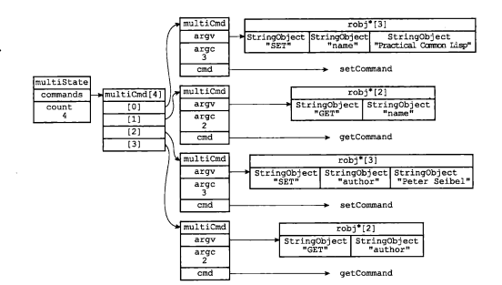
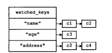

## Redis的事务

可以一次执行多个命令，本质是一组命令的集合。一个事物中的所有命令都会被序列化，按顺序的串行执行而不会被其他命令插入，不许加塞。

### 常用命令

| 命令            | 描述                                                         |
| --------------- | ------------------------------------------------------------ |
| multi           | 标记一个事务的开始                                           |
| exec            | 执行所有事务块内的命令                                       |
| discard         | 取消事务，放弃执行事务块内的所有命令                         |
| watch key [key] | 监视一个(或多个) key ，如果在事务执行之前这个(或这些) key 被其他命令所改动，那么事务将被打断。 |
| unwatch         | 取消watch命令对所有 key 的监视。                             |


### 3阶段

开启:以multi开启事务

入队:将多个命令入队到事务中,接到这些命令不会立刻执行,而是放到等待执行的事务队列里面

执行：有exec命令触发事务


### 事务队列

如果客户端发送的命令为**EXEC、DISCARD、WATCH、MULTI**四个命令的其中一个。那么服务器立即执行这个命令；与此相反，如果客户端发送的命令是EXEC、DISCARD、WATCH、MULTI四个命令以外的其他命令，那么服务器并不立即执行这个命令，而是将这个命令放入一个事务队列里面,然后向客户端返回QUEUED回复。

每一个Redis客户端都有自己的事务状态：

```c
typedef struct client {
    //....
    multiState mstate;      /* MULTI/EXEC state 事务状态*/
    //...
}
```

事务状态包含一个事务队列以及一个命令计数器：

```c
typedef struct multiState {
    multiCmd *commands;    //事务队列，FIFO
    int count;             //计数器
    int cmd_flags;          /* The accumulated command flags OR-ed together.
                               So if at least a command has a given flag, it
                               will be set in this field. */
    int minreplicas;        /* MINREPLICAS for synchronous replication */
    time_t minreplicas_timeout; /* MINREPLICAS timeout as unixtime. */
} multiState;
```

事务队列是一个multiCmd类型的数组，数组中的每个multiCmd结构都保存了一个已入队命令的相关信息，包括指向命令实现函数的指针、命令的参数，以及参数的数量：

```c
typedef struct multiCmd {
    robj **argv;  //命令的参数
    int argc;  //参数数量
    struct redisCommand *cmd; //指向命令实现函数的指针
} multiCmd;
```

<center></center>


### 例子

1. **正常执行**

   

2. **放弃事务**

   

   

3. <span id="yuan"><b>冤头债主</b></span>


### Watch监控

watch指令，`类似乐观锁`，WATCH命令是一个乐观锁（ optimistic locking)，它可以在EXEC命令执行之前，监视任意数量的数据库键，并在EXEC命令执行时，检查被监视的键是否至少有一个已经被修改过了，如果key的值已经被修改了，那么**整个事务队列都不会被执行**，同时返回一个Nullmulti-bulk应答以通知调用者事务执行失败。

注意：**一旦执行了exec或者discard，之前加的所有监控锁都会被取消掉了。**

例子：

- 初始化信用卡的可用余额和欠额

  

- 无加塞篡改

  

- 有加塞篡改，当watch的key被修改，后面的那个事务全部执行失败

  

- unwatch

  


每个Redis数据库都保存着一个watched_keys字典，这个字典的键是某个被WATCH命令监视的数据库键，而字典的值则是一个链表，链表中记录了所有监视相应数据库键的客户端：

```c
typedef struct redisDb {
    dict *dict;                 /* The keyspace for this DB */
    dict *expires;              /* Timeout of keys with a timeout set 用来存放key的过期时间。*/
    dict *blocking_keys;        /* Keys with clients waiting for data (BLPOP)* 处于阻塞状态的键和相应的client（主要用于List类型的阻塞操作）/
    dict *ready_keys;           /* Blocked keys that received a PUSH 准备好数据可以解除阻塞状态的键和相应的client*/
    dict *watched_keys;         /* WATCHED keys for MULTI/EXEC CAS 被watch命令监控的key和相应client */
    int id;                     /* Database ID 数据库ID标识*/
    long long avg_ttl;          /* Average TTL, just for stats 数据库内所有键的平均TTL（生存时间） */
    list *defrag_later;         /* List of key names to attempt to defrag one by one, gradually. */
} redisDb;
```

<center></center>

客户端c1和c2正在监视键“name"；客户端c3正在监视键"age"；客户端c2和c4正在监视键"address"。

所有对数据库进行修改的命令，比如 SET、LPUSH、SADD、ZREM、DEL、FLUSHDB等等，在执行之后都会调用multi.c/touchwatchKey函数对watched_keys字典进行检查，查看是否有客户端正在监视刚刚被命令修改过的数据库键，如果有的话，那么touchwatchKey函数会将监视被修改键的客户端的**REDIS_DIRTY_CAS**标识打开，表示该客户端的事务安全性已经被破坏。


### ACID

原子性：redis的事务具有部分原子性，事务队列中的命令要么全部执行，要么都不执行，但Redis的事务和传统的关系型数据库事务的最大区别在于，Redis不支持事务回滚机制( rollback )，即使事务队列中的某个命令在执行期间出现了错误，整个事务也会继续执行下去，直到将事务队列中的所有命令都执行完毕为止。Redis的作者在事务功能的文档中解释说，不支持事务回滚是因为这种复杂的功能和Redis追求简单高效的设计主旨不相符，并且他认为，**Redis事务的执行时错误通常都是编程错误产生的，这种错误通常只会出现在开发环境中，而很少会在实际的生产环境中出现**，所以他认为没有必要为Redis开发事务回滚功能。

一致性：redis并不具有一致性，因为redis舍弃了回滚，错误的命令并不会影响事务的执行。

隔离性：redis没有隔离级别的概念，因为redis是单线程的执行，且服务器保证事务执行期间不会被打断。（其实就相当于mysql中的串行化隔离级别）

持久性：redis具有持久性，包括RDB和AOF两种持久化方式。