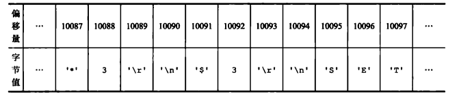
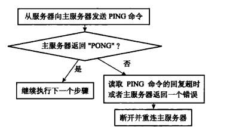

## Redis的复制（Master/Slave）

就是我们常说的主从复制，主机数据更新后根据配置和策略，自动同步到备机的master/slaver机制，Master以写为主，Slave以读为主。

### 旧版复制功能的实现

Redis 的复制功能分为同步( sync)和命令传播（ command propagate）两个操作：

- 同步操作用于将从服务器的数据库状态更新至主服务器当前所处的数据库状态。
- 命令传播操作则用于在主服务器的数据库状态被修改，导致主从服务器的数据库状态出现不一致时,让主从服务器的数据库重新回到一致状态。

**同步：**

当客户端向从服务器发送SLAVEOF命令，要求从服务器复制主服务器时，从服务器首先需要执行同步操作，也即是，将从服务器的数据库状态更新至主服务器当前所处的数据库状态。

从服务器对主服务器的同步操作需要通过向主服务器发送SYNC命令来完成，以下是SYNC命令的执行步骤：

2. 收到SYNC命令的主服务器执行BGSAVE命令，在后台生成一个RDB文件，并使用一个缓冲区记录从现在开始执行的所有写命令。
3. 当主服务器的BGSAVE命令执行完毕时，主服务器会将BGSAVE命令生成的RDB文件发送给从服务器。
4. 从服务器接收并载人这个RDB文件，将自己的数据库状态更新至主服务器执行BGSAVE命令时的数据库状态。
5. 主服务器将记录在缓冲区里面的所有写命令发送给从服务器，从服务器执行这些写命令，将自己的数据库状态更新至主服务器数据库当前所处的状态。

**命令传播：**

在同步操作执行完毕之后，主从服务器两者的数据库将达到一致状态，但这种一致并不是一成不变的，每当主服务器执行客户端发送的写命令时，主服务器的数据库就有可能会被修改，并导致主从服务器状态不再一致。

为了让主从服务器再次回到一致状态，主服务器需要对从服务器执行命令传播操作:主服务器会将自己执行的写命令，也即是造成主从服务器不一致的那条写命令，发送给从服务器执行，当从服务器执行了相同的写命令之后，主从服务器将再次回到一致状态。

旧版复制有些缺陷，如果时初次复制的话没问题，但如果是断线后重复制的话，只有后面部分数据不一致，如果进行同步的话虽然也能回到一致性状态，但效率却非常低。


### 新版复制功能的实现

从Redis2.8开始，使用PSYNC命令代替SYNC命令来执行复制时的同步操作。PSYNC命令具有完整重同步( full resynchronization)和部分重同步( partial resynchronization)两种模式：

- 其中**完整重同步**用于处理初次复制情况:完整重同步的执行步骤和SYNC命令的执行步骤基本一样，它们都是通过让主服务器创建并发送RDB文件，以及向从服务器发送保存在缓冲区里面的写命令来进行同步。
- 而**部分重同步**则用于处理断线后重复制情况：当从服务器在断线后重新连接主服务器时，如果条件允许，主服务器可以将主从服务器连接断开期间执行的写命令发送给从服务器，从服务器只要接收并执行这些写命令，就可以将数据库更新至主服务器当前所处的状态。


### PSYNC命令

PSYNC命令的调用方法有两种：

- 如果从服务器以前没有复制过任何主服务器，或者之前执行过SLAVEOF no one命令，那么从服务器在开始一次新的复制时将向主服务器发送PSYNC ? -1命令，主动请求主服务器进行完整重同步（因为这时不可能执行部分重同步)。
- 相反地，如果从服务器已经复制过某个主服务器，那么从服务器在开始一次新的复制时将向主服务器发送PSYNC \<runid> \<offset>命令：其中runid是上一次复制的主服务器的运行ID，而offset则是从服务器当前的复制偏移量，接收到这个命令的主服务器会通过这两个参数来判断应该对从服务器执行哪种同步操作。

根据情况，接收到PSYNC命令的主服务器会向从服务器返回以下三种回复的其中一种：

- 如果主服务器返回+FULLRESYNC \<runid> \<offset>回复，那么表示主服务器将与从服务器执行完整重同步操作:其中runid是这个主服务器的运行ID，从服务器会将这个ID保存起来，在下一次发送PSYNC命令时使用;而offset则是主服务器当前的复制偏移量，从服务器会将这个值作为自己的初始化偏移量。
- 如果主服务器返回+CONTINUE回复，那么表示主服务器将与从服务器执行部分重同步操作，从服务器只要等着主服务器将自己缺少的那部分数据发送过来就可以了。
- 如果主服务器返回–ERR回复，那么表示主服务器的版本低于Redis 2.8，它识别不了PSYNC命令，从服务器将向主服务器发送SYNC命令，并与主服务器执行完整同步操作。


### 部分重同步的实现

部分重同步功能由以下三个部分构成：

- 主服务器的复制偏移量( replication offset）和从服务器的复制偏移量；
- 主服务器的复制积压缓冲区（ replication backlog )；
- 服务器的运行ID ( run ID )。

#### 复制偏移量

执行复制的双方——主服务器和从服务器会分别维护一个复制偏移量：

- 主服务器每次向从服务器传播N个字节的数据时，就将自己的复制偏移量的值加上N。
- 从服务器每次收到主服务器传播来的N个字节的数据时,就将自己的复制偏移量的值加上N。

通过对比主从服务器的复制偏移量，程序可以很容易地知道主从服务器是否处于一致状态：

- 如果主从服务器处于一致状态，那么主从服务器两者的偏移量总是相同的。
- 相反，如果主从服务器两者的偏移量并不相同，那么说明主从服务器并未处于一致状态。

#### 复制积压缓冲区

复制积压缓冲区是由主服务器维护的一个固定长度(fixed-size)先进先出(FIFO)队列，默认大小为1MB。

当主服务器进行命令传播时，它不仅会将写命令发送给所有从服务器，还会将写命令入队到复制积压缓冲区中。会为队列中的每个字节记录相应的复制偏移量。

<center></center>

当从服务器重新连上主服务器时，从服务器会通过PSYNC命令将自己的复制偏移量offset 发送给主服务器，主服务器会根据这个复制偏移量来决定对从服务器执行何种同步操作：

- 如果offset 偏移量之后的数据（也即是偏移量offset+1开始的数据）仍然存在于复制积压缓冲区里面，那么主服务器将对从服务器执行部分重同步操作。
- 相反，如果offset偏移量之后的数据已经不存在于复制积压缓冲区，那么主服务器将对从服务器执行完整重同步操作。

#### 服务器运行ID

每个Redis服务器，不论主服务器还是从服务，都会有自己的运行ID。运行ID在服务器启动时自动生成，由40个随机的十六进制字符组成，例如53b9b28df8042fdc9ab5e3fcbbbabff1d5dce2b3。

当从服务器对主服务器进行初次复制时，主服务器会将自己的运行ID传送给从服务器，而从服务器则会将这个运行D保存起来。

当从服务器断线并重新连上一个主服务器时，从服务器将向当前连接的主服务器发送之前保存的运行ID：

- 如果从服务器保存的运行ID和当前连接的主服务器的运行ID相同，那么说明从服务器断线之前复制的就是当前连接的这个主服务器，主服务器可以继续尝试执行部分重同步操作。
- 相反地，如果从服务器保存的运行D和当前连接的主服务器的运行ID并不相同，那么说明从服务器断线之前复制的主服务器并不是当前连接的这个主服务器，主服务器将对从服务器执行完整重同步操作。


### 复制的实现(主从)

实现复制主要分为七个步骤：

1. 设置主服务器的地址和端口
2. 建立套接字连接
3. 发送ping命令
4. 身份验证
5. 发送端口信息
6. 同步
7. 命令传播

(1) **设置主服务器的地址和端口**

当客户端向从服务器发送命令：**SLAVEOF <master_ip>  <master_port>**。从服务器首先要做的就是将客户端给定的主服务器IP地址以及端口保存到**redisServer**的masterhost属性和 masterport属性里面。

SLAVEOF命令是一个异步命令，在完成masterhost属性和masterport属性的设置工作之后，从服务器将向发送SLAVEOF命令的客户端返回OK，表示复制指令已经被接收，而实际的复制工作将在OK返回之后才真正开始执行。

(2) **建立套接字连接**

在SLAVEOF命令执行之后，从服务器将根据命令所设置的IP地址和端口，**创建连向主服冬器的套接字连接**。如果从服务器创建的套接字能成功连接(connect）到主服务器，那么从服务器将为这个套接字关联一个专门用于**处理复制工作的文件事件处理器**，这个处理器将负责执行后续的复制工作，比如接收RDB文件，以及接收主服务器传播来的写命令，诸如此类。

而主服务器在接受(accept)从服务器的套接字连接之后，将**为该套接字创建相应的客户端状态，并将从服务器看作是一个连接到主服务器的客户端来对待**。这时从服务器将同时具有服务器(server)和客户端(client)两个身份：从服务器可以向主服务器发送命令请求，而主服务器则会向从服务器返回命令回复。

(3) **发送ping命令**

从服务器成为主服务器的客户端之后，做的第一件事就是向主服务器发送一个PING命令，这个PING命令有两个作用：

- 虽然主从服务器成功建立起了套接字连接，但双方并未使用该套接字进行过任何通信，通过发送PING命令可以**检查套接字的读写状态是否正常**。
- 因为复制工作接下来的几个步骤都必须在主服务器可以正常处理命令请求的状态下才能进行,通过发送PING命令可以**检查主服务器能否正常处理命令请求**。

从服务器在发送PING命令之后将遇到以下三种情况的其中一种：

- 如果主服务器向从服务器返回了一个命令回复，但从服务器却不能在规定的时限(timeout)内读取出命令回复的内容，那么表示主从服务器之间的网络连接状态不佳，不能继续执行复制工作的后续步骤。当出现这种情况时，从服务器断开并重新创建连向主服务器的套接字。
- 如果主服务器向从服务器返回一个错误，那么表示主服务器暂时没办法处理从服务器的命令请求，不能继续执行复制工作的后续步骤。当出现这种情况时，从服务器断开并重新创建连向主服务器的套接字。比如说，如果主服务器正在处理一个超时运行的脚本，那么当从服务器向主服务器发送 PING命令时，从服务器将收到主服务器返回的BUSY Redisis busy running a script. You can only calls CRIPT KILL or SHUTDOWN NOSAVE.错误。
- 如果从服务器读取到"PONG"回复，那么表示主从服务器之间的网络连接状态正常,并且主服务器可以正常处理从服务器（客户端）发送的命令请求，在这种情况下，从服务器可以继续执行复制工作的下个步骤。

<center></center>


(4) **身份验证**

从服务器在收到主服务器返回的"PONG”回复之后，下一步要做的就是决定是否进行身份验证：

- 如果从服务器设置了masterauth选项,那么进行身份验证。
- 如果从服务器没有设置masterauth选项，那么不进行身份验证。

从服务器在身份验证阶段可能遇到的情况有以下几种：

- 如果主服务器没有设置requirepass选项，并且从服务器也没有设置masterauth选项，那么主服务器将继续执行从服务器发送的命令，复制工作可以继续进行。
- 如果从服务器通过AUTH命令发送的密码和主服务器requirepass选项所设置的密码相同，那么主服务器将继续执行从服务器发送的命令，复制工作可以继续进行。与此相反，如果主从服务器设置的密码不相同，那么主服务器将返回一个invalidpassword错误。
- 如果主服务器设置了requirepass选项，但从服务器却没有设置masterauth选项，那么主服务器将返回一个NOAUTH错误。另一方面，如果主服务器没有设置requirepass选项，但从服务器却设置了masterauth选项，那么主服务器将返回一个no password is set错误。


(5) **发送端口信息**

在身份验证步骤之后，从服务器将执行命令REPLCONF listening-port  \<port-number>，向主服务器发送从服务器的监听端口号。

主服务器在接收到这个命令之后，会将端口号记录在从服务器所对应的客户端状态的slave_listening_port属性中:

```c
typedef struct client {
    ...
    int slave_listening_port; /* As configured with: SLAVECONF listening-port */
    ...
} client;
```

slave_ listening _ port属性目前唯一的作用就是在主服务器执行INFO replication命令时打印出从服务器的端口号。


(6) **同步**

在这一步，从服务器将向主服务器发送PSYNC命令，执行同步操作，并将自己的数据库更新至主服务器数据库当前所处的状态。

值得一提的是，**在同步操作执行之前，只有从服务器是主服务器的客户端，但是在执行同步操作之后,主服务器也会成为从服务器的客户端**：

- 如果PSYNC命令执行的是完整重同步操作，那么主服务器需要成为从服务器的客户端,才能将保存在缓冲区里面的写命令发送给从服务器执行。
- 如果PSYNC命令执行的是部分重同步操作，那么主服务器需要成为从服务器的客户端，才能向从服务器发送保存在复制积压缓冲区里面的写命令。

正因为双方都是对方的客户端，它们可以互相向对方发送命令请求，或者互相向对方返回命令回复。这也是命令传播操作的基础。


(7)**命令传播**

当完成了同步之后，主从服务器就会进入命令传播阶段，这时主服务器只要一直将自己执行的写命令发送给从服务器，而从服务器只要一直接收并执行主服务器发来的写命令，就可以保证主从服务器一直保持一致了。


### 心跳检测

在命令传播阶段，从服务器默认会以每秒一次的频率，向主服务器发送命令：

```bash
REPLCONF ACK <replication_offset>
```

其中replication_offset是从服务器当前的复制偏移量。

发送REPLCONF ACK命令对于主从服务器有三个作用：

- 检测主从服务器的网络连接状态：如果主服务器超过一秒钟没有收到从服务器发来的REPLCONF ACK命令，那么主服务器就知道主从服务器之间的连接出现问题了。

- 辅助实现min-slaves 选项：Redis 的min-slaves-to-write和min-slaves-max-lag两个选项可以防止主服务器在不安全的情况下执行写命令。

  举个例子，如果我们向主服务器提供以下设置：

  ```c
  min-slaves-to-write 3
  min-slaves-max-lag 10
  ```

  那么在从服务器的数量少于3个，或者三个从服务器的延迟(lag)值都大于或等于10秒时，主服务器将拒绝执行写命令，这里的延迟值就是上面提到的INFO replication命令的lag值。

- 检测命令丢失。如果因为网络故障，主服务器传播给从服务器的写命令在半路丢失，那么当从服务器向主服务器发送 REPLCONF ACK命令时，主服务器将发觉从服务器当前的复制偏移量少于自己的复制偏移量，然后主服务器就会根据从服务器提交的复制偏移量，在复制积压缓冲区里面找到从服务器缺少的数据,并将这些数据重新发送给从服务器。


>REPLCONF ACK命令和复制积压缓冲区都是Redis 2.8版本新增的，在Redis 2.8版本以前，即使命令在传播过程中丢失，主服务器和从服务器都不会注意到，主服务器更不会向从服务器补发丢失的数据，所以为了保证复制时主从服务器的数据一致性，**最好使用2.8或以上版本的 Redis**。


### 设置主从

配从(库)不配主(库)

从库配置

```shell
#配置从库
slaveof 主库ip 主库端口
#查看主从信息
info replication
```

每次与master断开后，都需要重新连接，除非你配置进redis.conf文件

### 常用的主从方式

####  一主二仆

含义：就是一个Master两个Slave


通过`info replication`查看主从信息

```shell
# Replication
role:master
connected_slaves:0
master_replid:f6baff9abfda12ca58048cfce4b0e2c1f4683da1
master_replid2:e8fe596d47d9d1d923d56d884b28128b78d2c1e0
master_repl_offset:0
second_repl_offset:1
repl_backlog_active:0
repl_backlog_size:1048576
repl_backlog_first_byte_offset:0
repl_backlog_histlen:0
```

```shell
# Replication
role:slave
master_host:127.0.0.1
master_port:6379
master_link_status:down
master_last_io_seconds_ago:-1
master_sync_in_progress:0
slave_repl_offset:0
master_link_down_since_seconds:1585217521
slave_priority:100
slave_read_only:1
connected_slaves:0
master_replid:adbec19afa734e84a333b07ea2f33c43c73fe743
master_replid2:0000000000000000000000000000000000000000
master_repl_offset:0
second_repl_offset:-1
repl_backlog_active:0
repl_backlog_size:1048576
repl_backlog_first_byte_offset:0
repl_backlog_histlen:0
```


<span id="zhuyi">注意:</span>

1. 第一次slave1 和slave2切入点，是全量复制，之后是增量复制

   

2. 主机可以写，但是从机不可以写，从机只能读

   

3. 主机shutdowm后从机待机状态，等主机回来后，主机新增记录从机可以顺利复制 

4. 从机shutdowm后，每次与master断开之后，都需要重新连接，除非你配置进redis.conf文件

5. 从机复制到的数据，会被本机持久化。就算shutdown断开连接依然会有数据。

6. 重新连接或者变更master，会清除之前的数据，重新建立拷贝最新的数据

   

#### 薪火相传

含义:就是上一个Slave可以是下一个slave的Master，Slave同样可以接收其他slaves的连接和同步请求，那么该slave作为了链条中下一个的master,可以有效减轻master的写压力。


`注意事项和一主二仆差不多,但注意虽然有slave是相对master，但是依然是slave`    [查看](#zhu yi)


####  反客为主

```shell    
SLAVEOF no one
```

 使当前数据库停止与其他数据库的同步，转成主数据库


#### 哨兵模式（sentinel）

反客为主的自动版，能够后台监控Master库是否故障，如果故障了根据投票数自动将slave库转换为主库。一组sentinel能

同时监控多个Master。

使用步骤：

1. 在Master对应redis.conf同目录下新建sentinel.conf文件，名字绝对不能错；

2. 配置哨兵，在sentinel.conf文件中填入内容(可以配置多个)：

   ```shell
   #说明：最后一个数字1，表示主机挂掉后slave投票看让谁接替成为主机，得票数多少后成为主机。
   sentinel monitor 被监控数据库名字（自己起名字） ip port 1
   ```

3. 启动哨兵模式(路径按照自己的需求进行配置)：

   ```shell
   redis-sentinel  /myredis/sentinel.conf
   ```


注意：

1. 当master挂掉后，会通过选票进行选出下一个master。而且只有使用了sentinel.conf启动的才能开启选票

2. 当原来的master后来后，很不幸变成了slave。


### 命令

| 命令                                                         | 作用                                             |
| ------------------------------------------------------------ | ------------------------------------------------ |
| slaveof 主库ip  主库端口                                     | 配置从库                                         |
| info replication                                             | 查看redis主从复制的情况                          |
| slaveof  no one                                              | 使当前数据库停止与其他数据库的同步，转成主数据库 |
| sentinel monitor 被监控数据库名字(自己起名字) 127.0.0.1 6379 1 | 配置哨兵，监视master                             |
| redis-sentinel /myredis/sentinel.conf                        | 以哨兵模式启动redis                              |

