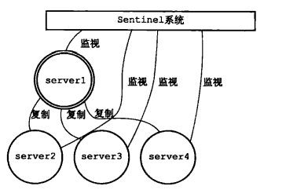
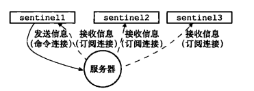
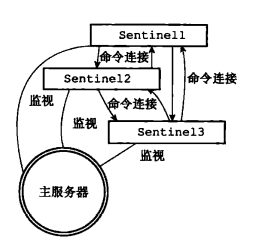
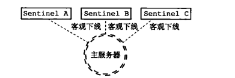
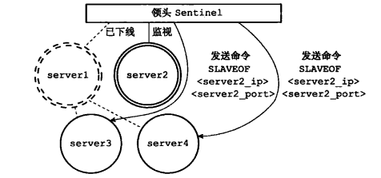

## Sentinel

sentinel(哨兵)是Redis的高可用性解决方案：由一个或多个Sentinel实例（ instance）组成的Sentinc1系统( system)可以监视任意多个主服务器，以及这些主服务器属下的所有从服务器，并在被监视的主服务器进入下线状态时，自动将下线主服务器属下的某个从服务器升级为新的主服务器，然后由新的主服务器代替已下线的主服务器继续处理命令请求。

<center></center>

如果主服务器server1进入下线状态，那么从服务器server2、server3、server4对主服务器的复制操作将被中止，并且 Sentinel系统会察觉到server1 已下线。

当server1的下线时长超过用户设定的下线时长上限时，Sentinel系统就会对server1执行故障转移操作:

- 首先，**Sentinel系统会挑选server1属下的其中一个从服务器**，并将这个被选中的从服务器升级为新的主服务器。
- 之后，**Sentinel系统会向server1属下的所有从服务器发送新的复制指令，让它们成为新的主服务器的从服务器**，当所有从服务器都开始复制新的主服务器时，故障转移操作执行完毕。
- 另外，**Sentinel还会继续监视已下线的server1**，并在它重新上线时，将它设置为新的主服务器的从服务器。

### 启动并初始化sentinel

启动一个Sentinel可以使用命令：

```c
redis-sentinel /path/tolyour/sentine1.conf
    或
redis-server /path/tol your/sentinel.conf --sentinel
```

这两个命令的效果完全相同。当一个Sentinel启动时,它需要执行以下步骤：

1. 初始化服务器；
2. 判断sentinel模式；
3. 将普通Redis服务器使用的代码替换成Sentinel专用代码；
4. 根据给定的配置文件，初始化Sentinel的监视主服务器列表；
5. 启动哨兵实例；
6. 创建连向主服务器的网络连接。


**(1) 初始化服务器**

Sentinel本质上就是一个运行在特殊模式下的Redis服务器，因此就是初始化一个普通的Redis服务器。

不过，因为Sentinel执行的工作和普通Redis服务器执行的工作不同，所以Sentinel的初始化过程和普通Redis服务器的初始化过程并不完全相同。

例如，普通服务器在初始化时会通过载入RDB文件或者AOF文件来还原数据库状态，但是因为Sentinel并不使用数据库，所以初始化Sentinel时就不会载入RDB文件或者AOF文件。

**(2) 判断sentinel模式**

main 函数在调用 initServerConfig 函数初始化各种配置项之前，会调用 **checkForSentinelMode** 函数，来判断当前运行的是否为哨兵实例，如下所示：

```c
//检验是否为sentinel模式
server.sentinel_mode = checkForSentinelMode(argc,argv);
//初始化服务器配置
initServerConfig();
```

checkForSentinelMode 函数（在 server.c 文件中）的参数，是 main 函数收到的启动命令字符串 argv 和启动命令中的参数个数 argc。然后，它会根据以下两个条件判断当前是否运行了哨兵实例。

- 条件一：执行的命令本身，也就是 argv[0]，是否为“redis-sentinel”；
- 条件二：执行的命令参数中，是否有“–sentinel”。

```c
/* Returns 1 if there is --sentinel among the arguments or if
 * argv[0] contains "redis-sentinel". */
int checkForSentinelMode(int argc, char **argv) {
    int j;
    // 第一个判断条件，判断执行命令本身是否为redis-sentinel
    if (strstr(argv[0],"redis-sentinel") != NULL) return 1;
    for (j = 1; j < argc; j++)
        // 第二个判断条件，判断命令参数是否有"--sentienl"
        if (!strcmp(argv[j],"--sentinel")) return 1;
    return 0;
}
```

其实，这两个判断条件也就对应了我们在命令行启动哨兵实例的两种方式，一种是直接运行 redis-sentinel 命令，另一种是运行 redis-server 命令，但是带有“–sentinel”参数。

所以，如果这两个条件中有一个成立，那么全局变量 server 的成员变量 sentinel_mode，就会被设置为 1，表明当前运行的是哨兵实例。这样一来，server.sentinel_mode 这一配置项就会在源码的其他地方，被用来判断当前是否运行的是哨兵实例。

**(3) 使用Sentinel专用代码并初始化Sentinel状态**

使用Sentinel专用代码即将普通Redis服务器使用的代码替换成Sentinel专用代码。比如：

- 普通Redis服务器使用redis.h/REDIS_SERVERPORT(6379)常量的值作为服务器端口，而Sentinel则使用sentinel.c/REDIS__SENTINEL_PORT(26379)常量的值作为服务器端口。
- 普通Redis服务器使用redis.c/redisCommandTable作为服务器的命令表，而Sentinel则使用sentinel.c/**sentinelcmds**作为服务器的命令表，并且其中的INFO命令会使用Sentinel模式下的专用实现sentinel.c/**sentinelInfoCommand**函数，而不是普通Redis服务器使用的实现redis.clinfoCommand函数。

初始化Sentinel状态就是初始化sentinelState构造体。

主要是通过sentinel.c中的两个函数initSentinelConfig和initSentinel来实现：

```c
int main(int argc, char **argv) {
    ...
    if (server.sentinel_mode) {
        initSentinelConfig();
        initSentinel();
    }
    ...
}

void initSentinelConfig(void) {
    //#define REDIS_SENTINEL_PORT 26379
    server.port = REDIS_SENTINEL_PORT;
    server.protected_mode = 0; /* Sentinel must be exposed. */
}

/* Perform the Sentinel mode initialization. */
void initSentinel(void) {
    unsigned int j;
    /* Remove usual Redis commands from the command table, then just add
     * the SENTINEL command. */
    dictEmpty(server.commands,NULL);
    for (j = 0; j < sizeof(sentinelcmds)/sizeof(sentinelcmds[0]); j++) {
        int retval;
        struct redisCommand *cmd = sentinelcmds+j;

        retval = dictAdd(server.commands, sdsnew(cmd->name), cmd);
        serverAssert(retval == DICT_OK);
    }

    /* Initialize various data structures. */
    sentinel.current_epoch = 0;
    sentinel.masters = dictCreate(&instancesDictType,NULL);
    sentinel.tilt = 0;
    sentinel.tilt_start_time = 0;
    sentinel.previous_time = mstime();
    sentinel.running_scripts = 0;
    sentinel.scripts_queue = listCreate();
    sentinel.announce_ip = NULL;
    sentinel.announce_port = 0;
    sentinel.simfailure_flags = SENTINEL_SIMFAILURE_NONE;
    sentinel.deny_scripts_reconfig = SENTINEL_DEFAULT_DENY_SCRIPTS_RECONFIG;
    memset(sentinel.myid,0,sizeof(sentinel.myid));
}
```

**initSentinelConfig 函数主要是将当前 server 的端口号，改为哨兵实例专用的端口号 REDIS_SENTINEL_PORT**。这是个宏定义，它对应的默认值是 26379。另外，这个函数还会把 server 的 protected_mode 设置为 0，即允许外部连接哨兵实例，而不是只能通过 127.0.0.1 本地连接 server；

initSentinel 函数是在 **initSentinelConfig** 函数的基础上，进一步完成哨兵实例的初始化，这其中主要包括两部分工作：

1）**替换 server 能执行的命令表**，普通Redis服务器使用redis.c/redisCommandTable作为服务器的命令表，而Sentinel则使用sentinel.c/**sentinelcmds**作为服务器的命令表：

```c
struct redisCommand sentinelcmds[] = {
    {"ping",pingCommand,1,"",0,NULL,0,0,0,0,0},
    {"sentinel",sentinelCommand,-2,"",0,NULL,0,0,0,0,0},
    {"subscribe",subscribeCommand,-2,"",0,NULL,0,0,0,0,0},
    {"unsubscribe",unsubscribeCommand,-1,"",0,NULL,0,0,0,0,0},
    {"psubscribe",psubscribeCommand,-2,"",0,NULL,0,0,0,0,0},
    {"punsubscribe",punsubscribeCommand,-1,"",0,NULL,0,0,0,0,0},
    {"publish",sentinelPublishCommand,3,"",0,NULL,0,0,0,0,0},
    {"info",sentinelInfoCommand,-1,"",0,NULL,0,0,0,0,0},
    {"role",sentinelRoleCommand,1,"l",0,NULL,0,0,0,0,0},
    {"client",clientCommand,-2,"rs",0,NULL,0,0,0,0,0},
    {"shutdown",shutdownCommand,-1,"",0,NULL,0,0,0,0,0},
    {"auth",authCommand,2,"sltF",0,NULL,0,0,0,0,0}
};
```

sentinelcmds命令表也解释了为什么在Sentinel模式下，Redis服务器不能执行诸如SET、DBSIZE、EVAL等等这些命令，因为服务器根本没有在命令表中载入这些命令。

其中你需要注意的是，哨兵实例执行的一些命令，其名称虽然和 Redis 实例命令表中的命令名称一样，但它们的实现函数是针对哨兵实例专门实现的。比如，哨兵实例和 Redis 实例都可以执行 publish、info、role 命令，但是在哨兵实例中，这三个命令分别由 sentinelPublishCommand、sentinelInfoCommand、sentinelRoleCommand 这三个在 sentinel.c 文件中的函数来实现的。所以，当你需要详细了解哨兵实例运行命令的实现时，注意不要找错代码文件。

2）其次，initSentinel 函数在替换了命令表后，紧接着它会开始**初始化哨兵实例用到的各种属性信息**。为了保存这些属性信息，哨兵实例定义了 **sentinelState** 结构体（在 sentinel.c 文件中），这其中包括了哨兵实例的 ID、用于故障切换的当前纪元、监听的主节点、正在执行的脚本数量，以及与其他哨兵实例发送的 IP 和端口号等信息。

```c
struct sentinelState {
    char myid[CONFIG_RUN_ID_SIZE+1];  //哨兵实例ID
    uint64_t current_epoch;         //当前纪元
    dict *masters;      //保存当前监听的主节点实例，key为实例id，value为实例指针,指向一个sentinelRedisInstance
    int tilt;           //是否处于TILT模式
    int running_scripts;    //运行的脚本个数
    mstime_t tilt_start_time;  //tilt模式的起始时间
    mstime_t previous_time;     //上一次执行时间处理函数的时间
    list *scripts_queue;         //用于保存脚本的队列
    char *announce_ip;  //向其他哨兵实例发送的IP信息
    int announce_port;  //向其他哨兵实例发送的端口号
    unsigned long simfailure_flags; /* Failures simulation. */
    int deny_scripts_reconfig; /* Allow SENTINEL SET ... to change script
                                  paths at runtime? */
} sentinel;
```


**(4) 根据给定的配置文件，初始化Sentinel的监视主服务器列表**

redis的main函数中，会调用 loadServerConfig 加载配置文件，loadServerConfig 函数会读取配置文件中的内容，然后调用 loadServerConfigFromString 函数解析具体的配置项。

loadServerConfigFromString 函数中，其中有一个分支，对哨兵模式进行了判断，如果是哨兵模式，则调用 sentinelHandleConfiguration 函数解析哨兵配置项。

所以，函数调用链为 main -> loadServerConfig（读出配置文件内容） -> loadServerConfigFromString（解析配置项） -> sentinelHandleConfiguration（解析哨兵配置项）。

简单看下sentinel.c#sentinelHandleConfiguration函数的两个解析部分：

```c
//创建监听的master实例
if (!strcasecmp(argv[0],"monitor") && argc == 5) {
    /* monitor <name> <host> <port> <quorum> */
    int quorum = atoi(argv[4]);

    if (quorum <= 0) return "Quorum must be 1 or greater.";
    if (createSentinelRedisInstance(argv[1],SRI_MASTER,argv[2],
                                    atoi(argv[3]),quorum,NULL) == NULL)
    {
        switch(errno) {
            case EBUSY: return "Duplicated master name.";
            case ENOENT: return "Can't resolve master instance hostname.";
            case EINVAL: return "Invalid port number";
        }
    }
}
...
//创建已知的监听同一个master的sentinel实例
else if (!strcasecmp(argv[0],"known-sentinel") &&
         (argc == 4 || argc == 5)) {
    sentinelRedisInstance *si;

    if (argc == 5) { /* Ignore the old form without runid. */
        /* known-sentinel <name> <ip> <port> [runid] */
        ri = sentinelGetMasterByName(argv[1]);
        if (!ri) return "No such master with specified name.";
        if ((si = createSentinelRedisInstance(argv[4],SRI_SENTINEL,argv[2],
                                              atoi(argv[3]), ri->quorum, ri)) == NULL)
        {
            return "Wrong hostname or port for sentinel.";
        }
        si->runid = sdsnew(argv[4]);
        sentinelTryConnectionSharing(si);
    }
}
```


**(5) 启动哨兵实例**

在InitServerLast()后会调用sentinelsRunning来启动哨兵实例：

```c
InitServerLast();
sentinelIsRunning();
```

主要是做了三件事情：

- 首先会确认哨兵实例的配置文件存在并且可以正常写入；
- 然后，它会检查哨兵实例是否设置了 ID。如果没有设置 ID 的话，sentinelIsRunning 函数就会为哨兵实例随机生成一个 ID；
- 最后，sentinelIsRunning 函数会调用 sentinelGenerateInitialMonitorEvents 函数（在 sentinel.c 文件中），给每个被监听的主节点发送事件信息。

```c
/* This function gets called when the server is in Sentinel mode, started,
 * loaded the configuration, and is ready for normal operations. */
// 当服务器处于 Sentinel 模式、启动、加载配置并准备好进行正常操作时，将调用此函数。
void sentinelIsRunning(void) {
    int j;

    /* If this Sentinel has yet no ID set in the configuration file, we
     * pick a random one and persist the config on disk. From now on this
     * will be this Sentinel ID across restarts. */
    // 如果这个 Sentinel 还没有在配置文件中设置 ID，我们随机选择一个并将配置保存在磁盘上。从现在开始，这将是重启后的 Sentinel ID。
    for (j = 0; j < CONFIG_RUN_ID_SIZE; j++)
        if (sentinel.myid[j] != 0) break;

    if (j == CONFIG_RUN_ID_SIZE) {
        /* Pick ID and persist the config. */
        // 生成一个16进制的随机ID，选择 ID 并持久化配置
        getRandomHexChars(sentinel.myid,CONFIG_RUN_ID_SIZE);
        sentinelFlushConfig();
    }

    /* Log its ID to make debugging of issues simpler. */
    // 记录其 ID 以简化问题的调试。
    serverLog(LL_WARNING,"Sentinel ID is %s", sentinel.myid);

    /* We want to generate a +monitor event for every configured master
     * at startup. */
    // 我们希望在启动时为每个配置的 master 生成一个 +monitor 事件。
    sentinelGenerateInitialMonitorEvents();
}
```

sentinelIsRunning 函数是如何获取到主节点的地址信息呢？

这就和刚才介绍的 initSentinel 函数有关了，它会初始化哨兵实例的数据结构 sentinel.masters。这个结构是使用了一个哈希表记录监听的主节点，每个主节点会使用 sentinelRedisInstance 结构来保存。而在 sentinelRedisInstance 结构中，就包含了被监听主节点的地址信息。这个地址信息是由 sentienlAddr 结构体保存的，其中包括了节点的 IP 和端口号。

```c
typedef struct sentinelRedisInstance {
    int flags;      //实例类型、状态的标记，它可以设置为不同的值，从而表示不同类型的实例。比如，当 flags 设置为 SRI_MASTER、SRI_SLAVE 或 SRI_SENTINEL 这三种宏定义（在 sentinel.c 文件中）时，就分别表示当前实例是主节点、从节点或其他sentinel。SRI_MASTER_DOWN表示其它sentinel认为其主节点下线，SRI_S_DOWN当前sentinel认为主节点主观下线，SRI_O_DOWN当前sentinel认为主节点主客观下线
    char *name;     //实例名称
    char *runid;    //实例ID
    uint64_t config_epoch;  //配置的纪元
    sentinelAddr *addr; //实例地址信息
    ...
    mstime_t s_down_since_time; //主观下线的时长
    mstime_t o_down_since_time; //客观下线的时长
    ...
    /*
     * 主节点特有的
     */
    dict *sentinels;    //监听同一个主节点的其他哨兵实例
    dict *slaves;       //主节点的从节点
    unsigned int quorum;  //sentinel leader选举时的阈值
    int parallel_syncs;  //当进行故障转移时，同时只允许parallel_syncs个从节点正在进行同步操作
   ...
}

typedef struct sentinelAddr {
    char *ip;
    int port;
} sentinelAddr;

```

这个 sentinelGenerateInitialMonitorEvents 函数的执行逻辑：

```c
// 此函数仅在启动时调用，用于为每个配置的主站生成 +monitor 事件。
// 当通过 SENTINEL MONITOR 命令在运行时添加要监控的主设备时，也会生成相同的事件
void sentinelGenerateInitialMonitorEvents(void) {
    dictIterator *di;
    dictEntry *de;

    // 获取masters的迭代器
    di = dictGetIterator(sentinel.masters);
    // 获取被监听的主节点
    while((de = dictNext(di)) != NULL) {
        sentinelRedisInstance *ri = dictGetVal(de);
        //发送消息
        sentinelEvent(LL_WARNING,"+monitor",ri,"%@ quorum %d",ri->quorum);
    }
    dictReleaseIterator(di);
}
```

从代码中，你可以看到，**sentinelGenerateInitialMonitorEvents** 函数是调用 **sentinelEvent** 函数（在 sentinel.c 文件中）来实际发送事件信息的。

简单点来说：如果看到 sentinelEvent，这就表明哨兵正在用它来发布消息。具体可以看后面的源码分析部分。


**(6) 创建网络连接**
对于每个被Sentinel监视的主服务器来说，Sentinel会创建两个连向主服务器的异步网络连接：

- 一个是命令连接，这个连接专门用于向主服务器发送命令，并接收命令回复。
- 另一个是订阅连接，这个连接专门用于订阅主服务器的\_sentinel\_:hello频道。

>Q：为什么要两个连接？
>
>A：在Redis目前的发布与订阅功能中，被发送的信息都不会保存在Redis服务器里面，如果在信息发送时，想要接收信息的客户端不在线或者断线，那么这个客户端就会丢失这条信息。因此，为了不丢失\_sentinel\_ :hello频道的任何信息，Sentinel必须专门用一个订阅连接来接收该频道的信息。
>
>另一方面，除了订阅频道之外，Sentinel还必须向主服务器发送命令，以此来与主服务器进行通信，所以Sentinel还必须向主服务器创建命令连接。
>
>因为Sentinel需要与多个实例创建多个网络连接，所以Sentinel使用的是异步连接。
>
>Q：如何创建的？
>
>A：在serverCron中每次会调用sentineltimer，如果链接没有建立，就会进行创建。


### 获取主服务信息

Sentinel默认会以每十秒一次的频率，通过命令连接向被监视的主服务器发送 INFO命令，并通过分析INFO命令的回复来获取主服务器的当前信息。

```c
# server
...
run_id:7611c59dc3a29aa6fa0609f841bb6a1019008a9c
...
# Replication
role:master
...
s1ave0:ip=127.0.0.1,port=11111,state=online,offset=43,lag=0
slave1:ip=127.0.0.1,port=22222,state=online,offset=43,lag-0
slave2:ip=127.0.0.1,port=33333,state=online,offset=43,lag-0
...
# other sections
...
```

主要包含以下信息：

| 参数名      | 说明                                                   |
| :---------- | :----------------------------------------------------- |
| server      | 获取 server 信息                                       |
| clients     | 获取 clients 信息，如客户端连接数等                    |
| memory      | 获取 server 的内存信息，包括当前内存消耗、内存使用峰值 |
| persistence | 获取 server 的持久化配置信息                           |
| stats       | 获取 server 的一些基本统计信息，如处理过的连接数量等   |
| replication | 获取 server 的主从配置信息                             |
| cpu         | 获取 server 的 CPU 使用信息                            |
| keyspace    | 获取 server 中各个 DB 的 key 的数量                    |
| cluster     | 获取集群节点信息，仅在开启集群后可见                   |
| commandstas | 获取每种命令的统计信息                                 |

通过分析主服务器返回的INFO命令回复，Sentinel可以获取以下两方面的信息：

- 一方面是关于主服务器本身的信息，包括**run_id**域记录的服务器运行ID，以及**role域**记录的服务器角色；
- 另一方面是关于**主服务器属下所有从服务器的信息**，每个从服务器都由一个"slave"字符串开头的行记录，每行的ip=域记录了从服务器的P地址，而port=域则记录了从服务器的端口号。根据这些IP地址和端口号，Sentinel无须用户提供从服务器的地址信息，就可以自动发现从服务器。

**根据run_id域和role域记录的信息，Sentinel将对主服务器的实例结构进行更新。至于主服务器返回的从服务器信息，则会被用于更新主服务器实例结构的slaves字典**，这个字典记录了主服务器属下从服务器的名单：

- 字典的键是由Sentinel自动设置的从服务器名字，格式为ip:port，字典的值则是从服务器对应的实例结构。比如说，如果键是127.0.0.1:11111，那么这个键的值就是P地址为127.0.0.1，端口号为11111的从服务器的实例结构。
- 如果从服务器对应的实例结构已经存在，那么Sentinel对从服务器的实例结构进行更新；如果从服务器对应的实例结构不存在，那么说明这个从服务器是新发现的从服务器，Sentinel 会在slaves字典中为这个从服务器新创建一个实例结构。


### 获取从服务信息

当Sentinel发现主服务器有新的从服务器出现时，Sentinel除了会为这个新的从服务器创建相应的实例结构之外，Sentinel还会创建连接到从服务器的命令连接和订阅连接。

在创建命令连接之后，Sentinel在默认情况下，会以每十秒一次的频率通过命令连接向从服务器发送INFO命令，并获得类似于以下内容的回复：

```c
# Server
...   
run_id:32be0699dd27b410f7c90dada3a6fab17f97899f
...
# Replication
role:slave
master_ host:127.0.o.1master_port : 6379
master_link_status : upslave_repl__offset: 11887slave_priority:10o
other sections
```

根据INFO命令的回复，Sentinel会提取出以下信息：

- 从服务器的运行ID run_id。
- 从服务器的角色role。
- 主服务器的P地址master_host，以及主服务器的端口号master_port。
- 主从服务器的连接状态master_link_status。
- 从服务器的优先级slave_priority。
- 从服务器的复制偏移量slave_repl_offset。

根据这些信息，Sentinel 会对从服务器的实例结构进行更新。


### 向主服务器和从服务器发送信息

在默认情况下，Sentinel会以每两秒一次的频率，通过命令连接向所有被监视的主服务器和从服务器发送以下格式的命令：

```c
PUBLISH_sentinel__:he11o "<s_ip>,<s_port>,<s_runid>,<s_epoch>,<m_name>,<m_ip>,<m_port>,<m_epoch>"
```

这条命令向服务器的\_sentinel\_:hello频道发送了一条信息，信息的内容由多个参数组成：
其中以s\_开头的参数记录的是Sentinel本身的信息，而m\_开头的参数记录的则是主服务器的信息。

>我在看源码的过程中，发现了其实在sentinelTimer的sentinelSendPeriodicCommand中，其实会对已知的所有节点（主、从、sentinel）发布该PUBLISH命令，主、从节点会进入hello频道，而sentinel节点会调用其特定的命令处理函数sentinelPublishCommand来进行处理，且该函数仅仅会处理频道为hello的PUBLISH命令，也是调用sentinelProcessHelloMessage函数进行具体处理，和从hello频道中接收到消息的回调处理函数相同。


### 接收来自主服务器和从服务器的频道信息

每个与Sentinel连接的服务器，Sentinel既通过命令连接向服务器的\_sentinel\_:hello频道发送信息，又通过订阅连接从服务器的\_sentinel_ :hello频道接收信息。

对于监视同一个服务器的多个Sentinel来说，一个Sentinel发送的信息会被其他Sentinel 接收到，这些信息会被用于更新其他Sentinel对发送信息Sentinel的认知，也会被用于更新其他Sentinel对被监视服务器的认知。

<center></center>

当一个Sentinel从\_sentinel\_:hello频道收到一条信息时，Sentinel 会对这条信息进行分析，提取出信息中的Sentinel IP地址、Sentinel 端口号、Sentinel运行ID等八个参数，并进行以下检查：

- 如果信息中记录的Sentinel运行ID和接收信息的 Sentinel的运行ID相同，那么说明这条信息是Sentinel自己发送的，Sentinel将丢弃这条信息，不做进一步处理。
- 相反地，如果信息中记录的Sentinel运行ID和接收信息的Sentinel的运行ID不相同，那么说明这条信息是监视同一个服务器的其他Sentinel发来的，接收信息的Sentinel将根据信息中的各个参数，对相应主服务器的实例结构进行更新。

#### 更新sentinels字典

Sentinel为主服务器创建的实例结构中的sentinels字典保存了除Sentinel本身之外，所有同样监视这个主服务器的其他Sentinel的资料：sentinels字典的键是sentinel的名字(ip:port)，值是sentinel的实例。

当一个Sentinel接收到其他Sentinel发来的信息时，目标Sentinel会从信息中分析并提取出以下两方面参数：

- 与Sentinel有关的参数:源Sentinel的IP地址、端口号、运行ID和配置纪元。
- 与主服务器有关的参数:源Sentinel正在监视的主服务器的名字、I地址、端口号和配置纪元。

根据信息中提取出的主服务器参数，目标Sentinel会在自己的Sentinel状态的**masters字典**中查找相应的主服务器实例结构，然后根据提取出的Sentinel参数，检查主服务器实例结构的sentinels字典中，源Sentinel的实例结构是否存在：

- 如果源Sentinel的实例结构已经存在，那么对源Sentinel的实例结构进行更新。
- 如果源Sentinel的实例结构不存在，那么说明源Sentinel是刚刚开始监视主服务器的新Sentinel，目标Sentinel会为源Sentinel创建一个新的实例结构，并将这个结构添加到sentinels字典里面。

#### 创建连向其他sentinel的命令连接

当Sentinel通过频道信息发现一个新的Sentinel时，它不仅会为新Sentinel在sentinels字典中创建相应的实例结构，还会创建一个连向新Sentinel的命令连接，而新Sentinel也同样会创建连向这个Sentinel的命令连接，最终监视同一主服务器的多个Sentinel将形成相互连接的网络：Sentinel A有连向Sentinel B的命令连接,而Sentinel B也有连向Sentinel A 的命令连接。

<center></center>

**Sentinel 之间不会创建订阅连接**。Sentinel在连接主服务器或者从服务器时，会同时创建命令连接和订阅连接，但是在连接其他Sentinel时，却只会创建命令连接，而不创建订阅连接。这是**因为Sentinel需要通过接收主服务器或者从服务器发来的频道信息来发现未知的新Sentinel**，所以才需要建立订阅连接，而相互已知的Sentinel只要使用命令连接来进行通信就足够了。


#### 检查下线状态

分为检测主观下线状态和检测客观下线状态。

**检测主观下线状态：**

在默认情况下，Sentinel 会以每秒一次的频率向所有与它创建了命令连接的实例（包括主服务器、从服务器、其他Sentinel在内）发送PING命令，并通过实例返回的PING命令回复判断实例是否在线。

实例对PING命令的回复可以分为以下两种情况：

- 有效回复：实例返回+PONG、-LOADING、-MASTERDOWN三种回复的其中一种。
- 无效回复：实例返回除+PONG、-LOADING、-MASTERDOWN三种回复之外的其他回复，或者在指定时限内没有返回任何回复。

Sentinel 配置文件中的down-after-milliseconds选项指定了Sentinel判断实例进入主观下线所需的时间长度：如果一个实例在**down-after-milliseconds**毫秒内，连续向Sentinel返回无效回复，那么Sentinel会修改这个实例所对应的实例结构，在结构的flags属性中打开**SRI_S_DOWN**标识，以此来表示这个实例已经进入主观下线状态。

**检测客观下线状态：**

当Sentinel将一个主服务器判断为主观下线之后，为了确认这个主服务器是否真的下线了，它会向同样监视这一主服务器的其他Sentinel进行询问，看它们是否也认为主服务器已经进入了下线状态（可以是主观下线或者客观下线)。当Sentinel 从其他Sentinel那里接收到足够数量的已下线判断之后，Sentinel就会将从服务器判定为客观下线，并对主服务器执行故障转移操作。

1. 发送 SENTINEL is-master-down-by-addr命令

   ```c
   SENTINEL is-master-down-by-addr <ip> <port> <current_epoch> <runid>
   ```

   ip：被Sentinel 判断为主观下线的主服务器的P地址
   port：被Sentinel判断为主观下线的主服务器的端口号
   current_epoch：Sentinel当前的配置纪元，用于选举领头 Sentinel
   runid：可以是\*符号或者Sentinel的运行ID：\*符号代表命令仅仅用于检测主服务器的客观下线状态，而Sentinel的运行ID则用于选举领头 Sentinel。

2. 接收SENTINEL is-master-down-by-addr命令
   当一个 Sentinel(目标Sentinel）接收到另一个Sentinel（源Sentinel）发来的SENTINE工 is-master-down-by命令时，目标Sentinel 会分析并取出命令请求中包含的各个参数，并根据其中的主服务器IP和端口号，检查主服务器是否已下线，然后向源Sentinel返回一条包含三个参数的Multi Bulk 回复作为SENTINEL is-master-down-by命令的回复:

   ```c
   1 <down_state>  //返回目标Sentincl对主服务器的检查结果，1代表主服务器已下线，0代表主服务器未下线
   2 <leader_runid>  //可以是*符号或者目标Sentincl的局部领头 Sentinel的运行ID:*符号代表命令仅仅用于检测主服务器的下线状态，而局部领头 Sentinel的运行ID则用于选举领头Sentinel
   3 <leader_epoch>  //目标Sentinel的局部领头Sentinel的配置纪元，用于选举领头Sentinel。仅在leader_runid的值不为*时有效，如果1eader_runid的值为*，那么leader_epoch总为0
   ```

3. 接收SENTINEL is-master-down-by-addr命令的回复
   根据其他Sentinel发回的SENTINEL is-master-down-by-addr命令回复，Sentinel将统计其他Sentinel同意主服务器已下线的数量，当这一数量达到配置指定的判断客观下线所需的数量时(quorum)，Sentinel 会将主服务器实例结构flags属性的**SRI_O_DOWN**标识打开，表示主服务器已经进入客观下线状态。

   

### 选举领头Sentinel

当一个主服务器被判断为客观下线时，监视这个下线主服务器的各个Sentinel会进行协商，选举出一个领头Sentinel，并由领头Sentine1对下线主服务器执行故障转移操作。

以下是Redis选举领头 Sentinel 的规则和方法：

- 所有在线的Sentine都有被选为领头 Sentinel的资格，换句话说，监视同一个主服务器的多个在线Sentinel中的任意一个都有可能成为领头Sentinel。
- 每次进行领头 Sentinel选举之后，不论选举是否成功，所有Sentinel的配置纪元( configuration epoch)的值都会自增一次。配置纪元实际上就是一个计数器，并没有什么特别的。
- 在一个配置纪元里面，所有Sentinel都有一次将某个Sentinel设置为局部领头Sentinel的机会，并且局部领头一旦设置，在这个配置纪元里面就不能再更改。每个发现主服务器进入客观下线的Sentinel都会要求其他Sentinel将自己设置为局部领头 Sentinel。
- 当一个Sentinel ( 源Sentinel )向另一个Sentinel (目标Sentinel）发送SENTINEL is-master-down-by-addr命令，并且命令中的runid参数不是*符号而是源Sentinel的运行ID时，这表示源Sentinel要求目标Sentinel将前者设置为后者的局部领头 Sentinel。
- Sentinel设置局部领头 Sentinel 的规则是先到先得：最先向目标Sentinel 发送设置要求的源Sentinel将成为目标Sentinel的局部领头Sentinel，而之后接收到的所有设置要求都会被目标Sentinel拒绝。
- 目标 Sentinel在接收到SENTINEL is-master-down-by-addr命令之后，将向源Sentinel返回一条命令回复，回复中的leader_runid参数和leader_epoch参数分别记录了目标Sentinel的局部领头 Sentinel的运行ID和配置纪元。
- 源Sentinel在接收到目标Sentinel返回的命令回复之后，会检查回复中leader_epoch参数的值和自己的配置纪元是否相同，如果相同的话，那么源Sentinel继续取出回复中的leader_runid参数，如果leader_runid参数的值和源Sentinel的运行ID一致，那么表示目标Sentinel将源Sentinel设置成了局部领头 Sentinel。
- 如果有某个Sentinel被半数以上的Sentinel设置成了局部领头 Sentinel，那么这个Sentinel成为领头 Sentinel。举个例子，在一个由10个Sentinel组成的Sentinel系统里面，只要有大于等于10/2+1=6个Sentinel将某个Sentinel设置为局部领头Sentinel，那么被设置的那个Sentinel就会成为领头Sentinel。
- 因为领头Sentinel的产生需要半数以上Sentinel的支持，并且每个Sentinel在每个配置纪元里面只能设置一次局部领头 Sentinel，所以在一个配置纪元里面，只会出现一个领头Sentinel。
- 如果在给定时限内，没有一个Sentinel被选举为领头Sentinel，那么各个 Sentinel将在一段时间之后再次进行选举，直到选出领头 Sentinel为止。

> 其实就是基本的leader半数选举规则。

一个案例过程：

假设现在有三个Sentinel正在监视同一个主服务器，并且这三个Sentinel之前已经通过SENTINEL is-master-down-by-addr命令确认主服务器进入了客观下线状态，如图：

<center></center>

那么为了选出领头Sentinel,三个Sentinel将再次向其他Sentine1发送SENTINEL is-master-down-by-addr命令,和检测客观下线状态时发送的SENTINEL is-master-down-by-addr命令不同,Sentinel这次发送的命令会带有Sentinel自己的运行ID，如

```c
SENTINEL is-master-down-by-addr 127.o.o.1 6379 o e955b4c85598ef5b5f055bc7ebfd5e828dbed4fa

```

如果接收到这个命令的Sentinel还没有设置局部领头Sentinel的话，它就会将运行ID为e955b4c85598ef5b5f055bc7ebfd5e828dbed4fa的Sentinel设置为自己的局部领头Sentinel，并返回类似以下的命令回复：

```c
1) 1
2) e955b4c85598ef5b5f055bc7ebfd5e828dbed4fa
3) 0
```

然后接收到命令回复的Sentinel就可以根据这一回复，统计出有多少个Sentinel将自己设置成了局部领头 Sentinel。然后局部领头Sentinel就可以开始对主服务器执行故障转移操作了。


### 故障转移

在选举产生出领头 Sentinel之后，领头Sentinel将对已下线的主服务器执行故障转移操作，该操作包含以下三个步骤:

1. 在已下线主服务器属下的所有从服务器里面，挑选出一个从服务器，并将其转换为主服务器。
2. 让已下线主服务器属下的所有从服务器改为复制新的主服务器。
3. 将已下线主服务器设置为新的主服务器的从服务器，当这个旧的主服务器重新上线时，它就会成为新的主服务器的从服务器。

#### 选出新的主服务器

故障转移操作第一步要做的就是在已下线主服务器属下的所有从服务器中，挑选出一个状态良好、数据完整的从服务器，然后向这个从服务器发送SLAVEOF no one命令，将这个从服务器转换为主服务器。

新的主服务器是怎样挑选出来的?

领头 Sentinel会将已下线主服务器的所有从服务器保存到一个列表里面，然后按照以下规则，一项一项地对列表进行过滤：

1. 删除列表中所有处于下线或者断线状态的从服务器，这可以保证列表中剩余的从服务器都是正常在线的。
2. 删除列表中所有最近五秒内没有回复过领头Sentinel的INFO命令的从服务器，这可以保证列表中剩余的从服务器都是最近成功进行过通信的。
3. 删除所有与已下线主服务器连接断开超过down-after-milliseconds * 10毫秒的从服务器：down-after-milliseconds选项指定了判断主服务器下线所需的时间，而删除断开时长超过down-after-milliseconds * 10毫秒的从服务器，则可以保证列表中剩余的从服务器都没有过早地与主服务器断开连接，换句话说，列表中剩余的从服务器保存的数据都是比较新的。
4. 之后，领头Sentinel将根据从服务器的优先级，对列表中剩余的从服务器进行排序，并选出其中优先级最高的从服务器。
5. 如果有多个具有相同最高优先级的从服务器，那么领头 Sentinel将按照从服务器的复制偏移量，对具有相同最高优先级的所有从服务器进行排序，并选出其中偏移量最大的从服务器（复制偏移量最大的从服务器就是保存着最新数据的从服务器)。
6. 最后，如果有多个优先级最高、复制偏移量最大的从服务器，那么领头 Sentinel将按照运行ID对这些从服务器进行排序，并选出其中运行ID最小的从服务器。

#### 修改从服务器的复制目标

当新的主服务器出现之后，领头Sentinel下一步要做的就是，让已下线主服务器属下的所有从服务器去复制新的主服务器，这一动作可以通过向从服务器发送SLAVEOF命令来实现。

<center></center>

#### 将旧的主服务器变为从服务器

故障转移操作最后要做的是，将已下线的主服务器设置为新的主服务器的从服务器。因为旧的主服务器已经下线，所以这种设置是**保存在server1对应的实例结构**里面的，当server1重新上线时，Sentinel就会向它发送SLAVEOF命令，让它成为server2的从服务器。