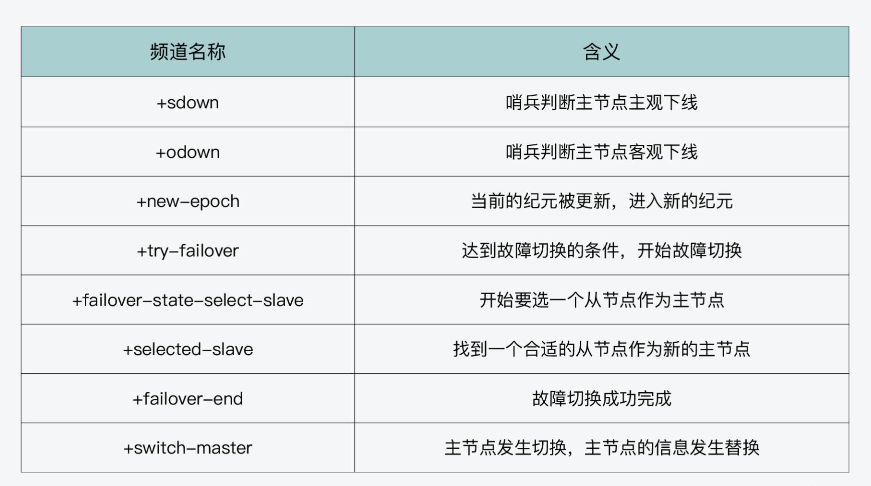
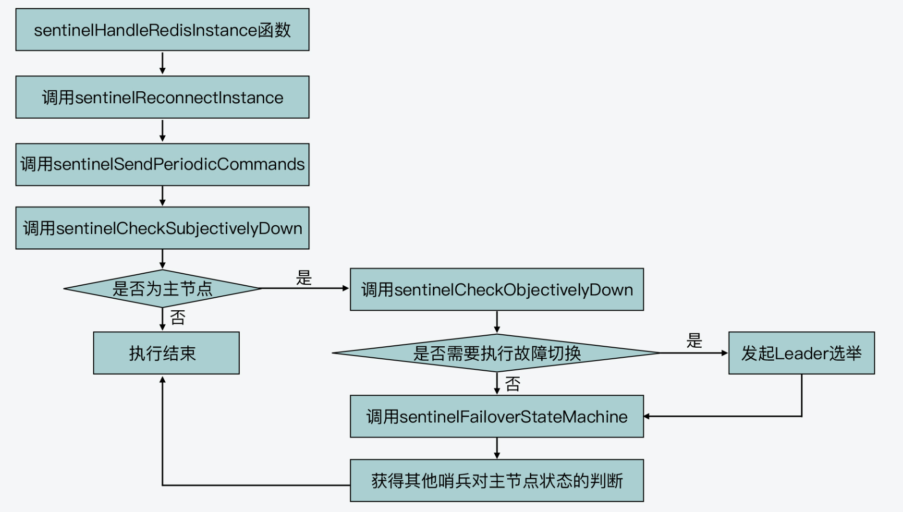
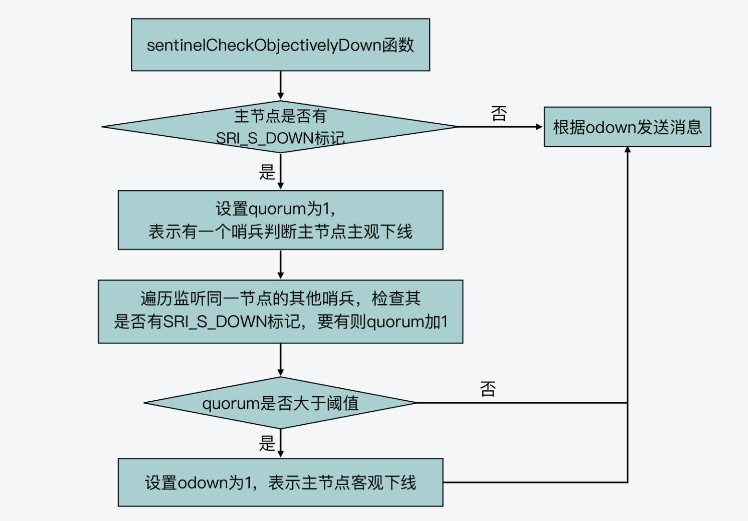
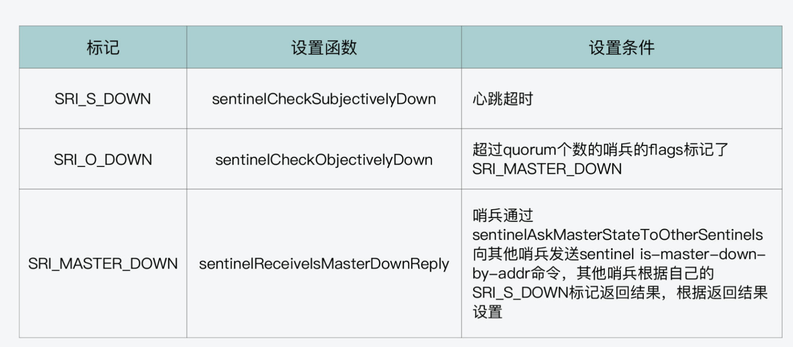

## sentinel源码分析

### 发布订阅的使用

#### 发布消息 & sentinelEvent

哨兵在使用发布订阅方法时，封装了 sentinelEvent 函数（在sentinel.c文件中），用来发布消息。所以，你在阅读 sentinel.c 文件中关于哨兵的源码时，**如果看到 sentinelEvent，这就表明哨兵正在用它来发布消息**。**但是注意这个消息的频道是在自身节点上，客户端可以通过订阅给定的频道来获取相应的事件提醒。**

**sentinelEvent** 函数：

```c
/*
 * - level 表示当前的日志级别；
 * - type 表示发送事件信息所用的订阅频道；
 * - ri 表示对应交互的主节点；
 * - fmt 则表示发送的消息内容。
 * - ...表示可变参数，用于填充fmt
 */
void sentinelEvent(int level, char *type, sentinelRedisInstance *ri,
                   const char *fmt, ...) {
    va_list ap;
    char msg[LOG_MAX_LEN];
    robj *channel, *payload;

    /* Handle %@ */
    // 如果传递消息以"%"和"@"开头，就判断实例是否为主节点
    if (fmt[0] == '%' && fmt[1] == '@') {
        // 判断实例的flags标签是否为SRI_MASTER，如果是，就表明实例是主节点
        sentinelRedisInstance *master = (ri->flags & SRI_MASTER) ? NULL : ri->master;
        // 如果当前实例是主节点，根据实例的名称、IP地址、端口号等信息调用snprintf生成传递的消息msg
        if (master) {
            snprintf(msg, sizeof(msg), "%s %s %s %d @ %s %s %d",
                     sentinelRedisInstanceTypeStr(ri),
                     ri->name, ri->addr->ip, ri->addr->port,
                     master->name, master->addr->ip, master->addr->port);
        } else {
            snprintf(msg, sizeof(msg), "%s %s %s %d",
                     sentinelRedisInstanceTypeStr(ri),
                     ri->name, ri->addr->ip, ri->addr->port);
        }
        fmt += 2;
    } else {
        msg[0] = '\0';
    }

    /* Use vsprintf for the rest of the formatting if any. */
    // 如果fmt后还有其他格式，使用 vsprintf来获取数据
    if (fmt[0] != '\0') {
        va_start(ap, fmt);
        vsnprintf(msg+strlen(msg), sizeof(msg)-strlen(msg), fmt, ap);
        va_end(ap);
    }

    /* Log the message if the log level allows it to be logged. */
    // 如果日志级别允许记录该消息，则记录该消息。
    if (level >= server.verbosity)
        serverLog(level,"%s %s",type,msg);

    /* Publish the message via Pub/Sub if it's not a debugging one. */
    // 如果不是调试消息，请通过 Pub/Sub 发布消息
    if (level != LL_DEBUG) {
        channel = createStringObject(type,strlen(type));
        payload = createStringObject(msg,strlen(msg));
        pubsubPublishMessage(channel,payload);
        decrRefCount(channel);
        decrRefCount(payload);
    }

    /* Call the notification script if applicable. */
    // 如果可应用，调用通知脚本
    if (level == LL_WARNING && ri != NULL) {
        sentinelRedisInstance *master = (ri->flags & SRI_MASTER) ?
            ri : ri->master;
        if (master && master->notification_script) {
            sentinelScheduleScriptExecution(master->notification_script,
                                            type,msg,NULL);
        }
    }
}
```

实际上，这个函数最终是通过调用 pubsubPublishMessage 函数，来实现向某一个频道发布消息的。那么，当我们要发布一条消息时，需要确定两个方面的内容：**一个是要发布的频道，另一个是要发布的消息**。

sentinelEvent 函数的第二个参数 type，表示的就是要发布的频道；

而要发布的消息，就是由这个函数第四个参数 fmt 和后面的省略号来表示的，fmt是要发布信息的一个模版。而具体要发布的信息主要处理：

在 sentinelEvent 函数中，为了使用了可变参数，它主要包含了四个步骤：

- 首先，我们需要定义一个 va_list 类型的变量，假设是 ap。这个变量是指向可变参数的指针；
- 然后，当我们要在函数中使用可变参数了，就需要通过 va_start 宏来获取可变参数中的第一个参数。va_start 宏有两个参数，一个是刚才定义的 va_list 类型变量 ap，另一个是可变参数的前一个参数，也就是 sentinelEvent 函数参数中，省略号前的参数 fmt；
- 紧接着，我们可以使用 vsnprintf 函数，来按照 fmt 定义的格式，打印可变参数中的内容。vsnprintf 函数会逐个获取可变参数中的每一个参数，并进行打印；
- 最后，我们在获取完所有参数后，需要调用 va_end 宏将刚才创建的 ap 指针关闭。

看如下的例子：

1）第一个对应了哨兵调用 **sentinelCheckSubjectivelyDown** 函数检测出主节点主观下线后，sentinelCheckSubjectivelyDown 函数调用 sentinelEvent 函数，向“+sdown”频道发布消息。此时，传递给 sentinelEvent 的参数就是 4 个，并没有可变参数，如下所示：

```c
sentinelEvent(LL_WARNING,"+sdown",ri,"%@");
```

2）第二个对应了哨兵在初始化时，在 **sentinelGenerateInitialMonitorEvents** 函数中，调用 sentinelEvent 函数向“+monitor”频道发布消息，此时，传递给 sentinelEvent 的参数有 5 个，包含了 1 个可变参数，表示的是哨兵的 quorum 阈值，如下所示：

```c
sentinelEvent(LL_WARNING,"+monitor",ri,"%@ quorum %d",ri->quorum);
```

3）最后一个对应了哨兵在完成主节点切换后，在 **sentinelFailoverSwitchToPromotedSlave** 函数中，调用 sentinelEvent 函数向“+switch-master”频道发布消息。此时，传递给 sentinelEvent 的可变参数一共有 5 个，对应了故障切换前的主节点名称、IP 和端口号，以及切换后升级为主节点的从节点 IP 和端口号，如下所示：

```c
sentinelEvent(LL_WARNING,"+switch-master",master,"%s %s %d %s %d",
              master->name, master->addr->ip, master->addr->port,
              ref->addr->ip, ref->addr->port);
```


可以这么说，哨兵在工作过程中是通过 sentinelEvent 函数和 pubsubPublishMessage 函数，来实现消息的发布的。在哨兵的整个工作过程中，它会在一些关键节点上，使用 sentinelEvent 函数往不同的频道上发布消息。

除了刚才举例的三个频道 +monitor、+sdown、+switch-master 以外，把哨兵在工作过程中会用到的消息发布频道列在了下表中：

<center></center>


其实，在哨兵的工作过程中，如果有客户端想要了解故障切换的整体情况或进度，比如主节点是否被判断为主观下线、主节点是否被判断为客观下线、Leader 是否完成选举、新主节点是否切换完成，等等，就**可以通过 subscribe 命令，订阅上面这张表中的相应频道**。这样一来，客户端就可以了解故障切换的过程了。

下面我们再来看下，哨兵在工作过程中对消息的订阅是如何实现的。


#### hello频道

首先你要知道，每个哨兵会订阅它所监听的主节点的"**sentinel**:hello"频道。哨兵会周期性调用 sentinelTimer 函数来完成周期性的任务，这其中，就有哨兵订阅主节点 hello 频道的操作。

具体来说，哨兵在周期性执行 sentinelTimer 函数时，会调用 sentinelHandleRedisInstance 函数，进而调用 sentinelReconnectInstance 函数。而在 sentinelReconnectInstance 函数中，哨兵会调用 redisAsyncCommand 函数，向主节点发送 subscribe 命令，订阅的频道由宏定义 SENTINEL_HELLO_CHANNEL（在 sentinel.c 文件中）指定，也就是"_sentinel_:hello"频道。这部分的代码如下所示：

```c
retval = redisAsyncCommand(link->pc,
                sentinelReceiveHelloMessages, ri, "%s %s",
                sentinelInstanceMapCommand(ri,"SUBSCRIBE"),
                SENTINEL_HELLO_CHANNEL);
```

从代码中，我们也可以看到，当在"_sentinel_:hello"频道上收到 hello 消息后，哨兵会回调 sentinelReceiveHelloMessages 函数来进行处理。而 sentinelReceiveHelloMessages 函数，实际是通过调用 sentinelProcessHelloMessage 函数，来完成 hello 消息的处理的。

```c
void sentinelReceiveHelloMessages(redisAsyncContext *c, void *reply, void *privdata) {
    sentinelRedisInstance *ri = privdata;
    redisReply *r;
    UNUSED(c);

    if (!reply || !ri) return;
    r = reply;

    /* Update the last activity in the pubsub channel. Note that since we
     * receive our messages as well this timestamp can be used to detect
     * if the link is probably disconnected even if it seems otherwise. */
    ri->link->pc_last_activity = mstime();

    /* Sanity check in the reply we expect, so that the code that follows
     * can avoid to check for details. */
    if (r->type != REDIS_REPLY_ARRAY ||
        r->elements != 3 ||
        r->element[0]->type != REDIS_REPLY_STRING ||
        r->element[1]->type != REDIS_REPLY_STRING ||
        r->element[2]->type != REDIS_REPLY_STRING ||
        strcmp(r->element[0]->str,"message") != 0) return;

    /* We are not interested in meeting ourselves */
    if (strstr(r->element[2]->str,sentinel.myid) != NULL) return;

    sentinelProcessHelloMessage(r->element[2]->str, r->element[2]->len);
}
```

对于 sentinelProcessHelloMessage 函数来说，它主要是从 hello 消息中获得发布 hello 消息的哨兵实例的**哨兵实例的 IP、端口号、ID 和当前的纪元，以及该哨兵监听的主节点的名称、IP、端口号和纪元信息。**

- 如果当前哨兵并没有记录发布 hello 消息的哨兵实例的信息，那么，sentinelProcessHelloMessage 函数就会调用 createSentinelRedisInstance 函数，来**创建发布 hello 消息的哨兵实例的信息记录**，这样一来，当前哨兵就拥有了其他哨兵实例的信息了；
- 如果当前哨兵收到其他哨兵发布的hello消息后，发现hello消息中的主节点信息，与本地的不一致，说明哨兵刚刚完成了一次故障转移流程，并升级了某个从节点使其成为了新的主节点。因此，该哨兵也会调用**sentinelResetMasterAndChangeAddress**函数，重置主节点信息。（这里与故障迁移的最后一个状态的处理相同）

好了，了解了哨兵对"_sentinel_:hello"频道的订阅和处理后，我们还需要搞清楚一个问题，即哨兵是在什么时候发布 hello 消息的呢？

这其实是哨兵在 **sentinelTimer** 函数中，调用 **sentinelSendPeriodicCommands** 函数时，由 sentinelSendPeriodicCommands 函数调用 **sentinelSendHello** 函数来完成的。

sentinelSendHello 函数会调用 redisAsyncCommand 函数，向主节点的"_sentinel_:hello"频道发布 hello 消息。在它发送的 hello 消息中，包含了发布 hello 消息的**哨兵实例的 IP、端口号、ID 和当前的纪元，以及该哨兵监听的主节点的名称、IP、端口号和纪元信息**。

下面的代码就展示了 hello 消息的生成和发布，sentinel.c#sentinelSendHello：

```c
//hello消息包含的内容
snprintf(payload,sizeof(payload),
         "%s,%d,%s,%llu," //当前哨兵实例的信息，包括ip、端口号、ID和当前纪元
         "%s,%s,%d,%llu", //当前主节点的信息，包括名称、IP、端口号和纪元
         announce_ip, announce_port, sentinel.myid,
         (unsigned long long) sentinel.current_epoch,
         master->name,master_addr->ip,master_addr->port,
         (unsigned long long) master->config_epoch);
//向主节点的hello频道发布hello消息
retval = redisAsyncCommand(ri->link->cc,
                           sentinelPublishReplyCallback, ri, "%s %s %s",
                           sentinelInstanceMapCommand(ri,"PUBLISH"),
                           SENTINEL_HELLO_CHANNEL,payload);
```

这样，当哨兵通过 sentinelSendHello，向自己监听的主节点的"_sentinel__:hello"频道发布 hello 消息时，和该哨兵监听同一个主节点的其他哨兵，也会订阅主节点的" _sentinel__:hello"频道，从而就可以获得该频道上的 hello 消息了。

其实**会向已知的所有节点（主、从、sentinel）调用sentinelSendPeriodicCommands函数，进而发布该PUBLISH命令，主、从节点会进入hello频道，而sentinel节点会调用其特定的命令处理函数sentinelPublishCommand来进行处理，且该函数仅仅会处理频道为hello的PUBLISH命令，也是调用sentinelProcessHelloMessage函数进行具体处理，和从hello频道中接收到消息的回调处理函数相同。**

通过这样的通信方式，监听同一主节点的哨兵就能相互知道彼此的访问信息了。如此一来，哨兵就可以基于这些访问信息，执行主节点状态共同判断，以及进行 Leader 选举等操作了。


#### 注意点

如果我们在哨兵实例上执行 publish 命令，那么，这条命令是不是就是由 pubsub.c 文件中的 publishCommand 函数来处理的呢?

**哨兵实例会使用到哨兵自身实现的命令，而不是普通 Redis 实例使用的命令**。在前面我们就已经介绍了。

哨兵初始化时，会调用 initSentinel 函数。而 initSentinel 函数会先把 server.commands 对应的命令表清空，然后执行一个循环，把哨兵自身的命令添加到命令表中。哨兵自身的命令是使用 sentinelcmds 数组保存的。

那么从 sentinelcmds 数组中，我们可以看到 publish 命令对应的实现函数，其实是 sentinelPublishCommand。所以，我们在哨兵实例上执行 publish 命令，执行的并不是 pubsub.c 文件中的 publishCommand 函数。

下面的代码展示了 initSentinel 函数先清空、再填充命令表的基本过程，以及 sentinelcmds 数组的部分内容:

```c
void initSentinel(void) {
    ...
        dictEmpty(server.commands,NULL);  //清空现有的命令表
    // 将sentinelcmds数组中的命令添加到命令表中
    for (j = 0; j < sizeof(sentinelcmds)/sizeof(sentinelcmds[0]); j++) {
        int retval;
        struct redisCommand *cmd = sentinelcmds+j;
        retval = dictAdd(server.commands, sdsnew(cmd->name), cmd);
        …
    }
    ...}

//sentinelcmds数组的部分命令定义
struct redisCommand sentinelcmds[] = {
    ...
    {"subscribe",subscribeCommand,-2,"",0,NULL,0,0,0,0,0},
    {"publish",sentinelPublishCommand,3,"",0,NULL,0,0,0,0,0}, //publish命令对应哨兵自身实现的sentinelPublishCommand函数
    {"info",sentinelInfoCommand,-1,"",0,NULL,0,0,0,0,0},
    ...
};
```


### sentinelTimer

sentinelTimer是哨兵的定时事件处理函数，其本身是在 server.c#serverCron 函数中调用的。

```c
int serverCron(struct aeEventLoop *eventLoop, long long id, void *clientData) {
    …
     //如果当前运行的是哨兵，则运行哨兵的时间事件处理函数
    if (server.sentinel_mode) sentinelTimer();
    …
}
```

serverCron 函数每 100ms 执行一次，在执行过程中，它会检查 server.sentinel_mode 配置项，如果该配置项为 1，就表明当前运行的是哨兵实例，紧接着它就会调用 sentinelTimer 函数。因此，sentinelTimer 函数也会周期性执行。

#### 总体流程

```c
void sentinelTimer(void) {
    //1.检查是否需要进入 TILT 模式
    sentinelCheckTiltCondition();
    //2.从 sentinel.master 哈希表中逐一取出监听的主节点，并调用 sentinelHandleRedisInstance 函数对该主节点进行处理
    sentinelHandleDictOfRedisInstances(sentinel.masters);
    //3.三个函数依次：运行待执行的脚本、收集结束的脚本以及将超时的脚本 kill 掉
    sentinelRunPendingScripts();
    sentinelCollectTerminatedScripts();
    sentinelKillTimedoutScripts();

    /* We continuously change the frequency of the Redis "timer interrupt"
     * in order to desynchronize every Sentinel from every other.
     * This non-determinism avoids that Sentinels started at the same time
     * exactly continue to stay synchronized asking to be voted at the
     * same time again and again (resulting in nobody likely winning the
     * election because of split brain voting). */
    //调整 server.hz 配置项，它会在 server.hz 默认值的基础上增加一个随机值，而这个配置项决定了 sentinelTimer 本身的执行频率
    //因此在调整后，sentinelTimer 函数就会按照修改后的运行频率再次执行。
    server.hz = CONFIG_DEFAULT_HZ + rand() % CONFIG_DEFAULT_HZ;
}
```

sentinelTimer的大概执行流程分为四步：

1. 调用 sentinelCheckTiltCondition 函数检查是否需要进入 TILT 模式。这里，你需要注意下，对于哨兵来说，TILT 模式是一种特殊的运行模式，当哨兵连续两次的时间事件处理间隔时长为负值，或是间隔时长过长，那么哨兵就会进入 TILT 模式。在该模式下，哨兵只会定期发送命令收集信息，而不会执行故障切换流程；而且在收到其他实例的”INFO”命令回复后的回调函数**sentinelRefreshInstanceInfo**中，仅将收到的信息保存下来，而后续涉及到主从角色变化、故障转移流程等，都不再处理；而且当收到其他哨兵发来的，用于询问某主节点是否下线的"**is-master-down-by-addr**"命令时，一律回复“未下线”，因为处于TILT模式下的哨兵的判断，已经不可信了；
2. 调用**sentinelHandleDictOfRedisInstances**从 sentinel.master 哈希表中逐一取出监听的主节点，并调用 **sentinelHandleRedisInstance** 函数对该主节点进行处理；（具体的处理看接下来的介绍）
3. 依次调用 sentinelRunPendingScripts、sentinelCollectTerminatedScripts 和 sentinelKillTimedoutScripts 这三个函数，来运行待执行的脚本、收集结束的脚本以及将超时的脚本 kill 掉；
4. 最后，sentinelTimer 函数会**调整 server.hz 配置项**，它会在 server.hz 默认值的基础上增加一个随机值，而这个配置项决定了 sentinelTimer 本身的执行频率。因此在调整后，sentinelTimer 函数就会按照修改后的运行频率再次执行。

>Q：为什么最后要修改server.hz？
>
>A：参考Raft中的超时选举，每个节点的超时时间会有一些不同。server.hz 表示执行定时任务函数 serverCron 的频率，哨兵在最后修改 server.hz 增加一个随机值，是为了避免多个哨兵以「相同频率」执行，引发每个哨兵同时发起选举，进而导致没有一个哨兵能拿到多数投票，领导者选举失败的问题。


#### sentinelHandleDictOfRedisInstances

**sentinelHandleDictOfRedisInstances** 函数会执行一个循环流程，在该流程中，它会从 **sentinel.master** 哈希表中逐一取出监听的主节点，并调用 **sentinelHandleRedisInstance** 函数对该主节点进行处理，如下所示：

```c
/* Perform scheduled operations for all the instances in the dictionary.
 * Recursively call the function against dictionaries of slaves. */
// 对哈希表中的所有实例执行预定操作。针对从节点的哈希表递归调用该函数
void sentinelHandleDictOfRedisInstances(dict *instances) {
    dictIterator *di;
    dictEntry *de;
    sentinelRedisInstance *switch_to_promoted = NULL;

    /* There are a number of things we need to perform against every master. */
    // 我们需要针对每个 master 节点执行许多事情
    // 获取哈希表的迭代器
    di = dictGetIterator(instances);
    while((de = dictNext(di)) != NULL) {
        // 从哈希表中取出一个实例
        sentinelRedisInstance *ri = dictGetVal(de);
        // 调用sentinelHandleRedisInstance处理实例
        sentinelHandleRedisInstance(ri);
        //如果当前实例为主节点，则依次取出其从节点以及监听该主节点的sentinel进行处理
        if (ri->flags & SRI_MASTER) {
            sentinelHandleDictOfRedisInstances(ri->slaves);
            sentinelHandleDictOfRedisInstances(ri->sentinels);
            //若某个主节点的故障转移状态为SENTINEL_FAILOVER_STATE_UPDATE_CONFIG，这是状态转移的最后一个状态
            //接下来调用的sentinelFailoverSwitchToPromotedSlave要根据新主节点重新创建主节点实例，并创建新的从节点字典slaves
            if (ri->failover_state == SENTINEL_FAILOVER_STATE_UPDATE_CONFIG) {
                switch_to_promoted = ri;
            }
        }
    }
    if (switch_to_promoted)
        sentinelFailoverSwitchToPromotedSlave(switch_to_promoted);
    dictReleaseIterator(di);
}
```

因此可以看出来了在sentinelTimer函数中最重要的一个函数其实是**sentinelHandleRedisInstance**：

```c
void sentinelHandleRedisInstance(sentinelRedisInstance *ri) {
    /* ========== MONITORING HALF ============ */
    /* Every kind of instance */
    //1.尝试和断连的实例重新建立连接
    sentinelReconnectInstance(ri);
    //2.向实例发送 PING、INFO 、PUBLISH命令
    sentinelSendPeriodicCommands(ri);

    /* ============== ACTING HALF ============= */
    /* We don't proceed with the acting half if we are in TILT mode.
     * TILT happens when we find something odd with the time, like a
     * sudden change in the clock. */
    if (sentinel.tilt) {
        if (mstime()-sentinel.tilt_start_time < SENTINEL_TILT_PERIOD) return;
        sentinel.tilt = 0;
        sentinelEvent(LL_WARNING,"-tilt",NULL,"#tilt mode exited");
    }

    /* Every kind of instance */
    //3.检查监听的实例是否主观下线，以及判断连接的活跃程度并断开
    sentinelCheckSubjectivelyDown(ri);

    /* Masters and slaves */
    if (ri->flags & (SRI_MASTER|SRI_SLAVE)) {
        /* Nothing so far. */
    }

    /* Only masters */
    //4.判断客观下线和执行故障切换
    if (ri->flags & SRI_MASTER) {
        //判断是否客观下线
        sentinelCheckObjectivelyDown(ri);
        //判断是否要启动故障切换。三个条件都要满足：
        //1）master必须有SRI_O_DOWN标志，即判断为客观下线；
        //2）故障切换没有正在进行；
        //3）上一次尝试故障切换时间超过了指定时间间隔
        if (sentinelStartFailoverIfNeeded(ri))
            //向监听同一主节点的其他哨兵发送 is-master-down-by-addr 命令并发起Leader选举，同时获取其他哨兵对主节点的状态判断
            sentinelAskMasterStateToOtherSentinels(ri,SENTINEL_ASK_FORCED);
        //进行leader选举并进行故障切换
        sentinelFailoverStateMachine(ri);
        //获取其他哨兵实例对主节点状态的判断
        sentinelAskMasterStateToOtherSentinels(ri,SENTINEL_NO_FLAGS);
    }
}
```

主要就是四步：

1. 重建连接。调用 **sentinelReconnectInstance** 函数，尝试和断连的实例重新建立连接；

2. 发送命令。调用 **sentinelSendPeriodicCommands** 函数，向实例发送 PING、INFO 、PUBLISH命令；

3. 判断主关下线。调用 **sentinelCheckSubjectivelyDown** 函数，检查监听的实例是否主观下线，以及判断连接的活跃程度并断开；

4. 判断客观下线和执行故障切换（仅针对监听的主节点）。

   1）首先，针对监听的主节点，调用 **sentinelCheckObjectivelyDown** 函数检查其是否客观下线；

   2）紧接着，调用 **sentinelStartFailoverIfNeeded** 函数判断是否要启动故障切换。如果要启动故障切换，就调用 **sentinelAskMasterStateToOtherSentinels** 函数，向监听同一主节点的其他哨兵发送 **is-master-down-by-addr** 命令并发起Leader选举，同时获取其他哨兵对主节点的状态判断。

   3）然后，调用 **sentinelFailoverStateMachine** 进行leader选举并进行故障切换;

   4）最后，再次调用 **sentinelAskMasterStateToOtherSentinels** 函数，获取其他哨兵实例对主节点状态的判断。

   **这里一共调用了两次sentinelAskMasterStateToOtherSentinels函数，第一次的作用着重于获取sentinel leader的投票，第二次的作用着重于获取其它sentinel对于master的状态判断。**

> 注意：前三步是监听的主节点、主节点下的从节点、监听当前主节点的sentinel都会执行的。

大概流程如下：

<center></center>

因为 sentinelHandleDictOfRedisInstances 函数接收的参数，是当前哨兵监听的主节点哈希表，而每个主节点又会记录同时监听它的其他哨兵实例以及它的从节点，这分别对应了主节点数据结构 sentinelRedisInstance 中的 sentinels 和 slaves 成员变量，这两个变量本身也是用哈希表来保存其他哨兵和从节点信息的，如下所示：

```c
typedef struct sentinelRedisInstance {
	...
 	dict *sentinels;    //监听同一个主节点的其他哨兵实例
 	dict *slaves;      //当前主节点的从节点
	...
}
```

所以，哨兵在 sentinelHandleDictOfRedisInstances 函数中，调用 sentinelHandleRedisInstance 处理完每个主节点后，还会针对监听主节点的其他哨兵实例，以及主节点的从节点，分别调用 sentinelHandleDictOfRedisInstances 函数进行处理。


#### sentinelReconnectInstance(重连接)

sentinelReconnectInstance 函数的主要作用是判断和当前传入的实例连接是否正常，如果发生了断连情况，它会重新建立连接。连接主要有两种连接：命令连接、订阅连接。

其实，哨兵在使用 sentinelRedisInstance 结构保存节点信息时，在该结构中有一个 instanceLink 类型的成员变量 link，该变量就记录了哨兵和节点间的两个连接，分别对应用来发送命令的连接 cc 和用来发送 Pub/Sub 消息的连接 pc，如下所示：

```c
typedef struct instanceLink {
    ...
    redisAsyncContext *cc; //用于发送命令的连接 
    redisAsyncContext *pc; //用于发送pub-sub消息的连接
    ...
}
```

sentinelReconnectInstance 函数执行时会**检查这两个连接是否为 NULL**。如果是的话，那么它就会调用 redisAsyncConnectBind 函数（在async.c文件中），重新和节点建立这两个连接。

```c
void sentinelReconnectInstance(sentinelRedisInstance *ri) {
    //如果是连接的，直接返回
    if (ri->link->disconnected == 0) return;
    //如果没有端口，无效地址，直接返回
    if (ri->addr->port == 0) return; /* port == 0 means invalid address. */
    ...
    /* Commands connection. */
    //如果和当前节点的命令连接为null，则进行建立
    if (link->cc == NULL) {
        link->cc = redisAsyncConnectBind(ri->addr->ip,ri->addr->port,NET_FIRST_BIND_ADDR);
    	...
    }
    /* Pub / Sub */
    //如果和当前节点的订阅连接为null，则进行建立，并订阅hello频道
    if ((ri->flags & (SRI_MASTER|SRI_SLAVE)) && link->pc == NULL) {
        link->pc = redisAsyncConnectBind(ri->addr->ip,ri->addr->port,NET_FIRST_BIND_ADDR)
        ...
        /* Now we subscribe to the Sentinels "Hello" channel. */
        retval = redisAsyncCommand(link->pc,
                                   sentinelReceiveHelloMessages, ri, "%s %s",
                                   sentinelInstanceMapCommand(ri,"SUBSCRIBE"),
                                   SENTINEL_HELLO_CHANNEL);
        ...
    }
    //如果已经建立命令连接和订阅连接，或者与sentinel节点建立了命令连接则修改连接信息
    if (link->cc && (ri->flags & SRI_SENTINEL || link->pc))
        link->disconnected = 0;
}
```

注意与当前节点建立订阅连接时，会订阅hello频道，并设置该命令的回调函数为sentinelReceiveHelloMessages。因此，当收到该频道上发布的消息时，就会调用函数**sentinelReceiveHelloMessages**。


#### sentinelSendPeriodicCommands(发送命令)

sentinelSendPeriodicCommands 的逻辑比较简单，主要是向实例发送 PING、INFO 、PUBLISH命令：

```c
void sentinelSendPeriodicCommands(sentinelRedisInstance *ri) {
   ...
    /* Send INFO to masters and slaves, not sentinels. */
    //通过和主、从节点的命令连接cc，调用redisAsyncCommand发送Info命令
    //并设置回调函数
    if ((ri->flags & SRI_SENTINEL) == 0 &&
        (ri->info_refresh == 0 ||
         (now - ri->info_refresh) > info_period))
    {
        retval = redisAsyncCommand(ri->link->cc,
                                   sentinelInfoReplyCallback, ri, "%s",
                                   sentinelInstanceMapCommand(ri,"INFO"));
        if (retval == C_OK) ri->link->pending_commands++;
    }

    /* Send PING to all the three kinds of instances. */
    //通过和该节点的命令连接，调用redisAsyncCommand发送ping命令
    if ((now - ri->link->last_pong_time) > ping_period &&
        (now - ri->link->last_ping_time) > ping_period/2) {
        sentinelSendPing(ri);
    }

    /* PUBLISH hello messages to all the three kinds of instances. */
    //通过和该节点的命令连接，调用redisAsyncCommand发送命令PUBLISH命令
    if ((now - ri->last_pub_time) > SENTINEL_PUBLISH_PERIOD) {
        sentinelSendHello(ri);
    }
}
```

- 第一步：如果该节点是主、从节点，它先是调用 redisAsyncCommand 函数（在 async.c 文件中），通过哨兵和该节点间的命令连接 cc，向该节点发送 INFO 命令。设置的”INFO”命令的回调函数是**sentinelInfoReplyCallback**。该函数的代码很简单，主要是调用sentinelRefreshInstanceInfo函数对回复进行处理；
- 第二步：通过 sentinelSendPing 函数（在 sentinel.c 文件中）向该节点发送 PING 命令（PING 命令的发送也是通过哨兵和该节点的命令连接 cc 来完成的）；
- 第三步：调用 sentinelSendHello 函数（在 sentinel.c 文件中），通过哨兵和节点的命令连接 cc，向节点发送 PUBLISH 命令，将当前节点和监听的master节点部分信息发送给hello频道：
  - 与Sentinel有关的参数:源Sentinel的IP地址、端口号、运行ID和配置纪元。
  - 与主服务器有关的参数:源Sentinel正在监视的主服务器的名字、I地址、端口号和配置纪元。

这里注意两点：

第一点：三个命令并不是依次发送，而是会判断如果达到了要发送的时间则进行发送；

第二点：**第三步是会对已知的所有节点（主、从、sentinel）发布该PUBLISH命令，而没有进行主、从节点的判断**。

- 如果目标是主、从节点会进入hello频道；
- 而sentinel节点并没有创建该频道，会调用其特定的命令处理函数**sentinelPublishCommand**来进行处理，且该函数仅仅会处理频道为hello的PUBLISH命令，也是调用**sentinelProcessHelloMessage**函数进行具体处理，和从hello频道中接收到消息的回调函数处理方式相同。

```c
void sentinelPublishCommand(client *c) {
    //仅仅处理频道为hello的PUBLISH命令
    if (strcmp(c->argv[1]->ptr,SENTINEL_HELLO_CHANNEL)) {
        addReplyError(c, "Only HELLO messages are accepted by Sentinel instances.");
        return;
    }
    //进行处理该命令
    sentinelProcessHelloMessage(c->argv[2]->ptr,sdslen(c->argv[2]->ptr));
    addReplyLongLong(c,1);
}
```


#### sentinelCheckSubjectivelyDown(检查主观下线)

sentinelCheckSubjectivelyDown 函数主要是检查监听的实例是否主观下线、以及判断连接的活跃程度并断开。

```c
void sentinelCheckSubjectivelyDown(sentinelRedisInstance *ri) {
    mstime_t elapsed = 0;

    //1.计算当前距离上一次发送PING命令的时长,
    //  或如果哨兵和主节点的连接断开了，那么计算当前距离连接最后可用的时长
    if (ri->link->act_ping_time)
        elapsed = mstime() - ri->link->act_ping_time;
    else if (ri->link->disconnected)
        elapsed = mstime() - ri->link->last_avail_time;

    //2.分别检测哨兵和节点的命令发送连接，以及 Pub/Sub 连接的活跃程度。
    // 如果活跃度不够，那么哨兵会调用 instanceLinkCloseConnection 函数，断开当前连接，以便重新连接
    if (ri->link->cc &&
        (mstime() - ri->link->cc_conn_time) >
        SENTINEL_MIN_LINK_RECONNECT_PERIOD &&
        ri->link->act_ping_time != 0 && /* There is a pending ping... */
        /* The pending ping is delayed, and we did not receive
         * error replies as well. */
        (mstime() - ri->link->act_ping_time) > (ri->down_after_period/2) &&
        (mstime() - ri->link->last_pong_time) > (ri->down_after_period/2))
    {
        instanceLinkCloseConnection(ri->link,ri->link->cc);
    }

    if (ri->link->pc &&
        (mstime() - ri->link->pc_conn_time) >
        SENTINEL_MIN_LINK_RECONNECT_PERIOD &&
        (mstime() - ri->link->pc_last_activity) > (SENTINEL_PUBLISH_PERIOD*3))
    {
        instanceLinkCloseConnection(ri->link,ri->link->pc);
    }

    //3.会根据以下两个条件，判断主节点是否为主观下线:
    //  - 当前距离上次发送 PING 的时长已经超过 down_after_period 阈值，还没有收到回复;
    //  - 哨兵认为当前实例是主节点，但是这个节点向哨兵报告它将成为从节点，并且在 down_after_period 时长，再加上两个 INFO 命令间隔后，该节点还是没有转换成功。
    if (elapsed > ri->down_after_period ||
        (ri->flags & SRI_MASTER &&
         ri->role_reported == SRI_SLAVE &&
         mstime() - ri->role_reported_time >
         (ri->down_after_period+SENTINEL_INFO_PERIOD*2)))
    {
        /* Is subjectively down */
        //如果主观下线，哨兵就会调用 sentinelEvent 函数发送“+sdown”事件信息
        if ((ri->flags & SRI_S_DOWN) == 0) {
            sentinelEvent(LL_WARNING,"+sdown",ri,"%@");
            ri->s_down_since_time = mstime();
            ri->flags |= SRI_S_DOWN;
        }
    } else {
        /* Is subjectively up */
        if (ri->flags & SRI_S_DOWN) {
            sentinelEvent(LL_WARNING,"-sdown",ri,"%@");
            ri->flags &= ~(SRI_S_DOWN|SRI_SCRIPT_KILL_SENT);
        }
    }
}
```

主要分为三步：

1. 第一步：计算当前距离上次哨兵发送 PING 命令的时长 elapsed，或者如果哨兵和主节点的连接断开了，那么计算当前距离连接最后可用的时长；

2. 第二步：分别检测哨兵和节点的命令发送连接，以及 Pub/Sub 连接的活跃程度(如果没有该连接，就不检测)。如果活跃度不够，那么哨兵会调用 **instanceLinkCloseConnection** 函数（在 sentinel.c 文件中），断开当前连接，以便重新连接；

3. 第三步：根据以下两个条件，判断主节点是否为主观下线:

   - 条件一：当前距离上次发送 PING 的时长已经超过 down_after_period 阈值，还没有收到回复。down_after_period 的值是由 sentinel.conf 配置文件中，down-after-milliseconds 配置项决定的，其默认值是 30s；
   - 条件二：哨兵认为当前实例是主节点，但是这个节点向哨兵报告它将成为从节点，并且在 down_after_period 时长，再加上两个 INFO 命令间隔后，该节点还是没有转换成功。

   当上面这两个条件有一个满足时，哨兵就判定主节点为主观下线了。然后，哨兵就会调用 sentinelEvent 函数发送“+sdown”事件信息。


### 客观下线和故障转移

这一部分其实是sentinelHandleRedisInstance处理的第四步。

#### sentinelCheckObjectivelyDown(判断客观下线)

sentinelCheckObjectivelyDown函数主要是判断客观下线：

```c
// 此实例是否根据配置的quorum而关闭？
// 请注意，ODOWN 是一个弱quorum，它仅表示在给定时间范围内报告了足够多的 Sentinel 报告该实例无法访问。
// 但是消息可能会延迟，因此无法保证 N 个实例同时同意关闭状态
void sentinelCheckObjectivelyDown(sentinelRedisInstance *master) {
    dictIterator *di;
    dictEntry *de;
    unsigned int quorum = 0, odown = 0;
    // 当前主节点已经被当前哨兵判断为主观下线
    if (master->flags & SRI_S_DOWN) {
        /* Is down for enough sentinels? */
        // 当前哨兵将quorum值置为1
        quorum = 1; /* the current sentinel. */
        /* Count all the other sentinels. */
        di = dictGetIterator(master->sentinels);
        // 遍历监听同一主节点的其他哨兵
        while((de = dictNext(di)) != NULL) {
            sentinelRedisInstance *ri = dictGetVal(de);

            if (ri->flags & SRI_MASTER_DOWN) quorum++;
        }
        dictReleaseIterator(di);
        // 如果quorum值大于预设的quorum阈值，那么设置odown为1。
        if (quorum >= master->quorum) odown = 1;
    }

    /* Set the flag accordingly to the outcome. */
    // 根据结果设置flag
    if (odown) {
        // 如果没有设置SRI_O_DOWN标记
        if ((master->flags & SRI_O_DOWN) == 0) {
            // 发送+odown事件消息
            sentinelEvent(LL_WARNING,"+odown",master,"%@ #quorum %d/%d",
                          quorum, master->quorum);
            // 在主节点的flags中记录SRI_O_DOWN标记
            master->flags |= SRI_O_DOWN;
            // 记录判断客观下线的时间
            master->o_down_since_time = mstime();
        }
    } else {
        if (master->flags & SRI_O_DOWN) {
            sentinelEvent(LL_WARNING,"-odown",master,"%@");
            master->flags &= ~SRI_O_DOWN;
        }
    }
}
```

**sentinelCheckObjectivelyDown** 函数在执行时，除了会检查当前哨兵对主节点主观下线的判断结果，还需要结合监听相同主节点的其他哨兵，对主节点主观下线的判断结果。它把这些判断结果综合起来，才能做出主节点客观下线的最终判断。

在哨兵用来记录主节点信息的 **sentinelRedisInstance 结构体**中，本身已经用哈希表保存了监听同一主节点的其他哨兵实例：

```c
typedef struct sentinelRedisInstance {
    …
    dict *sentinels;
    …
}
```

而对应的每个哨兵本身也是一个sentinelRedisInstance结构，只不过flag为SRI_SENTINEL。

该函数大体的执行步骤如下：

<center></center>

上图中第四个是SIR_MASTER_DOWN标记。看下三个标记的不同：

<center></center>

在此次的判断中：

- 如果判断为客观下线且没有设置过客观下线就记录SRI_O_DOWN标记，且发送+odown消息；
- 如果没有判断为主观下线或客观下线，但是标记了SRI_O_DOWN标记，则取消该标记，且发送-odown消息。

注意，sentinelCheckObjectivelyDown 函数，是检查监听同一主节点的其他哨兵 flags 变量中的 **SRI_MASTER_DOWN** 标记，那么其他哨兵的 SRI_MASTER_DOWN 标记是如何设置的呢?这就和 sentinelAskMasterStateToOtherSentinels 函数（在 sentinel.c 文件中）有关系了。


#### sentinelStartFailoverIfNeeded

在进行客观下线判断后，会调用**sentinelStartFailoverIfNeeded**函数判断是否要启动故障切换，满足一下三个条件才进行：

1. master必须有SRI_O_DOWN标志，即判断为客观下线；
2. 故障切换没有正在进行；
3. 上一次尝试故障切换时间超过了指定时间间隔，即需要超过 sentinel.conf 文件中的 sentinel failover-timeout 配置项的 2 倍。

这三个条件都满足后，**sentinelStartFailoverIfNeeded** 就会调用 **sentinelStartFailover** 函数，开始启动故障切换：

```c
void sentinelStartFailover(sentinelRedisInstance *master) {
    serverAssert(master->flags & SRI_MASTER);

    //将主节点的 failover_state 设置为ENTINEL_FAILOVER_STATE_WAIT_START
    master->failover_state = SENTINEL_FAILOVER_STATE_WAIT_START;
    //在主节点的 flags 设置 SRI_FAILOVER_IN_PROGRESS 标记，表示已经开始故障切换
    master->flags |= SRI_FAILOVER_IN_PROGRESS;
    /*
     * 要进行故障转移，第一步其实是进行sentinel leader的选举，那么依据raft协议，要将epoch+1
     */
    master->failover_epoch = ++sentinel.current_epoch;
    sentinelEvent(LL_WARNING,"+new-epoch",master,"%llu",
                  (unsigned long long) sentinel.current_epoch);
    sentinelEvent(LL_WARNING,"+try-failover",master,"%@");
    master->failover_start_time = mstime()+rand()%SENTINEL_MAX_DESYNC;
    master->failover_state_change_time = mstime();
}
```

而 sentinelStartFailover 会将主节点的 failover_state 设置为 **SENTINEL_FAILOVER_STATE_WAIT_START**，同时在主节点的 flags 设置 **SRI_FAILOVER_IN_PROGRESS** 标记，表示已经开始故障切换。

**并且在这里将自身的epoch+1，以便于接下的sentinel leader选举。**

而一旦 sentinelStartFailover 函数将主节点的 failover_state 设置为 SENTINEL_FAILOVER_STATE_WAIT_START 后，接下来，**sentinelFailoverStateMachine** 函数就会执行状态机来完成实际的切换。不过，在实际切换前，sentinelAskMasterStateToOtherSentinels 函数会被调用，而这个函数的其中一个作用就是获取sentinel leader的投票。


#### sentinelAskMasterStateToOtherSentinels 

在进行客观下线判断后，会调用**sentinelStartFailoverIfNeeded**函数判断是否要启动故障切换，满足一下三个条件才进行：

1. master必须有SRI_O_DOWN标志，即判断为客观下线；
2. 故障切换没有正在进行；
3. 上一次尝试故障切换时间超过了指定时间间隔。

满足以上三个条件，就调用**sentinelAskMasterStateToOtherSentinels** 函数，主要目的：向监听同一主节点的其他哨兵发送 **is-master-down-by-addr** 命令并发起Leader选举，同时获取其他哨兵对主节点的状态判断。

它会调用 redisAsyncCommand 函数（在async.c文件中），依次向其他哨兵发送 sentinel is-master-down-by-addr 命令，同时，它设置了收到该命令返回结果的回调函数为 sentinelReceiveIsMasterDownReply（在 sentinel.c 文件中），如下所示：

```c
/* If we think the master is down, we start sending
 * SENTINEL IS-MASTER-DOWN-BY-ADDR requests to other sentinels
 * in order to get the replies that allow to reach the quorum
 * needed to mark the master in ODOWN state and trigger a failover. */
// 如果我们认为 master 宕机了，我们开始向其他 sentinel 发送 SENTINEL IS-MASTER-DOWN-BY-ADDR 请求
// 以获取允许达到将 master 标记为 ODOWN 状态并触发故障转移所需的约定人数的回复
#define SENTINEL_ASK_FORCED (1<<0)
void sentinelAskMasterStateToOtherSentinels(sentinelRedisInstance *master, int flags) {
    dictIterator *di;
    dictEntry *de;

    di = dictGetIterator(master->sentinels);
    // 遍历监听同一主节点的其他哨兵
    while((de = dictNext(di)) != NULL) {
        // 得到一个哨兵实例
        sentinelRedisInstance *ri = dictGetVal(de);
        mstime_t elapsed = mstime() - ri->last_master_down_reply_time;
        char port[32];
        int retval;

        /* If the master state from other sentinel is too old, we clear it. */
        if (elapsed > SENTINEL_ASK_PERIOD*5) {
            ri->flags &= ~SRI_MASTER_DOWN;
            sdsfree(ri->leader);
            ri->leader = NULL;
        }

        /* Only ask if master is down to other sentinels if:
         *
         * 1) We believe it is down, or there is a failover in progress.
         * 2) Sentinel is connected.
         * 3) We did not receive the info within SENTINEL_ASK_PERIOD ms. */
        // 仅在以下情况下询问 master 是否已关闭到其他哨兵：
        // 1）我们认为它已关闭，或者正在进行故障转移。
        // 2) Sentinel 已连接。
        // 3) 我们没有在 SENTINEL_ASK_PERIOD (1000) 毫秒内收到信息。
        if ((master->flags & SRI_S_DOWN) == 0) continue;
        if (ri->link->disconnected) continue;
        if (!(flags & SENTINEL_ASK_FORCED) &&
            mstime() - ri->last_master_down_reply_time < SENTINEL_ASK_PERIOD)
            continue;

        /* Ask */
        ll2string(port,sizeof(port),master->addr->port);
        // 发送sentinel is-master-down-by-addr命令
        retval = redisAsyncCommand(ri->link->cc,
                                   sentinelReceiveIsMasterDownReply, ri,
                                   "%s is-master-down-by-addr %s %s %llu %s",
                                   sentinelInstanceMapCommand(ri,"SENTINEL"),
                                   announceSentinelAddr(master->addr), port,
                                   sentinel.current_epoch,
                                   (master->failover_state > SENTINEL_FAILOVER_STATE_NONE) ?
                                   sentinel.myid : "*");
        if (retval == C_OK) ri->link->pending_commands++;
    }
    dictReleaseIterator(di);
}
```

另外从代码中，我们可以看到，sentinel is-master-down-by-addr 命令中还包括**主节点 IP、主节点端口号、当前纪元（sentinel.current_epoch）和实例 ID**。下面展示的就是这个命令的格式：

```c
sentinel is-master-down-by-addr 主节点IP 主节点端口 当前epoch 实例ID
```

这其中，哨兵会根据当前主节点所处的状态来设置实例 ID。如果主节点已经要开始进行故障切换了，那么，实例 ID 会被设置为当前哨兵自身的 ID，否则就会被设置为 * 号

这里你需要注意的是，主节点的数据结构是使用了 master->failover_state 来记录故障切换的状态，其初始值为 **SENTINEL_FAILOVER_STATE_NONE**（对应的数值为 0），当主节点开始故障切换时，这个状态值就会大于 **SENTINEL_FAILOVER_STATE_NONE** 了。

好了，在了解了 sentinelAskMasterStateToOtherSentinels 函数的基本执行过程之后，我们还需要知道：sentinelAskMasterStateToOtherSentinels 函数向其他哨兵发出了 sentinel is-master-down-by-addr 命令后，其他哨兵是如何处理的呢？


#### sentinel is-master-down-by-addr 命令的处理

哨兵对于 sentinel 开头的命令，都是在 sentinelCommand 函数（在 sentinel.c 文件）中进行处理的。sentinelCommand 函数会根据 sentinel 命令后面跟的不同子命令，来执行不同的分支，而 is-master-down-by-addr 就是一条子命令：

```c
void sentinelCommand(client *c) {
    …
    // is-master-down-by-addr子命令对应的分支
    else if (!strcasecmp(c->argv[1]->ptr,"is-master-down-by-addr")) {
    …
    //当前哨兵判断主节点为主观下线
    if (!sentinel.tilt && ri && (ri->flags & SRI_S_DOWN) && (ri->flags & SRI_MASTER))
       isdown = 1;
    //选举leader，req_epoch是发送当前命令的sentinel的epoch
    if (ri && ri->flags & SRI_MASTER && strcasecmp(c->argv[5]->ptr,"*")) {
          leader = sentinelVoteLeader(ri,(uint64_t)req_epoch,
                                          c->argv[5]->ptr,
                                          &leader_epoch);
     }
        
    //回复信息
    addReplyMultiBulkLen(c,3); //哨兵返回的sentinel命令处理结果中包含三部分内容
    addReply(c, isdown ? shared.cone : shared.czero); //如果哨兵判断主节点为主观下线，第一部分为1，否则为0
    addReplyBulkCString(c, leader ? leader : "*"); //第二部分是Leader ID或者是*
    addReplyLongLong(c, (long long)leader_epoch); //第三部分是Leader的纪元
	…
    }
}
```

1. 根据命令中的主节点 IP 和端口号，来获取主节点对应的 **sentinelRedisInstance** 结构体；
2. 判断是否不处于TILT模式，且主节点的 flags 变量中是否有 SRI_S_DOWN 和 SRI_MASTER 标记，也就是说，sentinelCommand 函数会检查当前节点是否的确是主节点，以及哨兵是否已经将该节点标记为主观下线了。如果条件符合，那么它会设置 isdown 变量为 1，而这个变量表示的就是哨兵对主节点主观下线的判断结果；
3. 如果sentinel 命令中的实例 ID 不为 * 号，则根据投票规则选举leader sentinel（具体选举函数后面会说）；
4. 把当前哨兵对主节点主观下线的判断结果，返回给发送 sentinel 命令的哨兵。它返回的结果主要包含三部分内容，分别是当**前哨兵对主节点主观下线的判断结果、哨兵 Leader 的 ID，以及哨兵 Leader 所属的纪元。**


#### sentinelReceiveIsMasterDownReply

在sentinel发送is-master-down-by-addr命令的时候，就设置了该命令的回调函数：sentinelReceiveIsMasterDownReply。

该函数主要是处理其他哨兵返回的回复结果。回复结果主要是三部分内容：sentinel对主节点主观下线的判断结果、选举的sentinel Leader 的 ID，以及哨兵 Leader 所属的纪元。

```c
/* Receive the SENTINEL is-master-down-by-addr reply, see the
 * sentinelAskMasterStateToOtherSentinels() function for more information. */
// 接收 SENTINEL is-master-down-by-addr 回复，更多信息请参见 sentinelAskMasterStateToOtherSentinels() 函数
void sentinelReceiveIsMasterDownReply(redisAsyncContext *c, void *reply, void *privdata) {
    sentinelRedisInstance *ri = privdata;
    instanceLink *link = c->data;
    redisReply *r;

    if (!reply || !link) return;
    link->pending_commands--;
    r = reply;

    /* Ignore every error or unexpected reply.
     * Note that if the command returns an error for any reason we'll
     * end clearing the SRI_MASTER_DOWN flag for timeout anyway. */
    // 忽略每个错误或意外回复。请注意，如果命令由于任何原因返回错误，我们将结束清除 SRI_MASTER_DOWN 标志以表示超时。
    // r是当前哨兵收到的其他哨兵的命令处理结果
    // 如果返回结果包含三部分内容，并且第一，二，三部分内容的类型分别是整数、字符串和整数
    if (r->type == REDIS_REPLY_ARRAY && r->elements == 3 &&
        r->element[0]->type == REDIS_REPLY_INTEGER &&
        r->element[1]->type == REDIS_REPLY_STRING &&
        r->element[2]->type == REDIS_REPLY_INTEGER)
    {
        ri->last_master_down_reply_time = mstime();
        // 如果返回结果第一部分的值为1，则在对应哨兵的flags中设置SRI_MASTER_DOWN标记
        if (r->element[0]->integer == 1) {
            ri->flags |= SRI_MASTER_DOWN;
        } else {
            ri->flags &= ~SRI_MASTER_DOWN;
        }
        // 如果回复中的 runid 不是“*”，则 Sentinel 实际上回复了投票。
        //strcmp这个函数如果相同返回0，否则返回的runid必定大于*，返回一个正数
        if (strcmp(r->element[1]->str,"*")) {
            sdsfree(ri->leader);
            if ((long long)ri->leader_epoch != r->element[2]->integer)
                serverLog(LL_WARNING,
                          "%s voted for %s %llu", ri->name,
                          r->element[1]->str,
                          (unsigned long long) r->element[2]->integer);
            ri->leader = sdsnew(r->element[1]->str);
            ri->leader_epoch = r->element[2]->integer;
        }
    }
}
```

主要步骤：

1. 判断回复消息的哨兵对主节点主观下线的判断结果是否为 1。如果是，这就表明对应的哨兵已经判断主节点为主观下线了，那么就把回复消息的哨兵的sentinelRedisInstance中的 **flags**，设置为 SRI_MASTER_DOWN；
2. 判断回复消息的哨兵返回的leader是否为“\*”，如果不为\*，代表该哨兵选举了一个leader sentinel，就把该哨兵的sentinelRedisInstance中的**leader**和**leader_epoch**修改返回的值。

> 这里注意一下：选举leader的哨兵是在master的leader中保存sentinel leader。而被选举的哨兵会在选举的哨兵对应的sentinelRedisInstance结构中保存sentinel leader。


#### sentinelFailoverStateMachine(故障转移状态机🌟)

这个函数是进行具体的故障转移的函数，根据当前master不同的故障状态，进行不同的处理。

当sentinel针对某个主节点进行故障转移时，该主节点的故障转移状态master->**failover_state**要依次经历下面六个状态：

- SENTINEL_FAILOVER_STATE_WAIT_START：
- SENTINEL_FAILOVER_STATE_SELECT_SLAVE：
- SENTINEL_FAILOVER_STATE_SEND_SLAVEOF_NOONE
- SENTINEL_FAILOVER_STATE_WAIT_PROMOTION
- SENTINEL_FAILOVER_STATE_RECONF_SLAVES
- SENTINEL_FAILOVER_STATE_UPDATE_CONFIG

```c
//进行故障转移
//根据不同的failover_state执行不同的操作
void sentinelFailoverStateMachine(sentinelRedisInstance *ri) {
    serverAssert(ri->flags & SRI_MASTER);

    if (!(ri->flags & SRI_FAILOVER_IN_PROGRESS)) return;

    switch(ri->failover_state) {
        //如果主节点开始执行故障切换了，那么，主节点的 failover_state，会被设置成 SENTINEL_FAILOVER_STATE_WAIT_START
        case SENTINEL_FAILOVER_STATE_WAIT_START:
            sentinelFailoverWaitStart(ri);
            break;
        //按照一定的规则，选择一个从节点使其成为新的主节点
        case SENTINEL_FAILOVER_STATE_SELECT_SLAVE:
            sentinelFailoverSelectSlave(ri);
            break;
        //向该从节点(新主节点)发送”SLAVEOF  NO  ONE”命令
        case SENTINEL_FAILOVER_STATE_SEND_SLAVEOF_NOONE:
            sentinelFailoverSendSlaveOfNoOne(ri);
            break;
        //等待新主节点执行完SLSLAVEOD NO ONE命令，并回复info命令
        case SENTINEL_FAILOVER_STATE_WAIT_PROMOTION:
            sentinelFailoverWaitPromotion(ri);
            break;
        //向其他从节点发送”SLAVEOF”命令，使它们与新的主节点进行同步。
        case SENTINEL_FAILOVER_STATE_RECONF_SLAVES:
            sentinelFailoverReconfNextSlave(ri);
            break;
        //最后还有一个状态SENTINEL_FAILOVER_STATE_UPDATE_CONFIG，是在sentinelHandleDictOfRedisInstances中进行处理的，主要是根据新主节点重新创建主节点实例，并创建新的从节点字典slaves
    }
}
```

简单介绍下这几个状态对应的处理：

##### SENTINEL_FAILOVER_STATE_WAIT_START

调用sentinelStartFailoverIfNeeded函数判断是否可以开始一次故障转移流程。当条件满足后，就会将该主节点的故障转移状态置为**SENTINEL_FAILOVER_STATE_WAIT_START**。

而该函数就是进行leader的选举，如果当前sentinel当选，就修改状态为**SENTINEL_FAILOVER_STATE_SELECT_SLAVE**进行下一步；否者如果超过一定时间之后，当前哨兵还是没有赢得选举，则会终止当前的故障转移流程。

```c
void sentinelFailoverWaitStart(sentinelRedisInstance *ri) {
    char *leader;
    int isleader;

    /* Check if we are the leader for the failover epoch. */
    //选举出一个leader
    leader = sentinelGetLeader(ri, ri->failover_epoch);
    isleader = leader && strcasecmp(leader,sentinel.myid) == 0;
    sdsfree(leader);

    /* If I'm not the leader, and it is not a forced failover via
     * SENTINEL FAILOVER, then I can't continue with the failover. */
    //如果当前sentinel不是leader，并且master节点标志位中没有设置SRI_FORCE_FAILOVER标记，说明当前哨兵还没有获得足够的选票，暂时不能继续进行接下来的故障转移流程，需要直接返回。
    if (!isleader && !(ri->flags & SRI_FORCE_FAILOVER)) {
        int election_timeout = SENTINEL_ELECTION_TIMEOUT;

        /* The election timeout is the MIN between SENTINEL_ELECTION_TIMEOUT
         * and the configured failover timeout. */
        if (election_timeout > ri->failover_timeout)
            election_timeout = ri->failover_timeout;
        /* Abort the failover if I'm not the leader after some time. */
        //如果超过一定时间之后，当前哨兵还是没有赢得选举，则会终止当前的故障转移流程，因此如果当前距离开始故障转移的时间超过election_timeout，则调用函数sentinelAbortFailover，终止本次故障转移流程。
        if (mstime() - ri->failover_start_time > election_timeout) {
            sentinelEvent(LL_WARNING,"-failover-abort-not-elected",ri,"%@");
            sentinelAbortFailover(ri);
        }
        return;
    }
    sentinelEvent(LL_WARNING,"+elected-leader",ri,"%@");
    if (sentinel.simfailure_flags & SENTINEL_SIMFAILURE_CRASH_AFTER_ELECTION)
        sentinelSimFailureCrash();
    //如果当前哨兵最终赢得了选举，则更新故障转移的状态，置ri->failover_state属性为下一个状态：SENTINEL_FAILOVER_STATE_SELECT_SLAVE，并更新ri->failover_state_change为当前时间。
    ri->failover_state = SENTINEL_FAILOVER_STATE_SELECT_SLAVE;
    ri->failover_state_change_time = mstime();
    sentinelEvent(LL_WARNING,"+failover-state-select-slave",ri,"%@");
}
```

##### SENTINEL_FAILOVER_STATE_SELECT_SLAVE

按照一定的规则(具体的规则可以看前面“选出新的主服务器”理论部分)，选择一个从节点使其成为新的主节点：

- 如果没有合适的从节点，则调用sentinelAbortFailover直接终止本次故障转移流程；
- 如果找到了合适的从节点slave，则首先将标记SRI_PROMOTED增加到该从节点的标志位中，并使主节点实例的ri->promoted_slave指针指向该从节点实例，并将故障转移状态置为SENTINEL_FAILOVER_STATE_SEND_SLAVEOF_NOONE；然后更新ri->failover_state_change_time为当前时间。

```c
void sentinelFailoverSelectSlave(sentinelRedisInstance *ri) {
    //根据规则选取一个slave，注意如果当前slave被认为主观下线不能当选
    sentinelRedisInstance *slave = sentinelSelectSlave(ri);

    /* We don't handle the timeout in this state as the function aborts
     * the failover or go forward in the next state. */
    if (slave == NULL) {
        //如果没有合适的从节点，则调用sentinelAbortFailover直接终止本次故障转移流程
        sentinelEvent(LL_WARNING,"-failover-abort-no-good-slave",ri,"%@");
        sentinelAbortFailover(ri);
    } else {
        //如果找到了合适的从节点slave，则首先将标记SRI_PROMOTED增加到该从节点的标志位中，并使主节点实例的ri->promoted_slave指针指向该从节点实例
        sentinelEvent(LL_WARNING,"+selected-slave",slave,"%@");
        slave->flags |= SRI_PROMOTED;
        ri->promoted_slave = slave;
        //将故障转移状态置为SENTINEL_FAILOVER_STATE_SEND_SLAVEOF_NOONE
        ri->failover_state = SENTINEL_FAILOVER_STATE_SEND_SLAVEOF_NOONE;
        ri->failover_state_change_time = mstime();
        sentinelEvent(LL_NOTICE,"+failover-state-send-slaveof-noone",
                      slave, "%@");
    }
}
```

##### SENTINEL_FAILOVER_STATE_SEND_SLAVEOF_NOONE

当选择好一个从节点之后，接下来在状态为SENTINEL_FAILOVER_STATE_SEND_SLAVEOF_NOONE时，要做的就是向该从节点发送”SLAVEOF  NO  ONE”命令。

- 如果选中的从节点当前处于断链状态，则因无法向其发送命令，因此直接返回；如果该状态已经持续超过ri->failover_timeout的时间，则调用函数sentinelAbortFailover终止本次故障转移流程；
- 然后调用sentinelSendSlaveOf函数，向从节点发送"SLAVEOF  NO  ONE"命令，然后置故障转移状态为SENTINEL_FAILOVER_STATE_WAIT_PROMOTION，并且更新ri->failover_state_change_time为当前时间。

```c
void sentinelFailoverSendSlaveOfNoOne(sentinelRedisInstance *ri) {
    int retval;

    /* We can't send the command to the promoted slave if it is now
     * disconnected. Retry again and again with this state until the timeout
     * is reached, then abort the failover. */
    //如果选中的从节点当前处于断链状态，则因无法向其发送命令，因此直接返回
    if (ri->promoted_slave->link->disconnected) {
        //如果该状态已经持续超过ri->failover_timeout的时间，则调用函数sentinelAbortFailover终止本次故障转移流程
        if (mstime() - ri->failover_state_change_time > ri->failover_timeout) {
            sentinelEvent(LL_WARNING,"-failover-abort-slave-timeout",ri,"%@");
            sentinelAbortFailover(ri);
        }
        return;
    }

    /* Send SLAVEOF NO ONE command to turn the slave into a master.
     * We actually register a generic callback for this command as we don't
     * really care about the reply. We check if it worked indirectly observing
     * if INFO returns a different role (master instead of slave). */
    //调用sentinelSendSlaveOf函数，向从节点发送"SLAVEOF  NO  ONE"命令
    retval = sentinelSendSlaveOf(ri->promoted_slave,NULL,0);
    if (retval != C_OK) return;
    sentinelEvent(LL_NOTICE, "+failover-state-wait-promotion",
                  ri->promoted_slave,"%@");
    //置故障转移状态为SENTINEL_FAILOVER_STATE_WAIT_PROMOTION
    ri->failover_state = SENTINEL_FAILOVER_STATE_WAIT_PROMOTION;
    ri->failover_state_change_time = mstime();
}
```

##### SENTINEL_FAILOVER_STATE_WAIT_PROMOTION

判断处于SENTINEL_FAILOVER_STATE_WAIT_PROMOTION状态的时间是否超过了阈值ri->failover_timeout。如果确实已经超过了，则调用函数sentinelAbortFailover终止本次故障转移流程。

```c
void sentinelFailoverWaitPromotion(sentinelRedisInstance *ri) {
    /* Just handle the timeout. Switching to the next state is handled
     * by the function parsing the INFO command of the promoted slave. */
    if (mstime() - ri->failover_state_change_time > ri->failover_timeout) {
        sentinelEvent(LL_WARNING,"-failover-abort-slave-timeout",ri,"%@");
        sentinelAbortFailover(ri);
    }
}
```


从节点执行完"SLAVEOF  NO  ONE"命令之后，会在其发送的"INFO"命令回复中体现出来。因此相应的状态转换动作也就在"INFO"回复的回调函数**sentinelRefreshInstanceInfo**中执行。

```c
void sentinelRefreshInstanceInfo(sentinelRedisInstance *ri, const char *info) {
    ...
    /* Handle slave -> master role switch. */
    //如果ri->flags中为从节点，但是该节点返回的role为主节点，
    //说明当前实例是哨兵在进行故障转移流程中选中的新主节点,或者是之前下线的老的主节点又重新上线了。
    if ((ri->flags & SRI_SLAVE) && role == SRI_MASTER) {
        /* If this is a promoted slave we can change state to the
             * failover state machine. */
        //如果当前实例是哨兵在进行故障转移流程中选中的新主节点，且目前正在进行故障转移，状态为SENTINEL_FAILOVER_STATE_WAIT_PROMOTION，则说明"SLAVEOF"命令执行成功了，进入下一步
        if ((ri->flags & SRI_PROMOTED) &&
            (ri->master->flags & SRI_FAILOVER_IN_PROGRESS) &&
            (ri->master->failover_state ==
             SENTINEL_FAILOVER_STATE_WAIT_PROMOTION))
        {
            /*
                 * 说明当前实例是哨兵在进行故障转移流程中选中的新主节点
                 */
            /* Now that we are sure the slave was reconfigured as a master
                 * set the master configuration epoch to the epoch we won the
                 * election to perform this failover. This will force the other
                 * Sentinels to update their config (assuming there is not
                 * a newer one already available). */
            ri->master->config_epoch = ri->master->failover_epoch;
            //修改状态为SENTINEL_FAILOVER_STATE_RECONF_SLAVES
            ri->master->failover_state = SENTINEL_FAILOVER_STATE_RECONF_SLAVES;
            ri->master->failover_state_change_time = mstime();
            sentinelFlushConfig();
            sentinelEvent(LL_WARNING,"+promoted-slave",ri,"%@");
            if (sentinel.simfailure_flags &
                SENTINEL_SIMFAILURE_CRASH_AFTER_PROMOTION)
                sentinelSimFailureCrash();
            sentinelEvent(LL_WARNING,"+failover-state-reconf-slaves",
                          ri->master,"%@");
            sentinelCallClientReconfScript(ri->master,SENTINEL_LEADER,
                                           "start",ri->master->addr,ri->addr);
            sentinelForceHelloUpdateForMaster(ri->master);
        } else {
            /*
                 * 说明之前下线的老的主节点又重新上线了
                 */
            /* A slave turned into a master. We want to force our view and
                 * reconfigure as slave. Wait some time after the change before
                 * going forward, to receive new configs if any. */
            mstime_t wait_time = SENTINEL_PUBLISH_PERIOD*4;

            //判断当前主节点状态正常,并且该实例在近期并未主观下线或客观下线，并且该实例上报自己是主节点已经有一段时间了
            if (!(ri->flags & SRI_PROMOTED) &&
                sentinelMasterLooksSane(ri->master) &&
                sentinelRedisInstanceNoDownFor(ri,wait_time) &&
                mstime() - ri->role_reported_time > wait_time)
            {
                //向该实例发送"SLAVE OF"命令，使其成为从节点
                int retval = sentinelSendSlaveOf(ri,
                                                 ri->master->addr->ip,
                                                 ri->master->addr->port);
                if (retval == C_OK)
                    sentinelEvent(LL_NOTICE,"+convert-to-slave",ri,"%@");
            }
        }
    }
    ...
}
```

如果ri->flags中为从节点，但是该节点返回的role为主节点，其中一种情况就是：当前实例是哨兵在进行故障转移流程中选中的新主节点。

进一步，如果当前实例是哨兵在进行故障转移流程中选中的新主节点，且目前正在进行故障转移，状态为**SENTINEL_FAILOVER_STATE_WAIT_PROMOTION**，则说明"SLAVEOF NO ONE"命令执行成功了，则修改状态为**SENTINEL_FAILOVER_STATE_RECONF_SLAVES**，更新failover_state_change_time属性为当前时间；并且更新配置文件，记录日志，发布消息，调用sentinelForceHelloUpdateForMaster函数，强制引发向所有实例节点发送"PUBLISH"命令；


##### SENTINEL_FAILOVER_STATE_RECONF_SLAVES

当故障转移状态变为SENTINEL_FAILOVER_STATE_RECONF_SLAVES时，选中的从节点已经升级为主节点，接下来要做的就是向其他从节点发送”SLAVEOF”命令，使它们与新的主节点进行同步。

```c
/*
 * 向其他从节点发送”SLAVEOF”命令，使它们与新的主节点进行同步。
 * 因为从节点在与主节点进行同步时，有可能无法响应客户端的查询。因此为了避免过多从节点因为同步而无法响应的问题，
 * 一个时间段内，最多只能允许master->parallel_syncs个从节点正在进行同步操作；
 */
void sentinelFailoverReconfNextSlave(sentinelRedisInstance *master) {
    dictIterator *di;
    dictEntry *de;
    int in_progress = 0;

    //1.轮训字典master->slaves，统计当前正在进行同步的从节点之和
    di = dictGetIterator(master->slaves);
    while((de = dictNext(di)) != NULL) {
        sentinelRedisInstance *slave = dictGetVal(de);

        //要从节点标志位中设置了SRI_RECONF_SENT或者SRI_RECONF_INPROG标记，就说明该从节点正在进行同步，将计数器in_progress加1；
        if (slave->flags & (SRI_RECONF_SENT|SRI_RECONF_INPROG))
            in_progress++;
    }
    dictReleaseIterator(di);

    di = dictGetIterator(master->slaves);

    //2.只要in_progress还没超过master->parallel_syncs，就轮训字典master->slaves，向尚未发送过"SLAVEOF"命令的从节点发送该命令。
    while(in_progress < master->parallel_syncs &&
          (de = dictNext(di)) != NULL)
    {
        sentinelRedisInstance *slave = dictGetVal(de);
        int retval;

        /* Skip the promoted slave, and already configured slaves. */
        // 如果该从节点实例的标志位中设置了SRI_PROMOTED，说明它是"我"选中的新的主节点，因此直接跳过；
        // 如果该从节点实例的标志位中设置了SRI_RECONF_DONE，说明该从节点已经完成了同步，因此直接跳过；
        if (slave->flags & (SRI_PROMOTED|SRI_RECONF_DONE)) continue;

        /* If too much time elapsed without the slave moving forward to
         * the next state, consider it reconfigured even if it is not.
         * Sentinels will detect the slave as misconfigured and fix its
         * configuration later. */
        // 如果从节点处于SRI_RECONF_SENT状态的且时间已经超过了SENTINEL_SLAVE_RECONF_TIMEOUT，则将该从节点的状态直接置为SRI_RECONF_DONE，
        // 当做其已经完成了同步。后续收到该从节点的"INFO"回复时，如果信息不正确，到时候会采取相应的动作
        if ((slave->flags & SRI_RECONF_SENT) &&
            (mstime() - slave->slave_reconf_sent_time) >
            SENTINEL_SLAVE_RECONF_TIMEOUT)
        {
            sentinelEvent(LL_NOTICE,"-slave-reconf-sent-timeout",slave,"%@");
            slave->flags &= ~SRI_RECONF_SENT;
            slave->flags |= SRI_RECONF_DONE;
        }

        /* Nothing to do for instances that are disconnected or already
         * in RECONF_SENT state. */
        //如果从节点实例的状态为SRI_RECONF_SENT或SRI_RECONF_INPROG，说明该从节点正在进行同步，直接跳过；
        if (slave->flags & (SRI_RECONF_SENT|SRI_RECONF_INPROG)) continue;
        //如果从节点实例已经断链，则直接跳过；
        if (slave->link->disconnected) continue;

        /* Send SLAVEOF <new master>. */
        //经过以上判断之后，剩下的从节点就是还没有发送过"SLAVEOF"命令的节点，因此调用sentinelSendSlaveOf函数向其发送命令，
        //发送成功之后，将其状态置为SRI_RECONF_SENT；
        retval = sentinelSendSlaveOf(slave,
                                     master->promoted_slave->addr->ip,
                                     master->promoted_slave->addr->port);
        if (retval == C_OK) {
            slave->flags |= SRI_RECONF_SENT;
            slave->slave_reconf_sent_time = mstime();
            sentinelEvent(LL_NOTICE,"+slave-reconf-sent",slave,"%@");
            in_progress++;
        }
    }
    dictReleaseIterator(di);

    /* Check if all the slaves are reconfigured and handle timeout. */
    //检查是否所有从节点实例都已经完成了同步；
    sentinelFailoverDetectEnd(master);
}
```

因为从节点在与主节点进行同步时，有可能无法响应客户端的查询。因此为了避免过多从节点因为同步而无法响应的问题，一个时间段内，最多只能允许master->parallel_syncs个从节点正在进行同步操作；

因此，首先轮训字典master->slaves，统计当前正在进行同步的从节点之和；只要从节点标志位中设置了SRI_RECONF_SENT或者SRI_RECONF_INPROG标记，就说明该从节点正在进行同步，将计数器in_progress加1；

接下来，只要in_progress还没超过master->parallel_syncs，就轮训字典master->slaves，向尚未发送过"SLAVEOF"命令的从节点发送该命令。在轮训过程中：

- 如果该从节点实例的标志位中设置了SRI_PROMOTED，说明它是"我"选中的新的主节点，因此直接跳过；
- 如果该从节点实例的标志位中设置了SRI_RECONF_DONE，说明该从节点已经完成了同步，因此直接跳过；
- 如果从节点处于SRI_RECONF_SENT状态的时间已经超过了SENTINEL_SLAVE_RECONF_TIMEOUT，则将该从节点的状态直接置为SRI_RECONF_DONE，当做其已经完成了同步。后续收到该从节点的"INFO"回复时，如果信息不正确，到时候会采取相应的动作；
- 如果从节点实例已经断链，则直接跳过；
- 如果从节点实例的状态为SRI_RECONF_SENT或SRI_RECONF_INPROG，说明该从节点正在进行同步，直接跳过；
- 经过以上判断之后，剩下的从节点就是还没有发送过"SLAVEOF"命令的节点，因此调用sentinelSendSlaveOf函数向其发送命令，发送成功之后，将其状态置为SRI_RECONF_SENT；

在函数的最后，调用函数sentinelFailoverDetectEnd，检查是否所有从节点实例都已经完成了同步，如果所有从节点的标志位中都设置SRI_RECONF_DONE标记，或者超过了master->failover_timeout的时间，将故障转移状态置为**SENTINEL_FAILOVER_STATE_UPDATE_CONFIG**，表示进入故障转移流程的最后状态。

```c
void sentinelFailoverDetectEnd(sentinelRedisInstance *master) {
    //not_reconfigured记录未完成同步的从节点的个数，timeout记录是否超时
    int not_reconfigured = 0, timeout = 0;
    dictIterator *di;
    dictEntry *de;
    mstime_t elapsed = mstime() - master->failover_state_change_time;

    /* We can't consider failover finished if the promoted slave is
     * not reachable. */
    //如果选中的新主节点目前处于主观下线的状态，则直接返回
    if (master->promoted_slave == NULL ||
        master->promoted_slave->flags & SRI_S_DOWN) return;

    /* The failover terminates once all the reachable slaves are properly
     * configured. */
    //遍历所有从节点
    di = dictGetIterator(master->slaves);
    while((de = dictNext(di)) != NULL) {
        sentinelRedisInstance *slave = dictGetVal(de);

        if (slave->flags & (SRI_PROMOTED|SRI_RECONF_DONE)) continue;
        if (slave->flags & SRI_S_DOWN) continue;
        //如果该从节点的标志位中还没有设置SRI_RECONF_DONE标记，则表示它还没有完成同步操作；
        not_reconfigured++;
    }
    dictReleaseIterator(di);

    /* Force end of failover on timeout. */
    //如果故障转移流程处于当前状态的时间，已经超过了master->failover_timeout的时间，
    // 则将not_reconfigured置为0，表示全部节点完成同步操作，接下来会强制进入下一状态
    if (elapsed > master->failover_timeout) {
        not_reconfigured = 0;
        timeout = 1;
        sentinelEvent(LL_WARNING,"+failover-end-for-timeout",master,"%@");
    }

    //如果not_reconfigured为0，要么表示所有从节点已经完成了与新主节点间的同步，要么表示超时了。
    // 不管哪种情况，都将故障转移状态置为SENTINEL_FAILOVER_STATE_UPDATE_CONFIG，表示进入故障转移流程的最后状态
    if (not_reconfigured == 0) {
        sentinelEvent(LL_WARNING,"+failover-end",master,"%@");
        master->failover_state = SENTINEL_FAILOVER_STATE_UPDATE_CONFIG;
        master->failover_state_change_time = mstime();
    }

    /* If I'm the leader it is a good idea to send a best effort SLAVEOF
     * command to all the slaves still not reconfigured to replicate with
     * the new master. */
    //如果timeout为1，表示发生了超时
    //向所有未完成同步的从节点发送一次"SLAVEOF"命令
    if (timeout) {
        dictIterator *di;
        dictEntry *de;

        di = dictGetIterator(master->slaves);
        while((de = dictNext(di)) != NULL) {
            sentinelRedisInstance *slave = dictGetVal(de);
            int retval;

            if (slave->flags & (SRI_PROMOTED|SRI_RECONF_DONE|SRI_RECONF_SENT)) continue;
            if (slave->link->disconnected) continue;

            retval = sentinelSendSlaveOf(slave,
                                         master->promoted_slave->addr->ip,
                                         master->promoted_slave->addr->port);
            if (retval == C_OK) {
                sentinelEvent(LL_NOTICE,"+slave-reconf-sent-be",slave,"%@");
                slave->flags |= SRI_RECONF_SENT;
            }
        }
        dictReleaseIterator(di);
    }
}
```

 首先，如果选中的新主节点目前处于主观下线的状态，则直接返回；

接下来，轮训字典master->slaves，查看当前尚未完成同步的从节点的个数not_reconfigured：如果该从节点的标志位中还没有设置SRI_RECONF_DONE标记，则表示它还没有完成同步操作；

如果故障转移流程处于当前状态的时间，已经超过了master->failover_timeout的时间，则将not_reconfigured置为0，表示接下来会强制进入下一状态；并且置timeout为1，表示接下来会重新发送一次"SLAVEOF"命令；

接下来，如果not_reconfigured为0，要么表示所有从节点已经完成了与新主节点间的同步，要么表示超时了。不管哪种情况，都将故障转移状态置为SENTINEL_FAILOVER_STATE_UPDATE_CONFIG，表示进入故障转移流程的最后状态；

接下来，如果timeout为1，表示发生了超时。向所有未完成同步的从节点发送一次"SLAVEOF"命令：轮训字典master->slaves，只要从节点标志位中没有设置SRI_RECONF_DONE，SRI_RECONF_SENT或SRI_DISCONNECTED标记，就调用sentinelSendSlaveOf函数重新向从节点发送一次"SLAVEOF"命令；

 

再说一下，在向从节点发送”SLAVEOF”命令之后，该从节点实例的状态会经过**SRI_RECONF_SENT、SRI_RECONF_INPROG和SRI_RECONF_DONE**这三种状态的转换。

当向从节点发送完”SLAVEOF”命令之后，该从节点实例的状态为SRI_RECONF_SENT，剩下的状态转换是根据该从节点发来的”INFO”命令回复中的信息进行判断的。

在收到从节点的”INFO”命令回复的回调函数**sentinelRefreshInstanceInfo**中，处理这部分的代码如下：

```c
void sentinelRefreshInstanceInfo(sentinelRedisInstance *ri, const char *info) {
    ...
    /* Detect if the slave that is in the process of being reconfigured
     * changed state. */
    if ((ri->flags & SRI_SLAVE) && role == SRI_SLAVE &&
        (ri->flags & (SRI_RECONF_SENT|SRI_RECONF_INPROG)))
    {
        /* SRI_RECONF_SENT -> SRI_RECONF_INPROG. */
        //如果该从节点标志位中设置了SRI_RECONF_SENT标记，并且它的"INFO"回复中"master_host:"和"master_port:"的信息与新主节点的ip和port相同，则将从节点标志中的SRI_RECONF_SENT标记清除，并增加SRI_RECONF_INPROG标记；
        if ((ri->flags & SRI_RECONF_SENT) &&
            ri->slave_master_host &&
            strcmp(ri->slave_master_host,
                    ri->master->promoted_slave->addr->ip) == 0 &&
            ri->slave_master_port == ri->master->promoted_slave->addr->port)
        {
            ri->flags &= ~SRI_RECONF_SENT;
            ri->flags |= SRI_RECONF_INPROG;
            sentinelEvent(REDIS_NOTICE,"+slave-reconf-inprog",ri,"%@");
        }

        /* SRI_RECONF_INPROG -> SRI_RECONF_DONE */
        //如果该从节点的标志位中设置了SRI_RECONF_INPROG标记，并且它的"INFO"回复中的"master_link_status:"的信息为"up"，则说明该从节点已经完成了与新主节点间的同步，因此，将将从节点标志中的SRI_RECONF_INPROG标记清除，并增加SRI_RECONF_DONE标记。
        if ((ri->flags & SRI_RECONF_INPROG) &&
            ri->slave_master_link_status == SENTINEL_MASTER_LINK_STATUS_UP)
        {
            ri->flags &= ~SRI_RECONF_INPROG;
            ri->flags |= SRI_RECONF_DONE;
            sentinelEvent(REDIS_NOTICE,"+slave-reconf-done",ri,"%@");
        }
    }
} 
```

- 如果该从节点标志位中设置了SRI_RECONF_SENT标记，并且它的"INFO"回复中"master_host:"和"master_port:"的信息与新主节点的ip和port相同，则将从节点标志中的SRI_RECONF_SENT标记清除，并增加SRI_RECONF_INPROG标记；
- 如果该从节点的标志位中设置了SRI_RECONF_INPROG标记，并且它的"INFO"回复中的"master_link_status:"的信息为"up"，则说明该从节点已经完成了与新主节点间的同步，因此，将将从节点标志中的SRI_RECONF_INPROG标记清除，并增加SRI_RECONF_DONE标记。


##### SENTINEL_FAILOVER_STATE_UPDATE_CONFIG

故障转移流程的最后一个状态，就是要更新当前哨兵节点中的主节点实例，及其下属从节点实例的信息。

需要注意的是，该状态的处理并非在sentinelFailoverStateMachine函数中完成的。而是在**sentinelHandleDictOfRedisInstances**函数中，轮训完所有实例之后，一旦发现某个主节点的故障转移状态为**SENTINEL_FAILOVER_STATE_UPDATE_CONFIG**，则调用函数sentinelFailoverSwitchToPromotedSlave进行处理。

```c
while((de = dictNext(di)) != NULL) {
    // 从哈希表中取出一个实例
    sentinelRedisInstance *ri = dictGetVal(de);
    // 调用sentinelHandleRedisInstance处理实例
    sentinelHandleRedisInstance(ri);
    if (ri->flags & SRI_MASTER) {
        sentinelHandleDictOfRedisInstances(ri->slaves);
        sentinelHandleDictOfRedisInstances(ri->sentinels);
        //若某个主节点的故障转移状态为SENTINEL_FAILOVER_STATE_UPDATE_CONFIG，这是状态转移的最后一个状态
        //接下来调用的sentinelFailoverSwitchToPromotedSlave要根据新主节点重新创建主节点实例，并创建新的从节点字典slaves
        if (ri->failover_state == SENTINEL_FAILOVER_STATE_UPDATE_CONFIG) {
            switch_to_promoted = ri;
        }
    }
}
if (switch_to_promoted)
    sentinelFailoverSwitchToPromotedSlave(switch_to_promoted);
dictReleaseIterator(di);
```

```c
void sentinelFailoverSwitchToPromotedSlave(sentinelRedisInstance *master) {
    //promoted_slave指向新主节点实例
    sentinelRedisInstance *ref = master->promoted_slave ?
                                 master->promoted_slave : master;

    sentinelEvent(LL_WARNING,"+switch-master",master,"%s %s %d %s %d",
        master->name, master->addr->ip, master->addr->port,
        ref->addr->ip, ref->addr->port);

    //进行重制操作
    sentinelResetMasterAndChangeAddress(master,ref->addr->ip,ref->addr->port);
}
```

sentinelFailoverSwitchToPromotedSlave函数的代码很简单，就是调用函数sentinelResetMasterAndChangeAddress:

```c
int sentinelResetMasterAndChangeAddress(sentinelRedisInstance *master, char *ip, int port) {
    sentinelAddr *oldaddr, *newaddr;
    sentinelAddr **slaves = NULL;
    int numslaves = 0, j;
    dictIterator *di;
    dictEntry *de;

    newaddr = createSentinelAddr(ip,port);
    if (newaddr == NULL) return C_ERR;

    /* Make a list of slaves to add back after the reset.
     * Don't include the one having the address we are switching to. */
    //遍历字典master->slaves，根据其中的每一个从节点实例，只要它的ip或port与新主节点的ip或port不同，就将其ip和port记录到数组slaves中；
    di = dictGetIterator(master->slaves);
    while((de = dictNext(di)) != NULL) {
        sentinelRedisInstance *slave = dictGetVal(de);

        if (sentinelAddrIsEqual(slave->addr,newaddr)) continue;
        slaves = zrealloc(slaves,sizeof(sentinelAddr*)*(numslaves+1));
        slaves[numslaves++] = createSentinelAddr(slave->addr->ip,
                                                 slave->addr->port);
    }
    dictReleaseIterator(di);

    /* If we are switching to a different address, include the old address
     * as a slave as well, so that we'll be able to sense / reconfigure
     * the old master. */
    //如果当前主节点的ip和port与新的主节点的ip和port不同的情况下，也把当前主节点的地址记录到数组slaves中
    if (!sentinelAddrIsEqual(newaddr,master->addr)) {
        slaves = zrealloc(slaves,sizeof(sentinelAddr*)*(numslaves+1));
        slaves[numslaves++] = createSentinelAddr(master->addr->ip,
                                                 master->addr->port);
    }

    /* Reset and switch address. */
    //重置主节点实例的信息，比如释放并重建从节点字典ri->slaves；重置实例结构中的各个属性;断开异步上下文cc和pc上的连接等；
    sentinelResetMaster(master,SENTINEL_RESET_NO_SENTINELS);
    oldaddr = master->addr;
    master->addr = newaddr;
    master->o_down_since_time = 0;
    master->s_down_since_time = 0;

    /* Add slaves back. */
    //轮训数组slaves，根据其中记录的每一个ip和port信息，创建从节点实例，增加到字典master->slaves中
    for (j = 0; j < numslaves; j++) {
        sentinelRedisInstance *slave;

        slave = createSentinelRedisInstance(NULL,SRI_SLAVE,slaves[j]->ip,
                                            slaves[j]->port, master->quorum, master);
        releaseSentinelAddr(slaves[j]);
        if (slave) sentinelEvent(LL_NOTICE,"+slave",slave,"%@");
    }
    zfree(slaves);

    /* Release the old address at the end so we are safe even if the function
     * gets the master->addr->ip and master->addr->port as arguments. */
    releaseSentinelAddr(oldaddr);
    sentinelFlushConfig();
    return C_OK;
}
```

因为某个从节点实例升级为主节点了。因此首先遍历字典master->slaves，根据其中的每一个从节点实例，只要它的ip或port与新主节点的ip或port不同，就将其ip和port记录到数组slaves中；

并且，当前主节点的ip和port与新的主节点的ip和port不同的情况下，也把当前主节点的地址记录到数组slaves中（因为该主节点后续上线后，会转换成从节点）；

然后，调用sentinelResetMaster函数，重置主节点实例的信息，比如释放并重建从节点字典ri->slaves；断开异步上下文cc和pc上的连接；重置实例结构中的各个属性等；

最后，轮训数组slaves，根据其中记录的每一个ip和port信息，创建从节点实例，增加到字典master->slaves中；

---

另外，**如果某个哨兵收到其他哨兵发布的HELLO消息后，发现HELLO消息中的主节点信息，与本地的不一致。说明其他哨兵刚刚完成了一次故障转移流程，并升级了某个从节点使其成为了新的主节点**。因此，该哨兵也会调用sentinelResetMasterAndChangeAddress函数，重置主节点信息。

最后，当前处于下线状态的旧的主节点，已经被放到新的主节点的master->slaves字典中了。因此**哨兵会不断尝试向其建链接。一旦旧的主节点恢复上线后，哨兵与其的命令连接和订阅连接就会建立。**在向其发送”INFO”命令，并得到其回复后，就会发现它的角色还是主节点，因此需要向其发送”**SLAVEOF**”命令，使其成为从节点。这是在收到”INFO”命令回复的回调函数sentinelRefreshInstanceInfo中进行处理的。

```c
void sentinelRefreshInstanceInfo(sentinelRedisInstance *ri, const char *info) {
    ...
    /* Handle slave -> master role switch. */
    //如果ri->flags中为从节点，但是该节点返回的role为主节点，
    //说明当前实例是哨兵在进行故障转移流程中选中的新主节点,或者是之前下线的老的主节点又重新上线了。
    if ((ri->flags & SRI_SLAVE) && role == SRI_MASTER) {
        /* If this is a promoted slave we can change state to the
             * failover state machine. */
        //如果当前实例是哨兵在进行故障转移流程中选中的新主节点，且目前正在进行故障转移，状态为SENTINEL_FAILOVER_STATE_WAIT_PROMOTION，则说明"SLAVEOF"命令执行成功了，进入下一步
        if ((ri->flags & SRI_PROMOTED) &&
            (ri->master->flags & SRI_FAILOVER_IN_PROGRESS) &&
            (ri->master->failover_state ==
             SENTINEL_FAILOVER_STATE_WAIT_PROMOTION))
        {
            /*
                 * 说明当前实例是哨兵在进行故障转移流程中选中的新主节点
                 */
            /* Now that we are sure the slave was reconfigured as a master
                 * set the master configuration epoch to the epoch we won the
                 * election to perform this failover. This will force the other
                 * Sentinels to update their config (assuming there is not
                 * a newer one already available). */
            ri->master->config_epoch = ri->master->failover_epoch;
            //修改状态为SENTINEL_FAILOVER_STATE_RECONF_SLAVES
            ri->master->failover_state = SENTINEL_FAILOVER_STATE_RECONF_SLAVES;
            ri->master->failover_state_change_time = mstime();
            sentinelFlushConfig();
            sentinelEvent(LL_WARNING,"+promoted-slave",ri,"%@");
            if (sentinel.simfailure_flags &
                SENTINEL_SIMFAILURE_CRASH_AFTER_PROMOTION)
                sentinelSimFailureCrash();
            sentinelEvent(LL_WARNING,"+failover-state-reconf-slaves",
                          ri->master,"%@");
            sentinelCallClientReconfScript(ri->master,SENTINEL_LEADER,
                                           "start",ri->master->addr,ri->addr);
            sentinelForceHelloUpdateForMaster(ri->master);
        } else {
            /*
                 * 说明之前下线的老的主节点又重新上线了
                 */
            /* A slave turned into a master. We want to force our view and
                 * reconfigure as slave. Wait some time after the change before
                 * going forward, to receive new configs if any. */
            mstime_t wait_time = SENTINEL_PUBLISH_PERIOD*4;

            //判断当前主节点状态正常,并且该实例在近期并未主观下线或客观下线，并且该实例上报自己是主节点已经有一段时间了
            if (!(ri->flags & SRI_PROMOTED) &&
                sentinelMasterLooksSane(ri->master) &&
                sentinelRedisInstanceNoDownFor(ri,wait_time) &&
                mstime() - ri->role_reported_time > wait_time)
            {
                //向该实例发送"SLAVE OF"命令，使其成为从节点
                int retval = sentinelSendSlaveOf(ri,
                                                 ri->master->addr->ip,
                                                 ri->master->addr->port);
                if (retval == C_OK)
                    sentinelEvent(LL_NOTICE,"+convert-to-slave",ri,"%@");
            }
        }
    }
    ...
}
```

如果ri->flags中为从节点，但是role为主节点，但是该实例不是在在进行故障转移流程中选中的新主节点。这种情况有一种情况是：之前下线的老的主节点又重新上线了。

因此，在调用sentinelMasterLooksSane函数判断当前主节点状态正常，并且该实例在近期并未主观下线或客观下线，并且该实例上报自己是主节点已经有一段时间了，则调用函数sentinelSendSlaveOf，向该实例发送"SLAVE OF"命令，使其成为从节点。


#### sentinel leader选举(🌟)

在**sentinelStartFailoverIfNeeded** 中如果确认要进行故障转移，就会调用 **sentinelStartFailover** 函数，其中一步就是将自身的epoch+1。（类比epoch，一个节点要进行leader选举，必须要将自身epoch+1）

之后发送is-master-down-by-addr命令，会将当前纪元（sentinel.current_epoch）和实例 ID发送给其它sentinel。

而sentinel对每一个接收到的sentinel is-master-down-by-addr命令的处理中会判断并调用sentinelVoteLeader进行sentinel leader的选举。

```c
/* Vote for the sentinel with 'req_runid' or return the old vote if already
 * voted for the specified 'req_epoch' or one greater.
 *
 * If a vote is not available returns NULL, otherwise return the Sentinel
 * runid and populate the leader_epoch with the epoch of the vote. */
// 用“req_runid”投票给哨兵，如果已经投票给指定的“req_epoch”或更大，则返回之前的投票
// 如果投票不可用，则返回 NULL，否则返回 Sentinel runid 并使用投票的 epoch 填充 leader_epoch
char *sentinelVoteLeader(sentinelRedisInstance *master, uint64_t req_epoch, char *req_runid, uint64_t *leader_epoch) {
    if (req_epoch > sentinel.current_epoch) {
        sentinel.current_epoch = req_epoch;
        sentinelFlushConfig();
        sentinelEvent(LL_WARNING,"+new-epoch",master,"%llu",
                      (unsigned long long) sentinel.current_epoch);
    }

    // master 记录的 Leader 的纪元小于哨兵 A 的纪元，同时，哨兵 A 的纪元要大于或等于哨兵 B 的纪元
    if (master->leader_epoch < req_epoch && sentinel.current_epoch <= req_epoch)
    {
        sdsfree(master->leader);
        master->leader = sdsnew(req_runid);
        master->leader_epoch = sentinel.current_epoch;  //就是req_epoch
        sentinelFlushConfig();
        sentinelEvent(LL_WARNING,"+vote-for-leader",master,"%s %llu",
                      master->leader, (unsigned long long) master->leader_epoch);
        /* If we did not voted for ourselves, set the master failover start
         * time to now, in order to force a delay before we can start a
         * failover for the same master. */
        // 如果我们没有为自己投票，请将 master 故障转移开始时间设置为现在，
        // 以便在我们可以为同一个 master 启动故障转移之前强制延迟。
        if (strcasecmp(master->leader,sentinel.myid))
            master->failover_start_time = mstime()+rand()%SENTINEL_MAX_DESYNC;
    }

    *leader_epoch = master->leader_epoch;
    // 直接返回当前 master 中记录的 Leader ID
    return master->leader ? sdsnew(master->leader) : NULL;
}
```

其实redis的选举就是raft的选举规则：

**如果发送命令的sentinel的epoch要大于master 记录的 Leader 的纪元，以及大于等于当前sentinel的epoch，当前sentinel就选举该sentinel为leader。**

每个sentinel使用master 的 leader记录其选举的leader，因此，当要进行选举的sentinel的epoch大于之前选举的leader的epoch(或没有选举过)以及大于等于自身的epoch，就可以进行进行投票给该sentinel。

而在接收到该命令的回复后，会调用**sentinelReceiveIsMasterDownReply**函数进行处理，其中一个处理就是将回复命令的sentinel的sentinelRedisInstance中的**leader**和**leader_epoch**修改为返回的值。

```c
// 如果回复中的 runid 不是“*”，则 Sentinel 实际上回复了投票。
//strcmp这个函数如果相同返回0，否则返回的runid必定大于*，返回一个正数
if (strcmp(r->element[1]->str,"*")) {
    sdsfree(ri->leader);
    if ((long long)ri->leader_epoch != r->element[2]->integer)
        serverLog(LL_WARNING,
                  "%s voted for %s %llu", ri->name,
                  r->element[1]->str,
                  (unsigned long long) r->element[2]->integer);
    ri->leader = sdsnew(r->element[1]->str);
    ri->leader_epoch = r->element[2]->integer;
}
```

最后，发起投票的哨兵在调用了 sentinelAskMasterStateToOtherSentinels 函数让其他哨兵投票后，会执行 **sentinelFailoverStateMachine** 函数：

```c
//进行故障转移
//根据不同的failover_state执行不同的操作
void sentinelFailoverStateMachine(sentinelRedisInstance *ri) {
    serverAssert(ri->flags & SRI_MASTER);

    if (!(ri->flags & SRI_FAILOVER_IN_PROGRESS)) return;

    switch(ri->failover_state) {
        //如果主节点开始执行故障切换了，那么，主节点的 failover_state，会被设置成 SENTINEL_FAILOVER_STATE_WAIT_START
        case SENTINEL_FAILOVER_STATE_WAIT_START:
            sentinelFailoverWaitStart(ri);
            break;
        //按照一定的规则，选择一个从节点使其成为新的主节点
        case SENTINEL_FAILOVER_STATE_SELECT_SLAVE:
            sentinelFailoverSelectSlave(ri);
            break;
        //向该从节点(新主节点)发送”SLAVEOF  NO  ONE”命令
        case SENTINEL_FAILOVER_STATE_SEND_SLAVEOF_NOONE:
            sentinelFailoverSendSlaveOfNoOne(ri);
            break;
        //等待新主节点执行完SLSLAVEOD NO ONE命令，并回复info命令
        case SENTINEL_FAILOVER_STATE_WAIT_PROMOTION:
            sentinelFailoverWaitPromotion(ri);
            break;
        //向其他从节点发送”SLAVEOF”命令，使它们与新的主节点进行同步。
        case SENTINEL_FAILOVER_STATE_RECONF_SLAVES:
            sentinelFailoverReconfNextSlave(ri);
            break;
        //最后还有一个状态SENTINEL_FAILOVER_STATE_UPDATE_CONFIG，是在sentinelHandleDictOfRedisInstances中进行处理的，主要是根据新主节点重新创建主节点实例，并创建新的从节点字典slaves
    }
}
```

如果主节点开始执行故障切换了，那么，主节点的 failover_state，会被设置成 SENTINEL_FAILOVER_STATE_WAIT_START。在这种状态下，sentinelFailoverStateMachine 函数会调用 sentinelFailoverWaitStart 函数。

```c
void sentinelFailoverWaitStart(sentinelRedisInstance *ri) {
    char *leader;
    int isleader;

    /* Check if we are the leader for the failover epoch. */
    //选举出一个leader
    leader = sentinelGetLeader(ri, ri->failover_epoch);
    isleader = leader && strcasecmp(leader,sentinel.myid) == 0;
    sdsfree(leader);

    /* If I'm not the leader, and it is not a forced failover via
     * SENTINEL FAILOVER, then I can't continue with the failover. */
    //如果当前sentinel不是leader，并且master节点标志位中没有设置SRI_FORCE_FAILOVER标记，说明当前哨兵还没有获得足够的选票，暂时不能继续进行接下来的故障转移流程，需要直接返回。
    if (!isleader && !(ri->flags & SRI_FORCE_FAILOVER)) {
        int election_timeout = SENTINEL_ELECTION_TIMEOUT;

        /* The election timeout is the MIN between SENTINEL_ELECTION_TIMEOUT
         * and the configured failover timeout. */
        if (election_timeout > ri->failover_timeout)
            election_timeout = ri->failover_timeout;
        /* Abort the failover if I'm not the leader after some time. */
        //如果超过一定时间之后，当前哨兵还是没有赢得选举，则会终止当前的故障转移流程，因此如果当前距离开始故障转移的时间超过election_timeout，则调用函数sentinelAbortFailover，终止本次故障转移流程。
        if (mstime() - ri->failover_start_time > election_timeout) {
            sentinelEvent(LL_WARNING,"-failover-abort-not-elected",ri,"%@");
            sentinelAbortFailover(ri);
        }
        return;
    }
    sentinelEvent(LL_WARNING,"+elected-leader",ri,"%@");
    if (sentinel.simfailure_flags & SENTINEL_SIMFAILURE_CRASH_AFTER_ELECTION)
        sentinelSimFailureCrash();
    //如果当前哨兵最终赢得了选举，则更新故障转移的状态，置ri->failover_state属性为下一个状态：SENTINEL_FAILOVER_STATE_SELECT_SLAVE，并更新ri->failover_state_change为当前时间。
    ri->failover_state = SENTINEL_FAILOVER_STATE_SELECT_SLAVE;
    ri->failover_state_change_time = mstime();
    sentinelEvent(LL_WARNING,"+failover-state-select-slave",ri,"%@");
}
```

而 sentinelFailoverWaitStart 函数，又会调用 **sentinelGetLeader** 函数，来判断发起投票的哨兵是否为哨兵 Leader。发起投票的哨兵要想成为 Leader，必须满足两个条件：

- 获得超过半数的其他哨兵的赞成票;
- 获得超过预设的 quorum 阈值的赞成票数。

```c
/* Scan all the Sentinels attached to this master to check if there
 * is a leader for the specified epoch.
 *
 * To be a leader for a given epoch, we should have the majority of
 * the Sentinels we know (ever seen since the last SENTINEL RESET) that
 * reported the same instance as leader for the same epoch. */
// 扫描所有连接到这个master的sentinel，检查是否有指定epoch的leader。
// 要成为给定 epoch 的leader，我们应该让我们知道的大多数哨兵（自上次 SENTINEL RESET 以来见过）报告相同实例作为同一时期的leader
char *sentinelGetLeader(sentinelRedisInstance *master, uint64_t epoch) {
    dict *counters;
    dictIterator *di;
    dictEntry *de;
    unsigned int voters = 0, voters_quorum;
    char *myvote;
    char *winner = NULL;
    uint64_t leader_epoch;
    uint64_t max_votes = 0;

    serverAssert(master->flags & (SRI_O_DOWN|SRI_FAILOVER_IN_PROGRESS));
    counters = dictCreate(&leaderVotesDictType,NULL);

    voters = dictSize(master->sentinels)+1; /* All the other sentinels and me.*/

    /* Count other sentinels votes */
    di = dictGetIterator(master->sentinels);
    while((de = dictNext(di)) != NULL) {
        sentinelRedisInstance *ri = dictGetVal(de);
        if (ri->leader != NULL && ri->leader_epoch == sentinel.current_epoch)
            sentinelLeaderIncr(counters,ri->leader);
    }
    dictReleaseIterator(di);

    /* Check what's the winner. For the winner to win, it needs two conditions:
     * 1) Absolute majority between voters (50% + 1).
     * 2) And anyway at least master->quorum votes. */
    // 检查获胜者是什么。获胜者获胜，需要两个条件：
    // 1）哨兵数量的绝对多数（50％+ 1）。
    // 2）无论如何至少有master->quorum多的投票。
    di = dictGetIterator(counters);
    while((de = dictNext(di)) != NULL) {
        uint64_t votes = dictGetUnsignedIntegerVal(de);

        if (votes > max_votes) {
            max_votes = votes;
            winner = dictGetKey(de);
        }
    }
    dictReleaseIterator(di);

    /* Count this Sentinel vote:
     * if this Sentinel did not voted yet, either vote for the most
     * common voted sentinel, or for itself if no vote exists at all. */
    // 计算这个哨兵投票：如果这个哨兵还没有投票，要么投票给最常见的投票哨兵，要么投票给自己，或者它根本没有投票。
    if (winner)
        myvote = sentinelVoteLeader(master,epoch,winner,&leader_epoch);
    else
        myvote = sentinelVoteLeader(master,epoch,sentinel.myid,&leader_epoch);

    if (myvote && leader_epoch == epoch) {
        uint64_t votes = sentinelLeaderIncr(counters,myvote);

        if (votes > max_votes) {
            max_votes = votes;
            winner = myvote;
        }
    }

    // voters是所有哨兵的个数，max_votes是获得的票数
    // 赞成票的数量必须是超过半数以上的哨兵个数
    voters_quorum = voters/2+1;
    // 如果赞成票数不到半数的哨兵个数或者少于quorum阈值，那么Leader就为NULL
    if (winner && (max_votes < voters_quorum || max_votes < master->quorum))
        winner = NULL;
    // 确定最终的Leader
    winner = winner ? sdsnew(winner) : NULL;
    sdsfree(myvote);
    dictRelease(counters);
    return winner;
}
```


#### TLIT模式

根据之前的介绍可知，哨兵的运行，非常依赖于系统时间，但是当系统时间被调整，或者哨兵中的流程因为某种原因（比如负载较高、IO发生阻塞、进程被信号停止等）而被阻塞时，哨兵的行为就会变得不可预知了。

所谓**TILT模式，就是一种特殊的保护模式。进入TILT模式后，哨兵只定期发送命令用于收集信息，而不采取实质性的动作，比如不会进行故障转移流程。**

当恢复正常30秒后，哨兵就是退出TILT模式。

在哨兵的定时器函数sentinelTimer中，首先就是调用函数sentinelCheckTiltCondition判断哨兵当前是否需要进入TILT模式。该函数的代码如下：

```c
void sentinelCheckTiltCondition(void) {
    mstime_t now = mstime();
    //计算两次执行sentimelTimer的时间间隔
    mstime_t delta = now - sentinel.previous_time;

    //如果前后两次的时间事件处理间隔时间为负数，或者间隔时间太长，则进入TILT模式
    if (delta < 0 || delta > SENTINEL_TILT_TRIGGER) {
        sentinel.tilt = 1;
        sentinel.tilt_start_time = mstime();
        sentinelEvent(REDIS_WARNING,"+tilt",NULL,"#tilt mode entered");
    }
    //更新当前这次的执行时间
    sentinel.previous_time = mstime();
}
```

正常情况下，本函数每隔100ms左右执行一次。每次执行都会更新sentinel.previous_time属性。在某次调用本函数时，**如果前后两次的时间事件处理间隔时间为负数，或者间隔时间太长，，则置sentinel.tilt为1，说明哨兵进入了TILT模式**，并且置sentinel.tilt_start_time为当前时间。

当进入TILT模式后，**在收到其他实例的”INFO”命令回复后的回调函数sentinelRefreshInstanceInfo中，仅将收到的信息保存下来，而后续涉及到主从角色变化、故障转移流程等，都不再处理；而且当收到其他哨兵发来的，用于询问某主节点是否下线的"is-master-down-by-addr"命令时，一律回复“未下线”，因为处于TILT模式下的哨兵的判断，已经不可信了。**

在哨兵的“主函数”sentinelHandleRedisInstance中，在调用函数sentinelSendPeriodicCommands发送完周期性的命令之后，有下面的代码：

```c
void sentinelHandleRedisInstance(sentinelRedisInstance *ri) {
    /* ========== MONITORING HALF ============ */
    /* Every kind of instance */
    //1.尝试和断连的实例重新建立连接
    sentinelReconnectInstance(ri);
    //2.向实例发送 PING、INFO 、PUBLISH命令
    sentinelSendPeriodicCommands(ri);

    /* ============== ACTING HALF ============= */
    /* We don't proceed with the acting half if we are in TILT mode.
     * TILT happens when we find something odd with the time, like a
     * sudden change in the clock. */
    if (sentinel.tilt) {
        if (mstime()-sentinel.tilt_start_time < SENTINEL_TILT_PERIOD) return;
        sentinel.tilt = 0;
        sentinelEvent(LL_WARNING,"-tilt",NULL,"#tilt mode exited");
    }

    /* Every kind of instance */
    //3.检查监听的实例是否主观下线
    sentinelCheckSubjectivelyDown(ri);
```

因此，在TILT模式下，仅仅发送命令收集信息，而不会进行故障转移流程相关的动作。并且，当哨兵处于TILT模式下连续超过SENTINEL_TILT_PERIOD（30秒）后，就会退出TILT模式。

