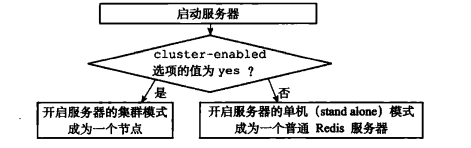
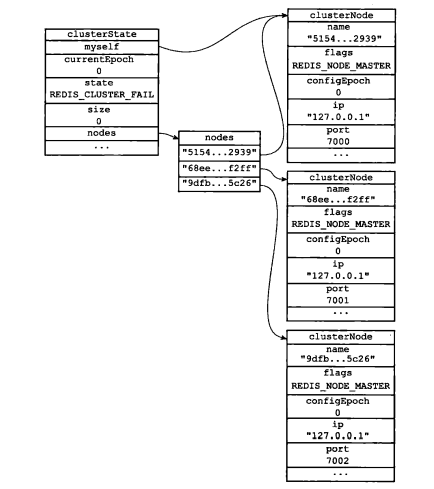
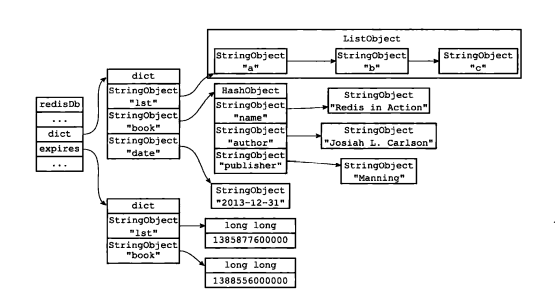
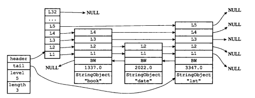
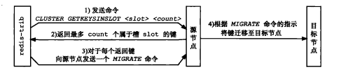
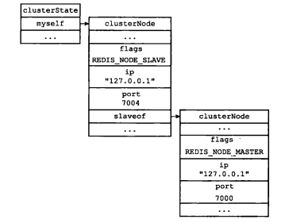
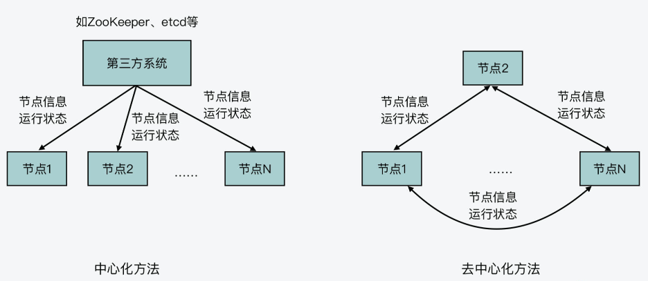
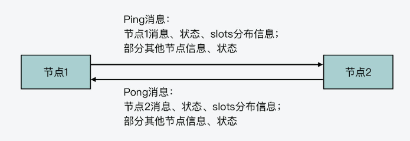
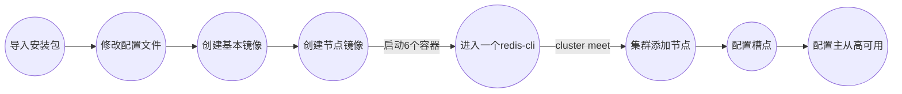

## 集群

Redis集群是Redis 提供的分布式数据库方案，集群通过分片( sharding)来进行数据共享，并提供复制和故障转移功能。

sentinel模式基本可以满足一般生产的需求，具备高可用性。但是当数据量过大到一台服务器存放不下的情况时，主从模式或sentinel模式就不能满足需求了，这个时候需要对存储的数据进行分片，将数据存储到多个Redis实例中。

集群特点：

1. 所有的节点都是一主一从或一主多从，其中从不提供服务，仅作为备用；
2. 不支持同时处理多个key（如MSET/MGET），因为redis需要把key均匀分布在各个节点上，并发量很高的情况下同时创建key-value会降低性能并导致不可预测的行为；
3. 客户端可以连接任何一个主节点进行读写。

### 节点

一个Redis集群通常由多个节点( node)组成，在刚开始的时候，每个节点都是相互独立的，它们都处于一个只包含自己的集群当中，要组建一个真正可工作的集群，我们必须将各个独立的节点连接起来，构成一个包含多个节点的集群。
连接各个节点的工作可以使用CLUSTER MEET命令来完成，该命令的格式如下：

```c
CLUSTER MEET <ip> <port>
```

向一个节点node发送CLUSTER MEET命令，**可以让node节点与ip和port所指定的节点进行握手**( handshake)，当握手成功时，node节点就会将ip和port所指定的节点添加到node节点当前所在的集群中。

一个节点就是一个运行在集群模式下的Redis服务器，Redis服务器在启动时会根据cluster-enabled配置选项是否为yes来决定是否开启服务器的集群模式：

<center></center>

节点(运行在集群模式下的Redis服务器）会继续使用所有在单机模式中使用的服务器组件,比如说：

- 节点会继续使用文件事件处理器来处理命令请求和返回命令回复。
- 节点会继续使用时间事件处理器来执行servercron函数，而**serverCron**函数又会调用集群模式特有的**clustercron**函数。clustercron函数负责执行在集群模式下需要执行的常规操作，例如向集群中的其他节点发送Gossip消息，检查节点是否断线，或者检查是否需要对下线节点进行自动故障转移等。
- 节点会继续使用数据库来保存键值对数据，键值对依然会是各种不同类型的对象。节点会继续使用RDB持久化模块和AOF持久化模块来执行持久化工作。
- 节点会继续使用发布与订阅模块来执行PUBLISH、SUBSCRIBE等命令。节点会继续使用复制模块来进行节点的复制工作。
- 节点会继续使用Lua脚本环境来执行客户端输人的Lua脚本。

除此之外，节点会继续使用redisserver结构来保存服务器的状态，使用redisclient结构来保存客户端的状态，至于那些只有在集群模式下才会用到的数据，节点将它们保存到了**cluster.h/clusterNode结构、cluster.h/clusterLink结构，以及cluster.h/clusterstate结构**里面。

每个节点都会使用一个clusterNode结构来记录自己的状态，并为集群中的所有其他节点（包括主节点和从节点）都创建一个相应的clusterNode结构。

```c
typedef struct clusterNode {
    mstime_t ctime; //创建节点的时间
    char name[CLUSTER_NAMELEN]; //节点的名字，由40个十六进制字符组成
    int flags;     //节点标识，使用各种不同的标识值记录节点的角色(主节点/从节点)，以及节点目前所处的状态(在线/下线)
    uint64_t configEpoch; //节点当前的配置纪元，用于实现故障转移
    unsigned char slots[CLUSTER_SLOTS/8]; /* slots handled by this node */
    int numslots;   /* Number of slots handled by this node */
    int numslaves;  //如果当前结点是主节点，则表示当前节点的从节点数
    struct clusterNode **slaves; //一个数组，每一项指向一个从节点
    struct clusterNode *slaveof; //指向master结点
    mstime_t ping_sent;      /* Unix time we sent latest ping */
    mstime_t pong_received;  /* Unix time we received the pong */
    mstime_t data_received;  /* Unix time we received any data */
    mstime_t fail_time;      /* Unix time when FAIL flag was set */
    mstime_t voted_time;     /* Last time we voted for a slave of this master */
    mstime_t repl_offset_time;  /* Unix time we received offset for this node */
    mstime_t orphaned_time;     /* Starting time of orphaned master condition */
    long long repl_offset;      /* Last known repl offset for this node. */
    char ip[NET_IP_STR_LEN];  //当前节点的ip地址
    int port;                  //当前节点的port号
    int cport;                  /* Latest known cluster port of this node. */
    clusterLink *link;          //保存连接节点所需的有关信息
    list *fail_reports;        //记录了所有节点对该节点的下线报告（故障检测）
} clusterNode;

//结点状态
#define CLUSTER_NODE_MASTER 1     //主节点
#define CLUSTER_NODE_SLAVE 2      //从节点
#define CLUSTER_NODE_PFAIL 4      //疑似下线状态
#define CLUSTER_NODE_FAIL 8       //下线状态
#define CLUSTER_NODE_MYSELF 16    /* This node is myself */
#define CLUSTER_NODE_HANDSHAKE 32 /* We have still to exchange the first ping */
#define CLUSTER_NODE_NOADDR   64  /* We don't know the address of this node */
#define CLUSTER_NODE_MEET 128     /* Send a MEET message to this node */
#define CLUSTER_NODE_MIGRATE_TO 256 /* Master elegible for replica migration. */
#define CLUSTER_NODE_NOFAILOVER 512 /* Slave will not try to failver. */
#define CLUSTER_NODE_NULL_NAME "\000\000\000\000\000\000\000\000\000\000\000\000\000\000\000\000\000\000\000\000\000\000\000\000\000\000\000\000\000\000\000\000\000\000\000\000\000\000\000\000"
```

clusterNode结构的link属性是一个clusterLink 结构，该结构保存了连接节点所需的有关信息，比如套接字描述符，输人缓冲区和输出缓冲区：

```c
typedef struct clusterLink {
    mstime_t ctime;  //连接的创建时间
    int fd;    // TCP 套接字描述符
    sds sndbuf;    //输出缓冲区，保存着等待发送给其他节点的消息（message ）
    sds rcvbuf;    //输入缓冲区，保存着从其他节点接收到的消息
    struct clusterNode *node;    //与这个连接相关联的节点，如果没有的话就为NULL
} clusterLink;
```

>redisClient结构和clusterLink结构的相同和不同之处：
>
>**redisClient结构和clusterLink结构都有自己的套接字描述符和输入、输出缓冲区，这两个结构的区别在于：redisClient结构中的套接字和缓冲区是用于连接客户端的，而clusterLink结构中的套接字和缓冲区则是用于连接节点的。**

每个节点都保存着一个clusterState结构，**这个结构记录了在当前节点的视角下， 集群目前所处的状态，例如集群是在线还是下线，集群包含多少个节点，集群当前的配置纪元**，诸如此类：

```c
typedef struct clusterState {
    clusterNode *myself;    //指向当前节点的指针
    uint64_t currentEpoch;  //集群当前的配置纪元，用于实现故障转移
    //集群当前的状态：是在线还是下线
    //#define CLUSTER_OK 0          /* Everything looks ok */
	//#define CLUSTER_FAIL 1        /* The cluster can't work */
	//#define CLUSTER_NAMELEN 40    /* sha1 hex length */
	//#define CLUSTER_PORT_INCR 10000 /* Cluster port = baseport + PORT_INCR */
    int state;
    int size;   //集群中至少处理着一个槽的节点的数量
    dict *nodes;  //集群节点名单（包括myself 节点）字典的键为节点的名字，字典的值为节点对应的clusterNode 结构
    dict *nodes_black_list; /* Nodes we don't re-add for a few seconds. */
    clusterNode *migrating_slots_to[CLUSTER_SLOTS];    //用于重新分片(导出方)
    clusterNode *importing_slots_from[CLUSTER_SLOTS];  //用于重新分片(导入方)
    clusterNode *slots[CLUSTER_SLOTS];  //记录了集群中所有16384个槽的指派信息
    uint64_t slots_keys_count[CLUSTER_SLOTS];  //每个slot的key数量
    rax *slots_to_keys;    //保存了槽和key之间的关系(老版本跳表，这里是用前缀树！)
    /* The following fields are used to take the slave state on elections. */
    mstime_t failover_auth_time; /* Time of previous or next election. */
    int failover_auth_count;    /* Number of votes received so far. */
    int failover_auth_sent;     /* True if we already asked for votes. */
    int failover_auth_rank;     /* This slave rank for current auth request. */
    uint64_t failover_auth_epoch; /* Epoch of the current election. */
    int cant_failover_reason;   /* Why a slave is currently not able to
                                   failover. See the CANT_FAILOVER_* macros. */
    /* Manual failover state in common. */
    mstime_t mf_end;            /* Manual failover time limit (ms unixtime).
                                   It is zero if there is no MF in progress. */
    /* Manual failover state of master. */
    clusterNode *mf_slave;      /* Slave performing the manual failover. */
    /* Manual failover state of slave. */
    long long mf_master_offset; /* Master offset the slave needs to start MF
                                   or zero if stil not received. */
    int mf_can_start;           /* If non-zero signal that the manual failover
                                   can start requesting masters vote. */
    /* The followign fields are used by masters to take state on elections. */
    uint64_t lastVoteEpoch;     /* Epoch of the last vote granted. */
    int todo_before_sleep; /* Things to do in clusterBeforeSleep(). */
    /* Messages received and sent by type. */
    long long stats_bus_messages_sent[CLUSTERMSG_TYPE_COUNT];
    long long stats_bus_messages_received[CLUSTERMSG_TYPE_COUNT];
    long long stats_pfail_nodes;    /* Number of nodes in PFAIL status,
                                       excluding nodes without address. */
} clusterState;
```

下图展示了节点7000创建的clusterState结构，这个结构从节点7000的角度记录了集群以及集群包含的三个节点的当前状态：

<center></center>

- 结构的**currentEpoch**属性的值为0，表示集群当前的配置纪元为0;
- 结构的**size**属性的值为0，表示集群目前没有任何节点在处理槽，因此结构的state属性的值为**REDIS_CLUSTER_FAIL**，这表示集群目前处于下线状态；
- 结构的nodes字典记录了集群目前包含的三个节点，这三个节点分别由三个clusterNode 结构表示，其中myself指针指向代表节点7000的clusterNode结构，而字典中的另外两个指针 则分别指向代表节点7001和代表节点7002的clusterNode结构，这两个节点是节点7000已知的在集群中的其他节点三个节点的clusterNode结构的flags属**REDIS_NODE_MASTER**，说明三个节点都是主节点。


### SLOTS

Redis集群通过分片的方式来保存数据库中的键值对:集群的整个数据库被分为16384个槽（ slot )，数据库中的每个键都属于这16384个槽的其中一个，集群中的每个节点可以处理0个或最多16384个槽。

当数据库中的16384个槽都有节点在处理时，集群处于上线状态（ ok);相反地，如果数据库中有任何一个槽没有得到处理，那么集群处于下线状态( fail )。

#### 槽指派信息记录

slots信息记录分为三种记录：记录节点的槽指派信息、传播节点的槽指派信息、记录集群所有槽的指派信息

**clusterNode结构的slots和numslots**记录了节点负责哪些槽：

```c
unsigned char slots[CLUSTER_SLOTS/8]; /* slots handled by this node */
int numslots;   /* Number of slots handled by this node */
```

slots属性是一个二进制位数组（ bit array )，这个数组的长度为16384/8=2048个字节，共包含16384个二进制位。

Redis以0为起始索引，16383为终止索引，对slots数组中的16384个二进制位进行编号，并根据索引i上的二进制位的值来判断节点是否负责处理槽i，如果为1则表示负责处理该槽，否则表示不负责处理该槽。

numslots记录了节点负责处理的槽的数量。

一个节点除了会将自己负责处理的槽记录在clusterNode结构的slots属性和numslots属性之外，它还会将自己的slots数组通过消息发送给集群中的其他节点,以此来告知其他节占自己目前负责外理哪些槽。接收节点会在自己的**clusterState.node**中查找发送节点的clusterNode结构，并对结构中的slots数组进行更新。因此集群中每个节点都会知道数据库中的16384个槽分别被指派给了集群中的哪些节点。

clusterState.slots数组中记录了集群中所有16384个槽的指派信息，每一项都是一个指向clusterNode的指针：

- 如果slots[i]指针指向NULL，那么表示槽i尚未指派给任何节点。
- 如果slots[i]指针指向一个clusterNode 结构，那么表示槽i已经指派给了clusterNode结构所代表的节点。

>**一个疑问：为什么是16384(2^14^)，而不是65535(2^16^)呢？**
>
>在redis节点发送心跳包时需要把所有的槽放到这个心跳包里，以便让节点知道当前集群信息，16384=16k，在发送心跳包时使用char进行bitmap压缩后是2kb（16384÷8÷1024=2kb），也就是说使用2k的空间创建了16k的槽数，65535=65k，压缩后就是8kb（65536÷8÷1024=8kb），也就是说需要8k的心跳包。

而在clusterState结构体中，与槽位相关的属性有：

```c
clusterNode *migrating_slots_to[CLUSTER_SLOTS];    //用于重新分片(导出方)
clusterNode *importing_slots_from[CLUSTER_SLOTS];  //用于重新分片(导入方)
clusterNode *slots[CLUSTER_SLOTS];  //记录了集群中所有16384个槽的指派信息
uint64_t slots_keys_count[CLUSTER_SLOTS];  //每个slot的key数量
rax *slots_to_keys;    //保存了槽和key之间的关系(老版本跳表，这里是用前缀树！)
```

接下来会进行介绍。


#### 增加槽命令

CLUSTER ADDSLOTS命令接受一个或多个槽作为参数，并将所有输入的槽指派给接收该命令的节点负责：

```c
CLSTER ADDSLOTS <slot> [slot ... ]
```

指令的处理伪代码：

```c
def cLUSTER_ADDSLOTs (-all_input_slots) :
	# 遍历所有输入槽。检查它们是否都是未看派槽
	for i in al1_input_slots:
		#如果有哪怕一个槽已经被指派给了某个节点
		#那么向客户省返回望误。并终止命令执行
		if ciusterstate-slots[i] != NULL:
			reply_error ()
    		return
   
    #如果所有输入槽都是未指派槽
    #那么再次遍历所有输入糟，将这些槽指派给当前节点
    for i in all_input_alota:
	    #设置clusterstate结构的slots数组
    	#slots[i]的指针指向代表当前节点的clusterNode 结构
	    clusterstate.slots[i]- cluaterstate.myself
    	
        #访问代表当前节点的clustezNode结构的slots数组
        #将数组在东引主上的二进制位设置为1
   	    setslotBit(elusterstate-myself.slots,i)
```

#### 执行命令

当客户端向节点发送与数据库键有关的命令时，接收命令的节点会计算出命令要处理的数据库键属于哪个槽，并检查这个槽是否指派给了自己：

- 如果键所在的槽正好就指派给了当前节点，那么节点直接执行这个命令。
- 如果键所在的槽并没有指派给当前节点，那么节点会向客户端返回一个MOVED错误，指引客户端转向(redirect)至正确的节点，并再次发送之前想要执行的命令。

具体流程：

1. 节点先计算key的CRC16校验和，再和16383做与运算(等价于CRC16(key)%16384)，从而得到一个介于0~16383的槽号：

   ```c
   def slot_number (key):
   	return CRC16[key] & 16383
   ```

2. 当节点计算出健所属的槽i之后，节点就会检查自己在clusterstate.slots数组中的项i，判断键所在的精是否由自己负责：

   - 如果clusterstate.slots[i]等于clusterstate.myself，那么说明槽i由当前节点负责，节点可以执行客户端发送的命令。

   - 如果clusterstate.slots[i]不等于clusterstate.myself，那么说明槽i并非由当前节点负责，节点会根据clusterstate.slots[i]指向的clusterNode结构所记录的节点I和端口号，向客户端返回MOVED错误，指引客户端转向至正在处理槽i的节点。

     MOVED错误的格式为：

     ```c
     MOVED <slot> <ip>:<port>
     ```


### 节点数据库的实现

Redis默认支持16个数据库，可以通过调整Redis的配置文件redis/redis.conf中的databases来修改这一个值，设置完毕后重启Redis便完成配置。

```c
#数据库的数量，默认使用的数据库是DB 0。可以通过SELECT命令选择一个db
databases 16
```

客户端与Redis建立连接后会默认选择0号数据库，不过可以随时使用SELECT命令更换数据库。

上面所说的是单机情况下，**在集群下，每个节点只能使用0号数据库，不支持SELECT的切换。**

集群中节点对键值对和过期时间的保存方式与单机情况下完全相同：

<center></center>

另外，除了将键值对保存在数据库里面之外，**节点还会用clusterState结构中的slots_to_keys跳跃表来保存槽和键之间的关系。**(5.0版本用的是**前缀树**)

```c
zskiplist *slots_to_keys;
或
rax *slots_to_keys;
```

<center></center>

slots_to_keys跳跃表每个节点的分值（ score）都是一个槽号，而每个节点的成员(member)都是一个数据库键：

- 每当节点往数据库中添加一个新的键值对时，节点就会将这个键以及键的槽号关联到slots_to_keys跳跃表。
- 当节点删除数据库中的某个键值对时，节点就会在slots_to_keys跳跃表解除被删除键与槽号的关联。

而前缀树的实现我看了一下源码，主要的插入/更新/删除逻辑可以看db.c#slotToKeyUpdateKey方法：

```c
void slotToKeyUpdateKey(robj *key, int add) {
    unsigned int hashslot = keyHashSlot(key->ptr,sdslen(key->ptr));
    unsigned char buf[64];
    unsigned char *indexed = buf;
    size_t keylen = sdslen(key->ptr);   //key的长度

    server.cluster->slots_keys_count[hashslot] += add ? 1 : -1;
    if (keylen+2 > 64) indexed = zmalloc(keylen+2);   //若用于存储slot的两位+key的长度超过了64字节就重新分配
    indexed[0] = (hashslot >> 8) & 0xff;  //下标0存储slot的高8位
    indexed[1] = hashslot & 0xff;  //下标1存储slot的低8位
    memcpy(indexed+2,key->ptr,keylen);  //剩余的空间存储key值
    if (add) {
        raxInsert(server.cluster->slots_to_keys,indexed,keylen+2,NULL,NULL); //插入char数组
    } else {
        raxRemove(server.cluster->slots_to_keys,indexed,keylen+2,NULL);  //删除char数组
    }
    if (indexed != buf) zfree(indexed);
} 
```

### 重新分片

在集群稳定一段时间之后，**如果有新的集群节点加入，或者某个集群节点下线了**。此时就涉及到将某个节点上的槽位迁移到另一个节点上的问题。

该过程也是需要手动完成的，Redis提供了辅助脚本**redis-trib.rb**，以”reshard”参数调用该脚本就可以实现重新分片的操作。但是本质上，该脚本就是通过向迁入节点和迁出节点发送一些命令实现的。

redis-trib对集群的单个槽slot进行重新分片的步骤如下:

1. redis-trib对目标节点发送CLUSTER SETSLOT \<slot\> IMPORTING <source_id>命令，让目标节点准备好从源节点导入(import)属于槽slot的键值对。
2. redis-trib对源节点发送CLUSTER SETSLOT \<slot> MIGRATING <target_id>命令，让源节点准备好将属于槽slot 的键值对迁移(migrate)至目标节点。
3. redis-trib向源节点发送CLUSTER GETKEYSINSLOT \<slot> \<count>命令，获得最多count个属于槽slot的键值对的键名( key name )。
4. 对于步骤3获得的每个键名，redis-trib都向源节点发送一个MIGRATE \<target_ip> \<target_port> \<key_name> 0 \<timeout>命令，将被选中的键原子地从源节点迁移至目标节点。（0是<target_database>，在集群下每个节点只能使用0号db，且该命令是原子性的将key从A迁移到B，迁移过程中，节点A和节点B都会阻塞（很小的时间），从而避免了竞争的发生）
5. 重复执行步骤3和步骤4，直到源节点保存的所有属于槽slot 的健值对都被迁移至目标节点为止。每次迁移键的过程如下图所示。
6. redis-trib向集群中的任意一个节点发送 CLUSTER SETSLOT \<slot> NODE \<target_id>命令，将槽slot指派给目标节点，这一指派信息会通过消息发送至整个集群，最终集群中的所有节点都会知道槽slot已经指派给了目标节点。

<center></center>

#### 集群节点执行命令

在集群模式下，数据库的key分布在多个集群节点中。因此当某个集群节点收到客户端的命令时，与普通模式下稍有不同。这不同主要体现在：

1. 若命令中涉及到多个key，而这些key处于不同的槽位中，则该命令不能被执行，直接返回错误；

2. 某个集群节点收到客户端发来的命令后，会判断命令中的key是否由本节点负责，若是，则直接处理命令；若不是，则反馈给客户端MOVED重定向错误，错误中指明了该key真正的负责节点。客户端收到MOVED重定向错误之后，需要重新向真正的负责节点再次发送命令；

3. 当进行重新分片时，源节点正向目标节点迁移一个槽，当客户端向源节点发送一个与数据库键有关的命令，并且命令要处理的数据库键恰好就属于正在被迁移的槽时：

   ①源节点会先在自己的数据库里面查找指定的键。如果找到的话，就直接执行客户端发送的命令；

   ②相反地，如果源节点没能在自己的数据库里面找到指定的键，那么这个键有可能巳经被迁移到了目标节点，源节点将向客户端返回一个ASK错误，指引客户端转向正在导人槽的目标节点,并再次发送之前想要执行的命令。客户端收到ASK错误之后，需要先向目标节点发送”ASKING”命令，然后再向B节点发送该命令。


#### MOVED错误和ASK错误的区别

ASK错误和 MOVED错误都会导致客户端转向，它们的区别在于：

- **MOVED错误代表槽的负责权已经从一个节点转移到了另一个节点**：在客户端收到关于槽i的MOVED错误之后，客户端每次遇到关于槽i的命令请求时，都可以直接将命令请求发送至MOVED错误所指向的节点，因为该节点就是目前负责槽i的节点。
- 与此相反，**ASK错误只是两个节点在迁移槽的过程中使用的一种临时措施**：在客户端收到关于槽i的ASK错误之后，客户端只会在接下来的一次命令请求中将关于槽i的命令请求发送至ASK错误所指示的节点，但这种转向不会对客户端今后发送关于槽主的命令请求产生任何影响，客户端仍然会将关于槽i的命令请求发送至目前负责处理槽i的节点，除非ASK错误再次出现。

#### IMPORTING命令的实现

clusterstate结构的**importing_slots_from**数组记录了当前节点正在从其他节点导入的槽。如果importing_slots_from[i]的值不为NULL，而是指向一个clusterNode结构，那么表示当前节点正在从clusterNode所代表的节点导入槽i。

#### MIGRATING命令的实现

clusterstate 结构的**migrating_slots_to**数组记录了当前节点正在迁移至其他节点的槽。如果migrating_slots_to[i]的值不为NULL，而是指向一个clusterNode结构，那么表示当前节点正在将槽i迁移至clusterNode所代表的节点。

#### ASKING命令

ASKING命令唯一要做的就是打开发送该命令的客户端的REDIS ASKING标识。

在一般情况下，如果客户端向节点发送一个关于槽i的命令，而槽i又没有指派给这个节点的话，那么节点将向客户端返回一个MOVED错误；但是，如果节点的clusterstate.importing_slots_from[i]显示节点正在导入槽i，并且发送命令的客户端带有REDIS_ASKING标识，那么节点将破例执行这个关于槽i的命令一次。

**当客尸端接收到ASK错误井转向至正在导入槽的节点时，客户端会先向节点发送一个ASKING命令，然后才重新发送想要执行的命令**，这是因为如果客户端不发送ASKING命令，而直接发送想要执行的命令的话，那么客户端发送的命令将被节点拒绝执行，并返回MOVED错误。


### 复制与故障转移

Redis集群中的节点分为主节点(master)和从节点(slave)，其中主节点用于处理槽,而从节点则用于复制某个主节点，并在被复制的主节点下线时,代替下线主节点继续处理命令请求。

#### 设置从节点

单机模式下以 SLAVEOF 命令触发； cluster 模式下以 REPLICATE 命令触发，且 **cluster 模式下不支持 SLAVEOF 命令**。

```bash
CLUSTER REPLICATE <node_id>
```

可以让接收命令的节点成为node_id所指定节点的从节点，并开始对主节点进行复制。

1. 接收到该命令的节点首先会在自己的clusterstate.nodes字典中找到node_id所对应节点的clusterNode结构，并将自己的clusterstate.myself.slaveof指针指向这个结构，以此来记录这个节点正在复制的主节点。
2. 然后节点会修改自已在clusterstate.myself.flags 中的属性。关闭原本的REDIs_NODE_MASTER标识，打开REDIS_NODE_SLAVE标识，表示这个节点已经由原来的主节点变成了从节点。
3. 最后，节点会调用复制代码，并根据clusterstate.myself.slaveof指向的clusterNode 结构所保存的IP地址和端口号，对主节点进行复制。因为节点的复制功能和单机Redis服务器的复制功能使用了相同的代码，所以让从节点复制主节点相当于向从节点发送命令SLAVEOF \<master_ip> \<master _port>。
   17-35展示了节点7004在复制节点7000时的clusterstate结构:

如：

<center></center>

一个节点成为从节点，并开始复制某个主节点这一俏恳会通过消息发送给集群中的其他节点，最终集群中的所有节点都会知道某个从节点正在复制某个主节点。

集群中的所有节点都会在代表主节点的clusterNode结构的slaves属性和numslaves属性中记录正在复制这个主节点的从节点名单：

```c
typedef struct clusterNode {
    ...
    int numslaves;  //如果当前结点是主节点，则表示当前节点的从节点数
    struct clusterNode **slaves; //一个数组，每一项指向一个从节点
    ...
} clusterNode
```

#### 故障检测

集群中的每个节点都会定期地向集群中的其他节点发送 PING消息，以此来检测对方是否在线，如果接收PING消息的节点没有在规定的时间内，向发送PING消息的节点返回PONG消息，那么发送PING消息的节点就会将接收PING消息的节点标记为疑似下线(probable fail，PFAIL)。

集群中的各个节点会通过互相发送消息的方式来交换集群中各个节点的状态信息，例如某个节点是处于在线状态、疑似下线状态（PFAIL)，还是已下线状态（FAIL )。

当一个主节点A通过消息得知主节点B认为主节点C进入了疑似下线状态时，主节点A会在自己的clusterstate.nodes字典中找到主节点C所对应的clusterNode结构，并将主节点B的下线报告（failure report）添加到clusterNode结构的fail_reports链表里面：

```c
typedef struct clusterNode {
    ...    
	list *fail_reports;        //记录了所有节点对该节点的下线报告（故障检测）
} clusterNode
```

每一个下线报告都是一个cluster.h#clusterNodeFailReport：

```c
typedef struct clusterNodeFailReport {
    struct clusterNode *node; //报告该节点已经下线的节点
    mstime_t time;            //最后一次从该node节点收到下线报告的时问，程序使用这个时间来检查下线报告是否过期（与当前时间相差太久的下线报告会被删除)
} clusterNodeFailReport;
```

如果在一个集群里面，半数以上负责处理槽的主节点都将某个主节点x报告为疑似下线，那么这个主节点x将被标记为已下线(FAIL)。将主节点x标记为已下线的节点会向集群广播一条关于主节点×的FAIL消息，所有收到这条FAIL消息的节点都会立即将主节点x标记为已下线。

#### 故障转移

当一个从节点发现自己正在复制的主节点进入了已下线状态时，从节点将开始对下线主节点进行故障转移，以下是故障转移的执行步骤:

1. 下线主节点的所有从节点里面，会有一个从节点被选中；
2. 被选中的从节点会执行调用clusterSetNodeAsMaster，将当前从节点从其主节点的slaves数组中删除，将当前节点的标志位中，清除REDIS_NODE_SLAVE标记，增加REDIS_NODE_MASTER标记，并置当前节点的主节点为NULL。此时该从节点才成为主节点；
3. 新的主节点会撤销所有对已下线主节点的槽指派，并将这些槽全部指派给自己；
4. 新的主节点向集群广播一条PONG消息，这条PONG消息可以让集群中的其他节点立即知道这个节点已经由从节点变成了主节点，并且这个主节点已经接管了原本由已下线节点负责处理的槽；
5. 新的主节点开始接收和自己负责处理的槽有关的命令请求，故障转移完成。

集群通过选举产生主节点：

1. 集群的配置纪元是一个自增计数器,它的初始值为0(uint64_t configEpoch)。
2. 当集群里的某个节点开始一次故障转移操作时，集群配置纪元的值会被增一。
3. 对于每个配置纪元，集群里**每个负责处理槽的主节点**都有一次投票的机会，而第一个向主节点要求投票的从节点将获得主节点的投票。
4. 当从节点发现自己正在复制的主节点进入已下线状态时(具体的会进行很多判断和时间的选取，可以看源码部分的介绍，很复杂)，从节点会向集群广播一条CLUSTERMSG_TYPE_FAILOVER_AUTH_REQUEST消息，要求所有收到这条消息、并且具有投票权的主节点向这个从节点投票。
5. 如果一个主节点具有投票权（它正在负责处理槽)，并且这个主节点尚未投票给其他从节点，那么主节点将向要求投票的从节点返回一条CLUSTERMSG_TYPE_FAILOVER_AUTH_ACK 消息，表示这个主节点支持从节点成为新的主节点。
6. 每个参与选举的从节点都会接收CLUSTERMSG_TYPE_FAILOVER_AUTH_ACK消息，并根据自己收到了多少条这种消息来统计自己获得了多少主节点的支持。
7. 如果集群里有N个具有投票权的主节点，那么当一个从节点收集到大于等于N/2+1张支持票时，这个从节点就会当选为新的主节点。
8. 因为在每一个配置纪元里面，每个具有投票权的主节点只能投一次票，所以如果有N个主节点进行投票，那么具有大于等于N/2+1张支持票的从节点只会有一个，这确保了新的主节点只会有一个。
9. 如果在一个配置纪元里面没有从节点能收集到足够多的支持票，那么集群进入一个新的配置纪元，并再次进行选举，直到选出新的主节点为止。

这个选举新主节点的方法和前面的选举领头Sentinel的方法非常相似，因为两者都是基于Rafn算法的领头选举( leader election)方法来实现的。


#### 手动故障转移

Redis集群支持手动故障转移。也就是向从节点发送”**CLUSTER FAILOVER**”命令，**使其在主节点未下线的情况下，发起故障转移流程，升级为新的主节点，而原来的主节点降级为从节点**。为了不丢失数据，向从节点发送”CLUSTER FAILOVER”命令后，流程如下：

- 从节点收到命令后，向主节点发送**CLUSTERMSG_TYPE_MFSTART**包；
- 主节点收到该包后，会**将其所有客户端置于阻塞状态，也就是在10s的时间内，不再处理客户端发来的命令；并且在其发送的心跳包中，会带有CLUSTERMSG_FLAG0_PAUSED标记；**
- **从节点收到主节点发来的，带CLUSTERMSG_FLAG0_PAUSED标记的心跳包后，从中获取主节点当前的复制偏移量。从节点等到自己的复制偏移量达到该值后，才会开始执行故障转移流程**：发起选举、统计选票、赢得选举、升级为主节点并更新配置；

 ”CLUSTER FAILOVER”命令支持两个选项：**FORCE**和**TAKEOVER**。使用这两个选项，可以改变上述的流程。

- 如果有FORCE选项，则从节点不会与主节点进行交互，主节点也不会阻塞其客户端，而是从节点立即开始故障转移流程：发起选举、统计选票、赢得选举、升级为主节点并更新配置；
- 如果有TAKEOVER选项，则更加简单粗暴：从节点不再发起选举，而是直接将自己升级为主节点，接手原主节点的槽位，增加自己的configEpoch后更新配置。

因此，**使用FORCE和TAKEOVER选项，主节点可以已经下线；而不使用任何选项，只发送”CLUSTER FAILOVER”命令的话，主节点必须在线**。


### 消息

#### Gossip协议

对于一个分布式集群来说，它的良好运行离不开集群节点信息和节点状态的正常维护。为了实现这一目标，通常我们可以选择中心化的方法，使用一个第三方系统，比如 Zookeeper 或 etcd，来维护集群节点的信息、状态等。同时，我们也可以选择去中心化的方法，让每个节点都维护彼此的信息、状态，并且使用集群通信协议 Gossip 在节点间传播更新的信息，从而实现每个节点都能拥有一致的信息。

下图就展示了这两种集群节点信息维护的方法，你可以看下：

<center></center>

简单来说，在一个使用了 Gossip 协议的集群中，每个集群节点会维护一份集群的状态信息，包括集群中各节点的信息、运行状态，以及数据在各节点间的分布情况。

对于 Redis 来说，集群节点信息包括了节点名称、IP、端口号等，而节点运行状态主要用两个时间来表示，分别是节点向其他节点发送 PING 消息的时间，以及它自己收到其他节点返回的 PONG 消息的时间。最后，集群中数据的分布情况，在 Redis 中就对应了 Redis Cluster 的 slots 分配情况，也就是每个节点拥有哪些 slots。

当集群节点按照 Gossip 协议工作时，每个节点会以一定的频率从集群中随机挑选一些其他节点，把自身的信息和已知的其他节点信息，用 PING 消息发送给选出的节点。而其他节点收到 PING 消息后，也会把自己的信息和已知的其他节点信息，用 PONG 消息返回给发送节点，这个过程如下图所示：


<center></center>

Gossip 协议正是通过这种**随机挑选通信节点**的方法，让节点信息在整个集群中传播。当有节点维护的信息发生变化时，比如数据布局信息发生了改变，那么通过几轮通信后，其他节点也可以获得这一变化的信息了。这样一来，就实现了分布式集群所有节点维护一致的状态信息的目标。


#### 消息类型

Redis 源码在 **cluster.h** 文件中，通过宏定义定义了**节点间通信的消息类型**。下面的代码列了几种常见的消息，包括：

- **MEET消息**：当发送者接到客户端发送的CLUSTER MEET命令时，发送者会向接收者发送MEET消息，请求接收者加入到发送者当前所处的集群里面。
- **PING 消息**：**集群里的每个节点默认每隔一秒钟就会从已知节点列表中随机选出五个节点，然后对这五个节点中最长时间没有发送过PING消息的节点发送PING消息，以此来检测被选中的节点是否在线以及传送消息**；除此之外，如果节点A最后一次收到节点B发送的PONG消息的时间，距离当前时间已经超过了节点A的**cluster-node-timeout**选项设置时长的一半，那么节点A也会向节点B发送PING消息，这可以防止节点A因为长时间没有随机选中节点B作为PING消息的发送对象而导致对节点B的信息更新滞后。
- **PONG消息**：**当接收者收到发送者发来的MEET消息或者PING消息时**，为了向发送者确认这条MEET消息或者PING消息已到达，接收者会向发送者返回一条PONG消息；另外，**一个节点也可以通过向集群广播自己的PONG消息来让集群中的其他节点立即刷新关于这个节点的认识**，例如当一次故障转移操作成功执行之后，新的主节点会向集群广播一条PONG消息，以此来让集群中的其他节点立即知道这个节点已经变成了主节点,并且接管了已下线节点负责的槽。
- **FAIL消息**：当一个主节点A判断另一个主节点B已经进人FAIL状态时，节点A会向集群广播一条关于节点B的FAIL消息，所有收到这条消息的节点都会立即将节点B标记为已下线。
- **PUBLISH消息**：当节点接收到一个PUBLISH命令时，节点会执行这个命令，并向集群广播一条PUBLISH消息，所有接收到这条PUBLISH消息的节点都会执行相同的PUBLISH命令。

**redis实现Gossip协议主要是靠PING、PONG、MEET这三种消息的传送来实现的。**

当然还有其他的：

```c
#define CLUSTERMSG_TYPE_PING 0  //Ping消息，用来向其他节点发送当前节点信息
#define CLUSTERMSG_TYPE_PONG 1  //Pong消息，对Ping消息的回复
#define CLUSTERMSG_TYPE_MEET 2  //Meet消息，表示某个节点要加入集群
#define CLUSTERMSG_TYPE_FAIL 3  //Fail消息，表示某个节点有故障

/* Message types.
 *
 * Note that the PING, PONG and MEET messages are actually the same exact
 * kind of packet. PONG is the reply to ping, in the exact format as a PING,
 * while MEET is a special PING that forces the receiver to add the sender
 * as a node (if it is not already in the list). */
#define CLUSTERMSG_TYPE_PING 0          /* Ping */
#define CLUSTERMSG_TYPE_PONG 1          /* Pong (reply to Ping) */
#define CLUSTERMSG_TYPE_MEET 2          /* Meet "let's join" message */
#define CLUSTERMSG_TYPE_FAIL 3          /* Mark node xxx as failing */
#define CLUSTERMSG_TYPE_PUBLISH 4       /* Pub/Sub Publish propagation */
#define CLUSTERMSG_TYPE_FAILOVER_AUTH_REQUEST 5 /* May I failover? */
#define CLUSTERMSG_TYPE_FAILOVER_AUTH_ACK 6     /* Yes, you have my vote */
#define CLUSTERMSG_TYPE_UPDATE 7        /* Another node slots configuration */
#define CLUSTERMSG_TYPE_MFSTART 8       /* Pause clients for manual failover */
#define CLUSTERMSG_TYPE_MODULE 9        /* Module cluster API message. */
#define CLUSTERMSG_TYPE_COUNT 10        /* Total number of message types. */
```


#### 消息头和正文

节点发送的所有消息都由一个消息头包裹，消息头除了包含消息正文之外，还记录了消息发送者自身的一些信息，因为这些信息也会被消息接收者用到，所以严格来讲，我们可以认为消息头本身也是消息的一部分。

每一个消息头都有一个cluster.h/clusterMsg结构表示：

```c
typedef struct {
    char sig[4];        /* Signature "RCmb" (Redis Cluster message bus). */
    uint32_t totlen;    //消息长度，=消息头长度+消息正文长度
    uint16_t ver;       /* Protocol version, currently set to 1. */
    uint16_t port;      //节点客户端通讯端口，与客户端进行通信，例如6379
    uint16_t type;      //消息类型,CLUSTERMSG_TYPE_XXX
    uint16_t count;     //消息正文包含的节点信息数量，只在发送MEET/PING/PONG这三种Gossip协议消息时使用
    uint64_t currentEpoch;  //发送者的配置纪元
    uint64_t configEpoch;   //如果发送者是主节点，就是自身的配置纪元；如果发送者是从节点，就是正在复制的主节点的配置纪元
    uint64_t offset;    //主从复制偏移量，如果是从节点则获取对应主节点的复制偏移量
    char sender[CLUSTER_NAMELEN];  //发送者的node_id
    unsigned char myslots[CLUSTER_SLOTS/8];  //发送者目前的槽指派信息
    char slaveof[CLUSTER_NAMELEN];   //如果发送者是一个从节点，就是正在复制的主节点的名字；如果发送者是一个主节点，就是REDIS_NODE_NULL_NAME
    char myip[NET_IP_STR_LEN];    //发送者的ip
    char notused1[34];  /* 34 bytes reserved for future usage. */
    uint16_t cport;      //节点间通讯的端口,一般为port+10000，例如16379
    uint16_t flags;     //发送者的标识值
    unsigned char state; //发送者所处集群的状态
    unsigned char mflags[3]; /* Message flags: CLUSTERMSG_FLAG[012]_... */
    union clusterMsgData data;  //消息的正文
} clusterMsg;
```

> 集群中每个节点必须开两个端口：port，cport。port为配置文件指定，cport是port+10000

data指向消息的正文，即一个联合cluster.h/clusterMsgData：

```c
union clusterMsgData {
    /* PING, MEET and PONG */
    struct {
        /* Array of N clusterMsgDataGossip structures */
        clusterMsgDataGossip gossip[1];
    } ping;

    /* FAIL */
    struct {
        clusterMsgDataFail about;
    } fail;

    /* PUBLISH */
    struct {
        clusterMsgDataPublish msg;
    } publish;

    /* UPDATE */
    struct {
        clusterMsgDataUpdate nodecfg;
    } update;

    /* MODULE */
    struct {
        clusterMsgModule msg;
    } module;
};
```

clusterMsg 结构的 currentEpoch，sender、myslot等属性记录了发送者自身的的节点信息，接收者会根据这些信息，在自己的clusterstate.nodes字典里找到发送者对应的clueterNode结构并对结构讲行更新。


#### MEET、PING、PONG消息的实现

Redis集群中的各个节点通过Gossip协议来交换各自关于不同节点的状态信息，其中Gossip协议由MEET、PING、PONG三种消息实现，这三种消息的正文都由两个cluster.h/clusterMsgDataGossip结构组成：

```c
typedef struct {
    char nodename[CLUSTER_NAMELEN];  //节点的node_id
    uint32_t ping_sent;    //上一次发送ping的时间戳
    uint32_t pong_received;    //上一次收到pong的时间戳
    char ip[NET_IP_STR_LEN];  //节点的ip
    uint16_t port;            //节点的客户端通讯端口
    uint16_t cport;           //节点的节点间通讯端口
    uint16_t flags;           //节点的标识值
    uint32_t notused1;
} clusterMsgDataGossip;
```

每次发送MEET、PING、PONG消息时，发送者都从自己的已知节点列表中随机选出两个节点（可以是主节点或者从节点)，并将这两个被选中节点的信息分别保存到两个clusterMsgDataGossip结构里面，**Redis 使用 clusterMsg 结构体作为节点间通信的消息，就可以实现 Gossip 协议的通信目的**。

当接收者收到MEET、PING、PONG消息时，接收者会访问消息正文中的两个clusterMsgDataGossip结构，并根据自己是否认识clusterMsgDataGossip结构中记录的被选中节点来选择进行哪种操作：

- 如果被选中节点不存在于接收者的已知节点列表，那么说明接收者是第一次接触到被选中节点，接收者将根据结构中记录的IP地址和端口号等信息，与被选中节点进行握手。
- 如果被选中节点已经存在于接收者的已知节点列表，那么说明接收者之前已经与被选中节点进行过接触，接收者将根据clusterMsgDataGossip结构记录的信息，对被选中节点所对应的clusterNode结构进行更新。

ping和pong其实都是通过**clusterSendPing**函数创建并发布的，操作几乎相同。而ping、pong、meet这三种消息在消息处理函数**clusterReadHandler**的处理几乎相同。

>原生Gossip过程是由种子节点发起，当一个种子节点有状态需要更新到网络中的其他节点时，它会随机的选择周围几个节点散播消息，收到消息的节点也会重复该过程，直至最终网络中所有的节点都收到了消息。这个过程可能需要一定的时间，由于不能保证某个时刻所有节点都收到消息，但是理论上最终所有节点都会收到消息，因此它是一个**最终一致性协议**。每次散播消息都选择尚未发送过的节点进行散播。
>
>如果你要开发 Gossip 协议，可以参考这里 clusterMsg、clusterMsgData 和 clusterMsgDataGossip 的定义。

#### FAIL消息的实现

当集群里的主节点A将主节点B标记为已下线(FAIL)时，主节点A将向集群广播一条关于主节点B的FAIL消息，所有接收到这条FAIL消息的节点都会将主节点B标记为已下线。

在集群的节点数量比较大的情况下，单纯使用Gossip 协议来传播节点的已下线信息会给节点的信息更新带来一定延迟，因为Gossip协议消息通常需要一段时间才能传播至整个集群，而**发送FAIL消息可以让集群里的所有节点立即知道某个主节点已下线，从而尽快判断是否需要将集群标记为下线，又或者对下线主节点进行故障转移**。

FAIL消息的正文由cluster.h/clusterMsgDataFail结构表示，这个结构只包含一个nodename属性，该属性记录了已下线节点的名字(node_id)：

```c
typedef struct {
    char nodename[CLUSTER_NAMELEN];
} clusterMsgDataFail;
```

#### PUBLISH消息的实现

当客户端向集群中的某个节点发送命令：PUBLISH \<channel> \<message>的时候，接收到PUBLISH命令的节点不仅会向channel频道发送消息message，它还会向集群广播一条PUBLISH消息，所有接收到这条PUBLISH消息的节点都会向channel频道发送message消息。

换句话说,向集群中的某个节点发送命令：PUBLISH \<channe1> \<message>将导致集群中的所有节点都向channe1频道发送message消息。

PUBLISH消息的正文由cluster.h/clusterMsgDataPublish结构表示：

```c
typedef struct {
    uint32_t channel_len;
    uint32_t message_len;
    unsigned char bulk_data[8]; /* 8 bytes just as placeholder. */
} clusterMsgDataPublish;
```

clusterMsgData Publish结构的bulk_data属性是一个字节数组，这个字节数组保存了客户端通过PUBLISH命令发送给节点的channel参数和message参数，而结构的channel_len和message_len则分别保存channel参数的长度和message参数的长度：

- 其中bulk_data的0字节至channel_len-1字节保存的是channel参数。
- 而bulk_data的channel_len字节至channe1_len+message_len-1字节呆存的则是message参数。

>Q：为什么不直接向节点广播PUBLISH命令？
>A：实际上，要让集群的所有节点都执行相同的PUBLISH命令，最简单的方法就是向所有节点广播相同的PUBLISH命令，这也是Redis 在复制PUBLISH命令时所使用的方法，不过因为这种做法并不符合Redis集群的“**各个节点通过发送和接收消息来进行通信**”这一规则，所以节点没有采取广播PUBLISH命令的做法。


### 孤立节点(从节点迁移)

在Redis集群中，为了增强集群的可用性，一般情况下需要为每个主节点配置若干从节点。但是这种主从关系如果是固定不变的，则经过一段时间之后，就有可能出现孤立主节点的情况，也就是一个主节点再也没有可用于故障转移的从节点了，一旦这样的主节点下线，整个集群也就不可用了。

因此，在Redis集群中，增加了从节点迁移的功能。简单描述如下：一旦发现集群中出现了孤立主节点，则某个从节点A就会自动变成该孤立主节点的从节点。该从节点A满足这样的条件：A的主节点具有最多的附属从节点；A在这些附属从节点中，节点ID是最小的。


### 集群搭建

[搭建看这篇文章,有效](http://codekiller.top/2020/03/30/redis-cluster/)




### 集群命令

```shell
CLUSTER INFO 打印集群的信息 
CLUSTER NODES 列出集群当前已知的所有节点（node），以及这些节点的相关信息。  

//节点(node) 
CLUSTER MEET <ip> <port> 将 ip 和 port 所指定的节点添加到集群当中，让它成为集群的一份子。 
CLUSTER FORGET <node_id> 从集群中移除 node_id 指定的节点。 
CLUSTER REPLICATE <node_id> 将当前节点设置为 node_id 指定的节点的从节点。 
CLUSTER SAVECONFIG 将节点的配置文件保存到硬盘里面。  

//槽(slot) 
CLUSTER ADDSLOTS <slot> [slot ...] 将一个或多个槽（slot）指派（assign）给当前节点。 
CLUSTER DELSLOTS <slot> [slot ...] 移除一个或多个槽对当前节点的指派。 
CLUSTER FLUSHSLOTS 移除指派给当前节点的所有槽，让当前节点变成一个没有指派任何槽的节点。 
CLUSTER SETSLOT <slot> NODE <node_id> 将槽 slot 指派给 node_id 指定的节点，如果槽已经指派给另一个节点，那么先让另一个节点删除该槽>，然后再进行指派。 
CLUSTER SETSLOT <slot> MIGRATING <node_id> 将本节点的槽 slot 迁移到 node_id 指定的节点中。 
CLUSTER SETSLOT <slot> IMPORTING <node_id> 从 node_id 指定的节点中导入槽 slot 到本节点。 
CLUSTER SETSLOT <slot> STABLE 取消对槽 slot 的导入（import）或者迁移（migrate）。  

//键 (key) 
CLUSTER KEYSLOT <key> 计算键 key 应该被放置在哪个槽上。 
CLUSTER COUNTKEYSINSLOT <slot> 返回槽 slot 目前包含的键值对数量。 
CLUSTER GETKEYSINSLOT <slot> <count> 返回 count 个 slot 槽中的键。
```


### Redis Cluster原理

1. node1和node2首先进行握手meet，知道彼此的存在
2. 握手成功后，两个节点会定期发送ping/pong消息，交换数据信息(消息头，消息体)
3. 消息头里面有个字段：unsigned char myslots[CLUSTER_SLOTS/8]，每一位代表一个槽，如果该位是1，代表该槽属于这个节点
4. 消息体中会携带一定数量的其他节点的信息，大约占集群节点总数量的十分之一，至少是3个节点的信息。节点数量越多，消息体内容越大。
5. 每秒都在发送ping消息。每秒随机选取5个节点，找出最久没有通信的节点发送ping消息。
6. 每100毫秒都会扫描本地节点列表，如果发现节点最近一次接受pong消息的时间大于cluster-node-timeout/2,则立即发送ping消息

redis集群的主节点数量基本不可能超过1000个，超过的话可能会导致网络拥堵。


### 在集群中录入值(组的概念)

redis-cli客户端提供-c参数实现自动重定向

```shell
redis-cli -c -p 6379
```

不在一个slot下的键值，是不能使用mget，mset等多键操作

可以通过{}来定义`组的概念`，从而使key中{}内相同内容的键值对放到一个slot中去。

```shell
set user:{info}:name xxx
set age{info} 12
set {info}email 12345@qq.com
hset user{info} name jiang
hset user{info} age 19
hset user{info} eamil 12345@qq.com

#结果
172.17.0.3:6379> keys *
1) "user{info}"
2) "{info}email"
3) "user:{info}:name"
4) "age{info}"
------------------------------------------------------
172.17.0.3:6379> hkeys user{info}
1) "name"
2) "age"
3) "eamil"
```

