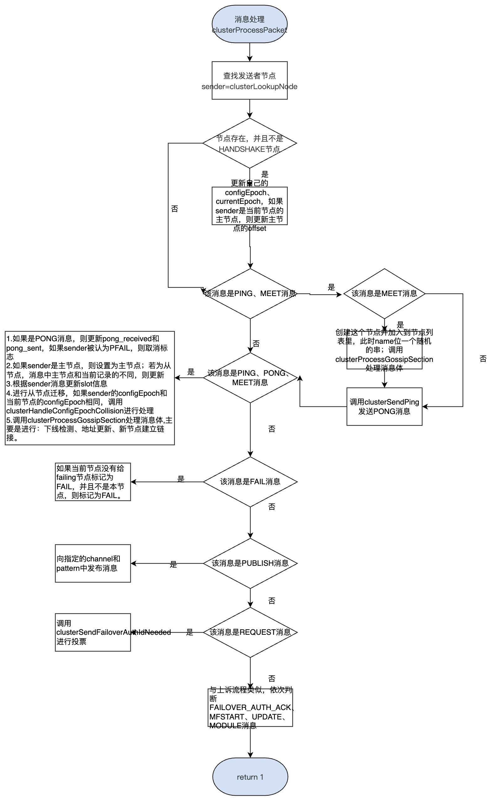
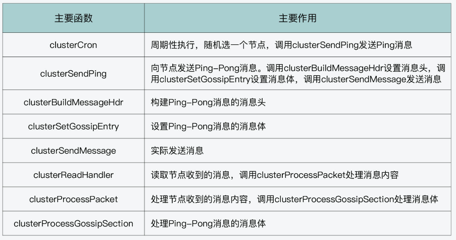

## 集群源码分析

### 初始化

Redis实例启动时，根据配置文件中的"cluster-enabled"选项，决定该Redis实例是否处于集群模式。如果该选项值为”yes”，则Redis实例中的server.cluster_enabled被置为1，表示当前处于集群模式。

在main函数中的**initServer**中，如果**server.cluster_enabled**为1，则调用**clusterInit**，初始化集群需要使用的结构，并创建监听端口。该函数的代码如下：

```c
void clusterInit(void) {
    int saveconf = 0;

    //1.初始化clusterState结构类型server.cluster中的各个属性
    server.cluster = zmalloc(sizeof(clusterState));
    server.cluster->myself = NULL;
    server.cluster->currentEpoch = 0;
    server.cluster->state = CLUSTER_FAIL;
    server.cluster->size = 1;
    server.cluster->todo_before_sleep = 0;
    server.cluster->nodes = dictCreate(&clusterNodesDictType,NULL);
    server.cluster->nodes_black_list =
        dictCreate(&clusterNodesBlackListDictType,NULL);
    server.cluster->failover_auth_time = 0;
    server.cluster->failover_auth_count = 0;
    server.cluster->failover_auth_rank = 0;
    server.cluster->failover_auth_epoch = 0;
    server.cluster->cant_failover_reason = CLUSTER_CANT_FAILOVER_NONE;
    server.cluster->lastVoteEpoch = 0;
    for (int i = 0; i < CLUSTERMSG_TYPE_COUNT; i++) {
        server.cluster->stats_bus_messages_sent[i] = 0;
        server.cluster->stats_bus_messages_received[i] = 0;
    }
    server.cluster->stats_pfail_nodes = 0;
    memset(server.cluster->slots,0, sizeof(server.cluster->slots));
    clusterCloseAllSlots();

    /* Lock the cluster config file to make sure every node uses
     * its own nodes.conf. */
    //2.如果在Redis配置文件中指定了"cluster-config-file"选项的值，则用server.cluster_configfile属性记录该选项值，表示集群配置文件
    server.cluster_config_file_lock_fd = -1;
    if (clusterLockConfig(server.cluster_configfile) == C_ERR)
        exit(1);

    /* Load or create a new nodes configuration. */
    //根据配置文件的内容，初始化server.cluster中的各个属性
    //如果加载集群配置文件失败（或者配置文件不存在）
    if (clusterLoadConfig(server.cluster_configfile) == C_ERR) {
        /* No configuration found. We will just use the random name provided
         * by the createClusterNode() function. */
        //以REDIS_NODE_MYSELF和REDIS_NODE_MASTER为标记，创建一个clusterNode结构表示自己本身，置为主节点，并设置自己的名字为一个40字节的随机串；
        //然后将该节点添加到server.cluster->nodes中
        myself = server.cluster->myself =
            createClusterNode(NULL,CLUSTER_NODE_MYSELF|CLUSTER_NODE_MASTER);
        serverLog(LL_NOTICE,"No cluster configuration found, I'm %.40s",
                  myself->name);
        clusterAddNode(myself);
        saveconf = 1;
    }
    if (saveconf) clusterSaveConfigOrDie(1);

    /* We need a listening TCP port for our cluster messaging needs. */
    server.cfd_count = 0;

    /* Port sanity check II
     * The other handshake port check is triggered too late to stop
     * us from trying to use a too-high cluster port number. */
    if (server.port > (65535-CLUSTER_PORT_INCR)) {
        serverLog(LL_WARNING, "Redis port number too high. "
                  "Cluster communication port is 10,000 port "
                  "numbers higher than your Redis port. "
                  "Your Redis port number must be "
                  "lower than 55535.");
        exit(1);
    }

    //3.调用listenToPort函数，在集群监端口上创建socket描述符进行监听
    //该集群监听端口是在Redis监听端口基础上加10000
    //该监听端口用于接收其他集群节点的TCP建链，集群中的每个节点，都会与其他节点进行建链，因此整个集群就形成了一个强连通网状图
    if (listenToPort(server.port+CLUSTER_PORT_INCR,
                     server.cfd,&server.cfd_count) == C_ERR)
    {
        exit(1);
    } else {
        int j;

        //注册监听端口上的可读事件，事件回调函数为clusterAcceptHandler
        //在clusterAcceptHandler函数中，对于每个已经accept的链接，都会创建一个clusterLink结构表示该链接，并注册socket描述符上的可读事件，事件回调函数为clusterReadHandler
        for (j = 0; j < server.cfd_count; j++) {
            if (aeCreateFileEvent(server.el, server.cfd[j], AE_READABLE,
                                  clusterAcceptHandler, NULL) == AE_ERR)
                serverPanic("Unrecoverable error creating Redis Cluster "
                            "file event.");
        }
    }

    /* The slots -> keys map is a radix tree. Initialize it here. */
    server.cluster->slots_to_keys = raxNew();
    memset(server.cluster->slots_keys_count,0,
           sizeof(server.cluster->slots_keys_count));

    /* Set myself->port / cport to my listening ports, we'll just need to
     * discover the IP address via MEET messages. */
    myself->port = server.port;
    myself->cport = server.port+CLUSTER_PORT_INCR;
    if (server.cluster_announce_port)
        myself->port = server.cluster_announce_port;
    if (server.cluster_announce_bus_port)
        myself->cport = server.cluster_announce_bus_port;

    server.cluster->mf_end = 0;
    resetManualFailover();
    clusterUpdateMyselfFlags();
}
```

其实就干了三件事情：

- 初始化clusterState结构类型server.cluster中的各个属性；

- 加载指定的集群配置文件，并初始化server.cluster中的各个属性；如果加载集群配置文件失败（或者配置文件不存在），则以REDIS_NODE_MYSELF和REDIS_NODE_MASTER为标记，创建一个clusterNode结构表示自己本身，置为主节点，并设置自己的名字为一个40字节的随机串；然后将该节点添加到server.cluster->nodes中；

- 调用listenToPort函数，创建socket描述符进行监听，并注册监听端口上的可读事件，事件回调函数为**clusterAcceptHandler**。

  该集群监听端口是在Redis监听端口基础上加10000，比如如果Redis监听客户端的端口为6379，则集群监听端口就是16379，该监听端口用于接收其他集群节点的TCP建链，集群中的每个节点，都会与其他节点进行建链，因此整个集群就形成了一个强连通网状图；

当前节点收到其他集群节点发来的TCP建链请求之后，就会调用clusterAcceptHandler函数accept连接。在clusterAcceptHandler函数中，对于每个已经accept的链接，都会创建一个clusterLink结构表示该链接，并注册socket描述符上的可读事件，事件回调函数为clusterReadHandler。

```c
#define MAX_CLUSTER_ACCEPTS_PER_CALL 1000
void clusterAcceptHandler(aeEventLoop *el, int fd, void *privdata, int mask) {
    int cport, cfd;
    int max = MAX_CLUSTER_ACCEPTS_PER_CALL;
    char cip[NET_IP_STR_LEN];
    clusterLink *link;
    UNUSED(el);
    UNUSED(mask);
    UNUSED(privdata);

    /* If the server is starting up, don't accept cluster connections:
     * UPDATE messages may interact with the database content. */
    if (server.masterhost == NULL && server.loading) return;

    while(max--) {
        //建立连接，并获取套接字描述符
        cfd = anetTcpAccept(server.neterr, fd, cip, sizeof(cip), &cport);
        if (cfd == ANET_ERR) {
            if (errno != EWOULDBLOCK)
                serverLog(LL_VERBOSE,
                          "Error accepting cluster node: %s", server.neterr);
            return;
        }
        anetNonBlock(NULL,cfd);
        anetEnableTcpNoDelay(NULL,cfd);

        /* Use non-blocking I/O for cluster messages. */
        serverLog(LL_VERBOSE,"Accepted cluster node %s:%d", cip, cport);
        /* Create a link object we use to handle the connection.
         * It gets passed to the readable handler when data is available.
         * Initiallly the link->node pointer is set to NULL as we don't know
         * which node is, but the right node is references once we know the
         * node identity. */
        //创建一个clusterLink结构表示该链接
        link = createClusterLink(NULL);
        link->fd = cfd;
        //为该套接字创建一个读文件事件，绑定处理函数clusterReadHandler
        aeCreateFileEvent(server.el,cfd,AE_READABLE,clusterReadHandler,link);
    }
}
```

看下clusterReadHandler：

```c
void clusterReadHandler(aeEventLoop *el, int fd, void *privdata, int mask) {
    char buf[sizeof(clusterMsg)];
    ssize_t nread;
    clusterMsg *hdr;
    clusterLink *link = (clusterLink*) privdata;
    unsigned int readlen, rcvbuflen;
    UNUSED(el);
    UNUSED(mask);

    //读取数据
    while(1) { /* Read as long as there is data to read. */
        rcvbuflen = sdslen(link->rcvbuf);
        if (rcvbuflen < 8) {
            /* First, obtain the first 8 bytes to get the full message
             * length. */
            readlen = 8 - rcvbuflen;
        } else {
            /* Finally read the full message. */
            hdr = (clusterMsg*) link->rcvbuf;
            if (rcvbuflen == 8) {
                /* Perform some sanity check on the message signature
                 * and length. */
                if (memcmp(hdr->sig,"RCmb",4) != 0 ||
                    ntohl(hdr->totlen) < CLUSTERMSG_MIN_LEN)
                {
                    serverLog(LL_WARNING,
                              "Bad message length or signature received "
                              "from Cluster bus.");
                    handleLinkIOError(link);
                    return;
                }
            }
            readlen = ntohl(hdr->totlen) - rcvbuflen;
            if (readlen > sizeof(buf)) readlen = sizeof(buf);
        }

        nread = read(fd,buf,readlen);
        if (nread == -1 && errno == EAGAIN) return; /* No more data ready. */

        if (nread <= 0) {
            /* I/O error... */
            serverLog(LL_DEBUG,"I/O error reading from node link: %s",
                      (nread == 0) ? "connection closed" : strerror(errno));
            handleLinkIOError(link);
            return;
        } else {
            /* Read data and recast the pointer to the new buffer. */
            link->rcvbuf = sdscatlen(link->rcvbuf,buf,nread);
            hdr = (clusterMsg*) link->rcvbuf;
            rcvbuflen += nread;
        }

        /* Total length obtained? Process this packet. */
        //进行消息处理，根据不同的消息类型，进行不同的处理
        if (rcvbuflen >= 8 && rcvbuflen == ntohl(hdr->totlen)) {
            if (clusterProcessPacket(link)) {
                sdsfree(link->rcvbuf);
                link->rcvbuf = sdsempty();
            } else {
                return; /* Link no longer valid. */
            }
        }
    }
}
```

clusterReadHandler主要是读取接收缓冲区中的每个消息，并调用clusterProcessPacket对不同的消息类型进行分别处理。

**clusterProcessPacket**这个函数很重要，会针对不同类型的消息，进行不同的处理。大概处理如下：

<center></center>

因为该函数过于复杂，主流程就是：基础信息的更新、不同消息类型的处理。


### Ping和Pong消息

#### Ping消息的生成和发送

Gossip 协议是按一定的频率随机选一些节点进行通信的。那么在前面的学习中，我们已经知道，Redis 的 serverCron 函数是在周期性执行的。而它会调用 clusterCron 函数（在 cluster.c 文件中）来实现集群的周期性操作，这就包括了 Gossip 协议的通信。

```c
int serverCron(struct aeEventLoop *eventLoop, long long id, void *clientData) {
   ...
   //如果使用了集群，则运行集群的时间事件处理函数
   run_with_period(100) {
 	  if (server.cluster_enabled) clusterCron();
   }
    ...
}
```

clusterCron 函数的一个主要逻辑就是每经过 10 次执行，就会随机选五个节点，然后在这五个节点中，遴选出最早向当前节点发送 Pong 消息的那个节点，并向它发送 Ping 消息。而 clusterCron 函数本身是每 1 秒执行 10 次，所以，这也相当于是集群节点**每 1 秒向一个随机节点发送 Gossip 协议的 Ping 消息。**

还会轮训字典中的所有节点，**如果已经超过 NODE_TIMEOUT/2的时间，没有向该节点发送过PING包了，则会立即向该节点发送PING包。**

下面的代码展示了 clusterCron 函数的这一执行逻辑:

```c
void clusterCron(void) { 
    ...
    //每执行10次clusterCron函数，执行1次该分支代码
    if (!(iteration % 10)) {
        int j;

        /* Check a few random nodes and ping the one with the oldest
         * pong_received time. */
        for (j = 0; j < 5; j++) {
            //随机选5个节点
            de = dictGetRandomKey(server.cluster->nodes);
            clusterNode *this = dictGetVal(de);

            /* Don't ping nodes disconnected or with a ping currently active. */
            //不向断连的节点、当前节点和正在握手的节点发送Ping消息
            if (this->link == NULL || this->ping_sent != 0) continue;
            if (this->flags & (CLUSTER_NODE_MYSELF|CLUSTER_NODE_HANDSHAKE))
                continue;
            //遴选向当前节点发送Pong消息最早的节点
            if (min_pong_node == NULL || min_pong > this->pong_received) {
                min_pong_node = this;
                min_pong = this->pong_received;
            }
        }
        //如果遴选出了最早向当前节点发送Pong消息的节点，那么调用clusterSendPing函数向该节点发送Ping消息
        if (min_pong_node) {
            serverLog(LL_DEBUG,"Pinging node %.40s", min_pong_node->name);
            clusterSendPing(min_pong_node->link, CLUSTERMSG_TYPE_PING);
        }
    }
    ...
    //遍历字典server.cluster->nodes
    while((de = dictNext(di)) != NULL) {
        ...
        //只要其中的节点不是我自己，没有处于REDIS_NODE_NOADDR或者握手状态，就对该node节点继续进行处理
        if (node->flags &
            (CLUSTER_NODE_MYSELF|CLUSTER_NODE_NOADDR|CLUSTER_NODE_HANDSHAKE))
                continue;
        ...
        //如果与node节点的连接正常，并且建链时间已经超过了server.cluster_node_timeout，并且最近一次向该node节点发送的PING包，还没有收到回复的PONG包，并且距离最近一次向其发送PING包，已经超过了server.cluster_node_timeout/2，则直接释放该连接
        if (node->link && /* is connected */
            now - node->link->ctime >
            server.cluster_node_timeout && /* was not already reconnected */
            node->ping_sent && /* we already sent a ping */
            node->pong_received < node->ping_sent && /* still waiting pong */
            /* and we are waiting for the pong more than timeout/2 */
            now - node->ping_sent > server.cluster_node_timeout/2 &&
            /* and in such interval we are not seeing any traffic at all. */
            now - node->data_received > server.cluster_node_timeout/2)
        {
            /* Disconnect the link, it will be reconnected automatically. */
            freeClusterLink(node->link);
        }

        /* If we have currently no active ping in this instance, and the
         * received PONG is older than half the cluster timeout, send
         * a new ping now, to ensure all the nodes are pinged without
         * a too big delay. */
        //如果与node的连接正常，并且上一次发送的PING包已经收到了相应的回复PONG包，
        //并且距离收到该PONG包已经超过了server.cluster_node_timeout/2的时间，则直接向该节点发送PING包
        if (node->link &&
            node->ping_sent == 0 &&
            (now - node->pong_received) > server.cluster_node_timeout/2)
        {
            clusterSendPing(node->link, CLUSTERMSG_TYPE_PING);  
       ...
       //如果距离上次向node发送PING包，已经超过了server.cluster_node_timeout的时间
       //则只要该node节点尚未被标记为PFAIL或FAIL，则将其标记为PFAIL，因此该节点目前处于疑似下线的状态
        if (delay > server.cluster_node_timeout) {
            /* Timeout reached. Set the node as possibly failing if it is
             * not already in this state. */
            if (!(node->flags & (CLUSTER_NODE_PFAIL|CLUSTER_NODE_FAIL))) {
                serverLog(LL_DEBUG,"*** NODE %.40s possibly failing",
                          node->name);
                node->flags |= CLUSTER_NODE_PFAIL;
                update_state = 1;
            }
        }
      ...
}
```

从这段代码中，我们可以看到，向其他节点发送 Ping 消息的函数是 **clusterSendPing**，而实际上，Ping 消息也是在这个函数中完成构建和发送的。 clusterSendPing 函数的主要逻辑可以分成三步，分别是：**构建 Ping 消息头、构建 Ping 消息体和发送消息**。我们分别来看下。

> 其实，ping和pong消息都是使用clusterSendPing构建的。


**（1）构建消息头**

clusterSendPing 函数会调用 **clusterBuildMessageHdr** 函数来构建 Ping 消息头，如下所示：

```c
if (link->node && type == CLUSTERMSG_TYPE_PING)
    //如果当前是Ping消息，那么在发送目标节点的结构中记录Ping消息的发送时间
   link->node->ping_sent = mstime();
//调用clusterBuildMessageHdr函数构建Ping消息头
clusterBuildMessageHdr(hdr,type); 
```

在刚才学习 Redis Cluster 节点间通信消息的数据结构时，我们知道了，每一条消息的数据结构是 clusterMsg，所以在这里，clusterBuildMessageHdr 函数也是设置 clusterMsg 结构体中的各个成员变量，比如消息类型，发送消息节点的名称、IP、slots 分布等信息。注意：data变量时正文，

**（2）构建正文**

看下 clusterMsgData 的数据结构定义，如下所示。当它表示 Ping、Pong 消息时，其实是一个 clusterMsgDataGossip 类型的数组，这也就是说，一个 Ping 消息中会包含多个 clusterMsgDataGossip 结构体，而每个 clusterMsgDataGossip 结构体实际对应了一个节点的信息。

```c
union clusterMsgData {
    struct {
        //当消息是Ping或Pong时，使用clusterMsgDataGossip类型的数组
        clusterMsgDataGossip gossip[1];
  } ping;
  …
}
```

所以，当 clusterSendPing 函数构建 Ping 消息体时，它会将多个节点的信息写入 Ping 消息。那么，clusterSendPing 函数具体会写入多少个节点的信息呢？这其实是由三个变量控制的，分别是 **freshnodes**、**wanted** 和 **maxiterations**：

- freshnodes 的值等于集群节点数减 2；

  ```c
  int freshnodes = dictSize(server.cluster->nodes)-2;
  ```

- wanted 的默认值是集群节点数的 1/10，但是如果这个默认值小于 3，那么 wanted 就等于 3。如果这个默认值大于 freshnodes，那么 wanted 就等于 freshnodes 的大小：

  ```c
  wanted = floor(dictSize(server.cluster->nodes)/10);
  if (wanted < 3) wanted = 3;
  if (wanted > freshnodes) wanted = freshnodes;
  ```

- maxiterations 的值就等于 wanted 的三倍大小:

  ```c
  int maxiterations = wanted*3;
  ```

在计算完 freshnodes、wanted 和 maxiterations 这三个值的大小后，clusterSendPing 会根据这三个值的大小，执行一个循环流程，在这个循环中，它**每次从集群节点中随机选一个节点出来，并调用 clusterSetGossipEntry 函数为这个节点设置相应的 Ping 消息体，也就是 clusterMsgDataGossip 结构**。关于 clusterSetGossipEntry 函数对 clusterMsgDataGossip 结构的具体设置，你可以进一步看下它的源码。
当然，如果选出的节点是当前节点自身、可能有故障的节点、正在握手的节点、失联的节点以及没有地址信息的节点，那么 clusterSendPing 是不会为这些节点设置 Ping 消息体的。

下面的代码展示了 clusterSendPing 函数设置 Ping 消息体的基本逻辑:

```c
while(freshnodes > 0 && gossipcount < wanted && maxiterations--) {
   dictEntry *de = dictGetRandomKey(server.cluster->nodes);
   clusterNode *this = dictGetVal(de);
   …
   clusterSetGossipEntry(hdr,gossipcount,this); //调用clusterSetGossipEntry设置Ping消息体
   freshnodes--;
   gossipcount++;
}
```


>Q：为什么 clusterSendPing 函数计算 wanted 值时，是用的集群节点个数的十分之一吗？
>
>A：Redis Cluster 在使用 clusterSendPing 函数，检测其他节点的运行状态时，既需要及时获得节点状态，又不能给集群的正常运行带来过大的额外通信负担。
>
>因此，clusterSendPing 函数发送的 Ping 消息，其中包含的节点个数不能过多，否则会导致 Ping 消息体较大，给集群通信带来额外的负担，影响正常的请求通信。而如果 Ping 消息包含的节点个数过少，又会导致节点无法及时获知较多其他节点的状态。
>
>所以，wanted 默认设置为集群节点个数的十分之一，主要是为了避免上述两种情况的发生。


**（3）发送消息**

clusterSendPing 函数主体逻辑的最后一步就是调用 **clusterSendMessage** 函数，将 Ping 消息发送给随机选出的目标节点。这样一来，Gossip 协议要求的，向随机选出的节点发送当前节点信息的操作就完成了。

```c
clusterSendMessage(link,buf,totlen);
```


#### Ping消息的处理和 Pong 消息的回复

在刚才介绍的 clusterCron 函数中，节点在调用 clusterSendPing 函数向其他节点发送 Ping 消息前，会检查它和其他节点连接情况，如果连接断开了，节点会重新建立连接，如下所示：

```c
void clusterCron(void) {
    …
    di = dictGetSafeIterator(server.cluster->nodes);
    while((de = dictNext(di)) != NULL) {
        clusterNode *node = dictGetVal(de);
        if (node->flags & (CLUSTER_NODE_MYSELF|CLUSTER_NODE_NOADDR)) continue;
        …
        //如果连接为null，建立连接
        if (node->link == NULL) {
            int fd;
            mstime_t old_ping_sent;
            clusterLink *link;

            //建立连接，并获取套接字描述符
            fd = anetTcpNonBlockBindConnect(server.neterr, node->ip,
                node->cport, NET_FIRST_BIND_ADDR);
            if (fd == -1) {
                /* We got a synchronous error from connect before
                 * clusterSendPing() had a chance to be called.
                 * If node->ping_sent is zero, failure detection can't work,
                 * so we claim we actually sent a ping now (that will
                 * be really sent as soon as the link is obtained). */
                if (node->ping_sent == 0) node->ping_sent = mstime();
                serverLog(LL_DEBUG, "Unable to connect to "
                    "Cluster Node [%s]:%d -> %s", node->ip,
                    node->cport, server.neterr);
                continue;
            }
            //创建连接
            link = createClusterLink(node);
            link->fd = fd;
            node->link = link;
            //创建事件
            aeCreateFileEvent(server.el,link->fd,AE_READABLE,
                    clusterReadHandler,link);
            /* Queue a PING in the new connection ASAP: this is crucial
             * to avoid false positives in failure detection.
             *
             * If the node is flagged as MEET, we send a MEET message instead
             * of a PING one, to force the receiver to add us in its node
             * table. */
            old_ping_sent = node->ping_sent;
            //如果有CLUSTER_NODE_MEET标志，说明收到过客户端的meet命令，发送meet消息，否则，发送ping消息
            clusterSendPing(link, node->flags & CLUSTER_NODE_MEET ?
                    CLUSTERMSG_TYPE_MEET : CLUSTERMSG_TYPE_PING);
            if (old_ping_sent) {
                /* If there was an active ping before the link was
                 * disconnected, we want to restore the ping time, otherwise
                 * replaced by the clusterSendPing() call. */
                node->ping_sent = old_ping_sent;
            }
            /* We can clear the flag after the first packet is sent.
             * If we'll never receive a PONG, we'll never send new packets
             * to this node. Instead after the PONG is received and we
             * are no longer in meet/handshake status, we want to send
             * normal PING packets. */
            //清除CLUSTER_NODE_MEET标志
            node->flags &= ~CLUSTER_NODE_MEET;

            serverLog(LL_DEBUG,"Connecting with Node %.40s at %s:%d",
                    node->name, node->ip, node->cport);
        }
        …
    }
    …
}
```

从代码中，我们可以看到，**一个节点在和其他节点建立的连接上，设置的事件处理函数是 clusterReadHandler**。所以，当一个节点收到 Ping 消息时，它就会在 clusterReadHandler 函数中进行处理，我们来看下这个函数。

> 在集群中，是采用事件处理的方式来处理信息，而不是和sentinel中一样采用回调函数。

clusterReadHandler 函数执行一个 while(1) 循环，并在这个循环中读取收到的消息，当读到一个完整的消息后，它会调用 clusterProcessPacket 函数处理这个消息，如下所示：

```c
void clusterReadHandler(aeEventLoop *el, int fd, void *privdata, int mask) {
    …
    while(1) { //持续读取收到的数据
       rcvbuflen = sdslen(link->rcvbuf);
       …
       nread = read(fd,buf,readlen); //读取收到的数据
       …
       // 读取到一个完整的消息
       if (rcvbuflen >= 8 && rcvbuflen == ntohl(hdr->totlen)) {
       if (clusterProcessPacket(link)) { …} //调用clusterProcessPacket函数处理消息
       …
    }
}
```

因为节点间发送的消息类型不止 Ping 消息，所以 clusterProcessPacket 函数会先从收到的消息头中读取消息类型，然后根据不同的消息类型，执行不同的代码分支。

当收到的是 Ping 消息时，clusterProcessPacket 函数会先调用 clusterSendPing 函数，向 Ping 消息发送节点返回 Pong 消息，如下所示：

```c
int clusterProcessPacket(clusterLink *link) {
   …
   if (type == CLUSTERMSG_TYPE_PING || type == CLUSTERMSG_TYPE_MEET) {
      //处理Meet消息，将发送Meet消息的节点加入本地记录的节点列表中
      … 
      // 调用clusterSendPing函数返回Pong消息
      clusterSendPing(link,CLUSTERMSG_TYPE_PONG); 
   }
   …
}
```

从这里你可以看到，Ping 和 Pong 消息使用的是同一个函数 clusterSendPing 来生成和发送的，所以它们包含的内容也是相同的。这也就是说，Pong 消息中也包含了 Pong 消息发送节点的信息和它已知的其他节点信息。因此，Ping 消息的发送节点从 Pong 消息中，也能获取其他节点的最新信息，这就能实现 Gossip 协议通过多轮消息传播，达到每个节点拥有一致信息的目的。

这里，你还需要注意的是，无论是 Ping 消息的目标节点收到 Ping 消息，还是发送 Ping 消息的节点收到目标节点返回的 Pong 消息，它们都会在 clusterProcessPacket 函数的同一个代码分支中进行处理，比如更新最新 Pong 消息的返回时间，根据消息头中的 slots 分布信息更新本地的 slots 信息。此外，clusterProcessPacket 函数还会调用 clusterProcessGossipSection 函数，依次处理 Ping-Pong 消息中包含的多个消息体。

这样一来，收到 Ping 或 Pong 消息的节点，就可以根据消息体中的信息，更新本地记录的对应节点的信息了:

```c
int clusterProcessPacket(clusterLink *link) {
    ...
    if (type == CLUSTERMSG_TYPE_PING || type == CLUSTERMSG_TYPE_PONG ||
        type == CLUSTERMSG_TYPE_MEET)
    {
        ...
        //如果是pong节点
        if (link->node && type == CLUSTERMSG_TYPE_PONG) {
            //更新两个时间点
            //- node->ping_sent：创建节点时，该属性置为0，当向node节点发送PING包后，该属性置为当时时间，当收到node节点对于PING的回复PONG包之后，该属性重置为0；
            //- node->pong_received：创建节点时，该属性置为0，向node节点发送PING包，当收到node节点对于PING的回复PONG包之后，该属性置为当时时间；
            link->node->pong_received = now;
            link->node->ping_sent = 0;

            /* The PFAIL condition can be reversed without external
             * help if it is momentary (that is, if it does not
             * turn into a FAIL state).
             *
             * The FAIL condition is also reversible under specific
             * conditions detected by clearNodeFailureIfNeeded(). */
            //如果之前被认为是PFAIL，则取消该标志
            if (nodeTimedOut(link->node)) {
                link->node->flags &= ~CLUSTER_NODE_PFAIL;
                clusterDoBeforeSleep(CLUSTER_TODO_SAVE_CONFIG|
                                     CLUSTER_TODO_UPDATE_STATE);
            } else if (nodeFailed(link->node)) {
                clearNodeFailureIfNeeded(link->node);
            }
        }

        //如果sender是主节点，则设置为主节点；若为从节点，消息中主节点和当前记录的不同，则更新
        if (sender) {
            if (!memcmp(hdr->slaveof,CLUSTER_NODE_NULL_NAME,
                        sizeof(hdr->slaveof)))
            {
                /* Node is a master. */
                clusterSetNodeAsMaster(sender);
            } else {
                /* Node is a slave. */
                clusterNode *master = clusterLookupNode(hdr->slaveof);

                if (nodeIsMaster(sender)) {
                    /* Master turned into a slave! Reconfigure the node. */
                    clusterDelNodeSlots(sender);
                    sender->flags &= ~(CLUSTER_NODE_MASTER|
                                       CLUSTER_NODE_MIGRATE_TO);
                    sender->flags |= CLUSTER_NODE_SLAVE;

                    /* Update config and state. */
                    clusterDoBeforeSleep(CLUSTER_TODO_SAVE_CONFIG|
                                         CLUSTER_TODO_UPDATE_STATE);
                }

                /* Master node changed for this slave? */
                if (master && sender->slaveof != master) {
                    if (sender->slaveof)
                        clusterNodeRemoveSlave(sender->slaveof,sender);
                    clusterNodeAddSlave(master,sender);
                    sender->slaveof = master;

                    /* Update config. */
                    clusterDoBeforeSleep(CLUSTER_TODO_SAVE_CONFIG);
                }
            }
        }
        
        ...

        //更新slot信息
        if (sender && nodeIsMaster(sender) && dirty_slots)
            clusterUpdateSlotsConfigWith(sender,senderConfigEpoch,hdr->myslots);

        ...
            
        //进行从节点迁移,如果发送消息的configEpoch与当前节点的configEpoch相同，则需要调用clusterHandleConfigEpochCollision进行处理
        if (sender &&
            nodeIsMaster(myself) && nodeIsMaster(sender) &&
            senderConfigEpoch == myself->configEpoch)
        {
            clusterHandleConfigEpochCollision(sender);
        }

        //如果发送消息的节点是主节点，更新本地记录的slots分布信息
        //调用clusterProcessGossipSection函数处理Ping或Pong消息的消息体
        if (sender) clusterProcessGossipSection(hdr,link);
    }
    …
}
```

主要是这几步：

1. 如果是PONG消息，则更新pong_received和pong_sent，如果sender被认为PFAIL，则取消标志；
2. 如果sender是主节点，则设置为主节点；若为从节点，消息中主节点和当前记录的不同，则更新；
3. 根据sender消息更新slot信息；
4. 进行从节点迁移，如果sender的configEpoch和当前节点的configEpoch相同，调用clusterHandleConfigEpochCollision进行处理；
5. 调用clusterProcessGossipSection处理消息体。主要是进行：下线检测、地址更新、新节点建立链接。

这里看下具体消息体的处理函数是**clusterProcessGossipSection**：

```c
void clusterProcessGossipSection(clusterMsg *hdr, clusterLink *link) {
    uint16_t count = ntohs(hdr->count);
    clusterMsgDataGossip *g = (clusterMsgDataGossip*) hdr->data.ping.gossip;
    //首先得到sender:如果当前节点是作为客户端，收到了服务端的回复，则sender就是服务端节点;
    //否则，就根据包中的发送者信息，在字典server.cluster->nodes中寻找相应的节点，找不到则sender为NULL；
    clusterNode *sender = link->node ? link->node : clusterLookupNode(hdr->sender);

    //在循环中依次处理gossip部分中每一个节点信息
    while(count--) {
        uint16_t flags = ntohs(g->flags);
        clusterNode *node;
        sds ci;

        //1.将节点的信息记录日志
        if (server.verbosity == LL_DEBUG) {
            ci = representClusterNodeFlags(sdsempty(), flags);
            serverLog(LL_DEBUG,"GOSSIP %.40s %s:%d@%d %s",
                      g->nodename,
                      g->ip,
                      ntohs(g->port),
                      ntohs(g->cport),
                      ci);
            sdsfree(ci);
        }

        /* Update our state accordingly to the gossip sections */
        //2.根据节点名，在字典中server.cluster->nodes中寻找该节点
        node = clusterLookupNode(g->nodename);

        if (node) {
            //3. 如果找到节点，进行下线检测和地址更新

            /* We already know this node.
               Handle failure reports, only when the sender is a master. */
            //如果能找到该节点node，并且sender不为NULL，并且sender为主节点，并且节点node不是我
            if (sender && nodeIsMaster(sender) && node != myself) {
                if (flags & (CLUSTER_NODE_FAIL|CLUSTER_NODE_PFAIL)) {
                    //如果包中标记该节点node为FAIL或者PFAIL，则调用clusterNodeAddFailureReport，
                    // 将sender节点的下线报告，追加到列表node->fail_reports中
                    if (clusterNodeAddFailureReport(node,sender)) {
                        serverLog(LL_VERBOSE,
                                  "Node %.40s reported node %.40s as not reachable.",
                                  sender->name, node->name);
                    }
                    //调用markNodeAsFailingIfNeeded函数，在条件满足的情况下，将node标注为FAIL，并向其他所有节点广播发送FAIL包，以便能尽快通知其他节点。
                    markNodeAsFailingIfNeeded(node);
                } else {
                    //如果包中没有标注该节点为FAIL或PFAIL，则调用clusterNodeDelFailureReport，清除列表node->fail_reports中的sender节点的下线报告（如果有的话）
                    if (clusterNodeDelFailureReport(node,sender)) {
                        serverLog(LL_VERBOSE,
                                  "Node %.40s reported node %.40s is back online.",
                                  sender->name, node->name);
                    }
                }
            }

            /* If from our POV the node is up (no failure flags are set),
             * we have no pending ping for the node, nor we have failure
             * reports for this node, update the last pong time with the
             * one we see from the other nodes. */
            if (!(flags & (CLUSTER_NODE_FAIL|CLUSTER_NODE_PFAIL)) &&
                node->ping_sent == 0 &&
                clusterNodeFailureReportsCount(node) == 0)
            {
                mstime_t pongtime = ntohl(g->pong_received);
                pongtime *= 1000; /* Convert back to milliseconds. */

                /* Replace the pong time with the received one only if
                 * it's greater than our view but is not in the future
                 * (with 500 milliseconds tolerance) from the POV of our
                 * clock. */
                if (pongtime <= (server.mstime+500) &&
                    pongtime > node->pong_received)
                {
                    node->pong_received = pongtime;
                }
            }

            /* If we already know this node, but it is not reachable, and
             * we see a different address in the gossip section of a node that
             * can talk with this other node, update the address, disconnect
             * the old link if any, so that we'll attempt to connect with the
             * new address. */
            //如果node节点已经被当前节点标注为PFAIL或者FAIL了，并且包中对于该节点的地址信息与当前节点记录的不一致，
            //则可能该节点有了新的地址，因此清除当前的连接，更新新的地址信息，在clusterCron中重新建立链接
            if (node->flags & (CLUSTER_NODE_FAIL|CLUSTER_NODE_PFAIL) &&
                !(flags & CLUSTER_NODE_NOADDR) &&
                !(flags & (CLUSTER_NODE_FAIL|CLUSTER_NODE_PFAIL)) &&
                (strcasecmp(node->ip,g->ip) ||
                 node->port != ntohs(g->port) ||
                 node->cport != ntohs(g->cport)))
            {
                if (node->link) freeClusterLink(node->link);
                memcpy(node->ip,g->ip,NET_IP_STR_LEN);
                node->port = ntohs(g->port);
                node->cport = ntohs(g->cport);
                node->flags &= ~CLUSTER_NODE_NOADDR;
            }
        } else {
            //4.如果没有找到node节点的信息，并且有sender信息（也就是sender已经是集群中一个可信的节点了），并且节点标志位中没有REDIS_NODE_NOADDR标记，
            // 并且该节点不在黑名单中，这说明node节点是集群中的新节点，新建节点加入server.cluster->nodes中，在下一次serverCron中会进行链接

            /* If it's not in NOADDR state and we don't have it, we
             * add it to our trusted dict with exact nodeid and flag.
             * Note that we cannot simply start a handshake against
             * this IP/PORT pairs, since IP/PORT can be reused already,
             * otherwise we risk joining another cluster.
             *
             * Note that we require that the sender of this gossip message
             * is a well known node in our cluster, otherwise we risk
             * joining another cluster. */
            if (sender &&
                !(flags & CLUSTER_NODE_NOADDR) &&
                !clusterBlacklistExists(g->nodename))
            {
                clusterNode *node;
                node = createClusterNode(g->nodename, flags);
                memcpy(node->ip,g->ip,NET_IP_STR_LEN);
                node->port = ntohs(g->port);
                node->cport = ntohs(g->cport);
                clusterAddNode(node);
            }
        }

        /* Next node */
        g++;
    }
}
```

1. 首先得到sender：如果当前节点是作为客户端，收到了服务端的回复，则sender就是服务端节点；否则，就根据包中的发送者信息，在字典server.cluster->nodes中寻找相应的服务端节点，找不到则sender为NULL；

2. 接下来，就是在**循环中依次处理gossip部分中每一个节点信息**:

   - 首先将节点的信息记录日志；

   - 根据节点名，在字典中server.cluster->nodes中寻找该节点；

   - **如果能找到该节点node，则进行下线检测和地址更新**。

     如果包中标记该节点node为FAIL或者PFAIL，则调用clusterNodeAddFailureReport，将sender节点的下线报告，追加到列表node->fail_reports中，然后调用markNodeAsFailingIfNeeded函数，在条件满足的情况下，将node标注为FAIL，并向其他所有节点广播发送FAIL包，以便能尽快通知其他节点；

     如果包中没有标注该节点为FAIL或PFAIL，则调用clusterNodeDelFailureReport，清除列表node->fail_reports中的sender节点的下线报告（如果有的话）；

     接下来，如果node节点已经被当前节点标注为PFAIL或者FAIL了，并且包中对于该节点的地址信息与当前节点记录的不一致，则可能该节点有了新的地址，因此清除当前的连接，更新新的地址信息，在clusterCron中重新建立链接。

   - **如果没有找到node节点的信息**，并且有sender信息（也就是sender已经是集群中一个可信的节点了），并且节点标志位中没有REDIS_NODE_NOADDR标记，并且该节点不在黑名单中，这说明**node节点是集群中的新节点，新建节点加入server.cluster->nodes中，在下一次serverCron中会进行链接**。

到这里，我们就了解了按照 Gossip 协议发送的 Ping、Pong 消息的整体处理过程。所涉及的函数：

<center></center>


### 集群间握手

#### CLUSTER MEET命令

Redis实例以集群模式启动之后，此时，在它的视角中，当前集群只有他自己一个节点。如何认识集群中的其他节点呢，这就需要客户端发送”CLUSTER MEET”命令。

客户端向集群节点A发送命令” CLUSTER MEET nodeB_ip nodeB_port”， 其中的nodeB_ip和nodeB_port，表示节点B的ip和port。节点A收到客户端发来的该命令后，调用clusterCommand函数处理。这部分的代码如下：

```c
if (!strcasecmp(c->argv[1]->ptr,"meet") && c->argc == 4) {
    long long port;

    if (getLongLongFromObject(c->argv[3], &port) != REDIS_OK) {
        addReplyErrorFormat(c,"Invalid TCP port specified: %s",
                            (char*)c->argv[3]->ptr);
        return;
    }

    if (clusterStartHandshake(c->argv[2]->ptr,port) == 0 &&
        errno == EINVAL)
    {
        addReplyErrorFormat(c,"Invalid node address specified: %s:%s",
                            (char*)c->argv[2]->ptr, (char*)c->argv[3]->ptr);
    } else {
        addReply(c,shared.ok);
    }
}
```

以命令中的ip和port为参数，调用clusterStartHandshake函数，节点A开始向节点B进行握手。

在clusterStartHandshake函数中，会以REDIS_NODE_HANDSHAKE|REDIS_NODE_MEET为标志，创建一个clusterNode结构表示节点B，该结构的ip和port属性分别置为节点B的ip和port，并将该节点插入到字典server.cluster->nodes中。   这部分的代码如下：

```c
/* Add the node with a random address (NULL as first argument to
 * createClusterNode()). Everything will be fixed during the
 * handshake. */
n = createClusterNode(NULL,REDIS_NODE_HANDSHAKE|REDIS_NODE_MEET);
memcpy(n->ip,norm_ip,sizeof(n->ip));
n->port = port;
clusterAddNode(n);
```

注意，因为此时A还不知道节点B的名字，因此以NULL为参数调用函数createClusterNode，该函数中，会暂时以一个随机串当做B的名字，后续交互过程中，节点B会在PONG包中发来自己的名字。而且此时并没有创建该节点的link链接。


#### TCP建链

在集群定时器函数**clusterCron**中，会轮训字典server.cluster->nodes中的每一个节点node，一旦发现node->link为NULL，就表示尚未向该节点建链（或是之前的连接已断开）。因此，开始向其集群端口发起TCP建链，这部分代码如下：

```c
while((de = dictNext(di)) != NULL) {
    clusterNode *node = dictGetVal(de);

    /* Not interested in reconnecting the link with myself or nodes
         * for which we have no address. */
    if (node->flags & (CLUSTER_NODE_MYSELF|CLUSTER_NODE_NOADDR)) continue;

    if (node->flags & CLUSTER_NODE_PFAIL)
        server.cluster->stats_pfail_nodes++;

    /* A Node in HANDSHAKE state has a limited lifespan equal to the
         * configured node timeout. */
    if (nodeInHandshake(node) && now - node->ctime > handshake_timeout) {
        clusterDelNode(node);
        continue;
    }

    //如果连接为null，建立连接
    if (node->link == NULL) {
        int fd;
        mstime_t old_ping_sent;
        clusterLink *link;

        //建立连接，并获取套接字描述符
        fd = anetTcpNonBlockBindConnect(server.neterr, node->ip,
                                        node->cport, NET_FIRST_BIND_ADDR);
        if (fd == -1) {
            if (node->ping_sent == 0) node->ping_sent = mstime();
            serverLog(LL_DEBUG, "Unable to connect to "
                      "Cluster Node [%s]:%d -> %s", node->ip,
                      node->cport, server.neterr);
            continue;
        }
        //创建连接
        link = createClusterLink(node);
        link->fd = fd;
        node->link = link;
        //创建事件
        aeCreateFileEvent(server.el,link->fd,AE_READABLE,
                          clusterReadHandler,link);
        old_ping_sent = node->ping_sent;
        //如果有CLUSTER_NODE_MEET标志，说明收到过客户端的meet命令，发送meet消息，否则，发送ping消息
        clusterSendPing(link, node->flags & CLUSTER_NODE_MEET ?
                        CLUSTERMSG_TYPE_MEET : CLUSTERMSG_TYPE_PING);
        if (old_ping_sent) {
            /* If there was an active ping before the link was
                 * disconnected, we want to restore the ping time, otherwise
                 * replaced by the clusterSendPing() call. */
            node->ping_sent = old_ping_sent;
        }
        //清除CLUSTER_NODE_MEET标志
        node->flags &= ~CLUSTER_NODE_MEET;

        serverLog(LL_DEBUG,"Connecting with Node %.40s at %s:%d",
                  node->name, node->ip, node->cport);
    }
}
```

- 当前节点A调用**anetTcpNonBlockBindConnect**函数，开始向节点B发起非阻塞的TCP建链，并获取套接字；
- 然后调用**createClusterLink**，创建clusterLink结构link，在这种连接中，节点B为服务端，当前节点为客户端；
- 然后注册套接字link->fd上的可读事件，事件回调函数为**clusterReadHandler**；
- 然后根据节点标志位中是否有**REDIS_NODE_MEET**标记，向该节点发送MEET包或者PING包；最后清除节点标志位中的REDIS_NODE_MEET标记。（该非阻塞的建链过程，没有判断建链成功或失败的步骤，只要可写事件触发，直接发送MEET或PING包，如果发送成功，则说明之前建链成功了，如果发送失败，则说明建链失败，会直接释放该链接）。

节点B在集群端口上收到其他集群节点发来的消息之后，触发其监听端口上的可读事件，事件回调函数clusterReadHandler中，调用read读取其他节点发来的数据。当收齐一个包的所有数据后，调用clusterProcessPacket函数处理该包。

```c
if (type == CLUSTERMSG_TYPE_PING || type == CLUSTERMSG_TYPE_MEET) {
    redisLog(REDIS_DEBUG,"Ping packet received: %p", (void*)link->node);
    	...
        /* Add this node if it is new for us and the msg type is MEET.
         * In this stage we don't try to add the node with the right
         * flags, slaveof pointer, and so forth, as this details will be
         * resolved when we'll receive PONGs from the node. */
        if (!sender && type == CLUSTERMSG_TYPE_MEET) {
            clusterNode *node;

            node = createClusterNode(NULL,REDIS_NODE_HANDSHAKE);
            nodeIp2String(node->ip,link);
            node->port = ntohs(hdr->port);
            clusterAddNode(node);
            clusterDoBeforeSleep(CLUSTER_TODO_SAVE_CONFIG);
        }
    
    	if (!sender && type == CLUSTERMSG_TYPE_MEET)
            clusterProcessGossipSection(hdr,link);
    	...
        /* Anyway reply with a PONG */
        clusterSendPing(link,CLUSTERMSG_TYPE_PONG);
}
```

在clusterProcessPacke函数中：

- 首先尝试在server.cluster->nodes字典中，以发送者的名字为key寻找发送者节点sender，因为此时节点B对于节点A一无所知，自然找不到对应的节点。
- 如果找不到发送者节点，并且收到的报文为MEET报文，则以**REDIS_NODE_HANDSHAKE**为标志，创建一个clusterNode结构表示节点A，该结构的ip和port分别置为节点A的ip和port，并将该节点插入到字典server.cluster->nodes中；并且调用clusterProcessGossipSection处理一次消息体；
- 最后回复PONG包给节点A。

注意，节点B这里调用createClusterNode函数创建clusterNode结构表示A节点时，也是以NULL为参数创建的，因此B不会设置A的名字，同样以一个随机串当做其名字，后续在节点B向节点A握手时，节点A会在PONG包中发来自己的名字。而且此时也没有建立连接。


节点A在集群端口上收到节点B发来的PONG回复包之后，触发其监听端口上的可读事件，调用回调函数clusterReadHandler，同样也调用clusterProcessPacket函数处理该包。

```c
if (type == CLUSTERMSG_TYPE_PING || type == CLUSTERMSG_TYPE_PONG ||
    type == CLUSTERMSG_TYPE_MEET)
{
    redisLog(REDIS_DEBUG,"%s packet received: %p",
             type == CLUSTERMSG_TYPE_PING ? "ping" : "pong",
             (void*)link->node);
    if (link->node) {
        if (nodeInHandshake(link->node)) {
            /* If we already have this node, try to change the
                 * IP/port of the node with the new one. */
            if (sender) {
                ...    
            }

            /* First thing to do is replacing the random name with the
                 * right node name if this was a handshake stage. */
            clusterRenameNode(link->node, hdr->sender);
            redisLog(REDIS_DEBUG,"Handshake with node %.40s completed.",
                     link->node->name);
            link->node->flags &= ~REDIS_NODE_HANDSHAKE;
            link->node->flags |= flags&(REDIS_NODE_MASTER|REDIS_NODE_SLAVE);
            clusterDoBeforeSleep(CLUSTER_TODO_SAVE_CONFIG);
        }
    }
}     
```

- 同样的，也是在server.cluster->nodes字典中，以包中发送者的名字为key寻找匹配的节点。因为此时A尚不知道B的名字，因此还找不到对应的sender；
- 此时在A中，节点B尚处于**REDIS_NODE_HANDSHAKE**状态，因此，利用PONG包中B的名字更新节点B中的name属性，并清除节点B标志位中的REDIS_NODE_HANDSHAKE标记。并根据节点B在PONG包中填写的角色信息，将REDIS_NODE_MASTER或REDIS_NODE_SLAVE标记增加到B节点中的标志位中。

至此，节点A向节点B的握手算是完成了。


同样的，在节点B中，收到A发来的MEET包后，也创建了相应的节点，并插入到server.cluster->nodes中。因此在节点B的clusterCron中，也会向A发起TCP建链。并且在建链成功之后，向该节点发送**PING**包，表示B开始向A发起握手过程。

A收到B发来的PING包后，会回复一个**PONG**包。在B中，类似的，也调用clusterProcessPacket函数进行处理。同样也在server.cluster->nodes字典中，以发送者的名字寻找匹配的节点。因为之前B没有设置A的名字，因此还找不到对应的sender。此时在B中，节点A尚处于REDIS_NODE_HANDSHAKE状态，因此，利用PONG包中A的名字更新节点A中的name属性，并清除节点A标志位中的REDIS_NODE_HANDSHAKE标记。并根据节点A在PONG包中填写的角色信息，将REDIS_NODE_MASTER或REDIS_NODE_SLAVE标记增加到A节点中的标志位中。

至此，节点B向节点A的握手也算是完成了。节点A和B它们算是相互认识了。


### slot

#### 分配/删除slot

**ADDSLOTS**和**DELSLOTS**，分别用于将槽位分配给节点，以及将槽位从节点中删除。ADDSLOTS命令常用于新建集群时，给每个主节点分配槽位；DELSLOTS常用于手动修改集群配置，或者用于DEBUG操作，实际中很少用到。

与sentinel类似，以“CLUSTER”命令开头的的处都是在函数**clusterCommand**中。在该函数中，处理” CLUSTER ADDSLOTS”与“CLUSTER DELSLOTS”部分的代码是：

```c
else if ((!strcasecmp(c->argv[1]->ptr,"addslots") ||
          !strcasecmp(c->argv[1]->ptr,"delslots")) && c->argc >= 3)
{
    /*
         * 处理addslots和delslots两种命令
         */
    /* CLUSTER ADDSLOTS <slot> [slot] ... */
    /* CLUSTER DELSLOTS <slot> [slot] ... */
    int j, slot;
    unsigned char *slots = zmalloc(CLUSTER_SLOTS);
    int del = !strcasecmp(c->argv[1]->ptr,"delslots");

    memset(slots,0,CLUSTER_SLOTS);
    /* Check that all the arguments are parseable and that all the
         * slots are not already busy. */
    //遍历命令中的所有slot
    for (j = 2; j < c->argc; j++) {
        if ((slot = getSlotOrReply(c,c->argv[j])) == -1) {
            zfree(slots);
            return;
        }
        if (del && server.cluster->slots[slot] == NULL) {
            //如果是DELSLOTS操作，但是数组server.cluster->slots中，记录负责该槽位号的节点为NULL，则反馈给客户端"unassigned"错误；
            addReplyErrorFormat(c,"Slot %d is already unassigned", slot);
            zfree(slots);
            return;
        } else if (!del && server.cluster->slots[slot]) {
            //如果是ADDSLOTS操作，但是数组server.cluster->slots中，记录已经有节点负责该槽位号了，则反馈给客户端"busy"错误
            addReplyErrorFormat(c,"Slot %d is already busy", slot);
            zfree(slots);
            return;
        }
        //将参数中的槽位号记录到数组slots中，如果slots中该槽位已经设置过了，说明发来的命令中，该槽位号出现了多次，因此反馈给客户端"multiple times"错误；
        if (slots[slot]++ == 1) {
            addReplyErrorFormat(c,"Slot %d specified multiple times",
                                (int)slot);
            zfree(slots);
            return;
        }
    }
    //遍历slots中记录的每一个槽位号进行处理
    for (j = 0; j < CLUSTER_SLOTS; j++) {
        if (slots[j]) {
            int retval;

            /* If this slot was set as importing we can clear this
                 * state as now we are the real owner of the slot. */
            //如果该槽位号在数组server.cluster->importing_slots_from中不为NULL，则将其置为NULL，因为该槽位已经由本节点负责了
            if (server.cluster->importing_slots_from[j])
                server.cluster->importing_slots_from[j] = NULL;

            //根据是ADDSLOTS，还是DELSLOTS操作，调用clusterAddSlot或clusterDelSlot处理；
            retval = del ? clusterDelSlot(j) :
            clusterAddSlot(myself,j);
            serverAssertWithInfo(c,NULL,retval == C_OK);
        }
    }
    zfree(slots);
    clusterDoBeforeSleep(CLUSTER_TODO_UPDATE_STATE|CLUSTER_TODO_SAVE_CONFIG);
    //最后，反馈给客户端"OK"
    addReply(c,shared.ok);
} 
```

这里” CLUSTER  ADDSLOTS”和” CLUSTER  DELSLOTS”命令，采用类似的代码进行处理。主要分为三步：

1. 遍历命令中的所有slot，如果是ADDSLOTS操作但是该slot已经被分配，则反馈“busy”错误；如果是DELSLOTS操作但是该slot没有分配，则反馈“unassigned”错误；否者将参数中的槽位号记录到数组slots中，如果slots中该槽位已经设置过了，说明发来的命令中，该槽位号出现了多次，因此反馈给客户端"multiple times"错误；
2. 遍历slots中记录的每一个slot进行处理，如果该slot正在被迁移进来，则设置为NULL，然后根据是ADDSLOTS，还是DELSLOTS操作，调用**clusterAddSlot**或**clusterDelSlot**处理。
3. 最后，反馈给客户端"OK";

clusterAddSlot主要就是设置两个参数表示当前slot已经被加入到当前节点：

```c
int clusterAddSlot(clusterNode *n, int slot) {
    //根据server.cluster->slots[slot]的值，判断该槽位是否已经分配给其他节点了，若是，则直接返回REDIS_ERR；
    if (server.cluster->slots[slot]) return C_ERR;
    //在位数组n->slots中设置相应的位；
    clusterNodeSetSlotBit(n,slot);
    //将server.cluster->slots[slot]置为n
    server.cluster->slots[slot] = n;
    return C_OK;
}
```

clusterDelSlot类似：

```c
int clusterDelSlot(int slot) {
    clusterNode *n = server.cluster->slots[slot];

    if (!n) return REDIS_ERR;
    redisAssert(clusterNodeClearSlotBit(n,slot) == 1);
    server.cluster->slots[slot] = NULL;
    return REDIS_OK;
}
```

集群节点在发送心跳包时，会附带自己当前记录的槽位信息（clusterNode结构中的位数组slots），这样，最终集群中的每个节点都会知道所有槽位的分配情况。


#### 重新分片

在集群稳定一段时间之后，**如果有新的集群节点加入，或者某个集群节点下线了**。此时就涉及到将某个节点上的槽位迁移到另一个节点上的问题。

该过程也是需要手动完成的，Redis提供了辅助脚本**redis-trib.rb**，以”reshard”参数调用该脚本就可以实现重新分片的操作。但是本质上，该脚本就是通过向迁入节点和迁出节点发送一些命令实现的。

具体的流程在理论已经讲述了，现在来看下几个命令执行和处理的源码：

##### 向迁入节点发送IMPORTING命令

redis-trib对目标节点发送CLUSTER SETSLOT \<slot\> IMPORTING <source_id>命令，让目标节点准备好从源节点导入(import)属于槽slot的键值对。

在函数clusterCommand中，处理该命令的代码如下：

```c
else if (!strcasecmp(c->argv[1]->ptr,"setslot") && c->argc >= 4) {
        int slot;
        clusterNode *n;

        if ((slot = getSlotOrReply(c,c->argv[2])) == -1) return;

        if (!strcasecmp(c->argv[3]->ptr,"migrating") && c->argc == 5) {
            ...
        } else if (!strcasecmp(c->argv[3]->ptr,"importing") && c->argc == 5) {
            //如果是迁入命令
            //如果该slot分配在本节点，直接返回
            if (server.cluster->slots[slot] == myself) {
                addReplyErrorFormat(c,
                    "I'm already the owner of hash slot %u",slot);
                return;
            }
            //查找该slot的源节点，如果不存在，直接返回
            if ((n = clusterLookupNode(c->argv[4]->ptr)) == NULL) {
                addReplyErrorFormat(c,"I don't know about node %s",
                    (char*)c->argv[3]->ptr);
                return;
            }
            //设置该slot的迁出对象(源节点)
            server.cluster->importing_slots_from[slot] = n;
        } else if (!strcasecmp(c->argv[3]->ptr,"stable") && c->argc == 4) {
            ...
        } else if (!strcasecmp(c->argv[3]->ptr,"node") && c->argc == 5) {
            ...
        } else {
            addReplyError(c,
                "Invalid CLUSTER SETSLOT action or number of arguments");
            return;
        }
        clusterDoBeforeSleep(CLUSTER_TODO_SAVE_CONFIG|CLUSTER_TODO_UPDATE_STATE);
        addReply(c,shared.ok);
    }
}
```

针对"CLUSTER SETSLOT"命令，首先从命令参数中取得槽位号slot，如果解析错误，则回复给客户端错误信息，然后直接返回；

如果收到的是" CLUSTER SETSLOT \<SLOT> IMPORTING  \<node>"命令，说明本节点需要迁入槽位。

主要分为三步：

- 首先判断server.cluster->slots[slot]是否等于myself，若是，说明slot槽位已由本节点负责，因此回复客户端错误信息后直接返回；
- 然后根据参数\<node>在字典server.cluster->nodes中查询迁入槽位的源节点n，若找不到，则回复客户端错误信息后返回；
- 最后，设置该slot的迁入对象，置server.cluster->importing_slots_from[slot]为n；


##### 向迁出节点发送MIGRATING命令

redis-trib对源节点发送CLUSTER SETSLOT \<slot> MIGRATING <target_id>命令，让源节点准备好将属于槽slot 的键值对迁移(migrate)至目标节点。

在函数clusterCommand中，处理该命令的代码如下：

```c
else if (!strcasecmp(c->argv[1]->ptr,"setslot") && c->argc >= 4) {
        /* SETSLOT 10 MIGRATING <node ID> */
        /* SETSLOT 10 IMPORTING <node ID> */
        /* SETSLOT 10 STABLE */
        /* SETSLOT 10 NODE <node ID> */
        int slot;
        clusterNode *n;

        if ((slot = getSlotOrReply(c,c->argv[2])) == -1) return;

        if (!strcasecmp(c->argv[3]->ptr,"migrating") && c->argc == 5) {
            //如果是迁出命令
            //如果该slot分配在本节点，直接返回
            if (server.cluster->slots[slot] != myself) {
                addReplyErrorFormat(c,"I'm not the owner of hash slot %u",slot);
                return;
            }
            //查找该slot的目标节点，如果不存在，直接返回
            if ((n = clusterLookupNode(c->argv[4]->ptr)) == NULL) {
                addReplyErrorFormat(c,"I don't know about node %s",
                    (char*)c->argv[4]->ptr);
                return;
            }
            //设置该slot的迁入对象（目标对象）
            server.cluster->migrating_slots_to[slot] = n;
        } else if (!strcasecmp(c->argv[3]->ptr,"importing") && c->argc == 5) {
            ...
        } else if (!strcasecmp(c->argv[3]->ptr,"stable") && c->argc == 4) {
            ...
        } else if (!strcasecmp(c->argv[3]->ptr,"node") && c->argc == 5) {
            ...
        } else {
            addReplyError(c,
                "Invalid CLUSTER SETSLOT action or number of arguments");
            return;
        }
        clusterDoBeforeSleep(CLUSTER_TODO_SAVE_CONFIG|CLUSTER_TODO_UPDATE_STATE);
        addReply(c,shared.ok);
    }
}
```

主要分为三步：

- 首先判断server.cluster->slots[slot]是否等于myself，若不是，说明slot槽位不由本节点负责，因此回复客户端错误信息后直接返回；
- 然后根据参数\<node\>在字典server.cluster->nodes中查询迁出的目的地节点n，若找不到，则回复客户端错误信息后返回；
- 最后，设置该slot的迁出对象，置server.cluster->migrating_slots_to[slot]为n；


##### 向迁出节点发送GETKEYSINSLOT命令

redis-trib向源节点发送CLUSTER GETKEYSINSLOT \<slot> \<count>命令，获得最多count个属于槽slot的键值对的键名( key name )。

 这里就需要用到之前介绍过的，clusterState结构体中的**slots_to_keys**结构。

在函数clusterCommand中，处理该命令的代码如下：

```c
else if (!strcasecmp(c->argv[1]->ptr,"getkeysinslot") && c->argc == 4) {
    /* CLUSTER GETKEYSINSLOT <slot> <count> */
    long long maxkeys, slot;
    unsigned int numkeys, j;
    robj **keys;

    //解析参数，获取slot、maxkeys
    if (getLongLongFromObjectOrReply(c,c->argv[2],&slot,NULL) != C_OK)
        return;
    if (getLongLongFromObjectOrReply(c,c->argv[3],&maxkeys,NULL)
        != C_OK)
        return;
    if (slot < 0 || slot >= CLUSTER_SLOTS || maxkeys < 0) {
        addReplyError(c,"Invalid slot or number of keys");
        return;
    }

    /* Avoid allocating more than needed in case of large COUNT argument
         * and smaller actual number of keys. */
    unsigned int keys_in_slot = countKeysInSlot(slot);
    if (maxkeys > keys_in_slot) maxkeys = keys_in_slot;

    keys = zmalloc(sizeof(robj*)*maxkeys);
    //获取最多maxkeys个指定slot的key，返回实际获取的值
    numkeys = getKeysInSlot(slot, keys, maxkeys);
    //将取得的所有key及数量回复给客户
    addReplyMultiBulkLen(c,numkeys);
    for (j = 0; j < numkeys; j++) {
        addReplyBulk(c,keys[j]);
        decrRefCount(keys[j]);
    }
    zfree(keys);
}
}
```

- 首先从命令参数中解析出槽位号slot，以及要获取的key的数量maxkeys。如果解析失败，或者得到的值不正常，则回复客户端错误信息后直接返回；
- 然后调用getKeysInSlot，从server.cluster->slots_to_keys中取出slot槽位中最多maxkeys个key，取出的key存入数组keys中；getKeysInSlot函数返回实际取得的key的数量；
- 最后，将取得的所有key及数量回复给客户端；


##### 向迁出节点发送MIGRATE命令

对于步骤3获得的每个键名，redis-trib都向源节点发送一个MIGRATE \<target_ip> \<target_port> \<key_name> 0 \<timeout>命令，将被选中的键**原子**地从源节点迁移至目标节点。

该命令不仅可以用于集群节点间的key迁移，还能用于普通节点间的key迁移。如果是在集群模式下，则<target_database>固定为0。

该命令是原子性的将key从A迁移到B，迁移过程中，节点A和节点B都会阻塞（很小的时间），从而避免了竞争的发生。

（1）缓存连接

因为一般情况下，是需要将多个key从A迁移到B中，为了避免A和B之间需要多次TCP建链，这里采用了缓存连接的实现方法。具体而言，当迁移第一个key时，节点A向节点B建链，并将该TCP链接缓存起来，一定时间内，当需要迁移下一个key时，可以直接使用缓存的链接，而无需重复建链。缓存的链接如果长时间不用，则会自动释放。

源码中使用**migrateCachedSocket**结构体表示缓存的TCP连接，该结构体的定义如下：

```c
typedef struct migrateCachedSocket {
    int fd;  //套接字描述符
    long last_dbid;  //上一次使用的目的节点的数据库id
    time_t last_use_time;  //该链接上一次被使用的时间
} migrateCachedSocket;
```

 **migrateGetSocket就是用于获取链接、建链并缓存的函数**，在处理MIGRATE命令时会进行调用，该函数的代码如下：

```c
migrateCachedSocket* migrateGetSocket(client *c, robj *host, robj *port, long timeout) {
    int fd;
    sds name = sdsempty();
    migrateCachedSocket *cs;

    /* Check if we have an already cached socket for this ip:port pair. */
    name = sdscatlen(name,host->ptr,sdslen(host->ptr));
    name = sdscatlen(name,":",1);
    name = sdscatlen(name,port->ptr,sdslen(port->ptr));
    //首先根据参数host和port，组成key，使用该key查询字典server.migrate_cached_sockets中是否已经缓存了到该地址的连接cs，
    // 若找到了缓存的cs，则更新cs->last_use_time为当前时间，然后直接返回cs即可
    cs = dictFetchValue(server.migrate_cached_sockets,name);
    if (cs) {
        sdsfree(name);
        cs->last_use_time = server.unixtime;
        return cs;
    }

    /* No cached socket, create one. */
    //若找不到相应的连接cs，则判断字典当前的大小是否已经达到了阈值64
    //若是，则从字典中随机选择一个字典项de，取出其中的连接cs，关闭cs->fd，释放cs结构，并将de从字典中删除；
    if (dictSize(server.migrate_cached_sockets) == MIGRATE_SOCKET_CACHE_ITEMS) {
        /* Too many items, drop one at random. */
        dictEntry *de = dictGetRandomKey(server.migrate_cached_sockets);
        cs = dictGetVal(de);
        close(cs->fd);
        zfree(cs);
        dictDelete(server.migrate_cached_sockets,dictGetKey(de));
    }

    /* Create the socket */
    // 向节点发起TCP建链,返回套接字描述符
    fd = anetTcpNonBlockConnect(server.neterr,c->argv[1]->ptr,
                                atoi(c->argv[2]->ptr));
    if (fd == -1) {
        sdsfree(name);
        addReplyErrorFormat(c,"Can't connect to target node: %s",
                            server.neterr);
        return NULL;
    }
    //设置socket描述符fd的NO_DELAY选项
    anetEnableTcpNoDelay(server.neterr,fd);

    /* Check if it connects within the specified timeout. */
    //调用aeWait，等待可写事件的触发
    if ((aeWait(fd,AE_WRITABLE,timeout) & AE_WRITABLE) == 0) {
        //如果在该时间段内没有触发可写事件，则建链超时，因此回复给客户端错误信息，关闭socket描述符，返回NULL
        sdsfree(name);
        addReplySds(c,
                    sdsnew("-IOERR error or timeout connecting to the client\r\n"));
        close(fd);
        return NULL;
    }

    /* Add to the cache and return it to the caller. */
    //构建一个migrateCachedSocket结构的cs
    cs = zmalloc(sizeof(*cs));
    cs->fd = fd;
    cs->last_dbid = -1;
    cs->last_use_time = server.unixtime;
    //加入到字典server.migrate_cached_sockets中
    dictAdd(server.migrate_cached_sockets,name,cs);
    return cs;
}
```

字典server.migrate_cached_sockets表示一个缓存连接池，该字典以目的节点的"\<ip>:\<port>"为key，以migrateCachedSocket结构为value。该字典中就保存了当前节点所有已经建链的TCP连接；

- 首先根据参数host和port，组成key，使用该key查询字典server.migrate_cached_sockets中是否已经缓存了到该地址的连接cs，若找到了缓存的cs，则更新cs->last_use_time为当前时间，然后直接返回cs即可；
- 若找不到相应的连接cs，则判断字典当前的大小是否已经达到了阈值64，若是，则从字典中随机选择一个字典项de，取出其中的连接cs，关闭cs->fd，释放cs结构，并将de从字典中删除；
- 接下来，调用anetTcpNonBlockConnect，根据地址信息，向远端Redis发起TCP建链，如果anetTcpNonBlockConnect返回-1，则回复给客户端错误信息后，直接返回NULL；
- 然后设置socket描述符fd的NO_DELAY选项；然后调用aeWait，等待可写事件的触发，等待时间为timeout，如果在该时间段内没有触发可写事件，则建链超时，因此回复给客户端错误信息，关闭socket描述符，返回NULL；否则，表示建链成功（实际上并没有检查建链是否真的成功，若建链失败，后续调用者在写消息时会发生错误，从而释放连接）；
- 接下来，构建一个migrateCachedSocket结构的cs，保存socket描述符，置其中的last_dbid为-1，置last_use_time属性为当前时间；然后将cs插入到字典server.migrate_cached_sockets中。

当某个连接长时间不用时，需要断开连接，删除缓存的migrateCachedSocket结构。这是通过**migrateCloseTimedoutSockets**函数实现的。该函数每隔1秒在定时器函数serverCron中调用一次。

```c
/* Cleanup expired MIGRATE cached sockets. */
//当某个连接长时间不用时，需要断开连接，删除缓存的migrateCachedSocket结构
//migrateCachedSocket是一个缓存链接，用于节点A->B的迁移
run_with_period(1000) {
    migrateCloseTimedoutSockets();
}
```

```c
void migrateCloseTimedoutSockets(void) {
    dictIterator *di = dictGetSafeIterator(server.migrate_cached_sockets);
    dictEntry *de;

    while((de = dictNext(di)) != NULL) {
        migrateCachedSocket *cs = dictGetVal(de);

        if ((server.unixtime - cs->last_use_time) > MIGRATE_SOCKET_CACHE_TTL) {
            close(cs->fd);
            zfree(cs);
            dictDelete(server.migrate_cached_sockets,dictGetKey(de));
        }
    }
    dictReleaseIterator(di);
}
```

轮训字典server.migrate_cached_sockets，针对其中的每一个migrateCachedSocket结构的cs，如果该cs的最后一次使用时间，距离当前时间已经超过10s，则关闭socket描述符，释放cs结构，并将其从字典中删除。


（2）处理MIGRATE命令

MIGRATE命令的格式是：”MIGRATE \<target_host> \<target_port> \<key> \<target_database> \<timeout> [COPY |REPLACE]"，如果最后一个参数是REPLACE，则发送成功之后，还要在当前实例中删除该key；如果是COPY，则无需删除key；默认参数就是REPLACE。

MIGRATE命令的处理函数是migrateCommand，该函数的代码如下：

```c
void migrateCommand(client *c) {
    migrateCachedSocket *cs;
    int copy = 0, replace = 0, j;
    char *password = NULL;
    long timeout;
    long dbid;
    robj **ov = NULL; /* Objects to migrate. */
    robj **kv = NULL; /* Key names. */
    robj **newargv = NULL; /* Used to rewrite the command as DEL ... keys ... */
    rio cmd, payload;
    int may_retry = 1;
    int write_error = 0;
    int argv_rewritten = 0;

    /* To support the KEYS option we need the following additional state. */
    int first_key = 3; /* Argument index of the first key. */
    int num_keys = 1;  /* By default only migrate the 'key' argument. */

    /* Parse additional options */
    //1.首先检查最后一个命令参数,如果该参数既不是COPY，也不是REPLACE，则直接回复给客户端语法错误信息
    for (j = 6; j < c->argc; j++) {
        int moreargs = j < c->argc-1;
        if (!strcasecmp(c->argv[j]->ptr,"copy")) {
            copy = 1;
        } else if (!strcasecmp(c->argv[j]->ptr,"replace")) {
            replace = 1;
        } else if (!strcasecmp(c->argv[j]->ptr,"auth")) {
            if (!moreargs) {
                addReply(c,shared.syntaxerr);
                return;
            }
            j++;
            password = c->argv[j]->ptr;
        } else if (!strcasecmp(c->argv[j]->ptr,"keys")) {
            if (sdslen(c->argv[3]->ptr) != 0) {
                addReplyError(c,
                              "When using MIGRATE KEYS option, the key argument"
                              " must be set to the empty string");
                return;
            }
            first_key = j+1;
            num_keys = c->argc - j - 1;
            break; /* All the remaining args are keys. */
        } else {
            addReply(c,shared.syntaxerr);
            return;
        }
    }

    /* Sanity check */
    //2.从命令中解析出timeout和dbid，若解析错误，则直接回复给客户端错误信息
    if (getLongFromObjectOrReply(c,c->argv[5],&timeout,NULL) != C_OK ||
        getLongFromObjectOrReply(c,c->argv[4],&dbid,NULL) != C_OK)
    {
        return;
    }
    //如果解析得到的timeout小于等于0，则将其置为1000，也就是1秒
    if (timeout <= 0) timeout = 1000;

    /* Check if the keys are here. If at least one key is to migrate, do it
     * otherwise if all the keys are missing reply with "NOKEY" to signal
     * the caller there was nothing to migrate. We don't return an error in
     * this case, since often this is due to a normal condition like the key
     * expiring in the meantime. */
    //3.然后从客户端当前连接的数据库中，查找key，得到其值对象o
    ov = zrealloc(ov,sizeof(robj*)*num_keys);
    kv = zrealloc(kv,sizeof(robj*)*num_keys);
    int oi = 0;

    for (j = 0; j < num_keys; j++) {
        if ((ov[oi] = lookupKeyRead(c->db,c->argv[first_key+j])) != NULL) {
            kv[oi] = c->argv[first_key+j];
            oi++;
        }
    }
    num_keys = oi;
    //如果找不到key，则回复给客户端"+NOKEY"，这不算是错误，因为可能该key刚好超时被删除了；
    if (num_keys == 0) {
        zfree(ov); zfree(kv);
        addReplySds(c,sdsnew("+NOKEY\r\n"));
        return;
    }

    try_again:
    write_error = 0;

    /* Connect */
    //4.根据参数中的host和port，调用migrateGetSocket函数，得到与远端Redis的连接
    //如果之前已经与该Redis建链了，则该函数会返回之前缓存的连接，否则，直接向该Redis发起TCP同步建链，建链超时时间为timeout
    cs = migrateGetSocket(c,c->argv[1],c->argv[2],timeout);
    if (cs == NULL) {
        zfree(ov); zfree(kv);
        return; /* error sent to the client by migrateGetSocket() */
    }

    //5. 接下来，开始构建要发送给远端Redis的RESTORE命令

    //首先初始化rio结构的cmd,该结构中记录要发送的命令
    rioInitWithBuffer(&cmd,sdsempty());

    /* Authentication */
    if (password) {
        serverAssertWithInfo(c,NULL,rioWriteBulkCount(&cmd,'*',2));
        serverAssertWithInfo(c,NULL,rioWriteBulkString(&cmd,"AUTH",4));
        serverAssertWithInfo(c,NULL,rioWriteBulkString(&cmd,password,
                                                       sdslen(password)));
    }

    /* Send the SELECT command if the current DB is not already selected. */
    //如果命令参数中的dbid，与上次迁移时的dbid不同，则需要首先向cmd中填充"SELECT  <dbid>"命令
    int select = cs->last_dbid != dbid; /* Should we emit SELECT? */
    if (select) {
        serverAssertWithInfo(c,NULL,rioWriteBulkCount(&cmd,'*',2));
        serverAssertWithInfo(c,NULL,rioWriteBulkString(&cmd,"SELECT",6));
        serverAssertWithInfo(c,NULL,rioWriteBulkLongLong(&cmd,dbid));
    }

    int non_expired = 0; /* Number of keys that we'll find non expired.
                            Note that serializing large keys may take some time
                            so certain keys that were found non expired by the
                            lookupKey() function, may be expired later. */

    /* Create RESTORE payload and generate the protocol to call the command. */
    for (j = 0; j < num_keys; j++) {
        long long ttl = 0;
        //然后取得该key的超时时间expireat，将其转换为相对时间ttl
        long long expireat = getExpire(c->db,kv[j]);

        if (expireat != -1) {
            ttl = expireat-mstime();
            if (ttl < 0) {
                continue;
            }
            if (ttl < 1) ttl = 1;
        }

        /* Relocate valid (non expired) keys into the array in successive
         * positions to remove holes created by the keys that were present
         * in the first lookup but are now expired after the second lookup. */
        kv[non_expired++] = kv[j];

        serverAssertWithInfo(c,NULL,
                             rioWriteBulkCount(&cmd,'*',replace ? 5 : 4));

        //如果当前处于集群模式下，则向cmd中填充"RESTORE-ASKING"命令，否则填充"RESTORE"命令
        if (server.cluster_enabled)
            serverAssertWithInfo(c,NULL,
                                 rioWriteBulkString(&cmd,"RESTORE-ASKING",14));
        else
            serverAssertWithInfo(c,NULL,rioWriteBulkString(&cmd,"RESTORE",7));
        serverAssertWithInfo(c,NULL,sdsEncodedObject(kv[j]));
        serverAssertWithInfo(c,NULL,rioWriteBulkString(&cmd,kv[j]->ptr,
                                                       sdslen(kv[j]->ptr)));
        //后向cmd中填充key，以及ttl
        serverAssertWithInfo(c,NULL,rioWriteBulkLongLong(&cmd,ttl));

        /* Emit the payload argument, that is the serialized object using
         * the DUMP format. */
        //调用createDumpPayload函数，将值对象o，按照DUMP的格式填充到payload中
        createDumpPayload(&payload,ov[j],kv[j]);
        //然后再将payload填充到cmd中
        serverAssertWithInfo(c,NULL,
                             rioWriteBulkString(&cmd,payload.io.buffer.ptr,
                                                sdslen(payload.io.buffer.ptr)));
        sdsfree(payload.io.buffer.ptr);

        /* Add the REPLACE option to the RESTORE command if it was specified
         * as a MIGRATE option. */
        //如果最后一个命令参数是REPLACE，则还需要填充"REPLACE"到cmd中
        if (replace)
            serverAssertWithInfo(c,NULL,rioWriteBulkString(&cmd,"REPLACE",7));
    }

    //6.接下来，开始向远端Redis发送命令

    /* Fix the actual number of keys we are migrating. */
    num_keys = non_expired;

    /* Transfer the query to the other node in 64K chunks. */
    errno = 0;
    {
        sds buf = cmd.io.buffer.ptr;
        size_t pos = 0, towrite;
        int nwritten = 0;

        //循环调用syncWrite函数，向远端Redis同步发送cmd中的内容，每次最多发送64k个字节；
        while ((towrite = sdslen(buf)-pos) > 0) {
            towrite = (towrite > (64*1024) ? (64*1024) : towrite);
            nwritten = syncWrite(cs->fd,buf+pos,towrite,timeout);
            if (nwritten != (signed)towrite) {
                write_error = 1;
                goto socket_err;
            }
            pos += nwritten;
        }
    }

    //7.发送完成后，开始读取远端Redis的回复

    char buf0[1024]; /* Auth reply. */
    char buf1[1024]; /* Select reply. */
    char buf2[1024]; /* Restore reply. */

    /* Read the AUTH reply if needed. */
    if (password && syncReadLine(cs->fd, buf0, sizeof(buf0), timeout) <= 0)
        goto socket_err;

    /* Read the SELECT reply if needed. */

    //如果之前发送了"SELECT"命令，则首先读取"SELECT"命令的回复到buf1中
    if (select && syncReadLine(cs->fd, buf1, sizeof(buf1), timeout) <= 0)
        goto socket_err;

    /* Read the RESTORE replies. */
    //然后读取"RESTORE"命令的回复到buf2中。读取超时时间为timeout。
    int error_from_target = 0;
    int socket_error = 0;
    int del_idx = 1; /* Index of the key argument for the replicated DEL op. */

    /* Allocate the new argument vector that will replace the current command,
     * to propagate the MIGRATE as a DEL command (if no COPY option was given).
     * We allocate num_keys+1 because the additional argument is for "DEL"
     * command name itself. */
    if (!copy) newargv = zmalloc(sizeof(robj*)*(num_keys+1));

    for (j = 0; j < num_keys; j++) {
        if (syncReadLine(cs->fd, buf2, sizeof(buf2), timeout) <= 0) {
            socket_error = 1;
            break;
        }
        // 如果buf1或buf2首字符为'-'，说明远端Redis回复了错误信息
        if ((password && buf0[0] == '-') ||
            (select && buf1[0] == '-') ||
            buf2[0] == '-')
        {
            /* On error assume that last_dbid is no longer valid. */
            //当出错时假设last_dbid无效
            if (!error_from_target) {
                //先设置cs->last_dbid为-1，这样下次迁移时会强制发送"SELECT"命令，然后回复错误信息给客户端
                cs->last_dbid = -1;
                char *errbuf;
                if (password && buf0[0] == '-') errbuf = buf0;
                else if (select && buf1[0] == '-') errbuf = buf1;
                else errbuf = buf2;

                error_from_target = 1;
                addReplyErrorFormat(c,"Target instance replied with error: %s",
                                    errbuf+1);
            }
        } else {
            if (!copy) {
                //如果客户端命令最后一个参数不是"COPY"，则先将该key从数据库中删除，接下里会修改命令
                /* No COPY option: remove the local key, signal the change. */
                dbDelete(c->db,kv[j]);
                signalModifiedKey(c->db,kv[j]);
                server.dirty++;

                /* Populate the argument vector to replace the old one. */
                newargv[del_idx++] = kv[j];
                incrRefCount(kv[j]);
            }
        }
    }

    /* On socket error, if we want to retry, do it now before rewriting the
     * command vector. We only retry if we are sure nothing was processed
     * and we failed to read the first reply (j == 0 test). */
    if (!error_from_target && socket_error && j == 0 && may_retry &&
        errno != ETIMEDOUT)
    {
        goto socket_err; /* A retry is guaranteed because of tested conditions.*/
    }

    /* On socket errors, close the migration socket now that we still have
     * the original host/port in the ARGV. Later the original command may be
     * rewritten to DEL and will be too later. */
    //如果写命令或者读回复发生错误，则调用migrateCloseSocket关闭与远端Redis的连接，如果不是超时错误的话，则重试一次，否则回复给客户端相应的错误信息；
    if (socket_error) migrateCloseSocket(c->argv[1],c->argv[2]);

    //如果客户端命令最后一个参数不是"COPY"
    //调用replaceClientCommandVector函数，将当前客户端的命令修改为"DEL <key>"，
    //这样接下来在propagate函数中，会将该DEL命令传递给AOF文件或从节点；
    if (!copy) {
        /* Translate MIGRATE as DEL for replication/AOF. Note that we do
         * this only for the keys for which we received an acknowledgement
         * from the receiving Redis server, by using the del_idx index. */
        if (del_idx > 1) {
            newargv[0] = createStringObject("DEL",3);
            /* Note that the following call takes ownership of newargv. */
            replaceClientCommandVector(c,del_idx,newargv);
            argv_rewritten = 1;
        } else {
            /* No key transfer acknowledged, no need to rewrite as DEL. */
            zfree(newargv);
        }
        newargv = NULL; /* Make it safe to call zfree() on it in the future. */
    }

    /* If we are here and a socket error happened, we don't want to retry.
     * Just signal the problem to the client, but only do it if we did not
     * already queue a different error reported by the destination server. */
    if (!error_from_target && socket_error) {
        may_retry = 0;
        goto socket_err;
    }

    //说明迁移成功了，先设置cs->last_dbid为dbid，然后回复客户端"OK"信息。
    if (!error_from_target) {
        /* Success! Update the last_dbid in migrateCachedSocket, so that we can
         * avoid SELECT the next time if the target DB is the same. Reply +OK.
         *
         * Note: If we reached this point, even if socket_error is true
         * still the SELECT command succeeded (otherwise the code jumps to
         * socket_err label. */
        cs->last_dbid = dbid;
        addReply(c,shared.ok);
    } else {
        /* On error we already sent it in the for loop above, and set
         * the currently selected socket to -1 to force SELECT the next time. */
    }

    sdsfree(cmd.io.buffer.ptr);
    zfree(ov); zfree(kv); zfree(newargv);
    return;

    /* On socket errors we try to close the cached socket and try again.
 * It is very common for the cached socket to get closed, if just reopening
 * it works it's a shame to notify the error to the caller. */
    socket_err:
    /* Cleanup we want to perform in both the retry and no retry case.
     * Note: Closing the migrate socket will also force SELECT next time. */
    sdsfree(cmd.io.buffer.ptr);

    /* If the command was rewritten as DEL and there was a socket error,
     * we already closed the socket earlier. While migrateCloseSocket()
     * is idempotent, the host/port arguments are now gone, so don't do it
     * again. */
    if (!argv_rewritten) migrateCloseSocket(c->argv[1],c->argv[2]);
    zfree(newargv);
    newargv = NULL; /* This will get reallocated on retry. */

    /* Retry only if it's not a timeout and we never attempted a retry
     * (or the code jumping here did not set may_retry to zero). */
    if (errno != ETIMEDOUT && may_retry) {
        may_retry = 0;
        goto try_again;
    }

    /* Cleanup we want to do if no retry is attempted. */
    zfree(ov); zfree(kv);
    addReplySds(c,
                sdscatprintf(sdsempty(),
                             "-IOERR error or timeout %s to target instance\r\n",
                             write_error ? "writing" : "reading"));
    return;
}
```

主要分为八步：

1. **首先检查最后一个命令参数，如果该参数既不是COPY，也不是REPLACE，则直接回复给客户端语法错误信息**；

2. **然后从命令中解析出timeout和dbid，若解析错误，则直接回复给客户端错误信息**。如果解析得到的timeout小于等于0，则将其置为1000，也就是1秒；

3. **然后从客户端当前连接的数据库中，查找key，得到其值对象o**。如果找不到key，则回复给客户端"+NOKEY"，这不算是错误，因为可能该key刚好超时被删除了；

4. **根据参数中的host和port，调用migrateGetSocket函数，得到与远端Redis的连接**。如果之前已经与该Redis建链了，则该函数会返回之前缓存的连接，否则，直接向该Redis发起TCP同步建链，建链超时时间为timeout。如果建链失败，则在migrateGetSocket中回复给客户端错误信息后，直接返回；

5. **构建要发送给远端Redis的RESTORE命令**。首先初始化rio结构的cmd，该结构中记录要发送的命令；如果命令参数中的dbid，与上次迁移时的dbid不同，则需要首先向cmd中填充"SELECT  \<dbid>"命令；然后取得该key的超时时间expireat，将其转换为相对时间ttl；如果当前处于集群模式下，则向cmd中填充"RESTORE-ASKING"命令，否则填充"RESTORE"命令；然后向cmd中填充key，以及ttl；然后调用createDumpPayload函数，将值对象o，按照DUMP的格式填充到payload中，然后再将payload填充到cmd中；如果最后一个命令参数是REPLACE，则还需要填充"REPLACE"到cmd中；

6. **向远端Redis发送命令**。循环调用**syncWrite**函数，向远端Redis同步发送cmd中的内容，每次最多发送64k个字节；

7. **发送完成后，开始读取远端Redis的回复**。如果之前发送了"SELECT"命令，则首先读取"SELECT"命令的回复到buf1中；然后读取"RESTORE"命令的回复到buf2中。读取超时时间为timeout；

   如果buf1或buf2首字符为'-'，说明远端Redis回复了错误信息，则先设置cs->last_dbid为-1，这样下次迁移时会强制发送"SELECT"命令，然后回复错误信息给客户端；否则，说明迁移成功了，先设置cs->last_dbid为dbid，然后回复客户端"OK"信息；

   如果客户端命令最后一个参数不是"COPY"，则先将该key从数据库中删除，然后调用rewriteClientCommandVector函数，将当前客户端的命令修改为"DEL \<key>"，这样接下来在propagate函数中，会将该DEL命令传递给AOF文件或从节点；

   如果写命令或者读回复发生错误，则调用migrateCloseSocket关闭与远端Redis的连接，如果不是超时错误的话，则重试一次，否则回复给客户端相应的错误信息。

​    

>注意：为了避免出现竞争条件（同一个key出现在两个节点中），在本函数中，涉及到向其他Redis服务器建链、发送命令和等待回复的过程，**以上过程都是同步的，因此如果网络异常，并且超时时间又设置的比较大，则该函数有可能会阻塞Redis对于其他事件的处理，导致其他客户端无法操作当前Redis服务器!!!**


（3）RESTORE-ASKING（或RESTORE）命令

key迁移的目的节点收到源节点发来的RESTORE-ASKING或RESTORE命令后，将命令中的key和value保存到本地数据库中。命令格式是："**RESTORE \<key> \<ttl> \<serialized-value> [REPLACE]**"或"**RESTORE-ASKING  \<key>  \<ttl>  \<serialized-value>  [REPLACE]**"

这两个命令的区别是：RESTORE-ASKING命令用于集群节点间的key迁移，RESTORE命令用于普通节点间的key迁移。RESTORE-ASKING命令对应的redisCommand结构标志位中带有'k'标记，这样在键迁移时，就不会返回ASK重定向错误；

这两个命令都通过调用restoreCommand函数处理。该函数的代码如下：

```c
void restoreCommand(client *c) {
    long long ttl, lfu_freq = -1, lru_idle = -1, lru_clock = -1;
    rio payload;
    int j, type, replace = 0, absttl = 0;
    robj *obj;

    /* Parse additional options */
    //1.解析命令中第四个参数是否为"REPLACE"，若是则置replace为1，否则，直接回复客户端语法错误信息
    for (j = 4; j < c->argc; j++) {
        int additional = c->argc-j-1;
        if (!strcasecmp(c->argv[j]->ptr,"replace")) {
            replace = 1;
        } else if
            ....
    }

    /* Make sure this key does not already exist here... */
    //2.如果replace为1，则从数据库中查找相应的key，如果查不到，则直接回复客户端错误信息
    robj *key = c->argv[1];
    if (!replace && lookupKeyWrite(c->db,key) != NULL) {
        addReply(c,shared.busykeyerr);
        return;
    }

    /* Check if the TTL value makes sense */
    //3.从命令中解析ttl参数，如果解析错误，或者解析出的ttl小于0，则直接回复客户端错误信息
    if (getLongLongFromObjectOrReply(c,c->argv[2],&ttl,NULL) != C_OK) {
        return;
    } else if (ttl < 0) {
        addReplyError(c,"Invalid TTL value, must be >= 0");
        return;
    }

    /* Verify RDB version and data checksum. */
    //4.调用verifyDumpPayload函数，验证远端Redis发来的命令参数中，DUMP格式的值对象参数中的验证码是否正确，验证失败则回复客户端错误信息
    if (verifyDumpPayload(c->argv[3]->ptr,sdslen(c->argv[3]->ptr)) == C_ERR)
    {
        addReplyError(c,"DUMP payload version or checksum are wrong");
        return;
    }

    //5.从命令参数中解析出值对象的类型和值对象本身，将值对象保存在obj中，如果解析错误，则回复客户端错误信息
    rioInitWithBuffer(&payload,c->argv[3]->ptr);
    if (((type = rdbLoadObjectType(&payload)) == -1) ||
        ((obj = rdbLoadObject(type,&payload,key)) == NULL))
    {
        addReplyError(c,"Bad data format");
        return;
    }

    /* Remove the old key if needed. */
    //6.如果replace为1，则将该key从数据库中删除；然后将key和obj添加到数据库中
    int deleted = 0;
    if (replace)
        deleted = dbDelete(c->db,key);

    //如果ttl不为0，则设置该key的超时时间；最后，回复客户端"OK"信息；
    if (ttl && !absttl) ttl+=mstime();
    if (ttl && checkAlreadyExpired(ttl)) {
        if (deleted) {
            rewriteClientCommandVector(c,2,shared.del,key);
            signalModifiedKey(c->db,key);
            notifyKeyspaceEvent(NOTIFY_GENERIC,"del",key,c->db->id);
            server.dirty++;
        }
        decrRefCount(obj);
        addReply(c, shared.ok);
        return;
    }

    /* Create the key and set the TTL if any */
    //添加进数据库
    dbAdd(c->db,key,obj);
    if (ttl) {
        setExpire(c,c->db,key,ttl);
    }
    objectSetLRUOrLFU(obj,lfu_freq,lru_idle,lru_clock);
    signalModifiedKey(c->db,key);
    //7.回复客户端ok信息
    addReply(c,shared.ok);
    server.dirty++;
}
```

1. 首先，解析命令中第四个参数是否为"REPLACE"，若是则置replace为1，否则，直接回复客户端语法错误信息；

2. 如果replace为1，则从数据库中查找相应的key，如果查不到，则直接回复客户端错误信息；
3. 然后从命令中解析ttl参数，如果解析错误，或者解析出的ttl小于0，则直接回复客户端错误信息；
4. 然后调用verifyDumpPayload函数，验证远端Redis发来的命令参数中，DUMP格式的值对象参数中的验证码是否正确，验证失败则回复客户端错误信息；
5. 接下来，从命令参数中解析出值对象的类型和值对象本身，将值对象保存在obj中，如果解析错误，则回复客户端错误信息；
6. 如果replace为1，则将该key从数据库中删除；然后将key和obj添加到数据库中，其中如果ttl不为0，则设置该key的超时时间；
7. 最后，回复客户端"OK"信息；


##### 向所有节点发送NODE命令

当槽位中的所有key都迁移完成之后，redis-trib向集群中的任意一个节点发送 CLUSTER SETSLOT \<slot> NODE \<target_id>命令，将槽slot指派给目标节点，这一指派信息会通过消息发送至整个集群，最终集群中的所有节点都会知道槽slot已经指派给了目标节点。

在函数clusterCommand中，处理该命令的代码如下：

```c
} else if (!strcasecmp(c->argv[3]->ptr,"node") && c->argc == 5) {
    /* CLUSTER SETSLOT <SLOT> NODE <NODE ID> */
    //如果是node命令，说明需要更新负责相应槽位的节点。

    //1.先根据参数<node ID>在字典server.cluster->nodes中查询新的负责该槽位的节点n，若找不到，则回复客户端错误信息后返回
    clusterNode *n = clusterLookupNode(c->argv[4]->ptr);

    if (!n) {
        addReplyErrorFormat(c,"Unknown node %s",
                            (char*)c->argv[4]->ptr);
        return;
    }
    /* If this hash slot was served by 'myself' before to switch
             * make sure there are no longer local keys for this hash slot. */
    //2.如果目前负责该槽位的节点为当前节点myself，并且myself不等于n，说明当前节点正在将该槽位迁出到节点n中
    if (server.cluster->slots[slot] == myself && n != myself) {
        //调用countKeysInSlot函数计算该槽位中尚存多少个key，如果该函数返回值不为0，说明该槽位中还有未迁出的key，因此回复客户端错误信息后返回；
        if (countKeysInSlot(slot) != 0) {
            addReplyErrorFormat(c,
                                "Can't assign hashslot %d to a different node "
                                "while I still hold keys for this hash slot.", slot);
            return;
        }
    }
    /* If this slot is in migrating status but we have no keys
             * for it assigning the slot to another node will clear
             * the migratig status. */
    //如果当前节点正在迁出该槽位，并且该槽位中所有的key都已经迁出，则置server.cluster->migrating_slots_to[slot]为NULL
    if (countKeysInSlot(slot) == 0 &&
        server.cluster->migrating_slots_to[slot])
        server.cluster->migrating_slots_to[slot] = NULL;

    /* If this node was importing this slot, assigning the slot to
             * itself also clears the importing status. */
    //3. 如果当前节点正在迁入该槽位，并且n就是myself
    if (n == myself &&
        server.cluster->importing_slots_from[slot])
    {
        /* This slot was manually migrated, set this node configEpoch
                 * to a new epoch so that the new version can be propagated
                 * by the cluster.
                 *
                 * Note that if this ever results in a collision with another
                 * node getting the same configEpoch, for example because a
                 * failover happens at the same time we close the slot, the
                 * configEpoch collision resolution will fix it assigning
                 * a different epoch to each node. */
        //首先调用函数clusterBumpConfigEpochWithoutConsensus增加纪元configEpoch的值，然后置server.cluster->importing_slots_from[slot]为NULL
        if (clusterBumpConfigEpochWithoutConsensus() == C_OK) {
            serverLog(LL_WARNING,
                      "configEpoch updated after importing slot %d", slot);
        }
        server.cluster->importing_slots_from[slot] = NULL;
    }
    //4.调用clusterDelSlot清空该slot相关的信息，然后调用clusterAddSlot，将该槽位的负责人改为节点n
    clusterDelSlot(slot);
    clusterAddSlot(n,slot);
```

如果收到的是"CLUSTER SETSLOT  \<SLOT>  NODE  \<nodeID>"命令，说明需要更新负责相应槽位的节点；

1. 首先根据参数\<node ID>在字典server.cluster->nodes中查询新的负责该槽位的节点n，若找不到，则回复客户端错误信息后返回
2. 如果目前负责该槽位的节点为当前节点myself，并且myself不等于n，说明当前节点正在将该槽位迁出到节点n中，调用countKeysInSlot函数计算该槽位中尚存多少个key，如果该函数返回值不为0，说明该槽位中还有未迁出的key，因此回复客户端错误信息后返回；如果当前节点正在迁出该槽位，并且该槽位中所有的key都已经迁出，则置server.cluster->migrating_slots_to[slot]为NULL；
3. 如果当前节点正在迁入该槽位，并且n就是myself，则首先调用函数clusterBumpConfigEpochWithoutConsensus增加纪元**configEpoch**的值，然后置server.cluster->importing_slots_from[slot]为NULL；
4. 最后，调用clusterDelSlot清空该slot相关的信息，然后调用clusterAddSlot，将该槽位的负责人改为节点n；


### 心跳消息和下线检测

#### 心跳消息

集群中的每个节点，每隔一段时间就会向其他节点发送PING包，节点收到PING包之后，就会回复PONG包。PING包和PONG包具有相同的格式，通过包头的type字段区分类型。因此，将PING和PONG包都称为心跳包。

节点发送PING包的策略是：**节点每隔1秒钟，就会从字典server.cluster->nodes中，随机挑选一个节点向其发送PING包。而且，还会轮训字典中的所有节点，如果已经超过 NODE_TIMEOUT/2的时间，没有向该节点发送过PING包了，则会立即向该节点发送PING包。**

节点发送PING包和收到PONG包时，会更新两个时间属性：**ping_sent**和**pong_received**。节点根据这两个属性判断是否需要向其他节点发送PING，以及其他节点是否下线。这两个属性的更新策略是：

- node->ping_sent：创建节点时，该属性置为0，当向node节点发送PING包后，该属性置为当时时间，当收到node节点对于PING的回复PONG包之后，该属性重置为0；

- node->pong_received：创建节点时，该属性置为0，向node节点发送PING包，当收到node节点对于PING的回复PONG包之后，该属性置为当时时间；

发送PING包的逻辑是在集群定时器函数clusterCron中处理的，这部分的代码如下：

```c
void clusterCron(void) { 
    ...
    //每执行10次clusterCron函数，执行1次该分支代码
    if (!(iteration % 10)) {
        int j;

        /* Check a few random nodes and ping the one with the oldest
         * pong_received time. */
        for (j = 0; j < 5; j++) {
            //随机选5个节点
            de = dictGetRandomKey(server.cluster->nodes);
            clusterNode *this = dictGetVal(de);

            /* Don't ping nodes disconnected or with a ping currently active. */
            //不向断连的节点、当前节点和正在握手的节点发送Ping消息
            if (this->link == NULL || this->ping_sent != 0) continue;
            if (this->flags & (CLUSTER_NODE_MYSELF|CLUSTER_NODE_HANDSHAKE))
                continue;
            //遴选向当前节点发送Pong消息最早的节点
            if (min_pong_node == NULL || min_pong > this->pong_received) {
                min_pong_node = this;
                min_pong = this->pong_received;
            }
        }
        //如果遴选出了最早向当前节点发送Pong消息的节点，那么调用clusterSendPing函数向该节点发送Ping消息
        if (min_pong_node) {
            serverLog(LL_DEBUG,"Pinging node %.40s", min_pong_node->name);
            clusterSendPing(min_pong_node->link, CLUSTERMSG_TYPE_PING);
        }
    }
    ...
    //遍历字典server.cluster->nodes
    while((de = dictNext(di)) != NULL) {
        ...
        //只要其中的节点不是我自己，没有处于REDIS_NODE_NOADDR或者握手状态，就对该node节点继续进行处理
        if (node->flags &
            (CLUSTER_NODE_MYSELF|CLUSTER_NODE_NOADDR|CLUSTER_NODE_HANDSHAKE))
                continue;
        ...
        //如果与node节点的连接正常，并且建链时间已经超过了server.cluster_node_timeout，并且最近一次向该node节点发送的PING包，还没有收到回复的PONG包，并且距离最近一次向其发送PING包，已经超过了server.cluster_node_timeout/2，则直接释放该连接
        if (node->link && /* is connected */
            now - node->link->ctime >
            server.cluster_node_timeout && /* was not already reconnected */
            node->ping_sent && /* we already sent a ping */
            node->pong_received < node->ping_sent && /* still waiting pong */
            /* and we are waiting for the pong more than timeout/2 */
            now - node->ping_sent > server.cluster_node_timeout/2 &&
            /* and in such interval we are not seeing any traffic at all. */
            now - node->data_received > server.cluster_node_timeout/2)
        {
            /* Disconnect the link, it will be reconnected automatically. */
            freeClusterLink(node->link);
        }

        /* If we have currently no active ping in this instance, and the
         * received PONG is older than half the cluster timeout, send
         * a new ping now, to ensure all the nodes are pinged without
         * a too big delay. */
        //如果与node的连接正常，并且上一次发送的PING包已经收到了相应的回复PONG包，
        //并且距离收到该PONG包已经超过了server.cluster_node_timeout/2的时间，则直接向该节点发送PING包
        if (node->link &&
            node->ping_sent == 0 &&
            (now - node->pong_received) > server.cluster_node_timeout/2)
        {
            clusterSendPing(node->link, CLUSTERMSG_TYPE_PING);  
       ...
}
```

这种发送PING包的策略，如果NODE_TIMEOUT被置为一个较小值，而总结点数较大时，集群内发送心跳包的总数会是比较大的。因为只要当前节点已经超过 NODE_TIMEOUT/2的时间没有向某个节点没有发送过PING包了，则会立即向其发送PING包。比如，如果当前集群中有100个节点，而NODE_TIMEOUT设置为60秒，则每个节点每隔30秒，就会向其他99个节点发送PING包，也就是说，每个节点平均每一秒就会发送3.3个PING包，100个节点，每秒就会发送330个PING包。

尽管可以降低发包数，但是目前尚未有关于带宽问题的报告，因此目前还是采用这种方法来发送心跳包。


#### 下线检测

Redis集群节点是通过某个节点是否能及时回复PING包来判断该节点是否下线的。这里的下线包括两种状态：疑似下线(PFAIL)和下线(FAIL)。

**如果当前节点已经长时间没有收到节点A对于PING包的回复了，就会将节点A标记为疑似下线**。因此所谓疑似下线，就是仅从当前节点的视角来看，节点A已经不可达了。但是节点A是否真正的下线了，还需要征求其他节点的意见。

**节点间交互的心跳包中，在其gossip部分会带有节点的状态信息，如果当前节点在收到的其他节点发来的心跳包中，有大多数节点都把节点A标记为PFAIL了，则当前节点就会认为节点A确实下线了，就将其标记为FAIL，表示该节点A确实下线。一旦将A标记为FAIL后，当前节点就会立即通过FAIL包，将节点A下线的消息广播给其他所有节点，这样最终所有节点都会标记节点A为FAIL状态了。**

疑似下线和下线，比较类似于哨兵中的主观下线和客观下线。

这部分逻辑是在定时器函数clusterCron中处理的，这部分的代码如下(在判断发送ping包后)：

```c
void clusterCron(void) { 
    ...
    while((de = dictNext(di)) != NULL) {
        ...
        //只要其中的节点不是我自己，没有处于REDIS_NODE_NOADDR或者握手状态，就对该node节点继续进行处理
        if (node->flags &
            (CLUSTER_NODE_MYSELF|CLUSTER_NODE_NOADDR|CLUSTER_NODE_HANDSHAKE))
                continue;
        ...
        //如果与node节点的连接正常，并且建链时间已经超过了server.cluster_node_timeout，并且最近一次向该node节点发送的PING包，还没有收到回复的PONG包，并且距离最近一次向其发送PING包，已经超过了server.cluster_node_timeout/2，则直接释放该连接
        if (node->link && /* is connected */
            now - node->link->ctime >
            server.cluster_node_timeout && /* was not already reconnected */
            node->ping_sent && /* we already sent a ping */
            node->pong_received < node->ping_sent && /* still waiting pong */
            /* and we are waiting for the pong more than timeout/2 */
            now - node->ping_sent > server.cluster_node_timeout/2 &&
            /* and in such interval we are not seeing any traffic at all. */
            now - node->data_received > server.cluster_node_timeout/2)
        {
            /* Disconnect the link, it will be reconnected automatically. */
            freeClusterLink(node->link);
        }
        
        ...
        
        //如果距离上次向node发送PING包，已经超过了server.cluster_node_timeout的时间
        //则只要该node节点尚未被标记为PFAIL或FAIL，则将其标记为PFAIL，因此该节点目前处于疑似下线的状态
        if (delay > server.cluster_node_timeout) {
            /* Timeout reached. Set the node as possibly failing if it is
                     * not already in this state. */
            if (!(node->flags & (CLUSTER_NODE_PFAIL|CLUSTER_NODE_FAIL))) {
                serverLog(LL_DEBUG,"*** NODE %.40s possibly failing",
                          node->name);
                node->flags |= CLUSTER_NODE_PFAIL;
                update_state = 1;
            }
        }
    }
}
```

在轮训字典server.cluster->nodes的过程中，只要其中的节点不是我自己，没有处于REDIS_NODE_NOADDR或者握手状态，就对该node节点做相应的处理：

如果与node节点的连接正常，并且建链时间已经超过了server.cluster_node_timeout，并且最近一次向该node节点发送的PING包，还没有收到回复的PONG包，并且距离最近一次向其发送PING包，已经超过了server.cluster_node_timeout/2，则直接释放该连接。这样下一次调用clusterCron时会重新向该节点建链，这是因为虽然网络暂时有问题，但是该node节点可能还是正常的，这么做可以避免因暂时的网咯问题，就标记该node节点下线；

**如果距离上次向node发送PING包，已经超过了server.cluster_node_timeout的时间，则只要该node节点尚未被标记为PFAIL或FAIL，则将其标记为PFAIL，因此该节点目前处于疑似下线的状态；**

**一旦当前节点A将节点B标记为PFAIL之后，则当前节点A发出去的心跳包中，在gossip部分就可能会带有节点B的信息。**其他节点C收到节点A的心跳包后，解析其中的gossip部分，发现B节点被A节点标记为PFAIL了，则就会将一个包含A节点的下线报告结构体clusterNodeFailReport插入到列表B->fail_reports中。

```c
typedef struct clusterNodeFailReport {
    struct clusterNode *node;  /* Node reporting the failure condition. */
    mstime_t time;             /* Time of the last report from this node. */
} clusterNodeFailReport;
```

该结构体中，包含发送下线报告的节点node，以及最近一次该节点发来下线报告的时间戳。

在节点结构体clusterNode中，有一个下线报告列表fail_reports，列表中的每个元素都是一个clusterNodeFailReport结构，该列表记录了将该节点B标记为疑似下线的所有其他节点。因此节点C收到节点A对于节点B的下线报告后，就会将包含A节点的下线报告结构体clusterNodeFailReport插入到列表B->fail_reports中。

**节点C每收到一次对于B节点的下线报告，就会统计列表B->fail_reports中，报告时间在2倍server.cluster_node_timeout内，若元素个数已经超过了集群节点的一半，则节点C就可以将节点B标记为下线（FAIL）了。注意会先清除那些发来下线报告的时间已经超过2倍server.cluster_node_timeout的所有节点**

 这部分的处理逻辑是在clusterProcessGossipSection函数中实现的。该函数的代码如下：

```c
void clusterProcessGossipSection(clusterMsg *hdr, clusterLink *link) {
    uint16_t count = ntohs(hdr->count);
    clusterMsgDataGossip *g = (clusterMsgDataGossip*) hdr->data.ping.gossip;
    //首先得到sender:如果当前节点是作为客户端，收到了服务端的回复，则sender就是服务端节点;
    //否则，就根据包中的发送者信息，在字典server.cluster->nodes中寻找相应的节点，找不到则sender为NULL；
    clusterNode *sender = link->node ? link->node : clusterLookupNode(hdr->sender);

    //在循环中依次处理gossip部分中每一个节点信息
    while(count--) {
        uint16_t flags = ntohs(g->flags);
        clusterNode *node;
        sds ci;

        //1.将节点的信息记录日志
        if (server.verbosity == LL_DEBUG) {
            ci = representClusterNodeFlags(sdsempty(), flags);
            serverLog(LL_DEBUG,"GOSSIP %.40s %s:%d@%d %s",
                      g->nodename,
                      g->ip,
                      ntohs(g->port),
                      ntohs(g->cport),
                      ci);
            sdsfree(ci);
        }

        /* Update our state accordingly to the gossip sections */
        //2.根据节点名，在字典中server.cluster->nodes中寻找该节点
        node = clusterLookupNode(g->nodename);

        if (node) {
            //3. 如果找到节点，进行下线检测和地址更新

            /* We already know this node.
               Handle failure reports, only when the sender is a master. */
            //如果能找到该节点node，并且sender不为NULL，并且sender为主节点，并且节点node不是我
            if (sender && nodeIsMaster(sender) && node != myself) {
                if (flags & (CLUSTER_NODE_FAIL|CLUSTER_NODE_PFAIL)) {
                    //如果包中标记该节点node为FAIL或者PFAIL，则调用clusterNodeAddFailureReport，
                    // 将sender节点的下线报告，追加到列表node->fail_reports中
                    if (clusterNodeAddFailureReport(node,sender)) {
                        serverLog(LL_VERBOSE,
                                  "Node %.40s reported node %.40s as not reachable.",
                                  sender->name, node->name);
                    }
                    //调用markNodeAsFailingIfNeeded函数，在条件满足的情况下，将node标注为FAIL，并向其他所有节点广播发送FAIL包，以便能尽快通知其他节点。
                    markNodeAsFailingIfNeeded(node);
                } else {
                    //如果包中没有标注该节点为FAIL或PFAIL，则调用clusterNodeDelFailureReport，清除列表node->fail_reports中的sender节点的下线报告（如果有的话）
                    if (clusterNodeDelFailureReport(node,sender)) {
                        serverLog(LL_VERBOSE,
                                  "Node %.40s reported node %.40s is back online.",
                                  sender->name, node->name);
                    }
                }
            }

            /* If from our POV the node is up (no failure flags are set),
             * we have no pending ping for the node, nor we have failure
             * reports for this node, update the last pong time with the
             * one we see from the other nodes. */
            if (!(flags & (CLUSTER_NODE_FAIL|CLUSTER_NODE_PFAIL)) &&
                node->ping_sent == 0 &&
                clusterNodeFailureReportsCount(node) == 0)
            {
                mstime_t pongtime = ntohl(g->pong_received);
                pongtime *= 1000; /* Convert back to milliseconds. */

                /* Replace the pong time with the received one only if
                 * it's greater than our view but is not in the future
                 * (with 500 milliseconds tolerance) from the POV of our
                 * clock. */
                if (pongtime <= (server.mstime+500) &&
                    pongtime > node->pong_received)
                {
                    node->pong_received = pongtime;
                }
            }

            /* If we already know this node, but it is not reachable, and
             * we see a different address in the gossip section of a node that
             * can talk with this other node, update the address, disconnect
             * the old link if any, so that we'll attempt to connect with the
             * new address. */
            //如果node节点已经被当前节点标注为PFAIL或者FAIL了，并且包中对于该节点的地址信息与当前节点记录的不一致，
            //则可能该节点有了新的地址，因此清除当前的连接，更新新的地址信息，在clusterCron中重新建立链接
            if (node->flags & (CLUSTER_NODE_FAIL|CLUSTER_NODE_PFAIL) &&
                !(flags & CLUSTER_NODE_NOADDR) &&
                !(flags & (CLUSTER_NODE_FAIL|CLUSTER_NODE_PFAIL)) &&
                (strcasecmp(node->ip,g->ip) ||
                 node->port != ntohs(g->port) ||
                 node->cport != ntohs(g->cport)))
            {
                if (node->link) freeClusterLink(node->link);
                memcpy(node->ip,g->ip,NET_IP_STR_LEN);
                node->port = ntohs(g->port);
                node->cport = ntohs(g->cport);
                node->flags &= ~CLUSTER_NODE_NOADDR;
            }
        } else {
            //4.如果没有找到node节点的信息，并且有sender信息（也就是sender已经是集群中一个可信的节点了），并且节点标志位中没有REDIS_NODE_NOADDR标记，
            // 并且该节点不在黑名单中，这说明node节点是集群中的新节点，新建节点加入server.cluster->nodes中，在下一次serverCron中会进行链接

            /* If it's not in NOADDR state and we don't have it, we
             * add it to our trusted dict with exact nodeid and flag.
             * Note that we cannot simply start a handshake against
             * this IP/PORT pairs, since IP/PORT can be reused already,
             * otherwise we risk joining another cluster.
             *
             * Note that we require that the sender of this gossip message
             * is a well known node in our cluster, otherwise we risk
             * joining another cluster. */
            if (sender &&
                !(flags & CLUSTER_NODE_NOADDR) &&
                !clusterBlacklistExists(g->nodename))
            {
                clusterNode *node;
                node = createClusterNode(g->nodename, flags);
                memcpy(node->ip,g->ip,NET_IP_STR_LEN);
                node->port = ntohs(g->port);
                node->cport = ntohs(g->cport);
                clusterAddNode(node);
            }
        }

        /* Next node */
        g++;
    }
}
```

1. 首先得到sender：如果当前节点是作为客户端，收到了服务端的回复，则sender就是服务端节点；否则，就根据包中的发送者信息，在字典server.cluster->nodes中寻找相应的服务端节点，找不到则sender为NULL；

2. 接下来，就是在循环中依次处理gossip部分中每一个节点信息:

   - 首先将节点的信息记录日志；

   - 根据节点名，在字典中server.cluster->nodes中寻找该节点；

   - **如果能找到该节点node，则进行下线检测和地址更新**。

     如果包中标记该节点node为FAIL或者PFAIL，则调用clusterNodeAddFailureReport，将sender节点的下线报告，追加到列表node->fail_reports中，然后调用markNodeAsFailingIfNeeded函数，在条件满足的情况下，将node标注为FAIL，并向其他所有节点广播发送FAIL包，以便能尽快通知其他节点；

     如果包中没有标注该节点为FAIL或PFAIL，则调用clusterNodeDelFailureReport，清除列表node->fail_reports中的sender节点的下线报告（如果有的话）；

     接下来，如果node节点已经被当前节点标注为PFAIL或者FAIL了，并且包中对于该节点的地址信息与当前节点记录的不一致，则可能该节点有了新的地址，因此清除当前的连接，更新新的地址信息，在clusterCron中重新建立链接。

   - 如果没有找到node节点的信息，并且有sender信息（也就是sender已经是集群中一个可信的节点了），并且节点标志位中没有REDIS_NODE_NOADDR标记，并且该节点不在黑名单中，这说明node节点是集群中的新节点，新建节点加入server.cluster->nodes中，在下一次serverCron中会进行链接。

markNodeAsFailingIfNeeded函数的代码如下：

```c
void markNodeAsFailingIfNeeded(clusterNode *node) {
    int failures;
    int needed_quorum = (server.cluster->size / 2) + 1;

    //如果node节点未被当前节点标记为PFAIL或已经被标记为FAIL状态了，则直接返回
    if (!nodeTimedOut(node)) return; /* We can reach it. */
    if (nodeFailed(node)) return; /* Already FAILing. */

    //统计下线报告列表node->fail_reports中的元素个数failures
    //会首先清除那些发来下线报告的时间已经超过2倍server.cluster_node_timeout的所有节点
    failures = clusterNodeFailureReportsCount(node);
    /* Also count myself as a voter if I'm a master. */
    //如果当前节点是主节点，则增加failures的值，因为当前节点也已把node节点标记为PFAIL了
    if (nodeIsMaster(myself)) failures++;
    //如果failures的值，没有超过所有节点数的一半，则直接返回
    if (failures < needed_quorum) return; /* No weak agreement from masters. */

    serverLog(LL_NOTICE,
              "Marking node %.40s as failing (quorum reached).", node->name);

    /* Mark the node as failing. */
    //首先清除node标志位中的REDIS_NODE_PFAIL标记，
    // 然后将REDIS_NODE_FAIL增加到node标志位中，更新node->fail_time为当前时间
    node->flags &= ~CLUSTER_NODE_PFAIL;
    node->flags |= CLUSTER_NODE_FAIL;
    node->fail_time = mstime();

    /* Broadcast the failing node name to everybody, forcing all the other
     * reachable nodes to flag the node as FAIL. */
    //如果当前节点为主节点，则调用clusterSendFail向起他节点广播FAIL包，
    // FAIL包中除了包头以外，就仅包含下线节点的名字nodename；
    if (nodeIsMaster(myself)) clusterSendFail(node->name);
    clusterDoBeforeSleep(CLUSTER_TODO_UPDATE_STATE|CLUSTER_TODO_SAVE_CONFIG);
}
```

本函数用于在条件满足的情况下，将节点node标记为下线(FAIL)状态。这里的条件是指：

- node节点已经被当前节点标记为疑似下线了(PFAIL)；
- 在node节点的下线报告列表node->fail_reports中，在2倍server.cluster_node_timeout的时间段内，有超过一半的节点都将node节点标记为PFAIL或FAIL了；

主要步骤如下： 

1. 在函数中，如果node节点未被当前节点标记为PFAIL，则直接返回；如果node节点已经被标记为FAIL状态了，则直接返回；
2. 然后调用clusterNodeFailureReportsCount统计下线报告列表node->fail_reports中的元素个数failures。在clusterNodeFailureReportsCount中，**会首先清除那些发来下线报告的时间已经超过2倍server.cluster_node_timeout的所有节点**；
3. 如果当前节点是主节点，则增加failures的值，因为当前节点也已把node节点标记为PFAIL了；
4. 如果failures的值，没有超过所有节点数的一半，则直接返回；
5. 接下来就是将node节点标记为FAIL状态了：首先清除node标志位中的REDIS_NODE_PFAIL标记，然后将REDIS_NODE_FAIL增加到node标志位中，更新node->fail_time为当前时间；如果当前节点为主节点，则调用clusterSendFail向起他节点广播FAIL包，FAIL包中除了包头以外，就仅包含下线节点的名字nodename；

其他节点收到FAIL包后，在包处理函数clusterProcessPacket中，立即将该节点标记为下线(FAIL)，不管它之前是否已经将该节点标记为PFAIL了。这部分的代码如下：

```c
else if (type == CLUSTERMSG_TYPE_FAIL) {
    clusterNode *failing;

    if (sender) {
        //根据包中的节点名，从字典server.cluster->nodes中寻找对应的failing节点
        failing = clusterLookupNode(hdr->data.fail.about.nodename);
        //如果能找到该failing节点，并且该节点尚未被标记为FAIL，并且该节点也不是当前节点本身，则将该failing节点标记为FAIL
        if (failing &&
            !(failing->flags & (CLUSTER_NODE_FAIL|CLUSTER_NODE_MYSELF)))
        {
            serverLog(LL_NOTICE,
                      "FAIL message received from %.40s about %.40s",
                      hdr->sender, hdr->data.fail.about.nodename);
            //将REDIS_NODE_FAIL标记增加到节点标志位中，更新failing->fail_time为当前时间
            failing->flags |= CLUSTER_NODE_FAIL;
            failing->fail_time = now;
            failing->flags &= ~CLUSTER_NODE_PFAIL;
            clusterDoBeforeSleep(CLUSTER_TODO_SAVE_CONFIG|
                                 CLUSTER_TODO_UPDATE_STATE);
        }
    } else {
        serverLog(LL_NOTICE,
                  "Ignoring FAIL message from unknown node %.40s about %.40s",
                  hdr->sender, hdr->data.fail.about.nodename);
    }
}
```

根据包中的节点名，从字典server.cluster->nodes中寻找对应的failing节点。如果能找到该failing节点，并且该节点尚未被标记为FAIL，并且该节点也不是当前节点本身，则将该failing节点标记为FAIL：**将REDIS_NODE_FAIL标记增加到节点标志位中，更新failing->fail_time为当前时间；将标记REDIS_NODE_PFAIL从标志位中清除**。


### 故障转移

#### 主从复制

在集群中，为了保证集群的健壮性，通常设置一部分集群节点为主节点，另一部分集群节点为这些主节点的从节点。一般情况下，需要保证每个主节点至少有一个从节点。

集群初始化时，每个集群节点都是以独立的主节点角色而存在的，通过向集群节点发送”CLUSTER MEET   \<ip> \<port>”命令，可以使集群节点间相互认识。节点间相互认识之后，可以通过向某些集群节点发送"CLUSTER  REPLICATE  \<nodeID>"命令，使收到命令的集群节点成为\<nodeID>节点的从节点。

在函数clusterCommand中，处理这部分的代码如下：

```c
else if (!strcasecmp(c->argv[1]->ptr,"replicate") && c->argc == 3) {
    /* CLUSTER REPLICATE <NODE ID> */
    //根据命令参数<nodeID>，从字典server.cluster->nodes中寻找对应的节点n
    clusterNode *n = clusterLookupNode(c->argv[2]->ptr);

    /* Lookup the specified node in our table. */
    //如果找不到n，或者，如果n就是当前节点，或者，n节点是个从节点，则回复客户端错误信息后返回
    if (!n) {
        addReplyErrorFormat(c,"Unknown node %s", (char*)c->argv[2]->ptr);
        return;
    }

    /* I can't replicate myself. */
    if (n == myself) {
        addReplyError(c,"Can't replicate myself");
        return;
    }

    /* Can't replicate a slave. */
    if (nodeIsSlave(n)) {
        addReplyError(c,"I can only replicate a master, not a replica.");
        return;
    }

    /* If the instance is currently a master, it should have no assigned
         * slots nor keys to accept to replicate some other node.
         * Slaves can switch to another master without issues. */
    //如果当前节点为主节点，则当前节点不能有负责的槽位，当前节点的数据库也必须为空，如果不满足以上任一条件，则将不能置当前节点为从节点，因此回复客户端错误信息后，直接返回；
    if (nodeIsMaster(myself) &&
        (myself->numslots != 0 || dictSize(server.db[0].dict) != 0)) {
        addReplyError(c,
                      "To set a master the node must be empty and "
                      "without assigned slots.");
        return;
    }

    /* Set the master. */
    //调用clusterSetMaster函数置当前节点为n节点的从节点，最后，回复客户端"OK"
    clusterSetMaster(n);
    clusterDoBeforeSleep(CLUSTER_TODO_UPDATE_STATE|CLUSTER_TODO_SAVE_CONFIG);
    addReply(c,shared.ok);
} 
```

- 首先，根据命令参数\<nodeID>，从字典server.cluster->nodes中寻找对应的节点n；如果找不到n，或者，如果n就是当前节点，或者，n节点是个从节点，则回复客户端错误信息后返回；
- 如果当前节点为主节点，则当前节点不能有负责的槽位，当前节点的数据库也必须为空，如果不满足以上任一条件，则将不能置当前节点为从节点，因此回复客户端错误信息后，直接返回；
- 接下来，调用**clusterSetMaster**函数置当前节点为n节点的从节点，最后，回复客户端"OK"；

```c
void clusterSetMaster(clusterNode *n) {
    //必须保证n不是当前节点，而且当前节点没有负责任何槽位
    serverAssert(n != myself);
    serverAssert(myself->numslots == 0);

    if (nodeIsMaster(myself)) {
        //如果当前节点已经是主节点了，则将节点标志位中的REDIS_NODE_MASTER标记清除，并增加REDIS_NODE_SLAVE标记
        myself->flags &= ~(CLUSTER_NODE_MASTER|CLUSTER_NODE_MIGRATE_TO);
        myself->flags |= CLUSTER_NODE_SLAVE;
        //置server.cluster->migrating_slots_to和server.cluster->importing_slots_from为空
        clusterCloseAllSlots();
    } else {
        if (myself->slaveof)
            //如果当前节点为从节点，并且目前已有主节点
            //调用clusterNodeRemoveSlave函数，将当前节点从其当前主节点的slaves数组中删除，解除当前节点与其当前主节点的关系
            clusterNodeRemoveSlave(myself->slaveof,myself);
    }
    //置myself->slaveof为n，调用clusterNodeAddSlave函数，将当前节点插入到n->slaves中
    myself->slaveof = n;
    clusterNodeAddSlave(n,myself);
    //直接复用了主从复制部分的代码，相当于向当前节点发送了"SLAVE OF"命令，开始主从复制流程；
    replicationSetMaster(n->ip, n->port);
    //清除手动故障转移状态
    resetManualFailover();
}
```

- 首先，必须保证n不是当前节点，而且当前节点没有负责任何槽位；
- 如果当前节点已经是主节点了，则将节点标志位中的REDIS_NODE_MASTER标记清除，并增加REDIS_NODE_SLAVE标记；然后调用clusterCloseAllSlots函数，置server.cluster->migrating_slots_to和server.cluster->importing_slots_from为空；
- 如果当前节点为从节点，并且目前已有主节点，则调用clusterNodeRemoveSlave函数，将当前节点从其当前主节点的slaves数组中删除，解除当前节点与其当前主节点的关系；
- 然后，置myself->slaveof为n，调用clusterNodeAddSlave函数，将当前节点插入到n->slaves中；调用replicationSetMaster函数，这里直接复用了主从复制部分的代码，相当于向当前节点发送了"SLAVE OF"命令，开始主从复制流程；最后，调用resetManualFailover函数，清除手动故障转移状态；


#### epoch

理解Redis集群中的故障转移，必须要理解纪元(epoch)在分布式Redis集群中的作用，Redis集群使用RAFT算法中类似term的概念，在Redis集群中这被称之为纪元(epoch)。纪元的概念在介绍哨兵时已经介绍过了，在Redis集群中，纪元的概念和作用与哨兵中的纪元类似。Redis集群中的纪元主要是两种：**currentEpoch**和**configEpoch**。

（1）currentEpoch

**currentEpoch是整个集群的epoch，可以当做记录集群状态变更的递增版本号**，每个集群节点，都会通过server.cluster->currentEpoch记录当前的currentEpoch。集群节点创建时，不管是主节点还是从节点，都置currentEpoch为0。当前节点接收到来自其他节点的包时，如果发送者的currentEpoch（消息头部会包含发送者的currentEpoch）大于当前节点的currentEpoch，那么当前节点会更新currentEpoch为发送者的currentEpoch。因此，**集群中所有节点的currentEpoch最终会达成一致，相当于对集群状态的认知达成了一致**。

currentEpoch作用在于，当集群的状态发生改变，某个节点为了执行一些动作需要寻求其他节点的同意时，就会增加currentEpoch的值。目前**currentEpoch只用于从节点的故障转移流程**，这就跟哨兵中的sentinel.current_epoch作用是一模一样的。

- 当从节点A发现其所属的主节点下线时，就会试图发起故障转移流程。**首先就是增加currentEpoch的值**，这个增加后的currentEpoch是所有集群节点中最大的。然后从节点A向所有节点发包用于拉票，请求其他主节点投票给自己，使自己能成为新的主节点。
- 其他节点收到包后，发现发送者的currentEpoch比自己的currentEpoch大，就会更新自己的currentEpoch，并在尚未投票的情况下，投票给从节点A，表示同意使其成为新的主节点。
- 解决configEpoch冲突问题时，如果有多个节点具有相同的configEpoch，只有具有最大节点ID的节点的configEpoch保持不变，其他节点都会增加自己的configEpoch，同时，currentEpoch也会增加。

（2）configEpoch

**每个集群节点都有自己独一无二的configEpoch**。所谓的节点配置，实际上是指节点所负责的槽位信息。

每一个主节点在向其他节点发送包时，都会附带其configEpoch信息，以及一份表示它所负责槽位的位数组信息。而从节点向其他节点发送包时，包中的configEpoch和负责槽位信息，是其主节点的configEpoch和负责槽位信息。节点收到包之后，就会根据包中的configEpoch和负责槽位信息，记录到相应节点属性中。

**configEpoch主要用于解决不同的节点的配置发生冲突的情况**。举个例子就明白了：节点A宣称负责槽位1，其向外发送的包中，包含了自己的configEpoch和负责槽位信息。节点C收到A发来的包后，发现自己当前没有记录槽位1的负责节点（也就是server.cluster->slots[1]为NULL），就会将A置为槽位1的负责节点（server.cluster->slots[1]= A），并记录节点A的configEpoch。后来，节点C又收到了B发来的包，它也宣称负责槽位1，此时，如何判断槽位1到底由谁负责呢？这就是configEpoch起作用的时候了，C在B发来的包中，发现它的configEpoch，要比A的大，说明B是更新的配置，因此，就将槽位1的负责节点设置为B（server.cluster->slots[1] = B）。

- 在每一次重新分片中，最后一步是向所有节点发送NODE命令，当迁入节点（目标节点）接收到这个命令，会将自身的configEpoch+1。
- 在从节点发起选举，获得足够多的选票之后，成功当选时，也就是从节点试图替代其下线主节点，成为新的主节点时，会增加它自己的configEpoch，使其成为当前所有集群节点的configEpoch中的最大值。这样，该从节点成为主节点后，就会向所有节点发送广播包，强制其他节点更新相关槽位的负责节点为自己。
- 解决configEpoch冲突问题时，如果有多个节点具有相同的configEpoch，只有具有最大节点ID的节点的configEpoch保持不变，其他节点都会增加自己的configEpoch，同时，currentEpoch也会增加。


#### 从节点的选举和升级

##### 从节点发起故障转移的时间

从节点在发现其主节点下线时，并不是立即发起故障转移流程，而是要等待一段时间，在未来的某个时间点才发起选举。这个时间点是这样计算的：

```c
server.cluster->failover_auth_time = mstime() + 500ms + random()%500ms + rank*1000ms
```

- 固定延时500ms，是为了留出时间，使主节点下线的消息能传播到集群中其他节点，这样集群中的主节点才有可能投票；
- 随机延时是为了避免两个从节点同时开始故障转移流程；
- **rank表示从节点的排名，rank越小说明复制数据量越多，排名越靠前，从而等待时间越短**，排名是指当前从节点在下线主节点的所有从节点中的排名，排名主要是根据复制数据量来定，复制数据量越多，排名越靠前，因此，具有较多复制数据量的从节点可以更早发起故障转移流程，从而更可能成为新的主节点。

rank主要是通过调用clusterGetSlaveRank得到的，该函数的代码如下：

```c
//计算当前从节点的rank，用于计算从节点发起故障迁移的事件
int clusterGetSlaveRank(void) {
    long long myoffset;
    int j, rank = 0;
    clusterNode *master;

    serverAssert(nodeIsSlave(myself));
    master = myself->slaveof;
    //如果master为NULL，则直接返回0
    if (master == NULL) return 0; /* Never called by slaves without master. */

    //得到当前从节点的复制偏移量myoffset
    myoffset = replicationGetSlaveOffset();
    //遍历master->slaves数组，只要其中从节点的复制偏移量大于myoffset，则增加排名rank的值
    for (j = 0; j < master->numslaves; j++)
        if (master->slaves[j] != myself &&
            !nodeCantFailover(master->slaves[j]) &&
            master->slaves[j]->repl_offset > myoffset) rank++;
    return rank;
}
```

在该函数中，首先得到当前从节点的主节点master，如果master为NULL，则直接返回0；

然后调用replicationGetSlaveOffset函数，得到当前从节点的复制偏移量myoffset；接下来轮训master->slaves数组，只要其中从节点的复制偏移量大于myoffset，则增加排名rank的值；

 在没有开始故障转移之前，每隔一段时间就会调用一次clusterGetSlaveRank函数，以更新当前从节点的排名。


##### 从节点发起故障转移，拉票(🌟)

从节点的故障转移，是在函数clusterHandleSlaveFailover中处理的，该函数在集群定时器函数clusterCron中调用：

```c
if (nodeIsSlave(myself)) {
    clusterHandleManualFailover();
    if (!(server.cluster_module_flags & CLUSTER_MODULE_FLAG_NO_FAILOVER))
        clusterHandleSlaveFailover();
    /* If there are orphaned slaves, and we are a slave among the masters
         * with the max number of non-failing slaves, consider migrating to
         * the orphaned masters. Note that it does not make sense to try
         * a migration if there is no master with at least *two* working
         * slaves. */
    if (orphaned_masters && max_slaves >= 2 && this_slaves == max_slaves)
        clusterHandleSlaveMigration(max_slaves);
}
```

本函数用于处理从节点进行故障转移的整个流程，包括：判断是否可以发起选举；发起选举；判断选举是否超时；判断自己是否拉到了足够的选票；使自己升级为新的主节点这些所有流程。首先看一下升级流程之前的代码，如下：

```c
void clusterHandleSlaveFailover(void) {
    /*
     * 1.计算auth_age、auth_timeout、auth_retry_time、needed_quorum等信息
     */
    mstime_t data_age;
    //计算auth_age，该变量表示距离上次发起故障转移流程，已经过去了多少时间
    mstime_t auth_age = mstime() - server.cluster->failover_auth_time;
    //计算needed_quorum，该变量表示当前从节点必须至少获得多少选票，才能成为新的主节点
    int needed_quorum = (server.cluster->size / 2) + 1;
    //manual_failover表示是否是管理员手动触发的故障转移流程
    int manual_failover = server.cluster->mf_end != 0 &&
        server.cluster->mf_can_start;
    mstime_t auth_timeout, auth_retry_time;

    server.cluster->todo_before_sleep &= ~CLUSTER_TODO_HANDLE_FAILOVER;

    /* Compute the failover timeout (the max time we have to send votes
     * and wait for replies), and the failover retry time (the time to wait
     * before trying to get voted again).
     *
     * Timeout is MAX(NODE_TIMEOUT*2,2000) milliseconds.
     * Retry is two times the Timeout.
     */
    //计算auth_timeout，该变量表示故障转移流程(发起投票，等待回应)的超时时间，
    //超过该时间后还没有获得足够的选票，则表示本次故障转移失败
    auth_timeout = server.cluster_node_timeout*2;
    if (auth_timeout < 2000) auth_timeout = 2000;
    //计算auth_retry_time，该变量表示判断是否可以开始下一次故障转移流程的时间
    //只有距离上一次发起故障转移时，已经超过auth_retry_time之后，才表示可以开始下一次故障转移了
    auth_retry_time = auth_timeout*2;

    /* Pre conditions to run the function, that must be met both in case
     * of an automatic or manual failover:
     * 1) We are a slave.
     * 2) Our master is flagged as FAIL, or this is a manual failover.
     * 3) We don't have the no failover configuration set, and this is
     *    not a manual failover.
     * 4) It is serving slots. */
    /*
     * 2.判断进行故障迁移的前置条件：
     *  1. 当前节点时从节点
     *  2. 当前节点有主节点
     *  3. 当前主节点被确定为FAIL（下线），或这是一个手动故障迁移
     *  4. 如果是自动故障迁移，且当前节点允许进行故障迁移
     *  5. 当前节点没有负责的槽位
     */
    if (nodeIsMaster(myself) ||
        myself->slaveof == NULL ||
        (!nodeFailed(myself->slaveof) && !manual_failover) ||
        (server.cluster_slave_no_failover && !manual_failover) ||
        myself->slaveof->numslots == 0)
    {
        /* There are no reasons to failover, so we set the reason why we
         * are returning without failing over to NONE. */
        server.cluster->cant_failover_reason = CLUSTER_CANT_FAILOVER_NONE;
        return;
    }

    /*
     * 3.计算data_age，如果data_age超过了一定时间直接返回
     */
    /* Set data_age to the number of seconds we are disconnected from
     * the master. */
    //计算，现在距离当前从节点与主节点最后交互的时间data_age，也就是当前从节点与主节点已经断链了多长时间
    if (server.repl_state == REPL_STATE_CONNECTED) {
        data_age = (mstime_t)(server.unixtime - server.master->lastinteraction)
            * 1000;
    } else {
        data_age = (mstime_t)(server.unixtime - server.repl_down_since) * 1000;
    }

    /* Remove the node timeout from the data age as it is fine that we are
     * disconnected from our master at least for the time it was down to be
     * flagged as FAIL, that's the baseline. */
    //如果data_age大于server.cluster_node_timeout，则从data_age中减去server.cluster_node_timeout
    //因为经过server.cluster_node_timeout时间没有收到主节点的PING回复，才会将其标记为PFAIL，
    //因此data_age实际上表示：在主节点下线之前，当前从节点有多长时间没有与其交互过了
    if (data_age > server.cluster_node_timeout)
        data_age -= server.cluster_node_timeout;

    /* Check if our data is recent enough according to the slave validity
     * factor configured by the user.
     *
     * Check bypassed for manual failovers. */
    //data_age主要用于判断当前从节点的数据新鲜度；
    //如果data_age超过了一定时间，表示当前从节点的数据已经太老了，不能替换掉下线主节点，因此在不是手动强制故障转移的情况下，直接返回；
    if (server.cluster_slave_validity_factor &&
        data_age >
        (((mstime_t)server.repl_ping_slave_period * 1000) +
         (server.cluster_node_timeout * server.cluster_slave_validity_factor)))
    {
        if (!manual_failover) {
            clusterLogCantFailover(CLUSTER_CANT_FAILOVER_DATA_AGE);
            return;
        }
    }

    /*
     * 4.如果auth_age大于auth_retry_time，表示可以开始进行下一次故障转移了，计算此次故障转移的开始时间
     * 如果auth_age小于auth_retry_time，要么是还没到此次的故障转移的开始时间(为负数)，要么是还没到下次故障转移的时间
     */

    /* If the previous failover attempt timedout and the retry time has
     * elapsed, we can setup a new one. */
    //如果auth_age大于auth_retry_time，表示可以开始进行下一次故障转移了
    if (auth_age > auth_retry_time) {
        //设置本次故障转移流程的开始时间=mstime() + 500ms + random()%500ms + rank*1000ms
        server.cluster->failover_auth_time = mstime() +
            500 + /* Fixed delay of 500 milliseconds, let FAIL msg propagate. */
            random() % 500; /* Random delay between 0 and 500 milliseconds. */
        server.cluster->failover_auth_count = 0;
        server.cluster->failover_auth_sent = 0;
        server.cluster->failover_auth_rank = clusterGetSlaveRank();
        /* We add another delay that is proportional to the slave rank.
         * Specifically 1 second * rank. This way slaves that have a probably
         * less updated replication offset, are penalized. */
        server.cluster->failover_auth_time +=
            server.cluster->failover_auth_rank * 1000;
        /* However if this is a manual failover, no delay is needed. */
        //如果是管理员发起的手动强制执行故障转移，则设置server.cluster->failover_auth_time为当前时间，表示会立即开始故障转移流程
        if (server.cluster->mf_end) {
            server.cluster->failover_auth_time = mstime();
            server.cluster->failover_auth_rank = 0;
            clusterDoBeforeSleep(CLUSTER_TODO_HANDLE_FAILOVER);
        }
        serverLog(LL_WARNING,
                  "Start of election delayed for %lld milliseconds "
                  "(rank #%d, offset %lld).",
                  server.cluster->failover_auth_time - mstime(),
                  server.cluster->failover_auth_rank,
                  replicationGetSlaveOffset());
        /* Now that we have a scheduled election, broadcast our offset
         * to all the other slaves so that they'll updated their offsets
         * if our offset is better. */
        //最后，调用clusterBroadcastPong，向该下线主节点的所有从节点发送PONG包，包头部分带有当前从节点的复制数据量，
        //因此其他从节点收到之后，可以更新自己的排名
        clusterBroadcastPong(CLUSTER_BROADCAST_LOCAL_SLAVES);
        return;
    }

    /*
     * 5.如果还没有开始故障转移，则更新rank，重新计算本次故障转移的时间
     */

    /* It is possible that we received more updated offsets from other
     * slaves for the same master since we computed our election delay.
     * Update the delay if our rank changed.
     *
     * Not performed if this is a manual failover. */
    //如果还没有开始故障转移，则调用clusterGetSlaveRank
    if (server.cluster->failover_auth_sent == 0 &&
        server.cluster->mf_end == 0) {
        //取得当前从节点的最新排名
        int newrank = clusterGetSlaveRank();
        //获得新排名newrank，如果newrank比之前的排名靠后，则需要增加故障转移开始时间的延迟，
        //然后将newrank记录到server.cluster->failover_auth_rank中
        if (newrank > server.cluster->failover_auth_rank) {
            long long added_delay =
                (newrank - server.cluster->failover_auth_rank) * 1000;
            server.cluster->failover_auth_time += added_delay;
            server.cluster->failover_auth_rank = newrank;
            serverLog(LL_WARNING,
                      "Replica rank updated to #%d, added %lld milliseconds of delay.",
                      newrank, added_delay);
        }
    }


    /*
     * 6.如果本次函数调用，当前时间还不到开始故障转移的时候，则直接返回
     */
    /* Return ASAP if we can't still start the election. */
    if (mstime() < server.cluster->failover_auth_time) {
        clusterLogCantFailover(CLUSTER_CANT_FAILOVER_WAITING_DELAY);
        return;
    }


    /*
     * 7.如果auth_age大于auth_timeout，说明之前的故障转移超时了，因此直接返回
     */
    /* Return ASAP if the election is too old to be valid. */
    if (auth_age > auth_timeout) {
        clusterLogCantFailover(CLUSTER_CANT_FAILOVER_EXPIRED);
        return;
    }

    /*
     * 8.开始故障转移
     */

    /* Ask for votes if needed. */
    if (server.cluster->failover_auth_sent == 0) {
        //首先增加当前节点的currentEpoch的值，表示要开始新一轮选举了
        server.cluster->currentEpoch++;
        server.cluster->failover_auth_epoch = server.cluster->currentEpoch;
        serverLog(LL_WARNING,"Starting a failover election for epoch %llu.",
                  (unsigned long long) server.cluster->currentEpoch);
        //向所有集群节点发送CLUSTERMSG_TYPE_FAILOVER_AUTH_REQUEST包用于拉票
        clusterRequestFailoverAuth();
        //置server.cluster->failover_auth_sent为1，表示已发起了故障转移流程
        server.cluster->failover_auth_sent = 1;
        clusterDoBeforeSleep(CLUSTER_TODO_SAVE_CONFIG|
                             CLUSTER_TODO_UPDATE_STATE|
                             CLUSTER_TODO_FSYNC_CONFIG);
        return; /* Wait for replies. */
    }

    /*
     * 9.检查自己是否被选举为主节点
     */

    /* Check if we reached the quorum. */
    //如果server.cluster->failover_auth_count的值大于needed_quorum，表明当前从节点已经受到了大部分节点的支持，可以成为新的主节点了。
    if (server.cluster->failover_auth_count >= needed_quorum) {
        /* We have the quorum, we can finally failover the master. */

        serverLog(LL_WARNING,
                  "Failover election won: I'm the new master.");

        /* Update my configEpoch to the epoch of the election. */
        //首先更新myself->configEpoch为server.cluster->failover_auth_epoch，
        // 这样当前节点的configEpoch就成为所有集群节点中最大的了，方便后续更新配置
        if (myself->configEpoch < server.cluster->failover_auth_epoch) {
            myself->configEpoch = server.cluster->failover_auth_epoch;
            serverLog(LL_WARNING,
                      "configEpoch set to %llu after successful failover",
                      (unsigned long long) myself->configEpoch);
        }

        /* Take responsibility for the cluster slots. */
        //取代下线主节点，成为新的主节点，并向其他节点广播这种变化
        clusterFailoverReplaceYourMaster();
    } else {
        clusterLogCantFailover(CLUSTER_CANT_FAILOVER_WAITING_VOTES);
    }
}
```

在介绍该函数之前，注意几个时间变量：

- failover_auth_time：表示从节点可以开始进行故障转移的时间，集群初始化时该属性置为0，一旦满足开始故障转移的条件后，该属性就置为未来的某个时间点，在该时间点，从节点才开始进行拉票；

  ```c
  server.cluster->failover_auth_time = mstime() + 500ms + random()%500ms + rank*1000ms
  ```

- auth_age：该变量表示距离发起故障转移流程(上次或本次)，已经过去了多少时间；

  ```c
  mstime_t auth_age = mstime() - server.cluster->failover_auth_time;
  ```

- auth_timeout：该变量表示故障转移流程(发起投票，等待回应)的超时时间，超过该时间后还没有获得足够的选票，则表示本次故障转移失败；

  ```c
  auth_timeout = server.cluster_node_timeout*2;
  ```

- auth_retry_time：该变量用来判断是否可以开始下一次故障转移流程，只有auth_age > auth_retry_time才能开启本次故障流程；

  ```c
  auth_retry_time = auth_timeout*2;
  ```

- data_age：当前从节点与主节点最后交互的时间间隔，主要用于判断当前从节点的数据新鲜度；如果data_age超过了一定时间，表示当前从节点的数据已经太老了，不能替换掉下线主节点；

  ```c
  data_age = (mstime_t)(server.unixtime - server.master->lastinteraction)  * 1000  -  server.cluster_node_timeout;
  ```

- neeed_quorun：表示当前从节点必须至少获得多少选票，才能成为新的主节点。

  ```c
  int needed_quorum = (server.cluster->size / 2) + 1;
  ```

  

该函数主要分为9个步骤，这9个步骤不是都执行的，每次可能只执行其中的几个：

1. **计算auth_age、auth_timeout、auth_retry_time、needed_quorum、manual_failover信息**。manual_failover表示是否是管理员手动触发的故障转移流程；

2. **判断进行故障迁移的前置条件**：满足一下条件才能继续进行运行该函数：①当前节点时从节点；②当前节点有主节点；③当前主节点被确定为FAIL（下线），或这是一个手动故障迁移；④如果是自动故障迁移，且当前节点允许进行故障迁移；⑤当前节点没有负责的槽位；

3. **计算现在距离当前从节点与主节点最后交互的时间data_age**，也就是当前从节点与主节点已经断链了多长时间。如果data_age大于server.cluster_node_timeout，则从data_age中减去server.cluster_node_timeout，因为经过server.cluster_node_timeout时间没有收到主节点的PING回复，才会将其标记为PFAIL，因此data_age实际上表示：在主节点下线之前，当前从节点有多长时间没有与其交互过了。data_age主要用于判断当前从节点的数据新鲜度；**如果data_age超过了一定时间，表示当前从节点的数据已经太老了，不能替换掉下线主节点，因此在不是手动强制故障转移的情况下，直接返回；**

4. **如果auth_age大于auth_retry_time，表示可以开始进行下一次故障转移了，计算此次故障转移的开始时间server.cluster->failover_auth_time**。如果auth_age小于auth_retry_time，要么是还没到此次的故障转移的开始时间(为负数)，要么是还没到下次故障转移的时间。

   其中，如果是管理员发起的手动强制执行故障转移，则设置server.cluster->failover_auth_time为当前时间，表示会立即开始故障转移流程；最后，调用**clusterBroadcastPong**，向该下线主节点的所有从节点发送PONG包，包头部分带有当前从节点的复制数据量，因此其他从节点收到之后，可以更新自己的排名；

   然后直接返回，从下一次函数调用再判断是否执行故障转移；

5. **判断如果还没有开始故障转移，则更新rank，重新计算本次故障转移的时间；**

6. **判断如果当前时间还不到开始故障转移的时候，则直接返回即可；**

7. **如果auth_age大于auth_timeout，说明之前的故障转移超时了，因此直接返回；**

8. 走到这里，说明可以**开始故障转移**了。首先增加当前节点的currentEpoch的值，表示要开始新一轮选举了，此时该从节点的currentEpoch就是所有集群节点中最大的；然后将该currentEpoch记录到server.cluster->failover_auth_epoch中；然后调用clusterRequestFailoverAuth，向所有集群节点发送CLUSTERMSG_TYPE_FAILOVER_AUTH_REQUEST包用于拉票；然后，置server.cluster->failover_auth_sent为1，表示已发起了故障转移流程；最后直接返回；

9. **检查自己是否被选举为主节点**。如果server.cluster->failover_auth_count的值大于needed_quorum，表明当前从节点已经受到了大部分节点的支持，可以成为新的主节点了。首先更新myself->configEpoch，然后调用**clusterFailoverReplaceYourMaster**函数取代下线主节点，成为新的主节点，并向其他节点广播这种变化。


##### 选举投票

集群中所有节点收到用于拉票的CLUSTERMSG_TYPE_FAILOVER_AUTH_REQUEST包后，**只有负责一定槽位的主节点能投票**，其他没资格的节点直接忽略掉该包。

在clusterProcessPacket中，判断收到的是CLUSTERMSG_TYPE_FAILOVER_AUTH_REQUEST包后，就会调用**clusterSendFailoverAuthIfNeeded**函数，在满足条件的基础上，给发送者投票。该函数的代码如下：

```c
void clusterSendFailoverAuthIfNeeded(clusterNode *node, clusterMsg *request) {
    clusterNode *master = node->slaveof;
    //1.首先得到包头中，发送节点的currentEpoch和configEpoch
    uint64_t requestCurrentEpoch = ntohu64(request->currentEpoch);
    uint64_t requestConfigEpoch = ntohu64(request->configEpoch);
    unsigned char *claimed_slots = request->myslots;
    int force_ack = request->mflags[0] & CLUSTERMSG_FLAG0_FORCEACK;
    int j;

    /* IF we are not a master serving at least 1 slot, we don't have the
     * right to vote, as the cluster size in Redis Cluster is the number
     * of masters serving at least one slot, and quorum is the cluster
     * size + 1 */

    /*
     * 2.进行拒绝投票判断
     */
    //如果当前节点为从节点，或者当前节点虽然为主节点，但是没有负责的槽位，则没有投票资格，因此直接返回
    if (nodeIsSlave(myself) || myself->numslots == 0) return;

    /* Request epoch must be >= our currentEpoch.
     * Note that it is impossible for it to actually be greater since
     * our currentEpoch was updated as a side effect of receiving this
     * request, if the request epoch was greater. */
    //如果发送者的currentEpoch小于当前节点的currentEpoch，则拒绝为其投票
    if (requestCurrentEpoch < server.cluster->currentEpoch) {
        serverLog(LL_WARNING,
                  "Failover auth denied to %.40s: reqEpoch (%llu) < curEpoch(%llu)",
                  node->name,
                  (unsigned long long) requestCurrentEpoch,
                  (unsigned long long) server.cluster->currentEpoch);
        return;
    }

    /* I already voted for this epoch? Return ASAP. */
    //如果当前节点lastVoteEpoch，与当前节点的currentEpoch相等，说明本界选举中，当前节点已经投过票了，不在重复投票，直接返回
    if (server.cluster->lastVoteEpoch == server.cluster->currentEpoch) {
        serverLog(LL_WARNING,
                  "Failover auth denied to %.40s: already voted for epoch %llu",
                  node->name,
                  (unsigned long long) server.cluster->currentEpoch);
        return;
    }

    /* Node must be a slave and its master down.
     * The master can be non failing if the request is flagged
     * with CLUSTERMSG_FLAG0_FORCEACK (manual failover). */
    //如果发送节点是主节点；或者发送节点虽然是从节点，但是找不到其主节点；
    //或者发送节点的主节点并未下线并且这不是手动强制开始的故障转移流程，则根据不同的条件，记录日志后直接返回；
    if (nodeIsMaster(node) || master == NULL ||
        (!nodeFailed(master) && !force_ack))
    {
        if (nodeIsMaster(node)) {
            serverLog(LL_WARNING,
                      "Failover auth denied to %.40s: it is a master node",
                      node->name);
        } else if (master == NULL) {
            serverLog(LL_WARNING,
                      "Failover auth denied to %.40s: I don't know its master",
                      node->name);
        } else if (!nodeFailed(master)) {
            serverLog(LL_WARNING,
                      "Failover auth denied to %.40s: its master is up",
                      node->name);
        }
        return;
    }

    /* We did not voted for a slave about this master for two
     * times the node timeout. This is not strictly needed for correctness
     * of the algorithm but makes the base case more linear. */
    //针对同一个下线主节点，在2*server.cluster_node_timeout时间内，只会投一次票(这和常用的选主算法有些许不同)
    //这可以使得获胜从节点有时间将其成为新主节点的消息通知给其他从节点，从而避免另一个从节点发起新一轮选举又进行一次没必要的故障转移；
    if (mstime() - node->slaveof->voted_time < server.cluster_node_timeout * 2)
    {
        serverLog(LL_WARNING,
                  "Failover auth denied to %.40s: "
                  "can't vote about this master before %lld milliseconds",
                  node->name,
                  (long long) ((server.cluster_node_timeout*2)-
                               (mstime() - node->slaveof->voted_time)));
        return;
    }

    /* The slave requesting the vote must have a configEpoch for the claimed
     * slots that is >= the one of the masters currently serving the same
     * slots in the current configuration. */
    //判断发送节点，对其宣称要负责的槽位，是否比之前负责这些槽位的节点，具有相等或更大的配置纪元configEpoch
    //若不是，说明发送节点的配置信息不是最新的，不能给他投票，因此直接返回
    for (j = 0; j < CLUSTER_SLOTS; j++) {
        if (bitmapTestBit(claimed_slots, j) == 0) continue;
        if (server.cluster->slots[j] == NULL ||
            server.cluster->slots[j]->configEpoch <= requestConfigEpoch)
        {
            continue;
        }
        /* If we reached this point we found a slot that in our current slots
         * is served by a master with a greater configEpoch than the one claimed
         * by the slave requesting our vote. Refuse to vote for this slave. */
        serverLog(LL_WARNING,
                  "Failover auth denied to %.40s: "
                  "slot %d epoch (%llu) > reqEpoch (%llu)",
                  node->name, j,
                  (unsigned long long) server.cluster->slots[j]->configEpoch,
                  (unsigned long long) requestConfigEpoch);
        return;
    }

    /*
     * 3.当前节点可以给发送节点投票了
     */

    /* We can vote for this slave. */
    //将server.cluster->currentEpoch记录到server.cluster->lastVoteEpoch，表示本界选举，当前节点已经投过票了
    server.cluster->lastVoteEpoch = server.cluster->currentEpoch;
    //记录当前投票时间到node->slaveof->voted_time中
    node->slaveof->voted_time = mstime();
    clusterDoBeforeSleep(CLUSTER_TODO_SAVE_CONFIG|CLUSTER_TODO_FSYNC_CONFIG);
    //调用clusterSendFailoverAuth函数向发送节点发送CLUSTERMSG_TYPE_FAILOVER_AUTH_ACK包表示投票
    clusterSendFailoverAuth(node);
    serverLog(LL_WARNING, "Failover auth granted to %.40s for epoch %llu",
              node->name, (unsigned long long) server.cluster->currentEpoch);
}
```

1. **首先得到包头中，发送节点的currentEpoch和configEpoch**；注意，如果发送节点为从节点，则该configEpoch是其主节点的configEpoch；

2. **进行拒绝投票判断**：

   （1）**如果当前节点为从节点，或者当前节点虽然为主节点，但是没有负责的槽位**，则没有投票资格，因此直接返回；

   （2）**如果发送者的currentEpoch小于当前节点的currentEpoch**，则拒绝为其投票。因为发送者的状态与当前集群状态不一致，可能是长时间下线的节点刚刚上线，这种情况下，直接返回即可；

   （3）**如果当前节点lastVoteEpoch，与当前节点的currentEpoch相等，说明本界选举中，当前节点已经投过票了，不在重复投票**，直接返回（因此，如果有两个从节点同时发起拉票，则当前节点先收到哪个节点的包，就只给那个节点投票。注意，即使这两个从节点分属不同主节点，也只能有一个从节点获得选票）；

   （4）**如果发送节点是主节点；或者发送节点虽然是从节点，但是找不到其主节点；或者发送节点的主节点并未下线并且这不是手动强制开始的故障转移流程，则根据不同的条件，记录日志后直接返回**；

   **（5）针对同一个下线主节点，在2*server.cluster_node_timeout时间内，只会投一次票**，这可以使得获胜从节点有时间将其成为新主节点的消息通知给其他从节点，从而避免另一个从节点发起新一轮选举又进行一次没必要的故障转移；（这一点与常用的选主有很大不同）

   （6）接下来，**判断发送节点，对其宣称要负责的槽位，是否比之前负责这些槽位的节点，具有相等或更新的配置纪元configEpoch**：针对16384个槽位，只要发送节点宣称要负责该槽位，就判断发送节点的configEpoch是否比当前节点记录的，该槽位当前的负责节点的configEpoch要大，**若不是，说明发送节点的配置信息不是最新的**，可能是一个长时间下线的节点又重新上线了，这种情况下，不能给他投票，因此直接返回；

3. 走到这里，说明当前节点**可以给发送节点投票**了。将server.cluster->currentEpoch记录到server.cluster->**lastVoteEpoch**，表示本界选举，当前节点已经投过票了；最后记录当前投票时间到node->slaveof->**voted_time**中；调用**clusterSendFailoverAuth**函数向发送节点发送**CLUSTERMSG_TYPE_FAILOVER_AUTH_ACK**包表示投票。


##### 从节点统计投票、赢得选举

节点收到CLUSTERMSG_TYPE_FAILOVER_AUTH_ACK包后，就会统计投票。这部分逻辑是在函数clusterProcessPacket中处理的。这部分的代码如下：

```c
else if (type == CLUSTERMSG_TYPE_FAILOVER_AUTH_ACK) {
    if (!sender) return 1;  /* We don't know that node. */
    /* We consider this vote only if the sender is a master serving
         * a non zero number of slots, and its currentEpoch is greater or
         * equal to epoch where this node started the election. */
    if (nodeIsMaster(sender) && sender->numslots > 0 &&
        senderCurrentEpoch >= server.cluster->failover_auth_epoch)
    {
        server.cluster->failover_auth_count++;
        /* Maybe we reached a quorum here, set a flag to make sure
             * we check ASAP. */
        clusterDoBeforeSleep(CLUSTER_TODO_HANDLE_FAILOVER);
    }
}
```

 **如果发送节点是主节点，并且该主节点有负责的槽位，并且发送节点的CurrentEpoch，大于等于当前节点发起选举时的CurrentEpoch**（否则，可能是当前节点之前发起过一轮选举，失败后，又发起了新一轮选举；而现在收到的包，是针对之前那一轮选举的投票（有可能在网络中迷路了一段时间）），满足以上条件，表示选票有效，因此增加**server.cluster->failover_auth_count**的值；

在clusterHandleSlaveFailover函数的最后一部分，从节点判断收到了大部分主节点的投票之后，就会开始升级为主节点。这部分的代码如下：

```c
//如果server.cluster->failover_auth_count的值大于needed_quorum，表明当前从节点已经受到了大部分节点的支持，可以成为新的主节点了。
if (server.cluster->failover_auth_count >= needed_quorum) {
    /* We have the quorum, we can finally failover the master. */

    serverLog(LL_WARNING,
              "Failover election won: I'm the new master.");

    /* Update my configEpoch to the epoch of the election. */
    //首先更新myself->configEpoch为server.cluster->failover_auth_epoch，
    // 这样当前节点的configEpoch就成为所有集群节点中最大的了，方便后续更新配置
    if (myself->configEpoch < server.cluster->failover_auth_epoch) {
        myself->configEpoch = server.cluster->failover_auth_epoch;
        serverLog(LL_WARNING,
                  "configEpoch set to %llu after successful failover",
                  (unsigned long long) myself->configEpoch);
    }

    /* Take responsibility for the cluster slots. */
    //取代下线主节点，成为新的主节点，并向其他节点广播这种变化
    clusterFailoverReplaceYourMaster();
} else {
    clusterLogCantFailover(CLUSTER_CANT_FAILOVER_WAITING_VOTES);
}
```

如果server.cluster->failover_auth_count的值大于needed_quorum，表明当前从节点已经受到了大部分节点的支持，可以成为新的主节点了。首先更新myself->configEpoch，然后调用**clusterFailoverReplaceYourMaster**函数取代下线主节点，成为新的主节点，并向其他节点广播这种变化。

clusterFailoverReplaceYourMaster函数的代码如下：

```c
void clusterFailoverReplaceYourMaster(void) {
    int j;
    clusterNode *oldmaster = myself->slaveof;

    if (nodeIsMaster(myself) || oldmaster == NULL) return;

    /* 1) Turn this node into a master. */
    //调用clusterSetNodeAsMaster，将当前从节点从其主节点的slaves数组中删除，将当前节点的标志位中，
    //清除REDIS_NODE_SLAVE标记，增加REDIS_NODE_MASTER标记，并置当前节点的主节点为NULL。
    //调用该函数之后，当前节点在集群中的的角色就是主节点了。
    clusterSetNodeAsMaster(myself);
    //取消主从复制过程，将当前节点升级为主节点
    replicationUnsetMaster();

    /* 2) Claim all the slots assigned to our master. */
    //遍历16384个槽位，当前节点接手老的主节点负责的槽位
    for (j = 0; j < CLUSTER_SLOTS; j++) {
        if (clusterNodeGetSlotBit(oldmaster,j)) {
            clusterDelSlot(j);
            clusterAddSlot(myself,j);
        }
    }

    /* 3) Update state and save config. */
    //看是否需要修改集群状态（由下线转为上线），然后将配置保存到本地配置文件中；
    clusterUpdateState();
    clusterSaveConfigOrDie(1);

    /* 4) Pong all the other nodes so that they can update the state
     *    accordingly and detect that we switched to master role. */
    //向所有集群节点广播PONG包，使得"当前节点成为新主节点并接手相应槽位"的消息，尽快通知给其他节点
    clusterBroadcastPong(CLUSTER_BROADCAST_ALL);

    /* 5) If there was a manual failover in progress, clear the state. */
    //重置手动强制故障转移的状态
    resetManualFailover();
}
```

1. 首先调用clusterSetNodeAsMaster，将当前从节点从其主节点的slaves数组中删除，将当前节点的标志位中，清除REDIS_NODE_SLAVE标记，增加REDIS_NODE_MASTER标记，并置当前节点的主节点为NULL，因此，调用该函数之后，当前节点在集群中的的角色就是主节点了；然后调用replicationUnsetMaster，取消主从复制过程；
2. 遍历16384个槽位，当前节点接手老的主节点负责的槽位；
3. 调用clusterUpdateState和clusterSaveConfigOrDie，看是否需要修改集群状态（由下线转为上线），然后将配置保存到本地配置文件中；
4. 然后，向所有集群节点广播PONG包，使得"当前节点成为新主节点并接手相应槽位"的消息，尽快通知给其他节点；
5. 最后，调用resetManualFailover，重置手动强制故障转移的状态。


### 孤立节点(从节点迁移)

在Redis集群中，为了增强集群的可用性，一般情况下需要为每个主节点配置若干从节点。但是这种主从关系如果是固定不变的，则经过一段时间之后，就有可能出现孤立主节点的情况，也就是一个主节点再也没有可用于故障转移的从节点了，一旦这样的主节点下线，整个集群也就不可用了。

因此，在Redis集群中，增加了从节点迁移的功能。简单描述如下：一旦发现集群中出现了孤立主节点，则某个从节点A就会自动变成该孤立主节点的从节点。该从节点A满足这样的条件：A的主节点具有最多的附属从节点；A在这些附属从节点中，节点ID是最小的。

该功能是在集群定时器函数clusterCron中实现的。这部分的代码如下：

```c
void clusterCron(void) {
    ...
    orphaned_masters = 0;
    max_slaves = 0;
    this_slaves = 0;
    di = dictGetSafeIterator(server.cluster->nodes);
    while((de = dictNext(di)) != NULL) {
        clusterNode *node = dictGetVal(de);
        now = mstime(); /* Use an updated time at every iteration. */
        mstime_t delay;

        if (node->flags &
            (REDIS_NODE_MYSELF|REDIS_NODE_NOADDR|REDIS_NODE_HANDSHAKE))
                continue;
        ...

        /* Orphaned master check, useful only if the current instance
                 * is a slave that may migrate to another master. */
        //判断是否有孤立从节点,为后续做从节点迁移做的准备
        if (nodeIsSlave(myself) && nodeIsMaster(node) && !nodeFailed(node)) {
            //如果当前节点是从节点，并且node节点是主节点，并且node未被标记为下线
            //调用函数clusterCountNonFailingSlaves，计算node节点未下线的从节点个数okslaves
            int okslaves = clusterCountNonFailingSlaves(node);

            /* A master is orphaned if it is serving a non-zero number of
                     * slots, have no working slaves, but used to have at least one
                     * slave, or failed over a master that used to have slaves. */
            //如果node主节点的okslaves为0，并且该主节点负责的插槽数不为0，说明该node主节点是孤立主节点，
            //因此增加orphaned_masters的值
            if (okslaves == 0 && node->numslots > 0 &&
                node->flags & CLUSTER_NODE_MIGRATE_TO)
            {
                orphaned_masters++;
            }
            //如果该node主节点的okslaves大于max_slaves，则将max_slaves改为okslaves
            //max_slaves记录了所有主节点中，拥有最多未下线从节点的那个主节点的未下线从节点个数
            if (okslaves > max_slaves) max_slaves = okslaves;
            //如果当前节点正好是node主节点的从节点之一，则将okslaves记录到this_slaves中
            if (nodeIsSlave(myself) && myself->slaveof == node)
                this_slaves = okslaves;
        }
        ...
    }
    ...

    if (nodeIsSlave(myself)) {
        clusterHandleManualFailover();
        if (!(server.cluster_module_flags & CLUSTER_MODULE_FLAG_NO_FAILOVER))
            clusterHandleSlaveFailover();
        /* If there are orphaned slaves, and we are a slave among the masters
             * with the max number of non-failing slaves, consider migrating to
             * the orphaned masters. Note that it does not make sense to try
             * a migration if there is no master with at least *two* working
             * slaves. */
        //如果存在孤立主节点，并且max_slaves大于等于2，并且当前节点刚好是那个拥有最多未下线从节点的主节点的众多从节点之一
        if (orphaned_masters && max_slaves >= 2 && this_slaves == max_slaves)
            //调用函数clusterHandleSlaveMigration，满足条件的情况下，进行从节点迁移，也就是将当前从节点置为某孤立主节点的从节点
            clusterHandleSlaveMigration(max_slaves);
    }
    ...
}
```

遍历字典server.cluster->nodes，只要其中的节点不是当前节点，没有处于REDIS_NODE_NOADDR或者握手状态，就对该node节点做相应的处理：

- 如果当前节点是从节点，并且node节点是主节点，并且node未被标记为下线：

  则首先调用函数clusterCountNonFailingSlaves，计算node节点未下线的从节点个数okslaves，如果node主节点的okslaves为0，并且该主节点负责的插槽数不为0，说明该node主节点是孤立主节点，因此增加orphaned_masters的值；

  如果该node主节点的okslaves大于max_slaves，则将max_slaves改为okslaves，因此，max_slaves记录了所有主节点中，拥有最多未下线从节点的那个主节点的未下线从节点个数；

  如果当前节点正好是node主节点的从节点之一，则将okslaves记录到this_slaves中，以上都是为后续做从节点迁移做的准备；

- 遍历完所有节点之后，**如果存在孤立主节点，并且max_slaves大于等于2，并且当前节点刚好是那个拥有最多未下线从节点的主节点的众多从节点之一**，则调用函数clusterHandleSlaveMigration，满足条件的情况下，进行从节点迁移，也就是将当前从节点置为某孤立主节点的从节点。

```c
//判断是否进行从节点迁移
void clusterHandleSlaveMigration(int max_slaves) {
    int j, okslaves = 0;
    clusterNode *mymaster = myself->slaveof, *target = NULL, *candidate = NULL;
    dictIterator *di;
    dictEntry *de;

    /* Step 1: Don't migrate if the cluster state is not ok. */
    //如果当前集群状态不是REDIS_CLUSTER_OK，则直接返回；
    if (server.cluster->state != CLUSTER_OK) return;

    /* Step 2: Don't migrate if my master will not be left with at least
     *         'migration-barrier' slaves after my migration. */
    //如果当前从节点没有主节点，则直接返回；
    if (mymaster == NULL) return;
    //计算，当前从节点的主节点，具有未下线从节点的个数okslaves
    for (j = 0; j < mymaster->numslaves; j++)
        if (!nodeFailed(mymaster->slaves[j]) &&
            !nodeTimedOut(mymaster->slaves[j])) okslaves++;
    //如果okslaves小于等于迁移阈值server.cluster_migration_barrier，则直接返回；
    if (okslaves <= server.cluster_migration_barrier) return;

    /* Step 3: Identify a candidate for migration, and check if among the
     * masters with the greatest number of ok slaves, I'm the one with the
     * smallest node ID (the "candidate slave").
     *
     * Note: this means that eventually a replica migration will occur
     * since slaves that are reachable again always have their FAIL flag
     * cleared, so eventually there must be a candidate. At the same time
     * this does not mean that there are no race conditions possible (two
     * slaves migrating at the same time), but this is unlikely to
     * happen, and harmless when happens. */
    candidate = myself;
    di = dictGetSafeIterator(server.cluster->nodes);
    //遍历字典server.cluster->nodes，针对其中的每一个节点node
    while((de = dictNext(di)) != NULL) {
        clusterNode *node = dictGetVal(de);
        int okslaves = 0, is_orphaned = 1;

        /* We want to migrate only if this master is working, orphaned, and
         * used to have slaves or if failed over a master that had slaves
         * (MIGRATE_TO flag). This way we only migrate to instances that were
         * supposed to have replicas. */
        //如果node节点是从节点，或者处于下线状态，则直接处理下一个节点
        if (nodeIsSlave(node) || nodeFailed(node)) is_orphaned = 0;
        //如果node节点没有配置从节点，则直接处理下一个节点
        if (!(node->flags & CLUSTER_NODE_MIGRATE_TO)) is_orphaned = 0;

        /* Check number of working slaves. */
        //计算该node节点的从节点数okslaves
        if (nodeIsMaster(node)) okslaves = clusterCountNonFailingSlaves(node);
        if (okslaves > 0) is_orphaned = 0;

        //如果okslaves为0，并且该node节点的numslots大于0，说明该主节点之前有从节点，但是都下线了，
        //因此找到了一个孤立主节点target
        if (is_orphaned) {
            if (!target && node->numslots > 0) target = node;

            /* Track the starting time of the orphaned condition for this
             * master. */
            if (!node->orphaned_time) node->orphaned_time = mstime();
        } else {
            node->orphaned_time = 0;
        }

        /* Check if I'm the slave candidate for the migration: attached
         * to a master with the maximum number of slaves and with the smallest
         * node ID. */
        //如果okslaves等于参数max_slaves，说明该node节点就是具有最多未下线从节点的主节点
        if (okslaves == max_slaves) {
            //将当前节点的节点ID，与其所有从节点的节点ID进行比较
            //其实这个for循环结束就可以直接退出了
            for (j = 0; j < node->numslaves; j++) {
                //如果当前节点的ID更大，则将candidate置为具有更小ID的那个从节点
                if (memcmp(node->slaves[j]->name,
                           candidate->name,
                           CLUSTER_NAMELEN) < 0)
                {
                    candidate = node->slaves[j];
                }
            }
        }
    }
    dictReleaseIterator(di);

    /* Step 4: perform the migration if there is a target, and if I'm the
     * candidate, but only if the master is continuously orphaned for a
     * couple of seconds, so that during failovers, we give some time to
     * the natural slaves of this instance to advertise their switch from
     * the old master to the new one. */
    //如果找到了孤立节点，并且当前节点是 拥有最多从节点的主节点的其中一个节点， 且节点ID最小
    //则调用clusterSetMaster，将target置为当前节点的主节点，并开始主从复制流程
    if (target && candidate == myself &&
        (mstime()-target->orphaned_time) > CLUSTER_SLAVE_MIGRATION_DELAY &&
        !(server.cluster_module_flags & CLUSTER_MODULE_FLAG_NO_FAILOVER))
    {
        serverLog(LL_WARNING,"Migrating to orphaned master %.40s",
                  target->name);
        clusterSetMaster(target);
    }
}
```

主要步骤就是：

1. 如果当前集群状态不是REDIS_CLUSTER_OK，则直接返回；如果当前从节点没有主节点，则直接返回；
2. 计算，当前从节点的主节点，具有未下线从节点的个数okslaves；如果okslaves小于等于迁移阈值server.cluster_migration_barrier，则直接返回；
3. 遍历字典server.cluster->nodes，针对其中的每一个节点node：
   - 如果node节点是从节点，或者处于下线状态，则直接处理下一个节点；如果node节点没有配置从节点，则直接处理下一个节点；
   - 调用clusterCountNonFailingSlaves函数，计算该node节点的未下线主节点数okslaves；
   - 如果okslaves为0，并且该node节点的numslots大于0，说明该主节点之前有从节点，但是都下线了，因此**找到了一个孤立主节点target；**
   - **如果okslaves等于参数max_slaves，说明该node节点就是具有最多未下线从节点的主节点，因此将当前节点的节点ID，与其所有从节点的节点ID进行比较，如果当前节点的ID更大，则将candidate置为具有更小ID的那个从节点**；（其实从这里就可以直接退出返回了）
4. 遍历完所有节点后，**如果找到了孤立节点，并且当前节点刚好是那个拥有最多未下线从节点的主节点的从节点之一，且拥有最小的节点ID，则调用clusterSetMaster，将该孤立节点置为当前节点的主节点，并开始主从复制流程**。


### configEpoch冲突问题

在集群中，负责不同槽位的主节点，具有相同的configEpoch其实是没有问题的，但是有可能因为人为介入的原因或者BUG的问题，导致具有相同configEpoch的主节点都宣称负责相同的槽位，这在分布式系统中是致命的问题；因此，Redis规定集群中的所有节点，必须具有不同的configEpoch。

- **当某个从节点升级为新主节点时**，它会得到一个大于当前所有节点的configEpoch的新configEpoch，所以不会导致具有重复configEpoch的从节点（因为一次选举中，不会有两个从节点同时胜出）；
- 在管理员发起的**重新分片过程**的最后，迁入槽位的节点会自己更新自己的configEpoch，而无需其他节点的同意；
- 或者**手动强制故障转移过程**，也会导致从节点在无需其他节点同意的情况下更新configEpoch，以上的情况都可能导致出现多个主节点具有相同configEpoch的情况。

因此，就需要一种算法，保证**集群中所有节点的configEpoch都不相同**。这种算法是这样实现的：**当某个主节点收到其他主节点发来的心跳包后，发现包中的configEpoch与自己的configEpoch相同，就会调用clusterHandleConfigEpochCollision函数，解决这种configEpoch冲突的问题。**

在每次收到PING、PONG、MEET三种消息的时候，会进行判断：

```c
if (type == CLUSTERMSG_TYPE_PING || type == CLUSTERMSG_TYPE_PONG ||
        type == CLUSTERMSG_TYPE_MEET)
    ...
     if (sender &&
            nodeIsMaster(myself) && nodeIsMaster(sender) &&
            senderConfigEpoch == myself->configEpoch)
        {
            clusterHandleConfigEpochCollision(sender);
        }
}
```

如果发送消息的configEpoch与当前节点的configEpoch相同，则需要调用**clusterHandleConfigEpochCollision**进行处理：

```c
void clusterHandleConfigEpochCollision(clusterNode *sender) {
    /* Prerequisites: nodes have the same configEpoch and are both masters. */
    //如果发送节点的configEpoch不等于当前节点的configEpoch，或者发送节点不是主节点，或者当前节点不是主节点，则直接返回；
    if (sender->configEpoch != myself->configEpoch ||
        !nodeIsMaster(sender) || !nodeIsMaster(myself)) return;
    /* Don't act if the colliding node has a smaller Node ID. */
    //如果相比于当前节点的节点ID，发送节点的节点ID更小，则直接返回；
    if (memcmp(sender->name,myself->name,CLUSTER_NAMELEN) <= 0) return;
    /* Get the next ID available at the best of this node knowledge. */
    //较小名字的节点能获得更大的configEpoch，接下来首先增加自己的currentEpoch，然后将configEpoch赋值为currentEpoch。
    server.cluster->currentEpoch++;
    myself->configEpoch = server.cluster->currentEpoch;
    clusterSaveConfigOrDie(1);
    serverLog(LL_VERBOSE,
              "WARNING: configEpoch collision with node %.40s."
              " configEpoch set to %llu",
              sender->name,
              (unsigned long long) myself->configEpoch);
}
```

如果发送节点的configEpoch不等于当前节点的configEpoch，或者发送节点不是主节点，或者当前节点不是主节点，则直接返回；

如果相比于当前节点的节点ID，发送节点的节点ID更小，则直接返回；

因此，较小名字的节点能获得更大的configEpoch，接下来首先增加自己的currentEpoch，然后将configEpoch赋值为currentEpoch。

这样，**即使有多个节点具有相同的configEpoch，最终，只有具有最大节点ID的节点的configEpoch保持不变，其他节点都会增加自己的configEpoch，而且增加的值会不同，具有最小NODE ID的节点，最终具有最大的configEpoch。**