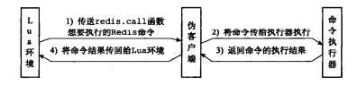

## Lua

`Lua`是一个高效的轻量级脚本语言，在葡萄牙语中是“月亮”的意思，用标准C语言编写并以源代码形式开放,其设计目的是为了嵌入应用程序中，从而为应用程序提供灵活的扩展和定制功能。

Redis中使用 Lua 的好处：

- 减少网络开销，在 Lua脚本 中可以把多个命令放在同一个脚本中运行；
- 原子操作，Redis 会将整个脚本作为一个整体执行，中间不会被其他命令插入（编写脚本过程中无需担心会出现竞态条件）；
- 复用性，客户端发送的脚本会永远存储在 Redis中，意味着其他客户端可以复用这一脚本

从 `Redis2.6`开始， Eval命令使用内置的Lua解释器执行脚本 ，不需要单独安装 Lua。


### Lua环境

为了在Redis服务器中执行Lua脚本，Redis在服务器内嵌了一个Lua环境（ environ-ment )。并对这个Lua环境进行了一系列修改，从而确保这个Lua环境可以满足Redis服务器的需要。

Redis服务器创建并修改Lua环境的整个过程由以下步骤组成：

1. 创建一个基础的Lua环境，之后的所有修改都是针对这个环境进行的;
2. 载入多个函数库到Lua环境里面，让Lua脚本可以使用这些函数库来进行数据操作；
3. 创建全局表格redis，这个表格包含了对Redis进行操作的函数，比如用于在 Lua脚本中执行Redis命令的redis.call函数。
4. 使用Redis自制的随机函数来替换Lua原有的带有副作用的随机函数，从而避免在脚本中引入副作用；
5. 创建排序辅助函数，Lua环境使用这个辅佐函数来对一部分Redis命令的结果进行排序，从而消除这些命令的不确定性；
6. 创建redis.pcall函数的错误报告辅助函数，这个函数可以提供更详细的出错信息；
7. 对Lua环境中的全局环境进行保护，防止用户在执行Lua脚本的过程中，将额外的全局变量添加到Lua环境中；
8. 将完成修改的Lua环境保存到服务器状态的lua属性中，等待执行服务器传来的Lua脚本。

#### 创建基本环境

在最开始的这一步，服务器首先调用Lua的CAPI函数1ua_open，创建一个新的Lua环境。因为lua_open函数创建的只是一个基本的Lua环境，为了让这个Lua环境可以满足Redis的操作要求。接下来服务器将对这个Lua环境进行一系列修改。

#### 载入函数库

Redis 修改Lua环境的第一步，就是将以下函数库载入到Lua环境里面:

1. 基础库( base library ):这个库包含Lua的核心( core）函数，比如assert、error、pairs、tostring、 pcall等。另外，为了防止用户从外部文件中引人不安全的代码，库中的1oadfile函数会被删除。
2. 表格库( table library ):这个库包含用于处理表格的通用函数，比如table.concat、 table.insert、 table.remove、table.sort 等。
3. 字符串库（ string library ):这个库包含用于处理字符串的通用函数，比如用于对字符串进行查找的string.find函数，对字符串进行格式化的string.format函数，查看字符串长度的string.len函数，对字符串进行翻转的string.reverse函数等。
4. 数学库( math library ):这个库是标准C语言数学库的接口，它包括计算绝对值的math.abs函数，返回多个数中的最大值和最小值的math .max函数和math.min函数。计算二次方根的math.sqrt函数，计算对数的math.log函数等。
5. 调试库( debug library ):这个库提供了对程序进行调试所需的函数，比如对程序设置钩子和取得钩子的debug.sethook函数和debug.gethook函数，返回给定函数相关信息的debug.getinfo 函数，为对象设置元数据的debug.setmetatable函数，获取对象元数据的debug.getmetatable函数等。
6. Lua CISON库( http://www.kyne.com.au/~-mark/software/lua-cjson.php ):这个库用于处理UTF-8编码的JSON格式，其中cjson.decode函数将一个JSON格式的字符串转换为一个Lua值，而cjson.encode函数将一个Lua值序列化为JSON格式的字符串。
7. Struct库( http://www.inf.puc-rio.brl~roberto/struct/ ):这个库用于在Lua值和C结构( struct)之间进行转换，丽数struct.pack将多个Lua值打包成一个类结构( struct-like)字符串，而函数struct.unpack 则从一个类结构字符串中解包出多个Lua值。
8. Lua cmsgpack 库( https://github.com/antirez/lua-cmsgpack ):这个库用于处理MessagePack格式的数据，其中cmsgpack.pack函数将Lua值转换为MessagePack数据，而cmsgpack.unpack函数则将MessagePack数据转换为Lua 值。

通过使用这些功能强大的函数库，Lua脚本可以直接对执行Redis命令获得的数据进行复杂的操作。

#### 创建redis全局表格

在这一步，服务器将在Lua环境中创建一个redis表格（ table)，并将它设为全局变量。这个redis表格包含以下函数;

- 用于执行Redis命令的redis.cal1和redis.pcal1函数。
- 用于记录Redis日志（ log )的redis.log函数，以及相应的日志级别( level )常量: redis.LOG_DEBUG，redis.LOG_VERBOSE，redis.LOG_NOTICE，以及redis.LOG_WARNING。
- 用于计算SHAl校验和的redis.sha1hex函数。
- 用于返回错误信息的redis.error_reply函数和redis.status_reply函数。

在这些函数里面，最常用也最重要的要数redis.call函数和redis.pcall函数，通过这两个函数,用户可以直接在Lua脚本中执行Redis命令。

>table 是 Lua 的一种数据结构用来帮助我们创建不同的数据类型，如：数组、字典等；Lua table 使用关联型数组，你可以用任意类型的值来作数组的索引，但这个值不能是 nil；Lua table 是不固定大小的，你可以根据自己需要进行扩容。

#### 替换随机函数

为了保证相同的脚本可以在不同的机器上产生相同的结果，Redis要求所有传入服务器的Lua脚本，以及Lua环境中的所有函数，都必须是无副作用（side effect）的纯函数（( purefunction )。

>**副作用**的概念：一个带有副作用的函数不仅只是简单的返回一个值，还干了一些其他的事情，比如：修改一个变量、直接修改数据结构、设置一个对象的成员、抛出一个异常或以一个错误终止、打印到终端或读取用户的输入、读取或写入一个文件、在屏幕上绘画等等。
>
>**纯函数**是所有函数式编程语言中使用的概念，满足一下条件：①不能引起副作用；②给定输入输出一定相同，即纯函数可以替换为表，该表表示来自输入和输出的映射；③自包含，即不使用全局变量。

但是，在之前载入Lua环境的math函数库中，用于生成随机数的math.random函数和math.randomseed函数都是带有副作用的，它们不符合Redis对Lua环境的无副作用要求。**因为lua的random并不能保证在设置了相同种子的情况下，不同平台能生成相同的随机数序列。**

以下是作者在redis的rand.c文件中的原话：

```c
* This functions are used in order to replace the default math.random()
* Lua implementation with something having exactly the same behavior
* across different systems (by default Lua uses libc's rand() that is not
* required to implement a specific PRNG generating the same sequence
* in different systems if seeded with the same integer).
```

因为这个原因，Redis使用自制的函数替换了math库中原有的math.random函数和math.randomseed函数。替换之后的两个函数有以下特征:

- 对于相同的seed 来说，math.random总产生相同的随机数序列，这个函数是一个纯函数;
- 除非在脚本中使用math.randomseed显式地修改seed，否则每次运行脚本时，Lua环境都使用固定的math.randomseed(0)语句来初始化seed 。

感兴趣的可以去看下源码(rand.c)。rand.c对外只提供了两个函数：

- redisLrand48()：返回一个随机数
- redisSrand48(int32_t seedval)：设置随机数种子


#### 创建排序辅助函数

上一个小节说到，为了防止带有副作用的函数令脚本产生不一致的数据，Redis对math库的math.random 函数和math.randomseed函数进行了替换。
对于Lua脚本来说，另一个可能产生不一致数据的地方是那些带有不确定性质的命令。比如对于一个集合键来说，因为集合元素的排列是无序的，所以即使两个集合的元素完全相同，它们的输出结果也可能并不相同。

例如：

```bash
redis> SADD fruit apple banana cherry
(integer)  3

redis> SMEMBERS fruit
1) "cherry"
2) "banana"
3) "apple"

redis> SADD another-fruit cherry banana apple
(integer) 3
redis>SEMBERS another-fruit
1) "apple"
2) "banana"
3) "cherry"
```

这个例子中的fruit集合和 another-fruit集合包含的元素是完全相同的，只是因为集合添加元素的顺序不同，SMEMBERS命令的输出就产生了不同的结果。

Redis将SMEMBERS这种在相同数据集上可能会产生不同输出的命令称为“带有不确定性的命令”，这些命令包括:SINTER、SUNION、SDIFF、SMEMBERS、HKEYS、HVALS、KEYS。

为了消除这些命令带来的不确定性，服务器会为Lua环境创建一个排序辅助函数\_redis_compare_helper，当Lua脚本执行完一个带有不确定性的命令之后，程序会使用\_redis_compare_helper作为对比函数，自动调用table.sort函数对命令的返回值做一次排序，以此来保证相同的数据集总是产生相同的输出。

#### 创建redis.pcall函数的错误报告辅助函数

在这一步，服务器将为Lua环境创建一个名为\_redis\_err\_\_handler的错误处理函数，当脚本调用redis.pcall函数执行Redis命令，并且被执行的命令出现错误时，\_redis\_\_err\_\_handler就会打印出错代码的来源和发生错误的行数，为程序的调试提供方便。

#### 保护Lua的全局环境

在这一步，服务器将对Lua环境中的全局环境进行保护，**确保传入服务器的脚本不会因为忘记使用local关键字而将额外的全局变量添加到Lua环境里面。**

因为全局变量保护的原因，当一个脚本试图创建一个全局变量时，服务器将报告一个错误：

```bash
redis> EVAL"x - 10" c
(error)ERR Error running script
(call to f_df1ad3745c2d2f078f0f41377a92bb6f8ac79af0)∶
@enable_strict_1ua: 7: user_scripttl:
script attempted to ereate global variable 'x'
```

除此之外，试图获取一个不存在的全局变量也会引发一个错误：

```bash
redis> EVAL "return x" 0
(error) ERE Error running script
(call to 1_03c387736bb5ccoo9ff35151572cee04677aa374)∶
enable_strict__lua: 14: uaer_8cript:1:
script attempted to access unexisting global variable "x'
```

不过Redis 并未禁止用户修改已存在的全局变量，所以在执行Lua脚本的时候，必须非常小心，以免错误地修改了已存在的全局变量：

```bash
redis>EVAL "redis = 10086;return redis" 0
(integer) 10086
```

#### 将Lua环境保存到服务器状态的lua属性里面

在最后的这一步，服务器会将Lua环境和服务嚣状态的lua属性关联起来。因为Redis 使用串行化的方式来执行Redis命令,所以在任何特定时间里，最多都只会有一个脚本能够被放进Lua环境里面运行，因此，整个Redis服务器只需要创建一个Lua环境即可。

```c
struct redisServer {
    lua_State *lua; /* The Lua interpreter. We use just one for all clients */
}
```


### Lua环境协作组件

#### 伪客户端

因为执行Redis命令必须有相应的客户端状态，所以为了执行Lua脚本中包含的Redis命令，Redis服务器专门为Lua环境创建了一个伪客户端，并由**这个伪客户端负责处理Lua脚本中包含的所有Redis命令**。

Lua脚本使用redis.call函数或者redis.pcall函数执行一个Redis命令，需要完成以下步骤：

1. Lua环境将redis.call函数或者redis.pcall函数想要执行的命令传给伪客户端；
2. 伪客户端将脚本想要执行的命令传给命令执行器；
3. 命令执行器执行伪客户端传给它的命令，并将命令的执行结果返回给伪客户端；
4. 伪客户端接收命令执行器返回的命令结果，并将这个命令结果返回给Lua环境；
5. Lua环境在接收到命令结果之后，将该结果返回给redis.call函数或者redis.pcall函数；
6. 接收到结果的redis.call函数或者redis.pcall函数会将命令结果作为函数返回值返回给脚本中的调用者。 

<center></center>

```c
struct redisServer {
    client *lua_client;   /* The "fake client" to query Redis from Lua */
}
```

#### lua_scripts字典

除了伪客户端之外，Redis服务器为Lua环境创建的另一个协作组件是lua_scripts字典，这个字典的键为某个Lua脚本的SHA1校验和（checksum )，而字典的值则是SHA1校验和对应的Lua脚本：

```c
struct redisServer {
	dict *lua_scripts;         /* A dictionary of SHA1 -> Lua scripts */
}
```

Redis服务器会将所有被EVAL命令执行过的Lua脚本，以及所有被SCRIPT LOAD命令载人过的Lua脚本都保存到lua_scripts字典里面。


### 定义和执行脚本

#### EVAL命令

```bash
EVAL script numkeys key [key ...] arg [arg ...] 
```

- script： 参数是一段 Lua 5.1 脚本程序。脚本不必(也不应该)定义为一个 Lua 函数。
- numkeys： 用于指定键名参数的个数。
- key [key ...] ： 从 EVAL 的第三个参数开始算起，表示在脚本中所用到的那些 Redis 键(key)，这些键名参数可以在 Lua 中通过全局变量 KEYS 数组，用 1 为基址的形式访问( KEYS[1] ， KEYS[2] ，以此类推)。
- arg [arg ...] ： 附加参数，在 Lua 中通过全局变量 ARGV 数组访问，访问的形式和 KEYS 变量类似( ARGV[1] 、 ARGV[2] ，诸如此类)

例如：

```bash
127.0.0.1:6379> eval "return {KEYS[1],KEYS[2],ARGV[1],ARGV[2]}" 2 username age jack 20
1) "username"
2) "age"
3) "jack"
4) "20"

127.0.0.1:6379> EVAL "redis.call('SET', KEYS[1], ARGV[1]);redis.call('EXPIRE', KEYS[1], ARGV[2]); return 1;" 1 userAge 10 60
(integer) 1
127.0.0.1:6379> get userAge
"10"
127.0.0.1:6379> ttl userAge
(integer) 44
```

在 Lua 脚本中，可以使用两个不同函数来执行 Redis 命令，它们分别是： `redis.call() 和 redis.pcall()`
这两个函数的唯一区别在于它们使用不同的方式处理执行命令所产生的错误，差别如下：

当 redis.call() 在执行命令的过程中发生错误时，脚本会停止执行，并返回一个脚本错误，错误的输出信息会说明错误造成的原因：

```c
127.0.0.1:6379> lpush foo a
(integer) 1

127.0.0.1:6379> eval "return redis.call('get', 'foo')" 0
(error) ERR Error running script (call to f_282297a0228f48cd3fc6a55de6316f31422f5d17): ERR Operation against a key holding the wrong kind of value
```

和 redis.call() 不同， redis.pcall() 出错时并不引发(raise)错误，而是返回一个带 err 域的 Lua 表(table)，用于表示错误：

```c
127.0.0.1:6379> EVAL "return redis.pcall('get', 'foo')" 0
(error) ERR Operation against a key holding the wrong kind of value
```


#### EVAL的处理

当客户端向服务器发送EVAL命令，要求执行某个Lua脚本的时候，服务器首先要做的就是在Lua环境中，为传入的脚本定义一个与这个脚本相对应的Lua函数，其中，Lua函数的名字由f_前缀加上脚本的**SHA1校验和**（四十个字符长）组成，而函数的体(body)则是脚本本身。(以便下次客户端可以使用 `EVALSHA` 命令调用该脚本)

EVAL命令要做的第二件事是将客户端传人的脚本保存到服务器的lua_scripts字典里面：

```c
struct redisServer {
    dict *lua_scripts;         /* A dictionary of SHA1 -> Lua scripts */
}
```

键为lua脚本的SHA1校验和，值为脚本本身。

在为脚本定义函数，并且将脚本保存到lua_scripts字典之后，服务器还需要进行一些设置钩子、传入参数之类的准备动作，才能正式开始执行脚本。整个准备和执行脚本的过程如下:

1. 将EVAL命令中传人的键名(key name）参数和脚本参数分别保存到KEYS数组和ARGV数组，然后将这两个数组作为全局变量传入到Lua环境里面；
2. 为Lua环境装载超时处理钩子( hook )，这个钩子可以在脚本出现超时运行情况时，让客户端通过SCRIPT KILL命令停止脚本，或者通过SHUTDOWN命令直接关闭服务器；
3. 执行脚本函数；
4. 移除之前装载的超时钩子；
5. 将执行脚本函数所得的结果保存到客户端状态的输出缓冲区里面，等待服务器将结果返回给客户端；
6. 对Lua环境执行垃圾回收操作。


#### EVALSHA命令

当使用EVAL命令成功执行一个Lua脚本，Lua环境中就会有一个与脚本相应的Lua函数，名字由f_前缀加上脚本的**SHA1校验和**（四十个字符长）组成，而函数的体(body)则是脚本本身。

举个例子，当服务器执行完以下EVAL命令之后:

```c
127.0.0.1:6379> EVAL "return 'hello wor1d'" 0
hello wor1d"
```

Lua环境里面就定义了以下函数:

```lua
function f_5332031c6b470dc5a0dd9b4bf2030dea6d65de91
	return 'hello world'
end
```

当客户端执行以下EVALSHA命令时:

```c
127.0.0.1:6379> EVALSHA "5332031c6b470dc5a0dd9b4bf2030dea6d65de91" 0 
"hello wor1d"
```

服务器首先根据客户端输人的SHA1校验和，检查函数f_5332031c6b470de5a0dd9b4bf2030dea6d65de91是否存在于Lua环境中，得到的回应是该函数确实存在，于是服务器执行Lua环境中的f_5332031c6b470dc5a0dd9b4bf2030dea6d65de91函数，并将结果"hello world”返回给客户端。


### 脚本管理命令

除了EVAL命令和EVALSHA命令之外，Redis中与Lua脚本有关的命令还有四个，它们分别是SCRIPT FLUSH命令、SCRIPT EXISTS命令、SCRIPT LOAD命令、以及SCRIPT KILL命令。

#### SCRIPT FLUSH

SCRIPT FLUSH命令用于清除服务器中所有和Lua脚本有关的信息，这个命令会释放并重建lua scripts字典，关闭现有的Lua环境并重新创建一个新的Lua环境。

```c
127.0.0.1:6379> script flush
OK
```

#### SCRIPT EXISTS

SCRIPT EXISTS命令恨据输入的SHA1校验和，检查效验和对应的脚本是否存在于服务器中。SCRIPT EXISTS命令是通过检查给定的校验和是否存在于lua_scripts字典来实现的。

```c
127.0.0.1:6379> script exists e0e1f9fabfc9d4800c877a703b823ac0578ff8db
1) (integer) 1
    
127.0.0.1:6379> SCRIPT EXISTS 6aeea4b3e96171ef835a78178fceadf1a5dbe345 6aeea4b3e96171ef835a78178fceadf1a5dbe366
1) (integer) 1
2) (integer) 0
```


#### SCRIPT LOAD

SCRIPT LOAD命令所做的事情和EVAL命令执行脚本时所做的前两步完全一样：命令首先在Lua环境中为脚本创建相对应的函数，然后再将脚本保存到lua_scripts字典里面。会返回对应的SHA1值。

```c
127.0.0.1:6379> SCRIPT LOAD "redis.call('SET', KEYS[1], ARGV[1]);redis.call('EXPIRE', KEYS[1], ARGV[2]); return 1;"
"6aeea4b3e96171ef835a78178fceadf1a5dbe345"
```


#### SCRIPT KILL

如果服务器设置了lua-time-limit配置选项，那么在每次执行Lua脚本之前,服务器都会在Lua环境里面设置一个超时处理钩子( hook )。超时处理钩子在脚本运行期间，会定期检查脚本已经运行了多长时间，一旦钩子发现脚本的运行时间已经超过lua-time-limit选项设置的时长，钩子将定期在脚本运行的间隙中，查看是否有SCRIPT KILL命令或者SHUTDOWN命令到达服务器。

- 如果超时运行的脚本未执行过任何写入操作,那么客户端可以通过SCRIPT KILL命令来指示服务器停止执行这个脚本，并向执行该脚本的客户端发送一个错误回复。处理完SCRIPT KILL命令之后，服务器可以继续运行；
- 如果脚本已经执行过写人操作，那么客户端只能用SHUTDowN nosave命令来停止服务器，从而防止不合法的数据被写人数据库中。


### 脚本复制

与其他普通Redis命令一样，当服务器运行在复制模式之下时，具有写性质的脚本命令也会被复制到从服务器，这些命令包括EVAL命令、EVALSHA命令、SCRIPT FLUSH命令以及SCRIPT LOAD命令。

Redis 复制EVAL、SCRIPT FLUSH、SCRIPT LOAD三个命令的方法和复制其他普通Redis命令的方法一样，当主服务器执行完以上三个命令的其中一个时，主服务器会直接将被执行的命令传播（propagate）给所有从服务器。

唯一有区别的就是EVALSHA命令，因为如果此时从服务器没有接收到主服务器的脚本的话(因为网络延迟等各种原因)，此时执行该命令就是报错（未找到脚本错误）。

为了防止以上假设的情况出现，Redis要求主服务器在传播EVALSHA命令的时候，必须确保EVALSHA命令要执行的脚本已经被所有从服务器载入过，如果不能确保这一点的话，主服务器会将EVALSHA命令转换成一个等价的EVAL命令，然后通过传播EVAL命令来代替EVALSHA命令。传播EVALSHA命令，或者将EVALSHA命令转换成EVAL命令，都需要用到服务器状态的lua_scripts字典和repl\_scriptcache\_dict字典。

主要注意一下两个问题：

1）判断传播EVALSHA命令是否安全

主服务器使用服务器状态的repl_scriptcache_dict字典记录自己已经将哪些脚本传播给了所有从服务器：

```c
struct redisServer {
	dict *repl_scriptcache_dict;        /* SHA1 all slaves are aware of. */
}
```

repl_scriptcache_dict字典的键是一个个Lua脚本的SHA1校验和，而字典的值则全部都是NULL，当一个SHA1校验和出现在repl_ecriptcache_dict字典时，说明这个校验和对应的Lua脚本已经传播给了所有从服务器，主服务器可以直接向从服务器传播包含这个SHA1校验和的EVALSHA命令，而不必担心从服务器会出现脚本未找到错误。

2）清空repl_scriptcache_dict字典

每当主服务器添加一个新的从服务器时，主服务器都会清空自己的repl_scriptcache_dict字典，这是因为随着新从服务器的出现，repl_scriptcache_dict字典里面记录的脚本已经不再被所有从服务器载入过，所以主服务器会清空repl_scriptcache_dict字典，强制自己重新向所有从服务器传播脚本，从而确保新的从服务器不会出现脚本未找到错误。

