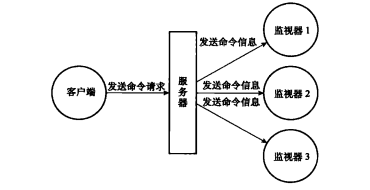

## 慢查询日志

Redis的慢查询日志功能用于记录执行时间超过给定时长的命令请求，用户可以通过这个功能产生的日志来监视和优化查询速度。
服务器配置有两个和慢查询日志相关的选项：

- slowlog-log-slower-than：选项指定执行时间超过多少微秒的命令请求是慢查询，会被记录到日志上；
- slowlog-max-len：选项指定服务器最多保存多少条慢查询日志。服务器使用先进先出的方式保存多条慢查询日志，当服务器存储的慢查询日志数量等于slowlog-max-len选项的值时，服务器在添加一条新的慢查询日志之前，会先将最旧的一条慢查询日志删除。

服务器状态中包含了几个和慢查询日志功能有关的属性：

```c
struct redisServer {
    list *slowlog;                  /* SLOWLOG list of commands */
    long long slowlog_entry_id;     /* SLOWLOG current entry ID */
    long long slowlog_log_slower_than; /* SLOWLOG time limit (to get logged) */
    unsigned long slowlog_max_len;     /* SLOWLOG max number of items logged */
}
```

- slowlog_entry_id属性的初始值为o，每当创建一条新的慢查询日志时，这个属性的值就会用作新日志的id值，之后程序会对这个属性的值增一。

- slowlog链表保存了服务器中的所有慢查询日志，链表中的每个节点都保存了一个slowlogEntry结构(slowlog.h#slowlogEntry)，每个slowlogEntry结构代表一条慢查询日志：

  ```c
  typedef struct slowlogEntry {
      robj **argv;     //命令参数
      int argc;         //命令参数个数
      long long id;       //唯一标识
      long long duration; //命令执行消耗的时间，单位为微秒
      time_t time;        //命令开始执行的时间，格式为unix时间戳
      sds cname;          /* Client name. */
      sds peerid;         /* Client network address. */
  } slowlogEntry;
  ```

要读取慢日志，使用 **SLOWLOG GET** 命令，该命令将返回慢日志中的每个条目。 可以仅返回N个最近的条目，并将其他参数传递给该命令（例如 SLOWLOG GET 10 ）。


## 监视器

通过执行MONITOR命令，客户端可以将自己变为一个监视器，每当一个客户端向服务器发送一条命令请求时，服务器除了会处理这条命令请求之外，还会将关于这条命令请求的信息发送给所有监视器：

<center></center>

如果客户端成为了监视器，那么客户端的REDIS_MONITOR标志会被打开，并且添加到redisServer的monitors链表中：

```c
struct redisServer {
    list *slaves, *monitors;    /* List of slaves and MONITORs */
}
```

服务器在每次处理命令请求之前，都会调用replicationFeedMonitors函数，由这个函数将被处理的命令请求的相关信息发送给各个监视器。