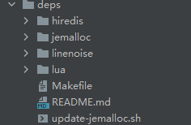

## 源码阅读指南

我看的源码是redis5.0的，可以自行到github上下载：[GitHub - redis/redis at 5.0](https://github.com/redis/redis/tree/5.0)。部分代码看的redis6.0。

### 目录结构

redis5.0源码的目录结构：

<center></center>

**deps目录：**

<center></center>

该包下是四种第三方依赖库。它主要存放了三类代码：① Redis 依赖的、实现更加高效的功能库，如内存分配；②独立于 Redis 开发演进的代码，如客户端；③ lua 脚本代码。后续完成功能的设计实现时，就可以在 deps 目录找到它们。

- hiredis是和客户端相关的库；
- jemalloc是和内存管理相关的库；
- linenoise是命令行编辑库，readline的替代品；
- lua是处理lua脚本的库

**src目录：**

这个目录里面包含了 Redis **所有功能模块的代码文件，也是 Redis 源码的重要组成部分。**

**tests目录：**

<center></center>

在软件产品的开发过程中，除了第三方依赖库和功能模块源码以外，我们通常还需要在系统源码中，添加用于功能模块测试和单元测试的代码。而在 Redis 的代码目录中，就将这部分代码用一个 tests 目录统一管理了起来。

Redis 实现的测试代码可以分成四部分，分别是单元测试（对应 **unit** 子目录），Redis Cluster 功能测试（对应 **cluster** 子目录）、哨兵功能测试（对应 **sentinel** 子目录）、主从复制功能测试（对应 **integration** 子目录）。这些子目录中的测试代码使用了 Tcl 语言（通用的脚本语言）进行编写，主要目的就是方便进行测试。

不过在 tests 目录中，除了有针对特定功能模块的测试代码外，还有一些代码是用来支撑测试功能的，这些代码在 **assets**、**helpers**、**modules**、**support** 四个目录中。

**utils目录：**

<center></center>

在 Redis 开发过程中，还有一些功能属于辅助性功能，包括用于创建 Redis Cluster 的脚本、用于测试 LRU 算法效果的程序，以及可视化 rehash 过程的程序。在 Redis 代码结构中，这些功能代码都被归类到了 utils 目录中统一管理。


### src源码

简单介绍：

```c
数据类型：
- String（t_string.c、sds.c、bitops.c）
- List（t_list.c、ziplist.c、quicklist.c）
- Hash（t_hash.c、ziplist.c、dict.c、listpack.c）
- Set（t_set.c、intset.c）
- Sorted Set（t_zset.c、ziplist.c、dict.c）
- HyperLogLog（hyperloglog.c）
- Geo（geo.c、geohash.c、geohash_helper.c）
- Stream（t_stream.c、rax.c、listpack.c）

全局：
- Server（server.c、anet.c）
- Object（object.c）
- 键值对（db.c）
- 事件驱动（ae.c、ae_epoll.c、ae_kqueue.c、ae_evport.c、ae_select.c、networking.c）
- 内存分配（zmalloc.h,zmalloc.c）
- 内存回收（expire.c、lazyfree.c）
- 内存驱逐(lru、lfu等操作)（evict.c）
- 后台线程（bio.c）
- 事务（multi.c）
- PubSub（pubsub.c）
- 双向链表（adlist.c）

高可用&集群：
- 持久化：RDB（rdb.c、redis-check-rdb.c)、AOF（aof.c、redis-check-aof.c）
- 主从复制（replication.c）
- 哨兵（sentinel.c）
- 集群（cluster.c）

辅助功能：
- 延迟统计（latency.c）
- 慢日志（slowlog.c）
- 通知（notify.c）
- 基准性能（redis-benchmark.c）
```

> 上诉源代码大部分都值得一读！！！

服务器基础定义、初始化：

- server.h：包含了大量结构体的定义，比如：redisServer、clientredisObject、redisDb、multiState、multiCmd、zset、zskiplist、pubsubPattern、redisCommand等。
- server.c：定义了一个redisCommandTable，存储了所有的redis命令。主要是定义了main函数，以及对server的初始化：initServerConfig、initServer等操作，以及processCommand、call、propagate等服务端命令的执行、复制等基本操作。server端的启动就是main函数，之后进入aeMain的循环。

服务器事件驱动模型和网络通信相关：

- ae.h：包含了服务器事件机制的一些结构体，比如：aeEventLoop、aeFileEvent、aeTimeEvent、aeFiredEvent。

- ae.c：主要是服务器事件机制的一些运行代码，aeMain是最核心的部分，整个服务器都是在这个函数中一直循环；每一次循环调用aeProcessEvents进行处理事件；processTimeEvents主要用于定时任务的处理；其他的诸如：aeCreateEventLoop、aeDeleteEventLoop、aeCreateFileEvent、aeDeleteFileEvent、aeCreateTimeEvent、aeDeleteTimeEvent都是一些核心函数。

- ae_epoll.c、ae_evport.c、ae_kqueue.c、ae_select.c：这是四种网络通信框架，都包含aeApiPoll函数，主要是用于对套接字的监听。

- anet.h、anet.c：redis对网络通信(socket)的简单封装和一些状态设置的封装。状态设置主要包括socket连接的阻塞性、tcp的保活定时器的设置、设置发送缓冲区、tcp的Nagle算法设置、设置发送超时时间、地址重用的设置等。

- networking.c：这是一个很核心的源文件，主要包括建立/清除和客户端的链接、接收/传送/处理客户端数据、跟客户端相关的事件处理器等。比如：createClient、resetClient等客户端操作，acceptTcpHandler、acceptUnixHandler处理客户端连接，readQueryFromClient命令请求处理器，sendReplyToclient命令回复处理器，addReply处理返回数据，prepareClientToWrite判断是否需要返回数据，writeToClient写数据给客户端，processInlineBuffer处理inline协议的数据，processMultibulkBuffer处理multibulk协议的数据，processInputBuffer处理输入的数据，processInputBufferAndReplicate处理输入的数据并进行复制等等。

  在redis6.0中，还引入了多IO线程操作：initThreadedIO初始化多个IO线程、IOThreadMain为各个IO线程处理客户端读/写操作、stopThreadedIOIfNeeded有条件关闭IO线程、startThreadedIO开启IO线程、stopThreadedIO关闭IO线程、postponeClientRead判断能否推迟从客户端读取数据、clientInstallWriteHandler判断能否推迟向客户端写数据、handleClientsWithPendingReadsUsingThreads将 clients_pending_read 列表中的客户端分配给 IO 线程进行处理、handleClientsWithPendingWritesUsingThreads将 clients_pending_write 列表中的客户端分配给 IO 线程进行处理。

数据库数据类型和操作：

Redis 数据库提供了丰富的键值对类型，其中包括了 String、List、Hash、Set 和 Sorted Set 这五种基本键值类型。此外，Redis 还支持位图、HyperLogLog、Geo 等扩展数据类型。

而为了支持这些数据类型，Redis 就使用了多种数据结构来作为这些类型的底层结构。比如，String 类型的底层数据结构是 SDS，而 Hash 类型的底层数据结构包括哈希表和压缩列表。

<center></center>

除了图上的，还有quicklist、listpack、rax等。

除了实现了诸多的数据类型以外：

- db.c：主要对数据库的键值对进行操作，比如对键值对的新增、查询、修改、删除、设置过期时间、查询过期键等操作。
- object.c：主要是创建、清除各种对象。

持久化相关：

- rdb.c：包含关于rdb数据持久化的一些具体操作。比如：saveCommand处理save命令、bgsaveCommand处理bgsave命令、rdbSave进行rdb的持久化操作、rdbSaveBackground进行rdb的后台持久化操作、rdbSaveRio将内存中的数据写入到文件、rdbSaveKey对ValuePair对每一个K-V对进行写入、backgroundSaveDoneHandler是bgsave完成后的后序处理、loadDataFromDisk载入rdb持久化的数据。
- aof.c：包含关于aof数据持久化的一些具体操作。比如：feedAppendOnlyFile将命令序列化并写入aof buffer中、flushAppendOnlyFile将aof buffer中的数据刷盘、loadDataFromDisk载入aof持久化的数据、loadAppendOnlyFile具体载入aof持久化的数据操作、bgrewriteaofCommand处理bgrewriteaof命令、rewriteAppendOnlyFileBackground进行aof的后台重写操作、rewriteAppendOnlyFile进行aof的重写操作、rewriteAppendOnlyFileRio将内存中的数据重写入aof文件、backgroundRewriteDoneHandler是aof重写完成后的后续处理。

内存驱逐：

- evict.c：主要是关于一些内存淘汰策略的相关操作，如lru、lfu等。比如：LRU_CLOCK获取全局LRU时钟值、freeMemoryIfNeededAndSafe判断是否要进行内存驱逐、freeMemoryIfNeeded是各种策略的具体淘汰key的操作、evictionPoolPopulate是lru、lfu、ttl三种操作的填充淘汰池操作、LFUDecrAndReturn根据访问频率衰减计算当前key的访问次数、LFULogIncr更新当前key的访问次数(仅跟访问次数有关)。

后台线程：

- bio.c：主要是关于一些BIO后台线程的初始化、创建任务、处理任务等操作。比如：bioInit初始化三种bio线程、bioProcessBackgroundJobs为各个线程处理任务操作、bioCreateBackgroundJob为创建BIO线程任务操作。

集群、sentinel相关的太复杂，就不做简述了，可以去具体章节看。

以上就是在我学习redis源码中，涉及到的主要源码文件，以后继续学习会继续增加。


更多源码可以参考前面每一章节的源码解析，也可以参考如下：

- :point_right:[​ Redis源码分析_Android路上的人的博客](https://blog.csdn.net/androidlushangderen/category_9263229.html)
- :point_right: [源码之路_chosen0ne的博客](https://blog.csdn.net/chosen0ne/category_848855.html)
- :point_right: [redis_wangxiaoangg的博客](https://blog.csdn.net/qq_16399991/category_8278597.html)
- :point_right: [Redis_柯南二号的博客](https://blog.csdn.net/qq_41688840/category_10313108.html)
- :point_right: https://www.cnblogs.com/gqtcgq/category/1043761.html